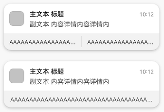
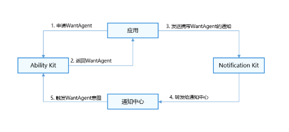

应用向Ability Kit申请[WantAgent](https://developer.huawei.com/consumer/cn/doc/harmonyos-references/js-apis-app-ability-wantagent)，并将WantAgent封装至通知中。当发布通知时，用户便可以通过点击通知栏中的消息或按钮，拉起目标应用组件或发布公共事件。

携带了actionButtons的通知示意图如下。



## 运行机制



## 接口说明

| **接口名** | **描述** |
| --- | --- |
| [publish](https://developer.huawei.com/consumer/cn/doc/harmonyos-references/js-apis-notificationmanager#notificationmanagerpublish-1)(request: NotificationRequest): Promise\<void\> | 发布通知。 |
| [getWantAgent](https://developer.huawei.com/consumer/cn/doc/harmonyos-references/js-apis-app-ability-wantagent#wantagentgetwantagent)(info: WantAgentInfo, callback: AsyncCallback\<WantAgent\>): void | 创建WantAgent。 |

## 开发步骤

1. 导入模块。

   ```
   import { notificationManager } from '@kit.NotificationKit';
   import { wantAgent, WantAgent } from '@kit.AbilityKit';
   import { BusinessError } from '@kit.BasicServicesKit';
   import { hilog } from '@kit.PerformanceAnalysisKit';

   const TAG: string = '[PublishOperation]';
   const DOMAIN_NUMBER: number = 0xFF00;
   ```

   

<div class="source-link-wrapper"><a href="https://gitcode.com/HarmonyOS_Samples/guide-snippets/blob/HarmonyOS-feature-20260402/Notification-Kit/Notification/entry/src/main/ets/filemanager/AddWantAgent.ets#L16-L24" target="_blank" rel="noopener noreferrer" class="source-link"><svg class="source-link-icon" width="14" height="14" viewBox="0 0 24 24" fill="none" stroke="currentColor" strokeWidth="2" strokeLinecap="round" strokeLinejoin="round">\<path d="M18 13v6a2 2 0 0 1-2 2H5a2 2 0 0 1-2-2V8a2 2 0 0 1 2-2h6" /\>\<polyline points="15 3 21 3 21 9" /\>\<line x1="10" y1="14" x2="21" y2="3" /\></svg> 查看源码：AddWantAgent.ets</a></div>

2. 创建WantAgentInfo信息。

   场景一：创建拉起UIAbility的WantAgent的[WantAgentInfo](https://developer.huawei.com/consumer/cn/doc/harmonyos-references/js-apis-inner-wantagent-wantagentinfo)信息。

   ```
   let wantAgentObj: WantAgent | null = null; // 用于保存创建成功的wantAgent对象，后续使用其完成触发的动作。

   // 通过WantAgentInfo的operationType设置动作类型
   let wantAgentInfo: wantAgent.WantAgentInfo = {
     wants: [
       {
         deviceId: '',
         bundleName: 'com.sample.eventnotification', // 需要替换为对应的bundleName。
         abilityName: 'EntryAbility', // 需要替换为对应的abilityName。
         action: '',
         entities: [],
         uri: '',
         parameters: {}
       }
     ],
     actionType: wantAgent.OperationType.START_ABILITY,
     requestCode: 0,
     actionFlags: [wantAgent.WantAgentFlags.CONSTANT_FLAG]
   };
   ```

   

<div class="source-link-wrapper"><a href="https://gitcode.com/HarmonyOS_Samples/guide-snippets/blob/HarmonyOS-feature-20260402/Notification-Kit/Notification/entry/src/main/ets/filemanager/AddWantAgent.ets#L91-L111" target="_blank" rel="noopener noreferrer" class="source-link"><svg class="source-link-icon" width="14" height="14" viewBox="0 0 24 24" fill="none" stroke="currentColor" strokeWidth="2" strokeLinecap="round" strokeLinejoin="round">\<path d="M18 13v6a2 2 0 0 1-2 2H5a2 2 0 0 1-2-2V8a2 2 0 0 1 2-2h6" /\>\<polyline points="15 3 21 3 21 9" /\>\<line x1="10" y1="14" x2="21" y2="3" /\></svg> 查看源码：AddWantAgent.ets</a></div>


   场景二：创建发布[公共事件](/docs/dev/app-dev/system/system-basicfun/basic-services-kit/app-events/common-event-communication/common-event-overview)的WantAgent的[WantAgentInfo](https://developer.huawei.com/consumer/cn/doc/harmonyos-references/js-apis-inner-wantagent-wantagentinfo)信息。

   ```
   let wantAgentObj: WantAgent | null = null; // 用于保存创建成功的WantAgent对象，后续使用其完成触发的动作。

   // 通过WantAgentInfo的operationType设置动作类型
   let wantAgentInfo: wantAgent.WantAgentInfo = {
     wants: [
       {
         action: 'event_name', // 设置事件名
         parameters: {},
       }
     ],
     actionType: wantAgent.OperationType.SEND_COMMON_EVENT,
     requestCode: 0,
     actionFlags: [wantAgent.WantAgentFlags.CONSTANT_FLAG],
   };
   ```

   

<div class="source-link-wrapper"><a href="https://gitcode.com/HarmonyOS_Samples/guide-snippets/blob/HarmonyOS-feature-20260402/Notification-Kit/Notification/entry/src/main/ets/filemanager/AddWantAgent.ets#L36-L51" target="_blank" rel="noopener noreferrer" class="source-link"><svg class="source-link-icon" width="14" height="14" viewBox="0 0 24 24" fill="none" stroke="currentColor" strokeWidth="2" strokeLinecap="round" strokeLinejoin="round">\<path d="M18 13v6a2 2 0 0 1-2 2H5a2 2 0 0 1-2-2V8a2 2 0 0 1 2-2h6" /\>\<polyline points="15 3 21 3 21 9" /\>\<line x1="10" y1="14" x2="21" y2="3" /\></svg> 查看源码：AddWantAgent.ets</a></div>

3. 调用[getWantAgent()](https://developer.huawei.com/consumer/cn/doc/harmonyos-references/js-apis-app-ability-wantagent#wantagentgetwantagent)方法进行创建WantAgent。

   ```
   // 创建WantAgent
   wantAgent.getWantAgent(wantAgentInfo, (err: BusinessError, data: WantAgent) => {
     if (err) {
       hilog.error(DOMAIN_NUMBER, TAG,
         `Failed to get want agent. Code is ${err.code}, message is ${err.message}`);
       return;
     }
     hilog.info(DOMAIN_NUMBER, TAG, 'Succeeded in getting want agent.');
     wantAgentObj = data;

     // ...
   });
   ```

   

<div class="source-link-wrapper"><a href="https://gitcode.com/HarmonyOS_Samples/guide-snippets/blob/HarmonyOS-feature-20260402/Notification-Kit/Notification/entry/src/main/ets/filemanager/AddWantAgent.ets#L113-L162" target="_blank" rel="noopener noreferrer" class="source-link"><svg class="source-link-icon" width="14" height="14" viewBox="0 0 24 24" fill="none" stroke="currentColor" strokeWidth="2" strokeLinecap="round" strokeLinejoin="round">\<path d="M18 13v6a2 2 0 0 1-2 2H5a2 2 0 0 1-2-2V8a2 2 0 0 1 2-2h6" /\>\<polyline points="15 3 21 3 21 9" /\>\<line x1="10" y1="14" x2="21" y2="3" /\></svg> 查看源码：AddWantAgent.ets</a></div>

4. 构造NotificationRequest对象，并发布携带WantAgent的通知。

   

   * 如果封装WantAgent至通知消息中，可以点击通知触发WantAgent。当通知消息存在actionButtons时，点击通知会先显示actionButtons，再次点击通知触发WantAgent。
   * 如果封装WantAgent至通知按钮中，点击通知后，该通知下方会出现通知按钮，可以点击按钮触发WantAgent。

   ```
   // 构造NotificationActionButton对象
   let actionButton: notificationManager.NotificationActionButton = {
     title: 'open_the_app',
     // wantAgentObj使用前需要保证已被赋值（即步骤3执行完成）
     // 通知按钮的WantAgent
     wantAgent: wantAgentObj!
   };

   // 构造NotificationRequest对象
   let notificationRequest: notificationManager.NotificationRequest = {
     content: {
       notificationContentType: notificationManager.ContentType.NOTIFICATION_CONTENT_BASIC_TEXT,
       normal: {
         title: 'one_button_notify',
         text: 'Click on this notification twice to open the app',
         additionalText: 'Test_AdditionalText',
       },
     },
     id: 6,
     // 通知消息的WantAgent
     wantAgent: wantAgentObj!,
     // 通知按钮
     actionButtons: [actionButton],
   };

   notificationManager.publish(notificationRequest, (err: BusinessError) => {
     if (err) {
       hilog.error(DOMAIN_NUMBER, TAG,
         `Failed to publish notification. Code is ${err.code}, message is ${err.message}`);
       return;
     }
     hilog.info(DOMAIN_NUMBER, TAG, 'Succeeded in publishing notification.');
   });
   ```

   

<div class="source-link-wrapper"><a href="https://gitcode.com/HarmonyOS_Samples/guide-snippets/blob/HarmonyOS-feature-20260402/Notification-Kit/Notification/entry/src/main/ets/filemanager/AddWantAgent.ets#L125-L159" target="_blank" rel="noopener noreferrer" class="source-link"><svg class="source-link-icon" width="14" height="14" viewBox="0 0 24 24" fill="none" stroke="currentColor" strokeWidth="2" strokeLinecap="round" strokeLinejoin="round">\<path d="M18 13v6a2 2 0 0 1-2 2H5a2 2 0 0 1-2-2V8a2 2 0 0 1 2-2h6" /\>\<polyline points="15 3 21 3 21 9" /\>\<line x1="10" y1="14" x2="21" y2="3" /\></svg> 查看源码：AddWantAgent.ets</a></div>


## 示例代码

* [自定义通知](https://gitcode.com/HarmonyOS_Samples/custom-notification-badge/blob/master/README.md)
