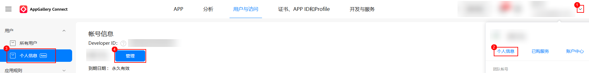
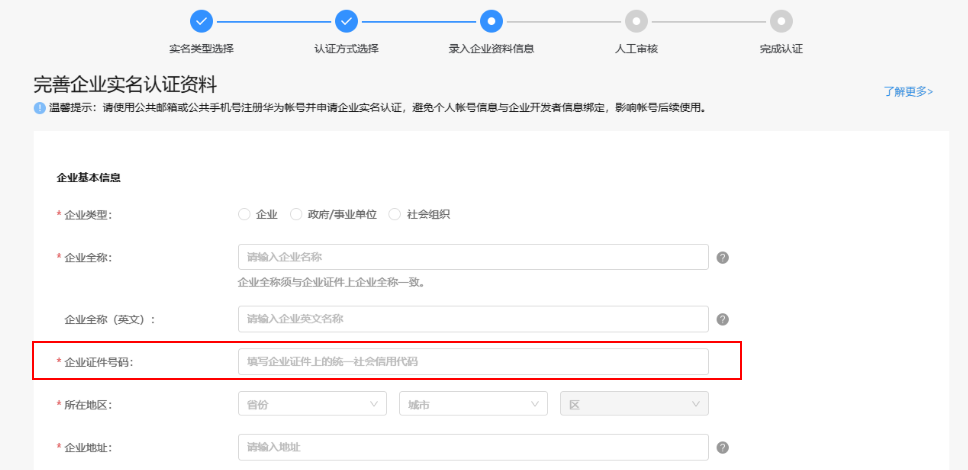

可能是开发者联盟上商户应用管理员的企业证件号码（营业执照注册号）未正确维护导致。

1. 商户应用管理员实名认证（在[AppGallery Connect](https://developer.huawei.com/consumer/cn/service/josp/agc/index.html) “个人信息 > 管理 > 实名认证”查询）需为[企业开发者](https://developer.huawei.com/consumer/cn/doc/start/edrna-0000001062678489)。

   

   
2. 检查商户应用管理员关联的主体企业证件号码和[商户号关联营业主体](https://developer.huawei.com/consumer/cn/doc/pay-docs/hwzf-chaxunzhutixinxi-0000001200337478)的企业证件号码是否一致。
