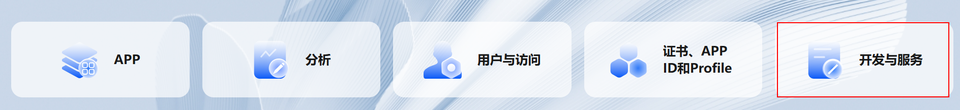
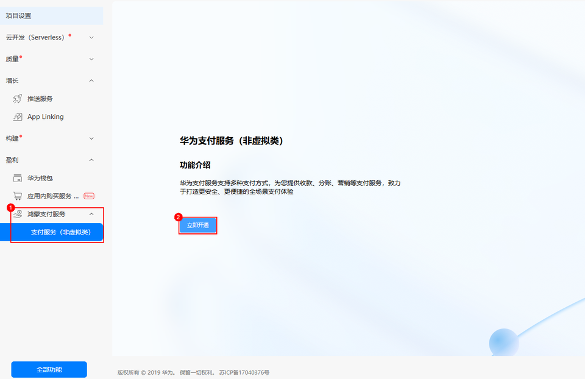

请先参考“[应用开发准备](https://developer.huawei.com/consumer/cn/doc/harmonyos-guides/application-dev-overview)”完成基本准备工作及指纹配置，再继续进行以下开发活动。

1. 后续接入涉及AppID绑定，仅限企业开发者接入。开发者注册后发起实名认证请选择[企业开发者实名认证](https://developer.huawei.com/consumer/cn/doc/start/edrna-0000001062678489)，并且需要准备企业营业执照等必要材料。
2. 每个应用/元服务最多支持添加4个签名证书指纹。
3. **[配置签名信息](https://developer.huawei.com/consumer/cn/doc/harmonyos-guides/application-dev-overview#配置签名信息)需选择手动签名**。

## 开通步骤

1. 登录[AppGallery Connect](https://developer.huawei.com/consumer/cn/service/josp/agc/index.html)网站，选择“开发与服务”。

   
2. 在项目列表中找到项目（如未创建项目可点击添加项目先完成项目创建），在项目下的应用列表中选择需要开通Payment Kit的应用。

   
3. 开通服务，操作路径如下：

   * **元服务**：“支付与交易 > 鸿蒙支付服务（可在‘全部功能’中搜索服务并固定到导航栏）> 支付服务（非虚拟类）> 立即开通”。
   * **HarmonyOS应用**：“盈利 > 鸿蒙支付服务（可在‘全部功能’中搜索服务并固定到导航栏）> 支付服务（非虚拟类）> 立即开通”。

     
4. 如涉及商户入网，在服务开通后需要为商户号申请绑定AppID，详细参见[商户号绑定AppID](/docs/dev/app-dev/application-services/payment-kit-guide/payment-preparations/payment-binding-appid-to-merc)（如未完成商户入网，可点击“申请支付商户号”先进行商户入网，详细介绍参考[商户入网](/docs/dev/app-dev/application-services/payment-kit-guide/payment-preparations/payment-merc-regist-apply)章节）。

   
