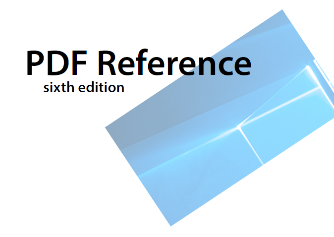

对指定页面添加背景图片或背景颜色，并设置大小、旋转、透明度和位置等属性，支持图片格式：PNG、BMP、JPEG。



## 接口说明

| 接口名 | 描述 |
| --- | --- |
| [addBackground](https://developer.huawei.com/consumer/cn/doc/harmonyos-references/pdf-arkts-pdfservice#addbackground)(info: BackgroundInfo, startIndex: number, endIndex: number, oddPages: boolean, evenPages: boolean): void | 插入PDF文档背景。 |
| [removeBackground](https://developer.huawei.com/consumer/cn/doc/harmonyos-references/pdf-arkts-pdfservice#removebackground)(): boolean | 删除PDF文档背景。 |


[addBackground](https://developer.huawei.com/consumer/cn/doc/harmonyos-references/pdf-arkts-pdfservice#addbackground)方法属于耗时业务，需要遍历每一页去添加背景，添加页面较多时建议放到线程里去处理。

## 示例代码

**添加背景：**

1. 调用loadDocument方法，加载PDF文档。
2. 实例化背景BackgroundInfo类，并设置相关属性，包括大小、旋转、透明度和位置等。
3. 调用addBackground方法，添加背景。
4. 保存PDF文档到应用沙箱。

**删除背景：**

1. 调用loadDocument方法，加载PDF文档。
2. 调用removeBackground方法，去除背景。
3. 保存PDF文档到应用沙箱。

```
import { pdfService } from '@kit.PDFKit';
import { hilog } from '@kit.PerformanceAnalysisKit';

@Entry
@Component
struct PdfPage {
  private pdfDocument: pdfService.PdfDocument = new pdfService.PdfDocument();
  private context = this.getUIContext().getHostContext() as Context;

  build() {
    Column() {
      Button('addBackground').onClick(async () => {
          // 确保在工程目录src/main/resources/resfile里有input.pdf文档
        let filePath = this.context.resourceDir + '/input.pdf';
        let res = this.pdfDocument.loadDocument(filePath);
        if (res === pdfService.ParseResult.PARSE_SUCCESS) {
          let bginfo: pdfService.BackgroundInfo = new pdfService.BackgroundInfo();
          // 确保在工程目录src/main/resources/resfile里有img.jpg文件
          bginfo.imagePath = this.context.resourceDir + '/img.jpg';
          bginfo.backgroundColor = 50;
          bginfo.isOnTop = true;
          bginfo.rotation = 45;
          bginfo.scale = 0.5;
          bginfo.opacity = 0.3;
          bginfo.verticalAlignment = pdfService.BackgroundAlignment.BACKGROUND_ALIGNMENT_TOP;
          bginfo.horizontalAlignment = pdfService.BackgroundAlignment.BACKGROUND_ALIGNMENT_LEFT;
          bginfo.horizontalSpace = 1.0;
          bginfo.verticalSpace = 1.0;
          this.pdfDocument.addBackground(bginfo, 0, 2, true, true);
          let outPdfPath = this.context.filesDir + '/testAddBackground.pdf';
          let result = this.pdfDocument.saveDocument(outPdfPath);
          hilog.info(0x0000, 'PdfPage', 'addBackground %{public}s!', result ? 'success' : 'fail');
        }
        this.pdfDocument.releaseDocument();
      })
      Button('removeBackground').onClick(async () => {
        let filePath = this.context.filesDir + '/testAddBackground.pdf';
        let res = this.pdfDocument.loadDocument(filePath);
        if (res === pdfService.ParseResult.PARSE_SUCCESS && this.pdfDocument.hasBackground()) {
          let removeResult = this.pdfDocument.removeBackground();
          if (removeResult) {
            let outPdfPath = this.context.filesDir + '/removeBackground.pdf';
            let result = this.pdfDocument.saveDocument(outPdfPath);
            hilog.info(0x0000, 'PdfPage', 'removeBackground %{public}s!', result ? 'success' : 'fail');
          }
        }
        this.pdfDocument.releaseDocument();
      })
    }
  }
}
```
