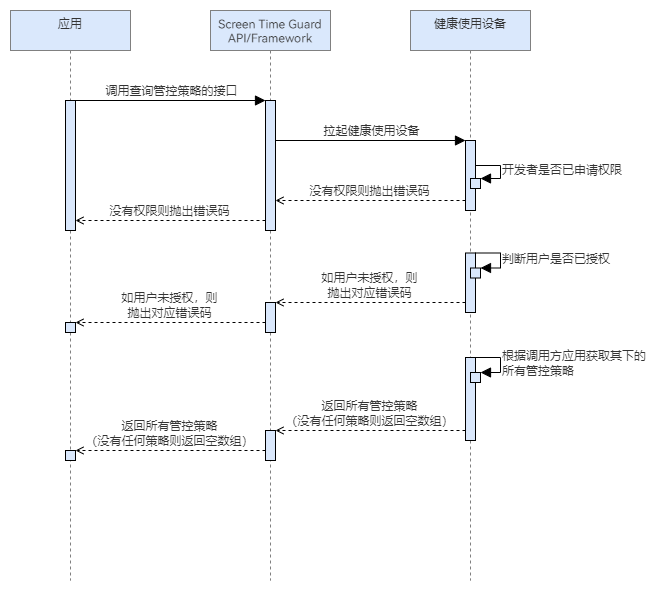

## 场景介绍

当用户希望查看现有的屏幕时间守护规则时，可以调用查询管控策略的接口。通过成功调用查询策略接口，用户可以浏览已创建的所有管控策略，如查看各个应用的停用起止时间或可使用时长。

## 业务流程



流程说明：

1. 应用调用查询管控策略的接口，拉起健康使用设备查询本应用是否已申请权限，以及用户是否对本应用授权。
2. 若没有权限，则抛出相应错误码；若有权限，则返回对应应用下的所有管控策略。

## 接口说明

查询策略的关键接口如下表所示：

| 接口名 | 描述 |
| --- | --- |
| [queryGuardStrategies](https://developer.huawei.com/consumer/cn/doc/harmonyos-references/screentimeguard-guardservice#queryguardstrategies)(): Promise[GuardStrategy](https://developer.huawei.com/consumer/cn/doc/harmonyos-references/screentimeguard-guardservice#guardstrategy)[] | 查询该应用下的所有管控策略。 |

## 开发前提

查询管控策略需要申请用户授权，请先参考[请求用户授权](/docs/dev/app-dev/application-services/screen-time-guard-kit-guide/screentimeguard-interface-call-auth/screentimeguard-request-user-auth)章节完成用户授权。

## 开发步骤

1. 导入相关模块。

   ```
   import { guardService } from '@kit.ScreenTimeGuardKit';
   import { hilog } from '@kit.PerformanceAnalysisKit';
   import { BusinessError } from '@kit.BasicServicesKit';
   ```
2. 调用queryGuardStrategy，查询对应应用下的所有管控策略。

   ```
   private async isStrategyExist(strategyName: string): Promise<boolean> {
      try {
         let guardStrategies: guardService.GuardStrategy[] = await guardService.queryGuardStrategies();
         for (let i = 0; i < guardStrategies.length; i++) {
            if (guardStrategies[i].name === strategyName) {
               return true;
            }
         }
      } catch (error) {
         let err: BusinessError = error as BusinessError;
         hilog.error(0x0000, 'GuardService',
            `queryGuardStrategies failed, errCode is ${err.code}, errMessage is ${err.message}`);
      }
      return false;
   }
   ```
