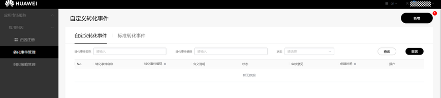
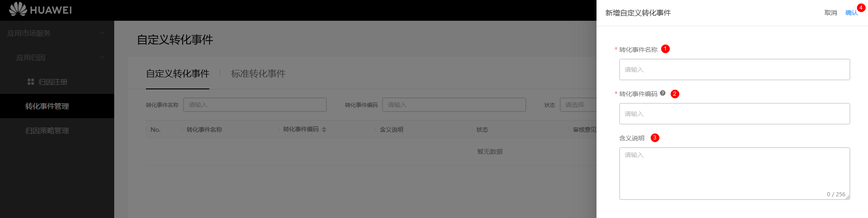
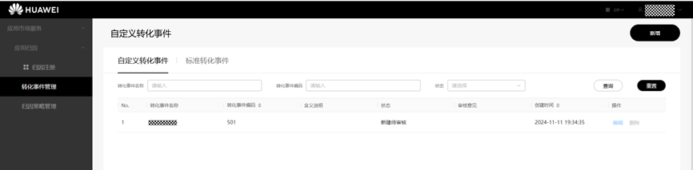
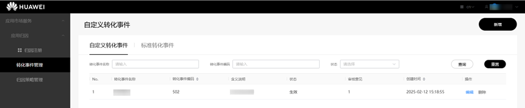
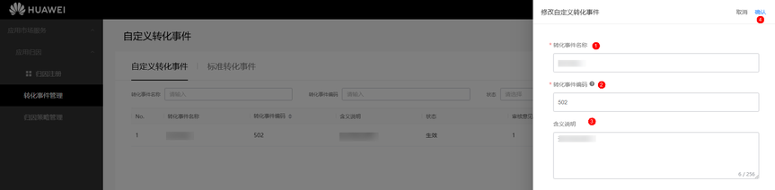
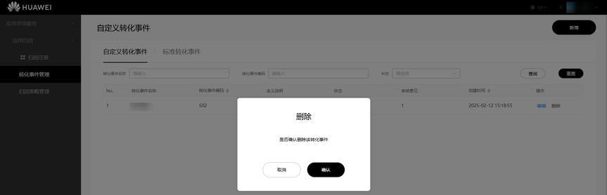
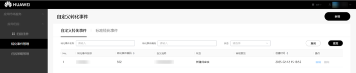

**开发者角色的合作伙伴在转化事件管理页面可以做如下操作**：

新增、修改、删除、查看自定义转化事件。

新增、修改、删除自定义转化事件时，相应的操作会被运营人员在后台审核通过或驳回，仅被审核通过的自定义转化事件才能生效。

## 新增

1. 在左侧点击转化事件管理菜单栏，进入自定义转化事件页面。

   
2. 点击右上角“新增”按钮，进入新增自定义转化事件页面。

   
3. 填写“转化事件名称”、“转化事件编码”、“含义说明”信息，点击“确认”按钮后会生成一条状态是“新建待审核”的自定义转化事件。

   

* 转化事件编码范围只能为[501, 600]。
* 转化事件名称或转化事件编码不能重复。

## 修改

1. 点击处于已生效或者驳回状态的自定义转化事件列表右侧“编辑”按钮：

   
2. 进入编辑页面，修改“转化事件名称”、“转化事件编码”、“含义说明”信息后点击“确认”按钮。

   
3. 修改后的数据状态为“修改待审核”或者“新建待审核”。

   

“修改待审核”状态的自定义转化事件被审核通过后才能生效，如果被驳回，则维持修改之前的转化事件名称和转化事件编码值。

* 修改后的转化事件名称或转化事件编码不能与已生效或者审核中的转化事件名称或转化事件编码重复。
* 对驳回状态的自定义转化事件进行编辑修改，修改后的状态为“新建待审核”。

## 删除

点击列表右侧的“删除”按钮，并在弹出框中点击“确认”。

状态为“已驳回”的自定义转化事件可以直接删除。

状态为“生效”的自定义转化事件，点击“确认”后该条自定义转化事件的状态由“生效”变为“删除待审核”。

删除待审核的自定义转化事件需要审核人员审核通过后，才会被删除。

## 查看

点击左侧转化事件管理菜单栏，进入自定义转化事件页面查看自定义转化事件信息。

