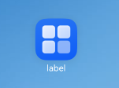
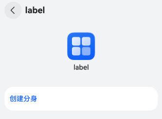
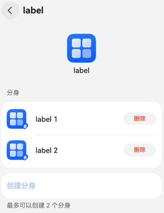
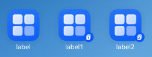

应用分身能在一个设备上安装多个相同的应用，实现多个账号同时登录并独立运行。主要应用场景有社交账号双开、游戏大小号双开等，无需账号切换，从而省去频繁登录的繁琐。

创建应用分身之后，桌面上会出现多个相同图标的应用，其中带有下角标的应用图标表示分身应用。

主应用与分身应用之间的关系如下：

* 主应用和分身应用共享同一个应用。例如，当主应用更新/升级时，主应用与分身应用都会同步更新，包括应用的图标（icon）和名称（label）、应用的新特性等。
* 主应用和分身应用，其对应的使能和相关配置都是独立的，数据也是彼此隔离。
* 主应用被卸载时，所有分身应用也会同步卸载。卸载分身应用时，不会影响主应用。

以下图片展示了应用分身的效果：


## 约束与限制

输入法应用配置分身无效，无法创建应用分身。

## 应用分身的开发步骤

1. 配置应用分身的方法。

   在工程项目中对AppScope/app.json5配置文件配置[multiAppMode](/docs/dev/app-dev/getting-started/dev-fundamentals/app-configuration-file#multiappmode标签)字段。具体配置如下：

   ```
   {
     "app": {
       // ...
       "multiAppMode": {
         "multiAppModeType": "appClone",
         "maxCount": 2
       }
     }
   }
   ```

   

<div class="source-link-wrapper"><a href="https://gitcode.com/HarmonyOS_Samples/guide-snippets/blob/HarmonyOS-feature-20260402/bmsSample/AppClone/AppScope/app.json5#L16-L33" target="_blank" rel="noopener noreferrer" class="source-link"><svg class="source-link-icon" width="14" height="14" viewBox="0 0 24 24" fill="none" stroke="currentColor" strokeWidth="2" strokeLinecap="round" strokeLinejoin="round"><path d="M18 13v6a2 2 0 0 1-2 2H5a2 2 0 0 1-2-2V8a2 2 0 0 1 2-2h6" /><polyline points="15 3 21 3 21 9" /><line x1="10" y1="14" x2="21" y2="3" /></svg> 查看源码：app.json5</a></div>

2. 创建分身应用。

   * 首先将已配置好的工程编译打包安装到设备上。

     
   * 然后打开设置>系统>应用分身，点击“创建分身”。

     

     
   * 返回桌面，检查创建是否成功。

     

     图中的三个应用的进程、运行、数据、通知等，都是彼此独立的。
