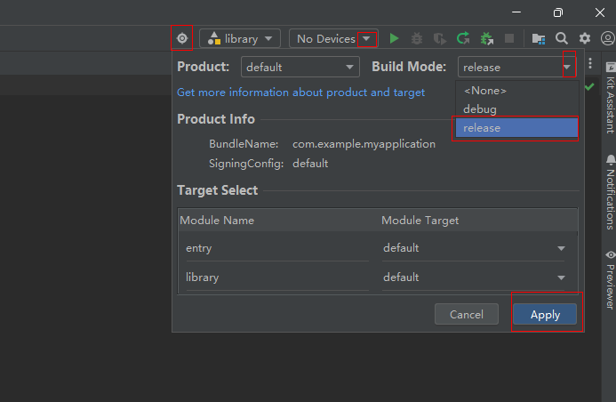

集成态HSP是应用内HSP的中间编译产物，用于解决使用方的bundleName和签名之间的强耦合问题。


HSP只能给bundleName一样的工程使用，集成态HSP可以给不同的bundleName的工程集成使用。

使用方使用集成态HSP时，需要采用使用方的签名文件对集成态HSP重新签名，且需要优先安装重新签名后的集成态HSP。

## 使用场景

如果存在多个应用包含相同的基础能力，例如日志打印模块，为节约开发成本并实现代码和资源的共享，多个应用可以共用一个日志模块。此时，可以通过应用内HSP方式提供能力。由于应用内HSP的限制，每个应用在使用前都需要调整其bundleName，并使用当前应用的签名重新签名，构建一个新的HSP提供给当前应用使用。这意味着，每增加一个应用，就需要进行一次调整bundleName和重新签名的操作，导致签名和打包过程繁琐。

而集成态HSP在DevEco Studio编译过程中，bundleName和重签名的动作会自动完成，开发者无需关注重复签名的操作，可以专注于功能业务的开发。

## 约束限制

* 集成态HSP只支持[Stage模型](/docs/dev/app-dev/getting-started/dev-fundamentals/application-package-structure-stage)。
* 从API version 12开始，支持使用集成态HSP。
* 使用集成态HSP要求使用标准化的OHMUrl格式。需要在工程级的[build-profile.json5文件](https://developer.huawei.com/consumer/cn/doc/harmonyos-guides/ide-hvigor-build-profile-app)中，将[strictMode](https://developer.huawei.com/consumer/cn/doc/harmonyos-guides/ide-hvigor-build-profile-app#section13181758123312)下的useNormalizedOHMUrl字段设置为true。

## 开发使用说明

### 配置集成态HSP

1. 工程配置：配置工程级的build-profile.json5文件，将useNormalizedOHMUrl字段设置为true。

   ```
   {
     "app": {
       "signingConfigs": [
       ],
       "products": [
         {
           "name": "default",
           "signingConfig": "default",
           "targetSdkVersion": "5.1.1(19)",
           "compatibleSdkVersion": "5.1.1(19)",
           "runtimeOS": "HarmonyOS",
           "buildOption": {
             "strictMode": {
               // ...
               "useNormalizedOHMUrl": true,
             }
           }
         }
       ],
       // ...
     },
     // ...
   }
   ```

   

<div class="source-link-wrapper"><a href="https://gitcode.com/HarmonyOS_Samples/guide-snippets/blob/HarmonyOS-feature-20260402/bmsSample/IntegratedHsp/build-profile.json5#L15-L77" target="_blank" rel="noopener noreferrer" class="source-link"><svg class="source-link-icon" width="14" height="14" viewBox="0 0 24 24" fill="none" stroke="currentColor" strokeWidth="2" strokeLinecap="round" strokeLinejoin="round"><path d="M18 13v6a2 2 0 0 1-2 2H5a2 2 0 0 1-2-2V8a2 2 0 0 1 2-2h6" /><polyline points="15 3 21 3 21 9" /><line x1="10" y1="14" x2="21" y2="3" /></svg> 查看源码：build-profile.json5</a></div>

2. 模块配置：修改模块级构建配置文件[build-profile.json5](https://developer.huawei.com/consumer/cn/doc/harmonyos-guides/ide-hvigor-build-profile)，将integratedHsp配置项设置为true，指定构建的HSP模块为集成态HSP。

   ```
   // library/build-profile.json5
   {
     "apiType": "stageMode",
     // ...
     "buildOptionSet": [
       {
         // ...
         "arkOptions": {
           "integratedHsp": true,
           // ...
         },
       },
     ],
     // ...
   }
   ```

   

<div class="source-link-wrapper"><a href="https://gitcode.com/HarmonyOS_Samples/guide-snippets/blob/HarmonyOS-feature-20260402/bmsSample/IntegratedHsp/library/build-profile.json5#L15-L57" target="_blank" rel="noopener noreferrer" class="source-link"><svg class="source-link-icon" width="14" height="14" viewBox="0 0 24 24" fill="none" stroke="currentColor" strokeWidth="2" strokeLinecap="round" strokeLinejoin="round"><path d="M18 13v6a2 2 0 0 1-2 2H5a2 2 0 0 1-2-2V8a2 2 0 0 1 2-2h6" /><polyline points="15 3 21 3 21 9" /><line x1="10" y1="14" x2="21" y2="3" /></svg> 查看源码：build-profile.json5</a></div>

3. 打包配置（tgz包）。

   (1) 配置项目签名信息，详情请参见[应用/元服务签名](https://developer.huawei.com/consumer/cn/doc/harmonyos-guides/ide-signing)。

   (2) 配置release模式。

   

   (3) 选择library目录，执行Build -> Make Module 'library'。

### 使用方集成

1. 创建目录并拷贝文件：在entry目录下新建libs目录，将集成态打包产物tgz包拷贝到libs目录下。
2. 工程依赖配置：在使用方主模块的oh-package.json5配置文件中添加依赖。

   ```
   "dependencies": {
     "library": "file:./libs/library-default.tgz"
   },
   ```

   

<div class="source-link-wrapper"><a href="https://gitcode.com/HarmonyOS_Samples/guide-snippets/blob/HarmonyOS-feature-20260402/bmsSample/IntegratedHsp/entry/oh-package.json5#L23-L27" target="_blank" rel="noopener noreferrer" class="source-link"><svg class="source-link-icon" width="14" height="14" viewBox="0 0 24 24" fill="none" stroke="currentColor" strokeWidth="2" strokeLinecap="round" strokeLinejoin="round"><path d="M18 13v6a2 2 0 0 1-2 2H5a2 2 0 0 1-2-2V8a2 2 0 0 1 2-2h6" /><polyline points="15 3 21 3 21 9" /><line x1="10" y1="14" x2="21" y2="3" /></svg> 查看源码：oh-package.json5</a></div>

3. 工程配置：在工程级的build-profile.json5文件中，将useNormalizedOHMUrl字段设置为true。

   ```
   {
     "app": {
       "signingConfigs": [
       ],
       "products": [
         {
           "name": "default",
           "signingConfig": "default",
           "targetSdkVersion": "5.1.1(19)",
           "compatibleSdkVersion": "5.1.1(19)",
           "runtimeOS": "HarmonyOS",
           "buildOption": {
             "strictMode": {
               // ...
               "useNormalizedOHMUrl": true,
             }
           }
         }
       ],
       // ...
     },
     // ...
   }
   ```

   

<div class="source-link-wrapper"><a href="https://gitcode.com/HarmonyOS_Samples/guide-snippets/blob/HarmonyOS-feature-20260402/bmsSample/IntegratedHsp/build-profile.json5#L15-L77" target="_blank" rel="noopener noreferrer" class="source-link"><svg class="source-link-icon" width="14" height="14" viewBox="0 0 24 24" fill="none" stroke="currentColor" strokeWidth="2" strokeLinecap="round" strokeLinejoin="round"><path d="M18 13v6a2 2 0 0 1-2 2H5a2 2 0 0 1-2-2V8a2 2 0 0 1 2-2h6" /><polyline points="15 3 21 3 21 9" /><line x1="10" y1="14" x2="21" y2="3" /></svg> 查看源码：build-profile.json5</a></div>

4. 配置签名。

   安装和运行应用前，必须配置项目签名信息，详见[应用/元服务签名](https://developer.huawei.com/consumer/cn/doc/harmonyos-guides/ide-signing)。
5. [安装和运行](https://developer.huawei.com/consumer/cn/doc/harmonyos-guides/ide-run-device)。
