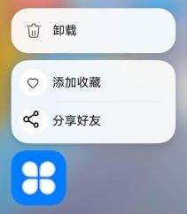

随着应用的功能越来越复杂，用户在使用应用时，找到某个功能的操作步骤也变得更加繁琐。为提升用户体验，可以对应用中常用的功能创建对应的桌面快捷方式，以达到快速启动应用、一键直达特定功能等目的。例如相机应用的 “快速拍照”、便签应用的 “新建便签” 和地图应用的常用地点导航等功能的快捷方式，用户通过快捷方式可以快速进入特定功能页面，既能大大提高操作效率，同时也增加了用户对应用的依赖性。使用快捷方式，还可以实现个性化定制的需求，创建多个快捷方式，以满足个性化的工作流程和操作偏好。快捷方式的配置请参考[配置方法](#配置方法)，快捷方式的管理能力请参考[shortcutManager模块](https://developer.huawei.com/consumer/cn/doc/harmonyos-references/js-apis-shortcutmanager)。

## 场景介绍

以导航场景为例，用户使用地图应用导航时，通常先搜索目的地，然后开始导航。为了提升导航效率和操作便捷性，建议在地图应用中添加常去地点的快捷方式，如公司、家等。添加这些快捷方式后，用户长按应用图标，即可打开快捷方式入口，快速启动导航。详情请参见[桌面快捷方式](https://developer.huawei.com/consumer/cn/doc/best-practices/bpta-desktop-shortcuts)。


桌面展示快捷方式的数量有上限要求，最多展示4个。

## 配置方法

下面介绍在工程中配置静态快捷方式的方法。

1. 在entry/src/main/resources/base/element/string.json配置资源文件如下。

   ```
   {
     "string": [
       {
         "name": "share",
         "value": "分享好友"
       },
       {
         "name": "add",
         "value": "添加收藏"
       }
     ]
   }
   ```
2. 配置快捷方式文件。

   在模块的/resources/base/profile/目录下配置[快捷方式的配置文件](/docs/dev/app-dev/getting-started/dev-fundamentals/module-configuration-file#shortcuts标签)，如shortcuts\_config.json。

   ```
   {
     "shortcuts": [
      {
         "shortcutId": "id_test1",
         "label": "$string:add",
         "icon": "$media:add_icon",
         "wants": [
           {
             "bundleName": "com.ohos.hello",
             "moduleName": "entry",
             "abilityName": "EntryAbility1",
             "parameters": {
               "testKey": "testValue"
             }
           }
         ]
       },
       {
         "shortcutId": "id_test2",
         "label": "$string:share",
         "icon": "$media:share_icon",
         "wants": [
           {
             "bundleName": "com.ohos.hello",
             "moduleName": "entry",
             "abilityName": "EntryAbility",
             "parameters": {
               "testKey": "testValue"
             }
           }
         ]
       }
     ]
   }
   ```
3. 在应用的module.json5文件中配置metadata，指向快捷方式的配置文件。

   ```
   {
     "module": {
       // ...
       "abilities": [
         {
           "name": "EntryAbility",
           "srcEntry": "./ets/entryability/EntryAbility.ets",
           "metadata": [
             {
               "name": "ohos.ability.shortcuts",  // 配置快捷方式，该值固定为ohos.ability.shortcuts
               "resource": "$profile:shortcuts_config"  // 指定shortcuts信息的资源位置
             }
           ],
           // ...
         }
       ],
       // ...
     },
   }
   ```

   

<div class="source-link-wrapper"><a href="https://gitcode.com/HarmonyOS_Samples/guide-snippets/blob/HarmonyOS-feature-20260402/bmsSample/TypicalScenarioConfiguration/entry/src/main/module.json5#L16-L79" target="_blank" rel="noopener noreferrer" class="source-link"><svg class="source-link-icon" width="14" height="14" viewBox="0 0 24 24" fill="none" stroke="currentColor" strokeWidth="2" strokeLinecap="round" strokeLinejoin="round"><path d="M18 13v6a2 2 0 0 1-2 2H5a2 2 0 0 1-2-2V8a2 2 0 0 1 2-2h6" /><polyline points="15 3 21 3 21 9" /><line x1="10" y1="14" x2="21" y2="3" /></svg> 查看源码：module.json5</a></div>


安装应用后，长按桌面上的应用图标，图标上方会显示开发者配置的快捷方式：“添加收藏”和“分享好友”。点击相应标签，可启动对应的组件。应用配置的静态快捷方式在桌面上的展示效果如下图所示。



## 隐藏快捷方式

可以通过[setShortcutVisibleForSelf](https://developer.huawei.com/consumer/cn/doc/harmonyos-references/js-apis-shortcutmanager#shortcutmanagersetshortcutvisibleforself)接口隐藏或展示快捷方式。
