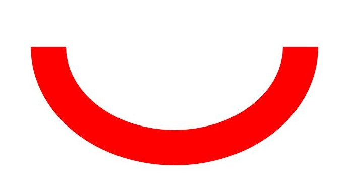
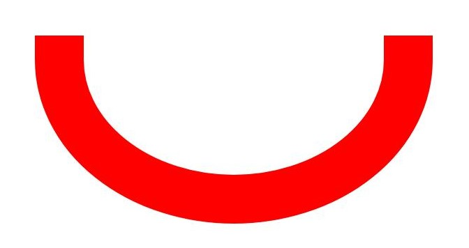
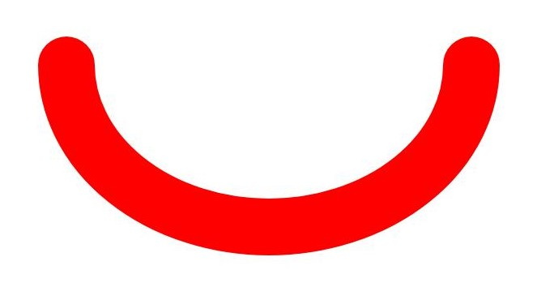
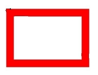
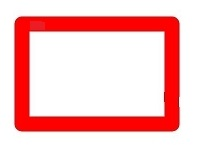
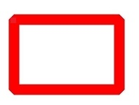

## 场景介绍

在进行绘制时，可以进行一些基础效果的设置，比如设置填充颜色、设置抗锯齿、设置图形描边、设置图形线条连接样式等。

主要通过画刷（Brush）设置填充基础效果，通过画笔（Pen）设置描边基础效果。

## 填充效果

可以通过画刷设置基础的填充颜色，还可以通过画刷使用混合模式、着色器效果、滤波器效果等实现更多复杂绘制效果，具体可见[复杂绘制效果](/docs/dev/app-dev/graphics/arkgraphics-2d/graphic-drawing-and-display/drawing-effect/complex-drawing-effect-c)。

### 接口说明

使用画刷（Brush）设置绘制效果的常用接口如下表所示，详细的使用和参数请见[drawing\_brush](https://developer.huawei.com/consumer/cn/doc/harmonyos-references/capi-drawing-brush-h)。

| 接口 | 描述 |
| --- | --- |
| OH\_Drawing\_Brush\* OH\_Drawing\_BrushCreate (void) | 用于创建一个画刷对象。 |
| void OH\_Drawing\_CanvasAttachBrush (OH\_Drawing\_Canvas\*, const OH\_Drawing\_Brush\*) | 用于设置画刷给画布，画布将使用设置的画刷样式和颜色填充绘制的图形形状。 |
| void OH\_Drawing\_BrushSetColor (OH\_Drawing\_Brush\* , uint32\_t color) | 用于设置画刷的颜色属性，颜色属性描述了画刷填充图形时使用的颜色，用一个32位（ARGB）的变量表示。 |
| void OH\_Drawing\_BrushSetAntiAlias (OH\_Drawing\_Brush\* , bool) | 用于设置画刷的抗锯齿属性，设置为true则画刷在绘制图形时会对图形的边缘像素进行半透明的模糊处理，以使图形边缘更加平滑。 |
| void OH\_Drawing\_CanvasDetachBrush (OH\_Drawing\_Canvas\*) | 用于去除画布中的画刷，执行后画布将不使用此前设置的画刷，恢复到默认的填充效果。 |
| void OH\_Drawing\_BrushDestroy (OH\_Drawing\_Brush\*) | 用于销毁画刷对象并回收该对象占有的内存。 |

### 开发步骤

1. 使用OH\_Drawing\_BrushCreate()接口创建画刷Brush对象。

   ```
   // 创建画刷
   OH_Drawing_Brush* brush = OH_Drawing_BrushCreate();
   ```

   

<div class="source-link-wrapper"><a href="https://gitcode.com/HarmonyOS_Samples/guide-snippets/blob/HarmonyOS-feature-20260402/ArkGraphics2D/Drawing/NDKGraphicsDraw/entry/src/main/cpp/samples/sample_graphics.cpp#L509-L512" target="_blank" rel="noopener noreferrer" class="source-link"><svg class="source-link-icon" width="14" height="14" viewBox="0 0 24 24" fill="none" stroke="currentColor" strokeWidth="2" strokeLinecap="round" strokeLinejoin="round">\<path d="M18 13v6a2 2 0 0 1-2 2H5a2 2 0 0 1-2-2V8a2 2 0 0 1 2-2h6" /\>\<polyline points="15 3 21 3 21 9" /\>\<line x1="10" y1="14" x2="21" y2="3" /\></svg> 查看源码：sample_graphics.cpp</a></div>

2. 使用画刷设置基础绘制效果（可选以下的一个或者多个效果）。

   * 可使用OH\_Drawing\_BrushSetColor()接口设置填充颜色。

     ```
     // 设置填充颜色为红色
     uint32_t color = 0xffff0000;
     OH_Drawing_BrushSetColor(brush, color);
     ```

     

<div class="source-link-wrapper"><a href="https://gitcode.com/HarmonyOS_Samples/guide-snippets/blob/HarmonyOS-feature-20260402/ArkGraphics2D/Drawing/NDKGraphicsDraw/entry/src/main/cpp/samples/sample_graphics.cpp#L513-L517" target="_blank" rel="noopener noreferrer" class="source-link"><svg class="source-link-icon" width="14" height="14" viewBox="0 0 24 24" fill="none" stroke="currentColor" strokeWidth="2" strokeLinecap="round" strokeLinejoin="round">\<path d="M18 13v6a2 2 0 0 1-2 2H5a2 2 0 0 1-2-2V8a2 2 0 0 1 2-2h6" /\>\<polyline points="15 3 21 3 21 9" /\>\<line x1="10" y1="14" x2="21" y2="3" /\></svg> 查看源码：sample_graphics.cpp</a></div>


     color是一个32位（ARGB）的变量，例如0xffff0000。
   * 可使用OH\_Drawing\_BrushSetAntiAlias()接口开启抗锯齿效果，以使图形边缘更加平滑。

     ```
     // 开启抗锯齿效果
     OH_Drawing_BrushSetAntiAlias(brush, true);
     ```

     

<div class="source-link-wrapper"><a href="https://gitcode.com/HarmonyOS_Samples/guide-snippets/blob/HarmonyOS-feature-20260402/ArkGraphics2D/Drawing/NDKGraphicsDraw/entry/src/main/cpp/samples/sample_graphics.cpp#L518-L521" target="_blank" rel="noopener noreferrer" class="source-link"><svg class="source-link-icon" width="14" height="14" viewBox="0 0 24 24" fill="none" stroke="currentColor" strokeWidth="2" strokeLinecap="round" strokeLinejoin="round">\<path d="M18 13v6a2 2 0 0 1-2 2H5a2 2 0 0 1-2-2V8a2 2 0 0 1 2-2h6" /\>\<polyline points="15 3 21 3 21 9" /\>\<line x1="10" y1="14" x2="21" y2="3" /\></svg> 查看源码：sample_graphics.cpp</a></div>

3. 使用OH\_Drawing\_CanvasAttachBrush()接口给Canvas画布设置画刷。接口接受两个参数，一个是画布对象Canvas，请确保已创建或获取得到画布Canvas，具体可见[画布的获取与绘制结果的显示（C/C++）](/docs/dev/app-dev/graphics/arkgraphics-2d/graphic-drawing-and-display/canvas-get-result-draw/canvas-get-result-draw-c)；另一个是要设置的画刷对象。画布将会使用设置的画刷样式和颜色等填充图形。

   ```
   // 设置画布的画刷
   OH_Drawing_CanvasAttachBrush(canvas, brush);
   ```

   

<div class="source-link-wrapper"><a href="https://gitcode.com/HarmonyOS_Samples/guide-snippets/blob/HarmonyOS-feature-20260402/ArkGraphics2D/Drawing/NDKGraphicsDraw/entry/src/main/cpp/samples/sample_graphics.cpp#L522-L525" target="_blank" rel="noopener noreferrer" class="source-link"><svg class="source-link-icon" width="14" height="14" viewBox="0 0 24 24" fill="none" stroke="currentColor" strokeWidth="2" strokeLinecap="round" strokeLinejoin="round">\<path d="M18 13v6a2 2 0 0 1-2 2H5a2 2 0 0 1-2-2V8a2 2 0 0 1 2-2h6" /\>\<polyline points="15 3 21 3 21 9" /\>\<line x1="10" y1="14" x2="21" y2="3" /\></svg> 查看源码：sample_graphics.cpp</a></div>

4. 按需绘制图元，具体可见[图元绘制](/docs/dev/app-dev/graphics/arkgraphics-2d/graphic-drawing-and-display/primitive-drawing/primitive-drawing-overview)一节。
5. 当不需要填充效果时，可以使用OH\_Drawing\_CanvasDetachBrush()去除。入参为画布对象Canvas。

   ```
   // 去除画布中的画刷
   OH_Drawing_CanvasDetachBrush(canvas);
   ```

   

<div class="source-link-wrapper"><a href="https://gitcode.com/HarmonyOS_Samples/guide-snippets/blob/HarmonyOS-feature-20260402/ArkGraphics2D/Drawing/NDKGraphicsDraw/entry/src/main/cpp/samples/sample_graphics.cpp#L529-L532" target="_blank" rel="noopener noreferrer" class="source-link"><svg class="source-link-icon" width="14" height="14" viewBox="0 0 24 24" fill="none" stroke="currentColor" strokeWidth="2" strokeLinecap="round" strokeLinejoin="round">\<path d="M18 13v6a2 2 0 0 1-2 2H5a2 2 0 0 1-2-2V8a2 2 0 0 1 2-2h6" /\>\<polyline points="15 3 21 3 21 9" /\>\<line x1="10" y1="14" x2="21" y2="3" /\></svg> 查看源码：sample_graphics.cpp</a></div>

6. 当不再需要画刷进行效果填充时，请及时使用OH\_Drawing\_BrushDestroy()接口销毁Brush对象。

   ```
   // 销毁各类对象
   OH_Drawing_BrushDestroy(brush);
   ```

   

<div class="source-link-wrapper"><a href="https://gitcode.com/HarmonyOS_Samples/guide-snippets/blob/HarmonyOS-feature-20260402/ArkGraphics2D/Drawing/NDKGraphicsDraw/entry/src/main/cpp/samples/sample_graphics.cpp#L533-L536" target="_blank" rel="noopener noreferrer" class="source-link"><svg class="source-link-icon" width="14" height="14" viewBox="0 0 24 24" fill="none" stroke="currentColor" strokeWidth="2" strokeLinecap="round" strokeLinejoin="round">\<path d="M18 13v6a2 2 0 0 1-2 2H5a2 2 0 0 1-2-2V8a2 2 0 0 1 2-2h6" /\>\<polyline points="15 3 21 3 21 9" /\>\<line x1="10" y1="14" x2="21" y2="3" /\></svg> 查看源码：sample_graphics.cpp</a></div>


## 描边效果

可以通过画笔设置基础的描边颜色，还可以通过画笔使用混合模式、路径效果、着色器效果、滤波器效果等实现更多复杂绘制效果，具体可见[复杂绘制效果](/docs/dev/app-dev/graphics/arkgraphics-2d/graphic-drawing-and-display/drawing-effect/complex-drawing-effect-c)。

### 接口说明

使用画笔（Pen）设置绘制效果的常用接口如下表所示，详细的使用和参数请见[drawing\_pen](https://developer.huawei.com/consumer/cn/doc/harmonyos-references/capi-drawing-pen-h)。

| 接口 | 描述 |
| --- | --- |
| OH\_Drawing\_Pen\* OH\_Drawing\_PenCreate (void) | 用于创建一个画笔对象。 |
| void OH\_Drawing\_CanvasAttachPen (OH\_Drawing\_Canvas\* , const OH\_Drawing\_Pen\* ) | 用于设置画笔给画布，画布将会使用设置画笔的样式和颜色去绘制图形形状的轮廓。 |
| void OH\_Drawing\_PenSetColor (OH\_Drawing\_Pen\* , uint32\_t color) | 用于设置画笔的颜色属性，颜色属性描述了画笔绘制图形轮廓时使用的颜色，用一个32位（ARGB）的变量表示。 |
| void OH\_Drawing\_PenSetWidth (OH\_Drawing\_Pen\* , float width) | 用于设置画笔的线宽。0线宽被视作特殊的极细线宽，在绘制时始终会被绘制为1像素，不随画布的缩放而改变；负数线宽在实际绘制时会被视作0线宽。 |
| void OH\_Drawing\_PenSetAntiAlias (OH\_Drawing\_Pen\* , bool ) | 用于设置画笔的抗锯齿属性，设置为true则画笔在绘制图形时会对图形的边缘像素进行半透明的模糊处理。 |
| void OH\_Drawing\_PenSetCap (OH\_Drawing\_Pen\* , OH\_Drawing\_PenLineCapStyle) | 用于设置画笔线帽样式。 |
| void OH\_Drawing\_PenSetJoin (OH\_Drawing\_Pen\* , OH\_Drawing\_PenLineJoinStyle) | 用于设置画笔绘制转角的样式。 |
| void OH\_Drawing\_CanvasDetachPen (OH\_Drawing\_Canvas\*) | 用于去除画布中的画笔，执行后画布将不去绘制图形形状的轮廓，恢复到默认的填充效果。 |
| void OH\_Drawing\_PenDestroy (OH\_Drawing\_Pen\*) | 用于销毁画笔对象并回收该对象占有的内存。 |

### 开发步骤

1. 使用OH\_Drawing\_PenCreate()接口创建画笔Pen对象。

   ```
   // 创建画笔
   OH_Drawing_Pen* pen = OH_Drawing_PenCreate();
   ```

   

<div class="source-link-wrapper"><a href="https://gitcode.com/HarmonyOS_Samples/guide-snippets/blob/HarmonyOS-feature-20260402/ArkGraphics2D/Drawing/NDKGraphicsDraw/entry/src/main/cpp/samples/sample_graphics.cpp#L542-L545" target="_blank" rel="noopener noreferrer" class="source-link"><svg class="source-link-icon" width="14" height="14" viewBox="0 0 24 24" fill="none" stroke="currentColor" strokeWidth="2" strokeLinecap="round" strokeLinejoin="round">\<path d="M18 13v6a2 2 0 0 1-2 2H5a2 2 0 0 1-2-2V8a2 2 0 0 1 2-2h6" /\>\<polyline points="15 3 21 3 21 9" /\>\<line x1="10" y1="14" x2="21" y2="3" /\></svg> 查看源码：sample_graphics.cpp</a></div>

2. 使用画笔设置具体的描边效果（可选以下的一个或者多个效果）。

   * 可使用OH\_Drawing\_PenSetColor()接口设置画笔颜色，对应为绘制图形轮廓时使用的颜色。

     ```
     // 设置画笔颜色为红色
     uint32_t color = 0xffff0000;
     OH_Drawing_PenSetColor(pen, color);
     ```

     

<div class="source-link-wrapper"><a href="https://gitcode.com/HarmonyOS_Samples/guide-snippets/blob/HarmonyOS-feature-20260402/ArkGraphics2D/Drawing/NDKGraphicsDraw/entry/src/main/cpp/samples/sample_graphics.cpp#L546-L550" target="_blank" rel="noopener noreferrer" class="source-link"><svg class="source-link-icon" width="14" height="14" viewBox="0 0 24 24" fill="none" stroke="currentColor" strokeWidth="2" strokeLinecap="round" strokeLinejoin="round">\<path d="M18 13v6a2 2 0 0 1-2 2H5a2 2 0 0 1-2-2V8a2 2 0 0 1 2-2h6" /\>\<polyline points="15 3 21 3 21 9" /\>\<line x1="10" y1="14" x2="21" y2="3" /\></svg> 查看源码：sample_graphics.cpp</a></div>


     color是一个32位（ARGB）的变量，例如0xffff0000。
   * 可使用OH\_Drawing\_PenSetWidth()接口设置画笔的线宽。

     ```
     // 设置画笔的线宽为50像素
     float width = 50.0;
     OH_Drawing_PenSetWidth(pen, width);
     ```

     

<div class="source-link-wrapper"><a href="https://gitcode.com/HarmonyOS_Samples/guide-snippets/blob/HarmonyOS-feature-20260402/ArkGraphics2D/Drawing/NDKGraphicsDraw/entry/src/main/cpp/samples/sample_graphics.cpp#L551-L555" target="_blank" rel="noopener noreferrer" class="source-link"><svg class="source-link-icon" width="14" height="14" viewBox="0 0 24 24" fill="none" stroke="currentColor" strokeWidth="2" strokeLinecap="round" strokeLinejoin="round">\<path d="M18 13v6a2 2 0 0 1-2 2H5a2 2 0 0 1-2-2V8a2 2 0 0 1 2-2h6" /\>\<polyline points="15 3 21 3 21 9" /\>\<line x1="10" y1="14" x2="21" y2="3" /\></svg> 查看源码：sample_graphics.cpp</a></div>


     width表示线宽的像素值。
   * 可使用OH\_Drawing\_PenSetAntiAlias()接口设置画笔抗锯齿，以使图形绘制边缘更平滑。

     ```
     // 设置画笔抗锯齿
     OH_Drawing_PenSetAntiAlias(pen, true);
     ```

     

<div class="source-link-wrapper"><a href="https://gitcode.com/HarmonyOS_Samples/guide-snippets/blob/HarmonyOS-feature-20260402/ArkGraphics2D/Drawing/NDKGraphicsDraw/entry/src/main/cpp/samples/sample_graphics.cpp#L556-L559" target="_blank" rel="noopener noreferrer" class="source-link"><svg class="source-link-icon" width="14" height="14" viewBox="0 0 24 24" fill="none" stroke="currentColor" strokeWidth="2" strokeLinecap="round" strokeLinejoin="round">\<path d="M18 13v6a2 2 0 0 1-2 2H5a2 2 0 0 1-2-2V8a2 2 0 0 1 2-2h6" /\>\<polyline points="15 3 21 3 21 9" /\>\<line x1="10" y1="14" x2="21" y2="3" /\></svg> 查看源码：sample_graphics.cpp</a></div>

   * 可使用OH\_Drawing\_PenSetCap()接口设置画笔线帽样式。

     ```
     // 设置画笔线帽样式
     OH_Drawing_PenSetCap(pen, OH_Drawing_PenLineCapStyle::LINE_ROUND_CAP);
     ```

     

<div class="source-link-wrapper"><a href="https://gitcode.com/HarmonyOS_Samples/guide-snippets/blob/HarmonyOS-feature-20260402/ArkGraphics2D/Drawing/NDKGraphicsDraw/entry/src/main/cpp/samples/sample_graphics.cpp#L560-L563" target="_blank" rel="noopener noreferrer" class="source-link"><svg class="source-link-icon" width="14" height="14" viewBox="0 0 24 24" fill="none" stroke="currentColor" strokeWidth="2" strokeLinecap="round" strokeLinejoin="round">\<path d="M18 13v6a2 2 0 0 1-2 2H5a2 2 0 0 1-2-2V8a2 2 0 0 1 2-2h6" /\>\<polyline points="15 3 21 3 21 9" /\>\<line x1="10" y1="14" x2="21" y2="3" /\></svg> 查看源码：sample_graphics.cpp</a></div>


     OH\_Drawing\_PenLineCapStyle线帽样式可选分类对应如下：

     | 线帽样式 | 说明 | 示意图 |
     | --- | --- | --- |
     | LINE\_FLAT\_CAP | 没有线帽样式，线条头尾端点处横切。 |  |
     | LINE\_SQUARE\_CAP | 线帽的样式为方框，线条的头尾端点处多出一个方框，方框宽度和线段一样宽，高度是线段宽度的一半。 |  |
     | LINE\_ROUND\_CAP | 线帽的样式为圆弧，线条的头尾端点处多出一个半圆弧，半圆的直径与线段宽度一致。 |  |
   * 可使用OH\_Drawing\_PenSetJoin()接口设置画笔转角样式。

     ```
     // 设置画笔转角样式
     OH_Drawing_PenSetJoin(pen, OH_Drawing_PenLineJoinStyle::LINE_BEVEL_JOIN);
     ```

     

<div class="source-link-wrapper"><a href="https://gitcode.com/HarmonyOS_Samples/guide-snippets/blob/HarmonyOS-feature-20260402/ArkGraphics2D/Drawing/NDKGraphicsDraw/entry/src/main/cpp/samples/sample_graphics.cpp#L564-L567" target="_blank" rel="noopener noreferrer" class="source-link"><svg class="source-link-icon" width="14" height="14" viewBox="0 0 24 24" fill="none" stroke="currentColor" strokeWidth="2" strokeLinecap="round" strokeLinejoin="round">\<path d="M18 13v6a2 2 0 0 1-2 2H5a2 2 0 0 1-2-2V8a2 2 0 0 1 2-2h6" /\>\<polyline points="15 3 21 3 21 9" /\>\<line x1="10" y1="14" x2="21" y2="3" /\></svg> 查看源码：sample_graphics.cpp</a></div>


     OH\_Drawing\_PenLineJoinStyle转角样式可选分类对应如下：

     | 转角样式 | 说明 | 示意图 |
     | --- | --- | --- |
     | LINE\_MITER\_JOIN | 转角类型为尖角 |  |
     | LINE\_ROUND\_JOIN | 转角类型为圆头 |  |
     | LINE\_BEVEL\_JOIN | 转角类型为平头 |  |
3. 使用OH\_Drawing\_CanvasAttachPen()接口给Canvas画布设置画笔。接口接受两个参数，一个是画布对象Canvas，请确保已创建或获取得到画布Canvas，具体可见[画布的获取与绘制结果的显示（C/C++）](/docs/dev/app-dev/graphics/arkgraphics-2d/graphic-drawing-and-display/canvas-get-result-draw/canvas-get-result-draw-c)；另一个是要设置的画笔对象。画布将会使用设置的画笔样式和颜色等绘制图形轮廓。

   ```
   // 设置画布的画笔
   OH_Drawing_CanvasAttachPen(canvas, pen);
   ```

   

<div class="source-link-wrapper"><a href="https://gitcode.com/HarmonyOS_Samples/guide-snippets/blob/HarmonyOS-feature-20260402/ArkGraphics2D/Drawing/NDKGraphicsDraw/entry/src/main/cpp/samples/sample_graphics.cpp#L568-L571" target="_blank" rel="noopener noreferrer" class="source-link"><svg class="source-link-icon" width="14" height="14" viewBox="0 0 24 24" fill="none" stroke="currentColor" strokeWidth="2" strokeLinecap="round" strokeLinejoin="round">\<path d="M18 13v6a2 2 0 0 1-2 2H5a2 2 0 0 1-2-2V8a2 2 0 0 1 2-2h6" /\>\<polyline points="15 3 21 3 21 9" /\>\<line x1="10" y1="14" x2="21" y2="3" /\></svg> 查看源码：sample_graphics.cpp</a></div>

4. 按需绘制图元，具体可见[图元绘制](/docs/dev/app-dev/graphics/arkgraphics-2d/graphic-drawing-and-display/primitive-drawing/primitive-drawing-overview)一节。
5. 当不需要描边效果时，可以使用OH\_Drawing\_CanvasDetachPen()去除。入参为画布对象Canvas，请确保已创建或获取得到画布Canvas，具体可见[画布的获取与绘制结果的显示（C/C++）](/docs/dev/app-dev/graphics/arkgraphics-2d/graphic-drawing-and-display/canvas-get-result-draw/canvas-get-result-draw-c)。

   ```
   // 去除掉画布中的画笔
   OH_Drawing_CanvasDetachPen(canvas);
   ```

   

<div class="source-link-wrapper"><a href="https://gitcode.com/HarmonyOS_Samples/guide-snippets/blob/HarmonyOS-feature-20260402/ArkGraphics2D/Drawing/NDKGraphicsDraw/entry/src/main/cpp/samples/sample_graphics.cpp#L590-L593" target="_blank" rel="noopener noreferrer" class="source-link"><svg class="source-link-icon" width="14" height="14" viewBox="0 0 24 24" fill="none" stroke="currentColor" strokeWidth="2" strokeLinecap="round" strokeLinejoin="round">\<path d="M18 13v6a2 2 0 0 1-2 2H5a2 2 0 0 1-2-2V8a2 2 0 0 1 2-2h6" /\>\<polyline points="15 3 21 3 21 9" /\>\<line x1="10" y1="14" x2="21" y2="3" /\></svg> 查看源码：sample_graphics.cpp</a></div>

6. 当不再需要画笔进行描边时，请及时使用OH\_Drawing\_PenDestroy()接口销毁Pen对象。

   ```
   // 销毁各类对象
   OH_Drawing_PenDestroy(pen);
   ```

   

<div class="source-link-wrapper"><a href="https://gitcode.com/HarmonyOS_Samples/guide-snippets/blob/HarmonyOS-feature-20260402/ArkGraphics2D/Drawing/NDKGraphicsDraw/entry/src/main/cpp/samples/sample_graphics.cpp#L594-L597" target="_blank" rel="noopener noreferrer" class="source-link"><svg class="source-link-icon" width="14" height="14" viewBox="0 0 24 24" fill="none" stroke="currentColor" strokeWidth="2" strokeLinecap="round" strokeLinejoin="round">\<path d="M18 13v6a2 2 0 0 1-2 2H5a2 2 0 0 1-2-2V8a2 2 0 0 1 2-2h6" /\>\<polyline points="15 3 21 3 21 9" /\>\<line x1="10" y1="14" x2="21" y2="3" /\></svg> 查看源码：sample_graphics.cpp</a></div>


## 示例代码

* [图形绘制（C/C++）](https://gitcode.com/HarmonyOS_Samples/guide-snippets/tree/master/ArkGraphics2D/Drawing/NDKGraphicsDraw)
