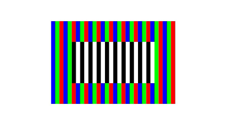

位图是一种用于在内存中存储和表示图像的数据结构，它是一个未经过压缩的像素集合，而JPEG或PNG等格式的图片是压缩格式的，两者并不相同。如果需要将JPEG或PNG绘制到屏幕上，需要先解码成位图格式，具体可参考[图片处理服务（Image Kit）](https://developer.huawei.com/consumer/cn/doc/harmonyos-guides/image-overview)图片解码相关章节。

目前Drawing（ArkTS）中位图绘制需要依赖PixelMap，它可以用于读取或写入图像数据以及获取图像信息。详细的API介绍请参考[PixelMap](https://developer.huawei.com/consumer/cn/doc/harmonyos-references/arkts-apis-image-pixelmap)。

1. 创建PixelMap。

   有多个API接口可以创建PixelMap，下文以createPixelMapSync()为例。更多创建方式和接口请见[@ohos.multimedia.image (图片处理)](https://developer.huawei.com/consumer/cn/doc/harmonyos-references/arkts-apis-image)模块。

   ```
   // 图片宽高
   let width = 600;
   let height = 400;
   // 字节长度，RGBA_8888每个像素占4字节
   let byteLength = width * height * 4;
   const color: ArrayBuffer = new ArrayBuffer(byteLength);
   let bufferArr = new Uint8Array(color);
   for (let i = 0; i < bufferArr.length; i += 4) {
     // 遍历并编辑每个像素，从而形成红绿蓝相间的条纹
     bufferArr[i] = 0x00;
     bufferArr[i+1] = 0x00;
     bufferArr[i+2] = 0x00;
     bufferArr[i+3] = 0xFF;
     let n = Math.floor(i / 80) % 3;
     if (n == 0) {
       bufferArr[i] = 0xFF;
     } else if (n == 1) {
       bufferArr[i+1] = 0xFF;
     } else {
       bufferArr[i+2] = 0xFF;
     }
   }
   // 设置像素属性
   let opts: image.InitializationOptions =
     { editable: true, pixelFormat: image.PixelMapFormat.RGBA_8888, size: { height: height, width: width } };
   // 创建PixelMap
   pixelMap = image.createPixelMapSync(color, opts);
   ```

   

<div class="source-link-wrapper"><a href="https://gitcode.com/HarmonyOS_Samples/guide-snippets/blob/HarmonyOS-feature-20260402/ArkGraphics2D/Drawing/ArkTSGraphicsDraw/entry/src/main/ets/drawing/pages/PixelMapDrawing.ets#L24-L52" target="_blank" rel="noopener noreferrer" class="source-link"><svg class="source-link-icon" width="14" height="14" viewBox="0 0 24 24" fill="none" stroke="currentColor" strokeWidth="2" strokeLinecap="round" strokeLinejoin="round">\<path d="M18 13v6a2 2 0 0 1-2 2H5a2 2 0 0 1-2-2V8a2 2 0 0 1 2-2h6" /\>\<polyline points="15 3 21 3 21 9" /\>\<line x1="10" y1="14" x2="21" y2="3" /\></svg> 查看源码：PixelMapDrawing.ets</a></div>

2. （可选）编辑PixelMap中的像素。如果没有编辑像素的需求，此步骤可以省略。

   有多个API接口可以编辑PixelMap中的像素，下文以writePixelsSync()为例。更多方式和接口的使用可见[PixelMap](https://developer.huawei.com/consumer/cn/doc/harmonyos-references/arkts-apis-image-pixelmap)。

   ```
   // 设置编辑区域的宽高
   let innerWidth = 400;
   let innerHeight = 200;
   // 编辑区域的字节长度，RGBA_8888每个像素占4字节
   let innerByteLength = innerWidth * innerHeight * 4;
   const innerColor: ArrayBuffer = new ArrayBuffer(innerByteLength);
   let innerBufferArr = new Uint8Array(innerColor);
   for (let i = 0; i < innerBufferArr.length; i += 4) {
     // 编辑区域的像素都设置为黑白相间条纹
     let n = Math.floor(i / 80) % 2;
     if (n == 0) {
       innerBufferArr[i] = 0x00;
       innerBufferArr[i+1] = 0x00;
       innerBufferArr[i+2] = 0x00;
     } else {
       innerBufferArr[i] = 0xFF;
       innerBufferArr[i+1] = 0xFF;
       innerBufferArr[i+2] = 0xFF;
     }
     innerBufferArr[i+3] = 0xFF;
   }
   // 设置编辑区域的像素、宽高、偏移量等
   const area: image.PositionArea = {
     pixels: innerColor,
     offset: 0,
     stride: innerWidth * 4,
     region: { size: { height: innerHeight, width: innerWidth }, x: 100, y: 100 }
   };
   // 编辑位图，形成中间的黑白相间条纹
   pixelMap.writePixelsSync(area);
   // 为了使图片完全显示，修改绘制起点参数为（0，0）
   canvas.drawImage(pixelMap, 0, 0);
   ```

   

<div class="source-link-wrapper"><a href="https://gitcode.com/HarmonyOS_Samples/guide-snippets/blob/HarmonyOS-feature-20260402/ArkGraphics2D/Drawing/ArkTSGraphicsDraw/entry/src/main/ets/drawing/pages/PixelMapDrawing.ets#L60-L97" target="_blank" rel="noopener noreferrer" class="source-link"><svg class="source-link-icon" width="14" height="14" viewBox="0 0 24 24" fill="none" stroke="currentColor" strokeWidth="2" strokeLinecap="round" strokeLinejoin="round">\<path d="M18 13v6a2 2 0 0 1-2 2H5a2 2 0 0 1-2-2V8a2 2 0 0 1 2-2h6" /\>\<polyline points="15 3 21 3 21 9" /\>\<line x1="10" y1="14" x2="21" y2="3" /\></svg> 查看源码：PixelMapDrawing.ets</a></div>

3. 绘制PixelMap。

   绘制PixelMap时需要通过Canvas相关接口绘制位图，下文以drawImage()为例。更多方式和接口的使用请见[drawing.Canvas](https://developer.huawei.com/consumer/cn/doc/harmonyos-references/arkts-apis-graphics-drawing-canvas)。

   drawImage()函数接受4个参数，第一个就是上文中创建的PixelMap，第二个是绘制图片位置的左上角x轴坐标，第三个是左上角y轴坐标，第四个为采样选项对象，默认为不使用任何参数构造的原始采样选项对象。

   ```
   // 为了使图片完全显示，修改绘制起点参数为（0，0）
   canvas.drawImage(pixelMap, 0, 0);
   ```

   

<div class="source-link-wrapper"><a href="https://gitcode.com/HarmonyOS_Samples/guide-snippets/blob/HarmonyOS-feature-20260402/ArkGraphics2D/Drawing/ArkTSGraphicsDraw/entry/src/main/ets/drawing/pages/PixelMapDrawing.ets#L53-L56" target="_blank" rel="noopener noreferrer" class="source-link"><svg class="source-link-icon" width="14" height="14" viewBox="0 0 24 24" fill="none" stroke="currentColor" strokeWidth="2" strokeLinecap="round" strokeLinejoin="round">\<path d="M18 13v6a2 2 0 0 1-2 2H5a2 2 0 0 1-2-2V8a2 2 0 0 1 2-2h6" /\>\<polyline points="15 3 21 3 21 9" /\>\<line x1="10" y1="14" x2="21" y2="3" /\></svg> 查看源码：PixelMapDrawing.ets</a></div>


   绘制效果如下：

   

## 示例代码

* [图形绘制（ArkTS）](https://gitcode.com/HarmonyOS_Samples/guide-snippets/tree/master/ArkGraphics2D/Drawing/ArkTSGraphicsDraw)
