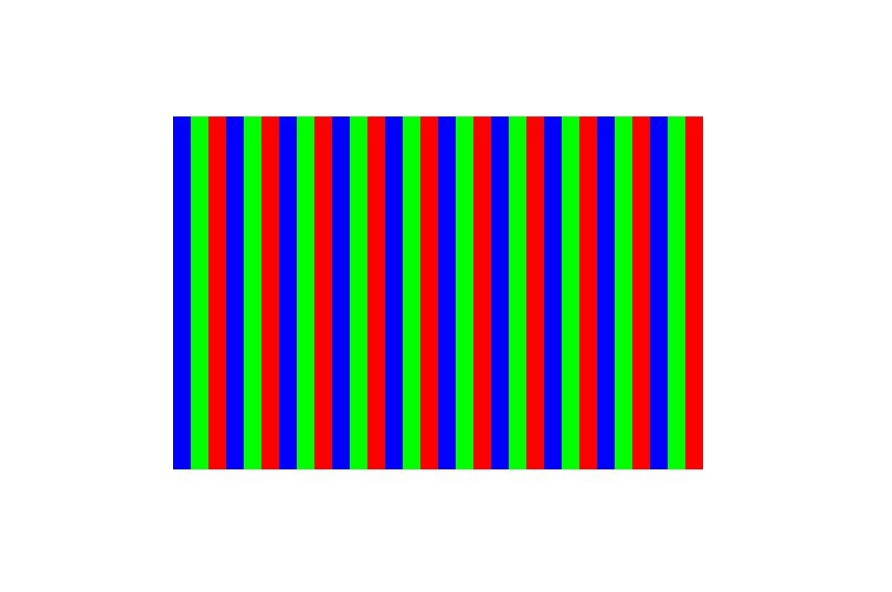

位图是一种用于在内存中存储和表示图像的数据结构，它是一个未经过压缩的像素集合，而JPEG或PNG等图片是压缩格式的，两者并不相同。如果需要将JPEG或PNG绘制到屏幕上，需要先解码成位图格式，具体可参考[图片处理服务（Image Kit）](/docs/dev/app-dev/media/image-kit/image-overview)图片解码相关章节。

目前Drawing（C/C++）中位图绘制需要依赖PixelMap，它可以用于读取或写入图像数据以及获取图像信息。详细的API介绍请参考[drawing\_pixel\_map.h](https://developer.huawei.com/consumer/cn/doc/harmonyos-references/capi-drawing-pixel-map-h)。

有多个API接口可以创建PixelMap，下文以使用OH\_Drawing\_PixelMapGetFromOhPixelMapNative()为例。

1. 添加链接库。

   在Native工程的src/main/cpp/CMakeLists.txt，添加如下链接库：

   ```
   target_link_libraries(entry PUBLIC libnative_drawing.so)
   target_link_libraries(entry PUBLIC libhilog_ndk.z.so)
   target_link_libraries(entry PUBLIC libpixelmap.so)
   ```
2. 导入依赖的相关头文件。

   ```
   #include <multimedia/image_framework/image/pixelmap_native.h>
   ```

   

<div class="source-link-wrapper"><a href="https://gitcode.com/HarmonyOS_Samples/guide-snippets/blob/HarmonyOS-feature-20260402/ArkGraphics2D/Drawing/NDKGraphicsDraw/entry/src/main/cpp/samples/sample_graphics.cpp#L16-L18" target="_blank" rel="noopener noreferrer" class="source-link"><svg class="source-link-icon" width="14" height="14" viewBox="0 0 24 24" fill="none" stroke="currentColor" strokeWidth="2" strokeLinecap="round" strokeLinejoin="round">\<path d="M18 13v6a2 2 0 0 1-2 2H5a2 2 0 0 1-2-2V8a2 2 0 0 1 2-2h6" /\>\<polyline points="15 3 21 3 21 9" /\>\<line x1="10" y1="14" x2="21" y2="3" /\></svg> 查看源码：sample_graphics.cpp</a></div>

3. 创建OH\_PixelmapNative像素图对象。

   PixelMap需要从图像框架定义的像素图对象（OH\_PixelmapNative）中获取，所以需要先通过OH\_PixelmapNative\_CreatePixelmap()创建OH\_PixelmapNative。该函数接受4个参数，第一个参数为图像像素数据的缓冲区，用于初始化PixelMap的像素。第二个参数是缓冲区长度。第三个参数是位图格式（包括长、宽、颜色类型、透明度类型等）。第四个参数即OH\_PixelmapNative对象，作为出参使用。

   ```
   // 图片宽高分别为 600 * 400
   uint32_t width = 600;
   uint32_t height = 400;
   // 字节长度，RGBA_8888每个像素占4字节
   size_t bufferSize = width * height * 4;
   uint8_t *pixels = new uint8_t[bufferSize];
   for (uint32_t i = 0; i < width * height; ++i) {
       // 遍历并编辑每个像素，从而形成红绿蓝相间的条纹
       uint32_t n = i / 20 % 3;
       pixels[i * RGBA_SIZE] = RGBA_MIN; // 红色通道
       pixels[i * RGBA_SIZE + 1] = RGBA_MIN; // +1表示绿色通道
       pixels[i * RGBA_SIZE + 2] = RGBA_MIN; // +2表示蓝色通道
       pixels[i * RGBA_SIZE + 3] = 0xFF; // +3表示不透明度通道
       if (n == 0) {
           pixels[i * RGBA_SIZE] = 0xFF; // 红色通道赋值，颜色显红色
       } else if (n == 1) {
           pixels[i * RGBA_SIZE + 1] = 0xFF; // +1表示绿色通道赋值，其余通道为0，颜色显绿色
       } else {
           pixels[i * RGBA_SIZE + 2] = 0xFF; // +2表示蓝色通道赋值，其余通道为0，颜色显蓝色
       }
   }
   // 设置位图格式（长、宽、颜色类型、透明度类型）
   OH_Pixelmap_InitializationOptions *createOps = nullptr;
   OH_PixelmapInitializationOptions_Create(&createOps);
   OH_PixelmapInitializationOptions_SetWidth(createOps, width);
   OH_PixelmapInitializationOptions_SetHeight(createOps, height);
   OH_PixelmapInitializationOptions_SetPixelFormat(createOps, PIXEL_FORMAT_RGBA_8888);
   OH_PixelmapInitializationOptions_SetAlphaType(createOps, PIXELMAP_ALPHA_TYPE_UNKNOWN);
   // 创建OH_PixelmapNative对象
   OH_PixelmapNative *pixelMapNative = nullptr;
   OH_PixelmapNative_CreatePixelmap(pixels, bufferSize, createOps, &pixelMapNative);
   ```

   

<div class="source-link-wrapper"><a href="https://gitcode.com/HarmonyOS_Samples/guide-snippets/blob/HarmonyOS-feature-20260402/ArkGraphics2D/Drawing/NDKGraphicsDraw/entry/src/main/cpp/samples/sample_graphics.cpp#L1080-L1112" target="_blank" rel="noopener noreferrer" class="source-link"><svg class="source-link-icon" width="14" height="14" viewBox="0 0 24 24" fill="none" stroke="currentColor" strokeWidth="2" strokeLinecap="round" strokeLinejoin="round">\<path d="M18 13v6a2 2 0 0 1-2 2H5a2 2 0 0 1-2-2V8a2 2 0 0 1 2-2h6" /\>\<polyline points="15 3 21 3 21 9" /\>\<line x1="10" y1="14" x2="21" y2="3" /\></svg> 查看源码：sample_graphics.cpp</a></div>

4. 创建PixelMap。

   通过OH\_Drawing\_PixelMapGetFromOhPixelMapNative()函数从OH\_PixelmapNative中获取PixelMap。

   ```
   OH_Drawing_PixelMap *pixelMap = OH_Drawing_PixelMapGetFromOhPixelMapNative(pixelMapNative);
   ```

   

<div class="source-link-wrapper"><a href="https://gitcode.com/HarmonyOS_Samples/guide-snippets/blob/HarmonyOS-feature-20260402/ArkGraphics2D/Drawing/NDKGraphicsDraw/entry/src/main/cpp/samples/sample_graphics.cpp#L1113-L1115" target="_blank" rel="noopener noreferrer" class="source-link"><svg class="source-link-icon" width="14" height="14" viewBox="0 0 24 24" fill="none" stroke="currentColor" strokeWidth="2" strokeLinecap="round" strokeLinejoin="round">\<path d="M18 13v6a2 2 0 0 1-2 2H5a2 2 0 0 1-2-2V8a2 2 0 0 1 2-2h6" /\>\<polyline points="15 3 21 3 21 9" /\>\<line x1="10" y1="14" x2="21" y2="3" /\></svg> 查看源码：sample_graphics.cpp</a></div>

5. 绘制PixelMap。

   需要通过OH\_Drawing\_CanvasDrawPixelMapRect()绘制位图PixelMap。函数接受5个参数，分别为画布Canvas、PixelMap对象、PixelMap中像素的截取区域、画布中显示的区域以及采样选项对象。

   其中采样选项对象（OH\_Drawing\_SamplingOptions）表示了从原始像素数据（即Bitmap）中采样以生成新的像素值的具体方式，具体可见[drawing\_sampling\_options.h](https://developer.huawei.com/consumer/cn/doc/harmonyos-references/capi-drawing-sampling-options-h)。

   ```
   // PixelMap中像素的截取区域
   OH_Drawing_Rect *src = OH_Drawing_RectCreate(0, 0, 600, 400);
   // 画布中显示的区域
   OH_Drawing_Rect *dst = OH_Drawing_RectCreate(value200_, value200_, value800_, value600_);
   // 采样选项对象
   OH_Drawing_SamplingOptions* samplingOptions = OH_Drawing_SamplingOptionsCreate(
       OH_Drawing_FilterMode::FILTER_MODE_LINEAR, OH_Drawing_MipmapMode::MIPMAP_MODE_LINEAR);
   // 绘制PixelMap
   OH_Drawing_CanvasDrawPixelMapRect(canvas, pixelMap, src, dst, samplingOptions);
   ```

   

<div class="source-link-wrapper"><a href="https://gitcode.com/HarmonyOS_Samples/guide-snippets/blob/HarmonyOS-feature-20260402/ArkGraphics2D/Drawing/NDKGraphicsDraw/entry/src/main/cpp/samples/sample_graphics.cpp#L1116-L1126" target="_blank" rel="noopener noreferrer" class="source-link"><svg class="source-link-icon" width="14" height="14" viewBox="0 0 24 24" fill="none" stroke="currentColor" strokeWidth="2" strokeLinecap="round" strokeLinejoin="round">\<path d="M18 13v6a2 2 0 0 1-2 2H5a2 2 0 0 1-2-2V8a2 2 0 0 1 2-2h6" /\>\<polyline points="15 3 21 3 21 9" /\>\<line x1="10" y1="14" x2="21" y2="3" /\></svg> 查看源码：sample_graphics.cpp</a></div>

6. 绘制完成后释放相关对象。

   ```
   OH_PixelmapNative_Release(pixelMapNative);
   delete[] pixels;
   ```

   

<div class="source-link-wrapper"><a href="https://gitcode.com/HarmonyOS_Samples/guide-snippets/blob/HarmonyOS-feature-20260402/ArkGraphics2D/Drawing/NDKGraphicsDraw/entry/src/main/cpp/samples/sample_graphics.cpp#L1127-L1130" target="_blank" rel="noopener noreferrer" class="source-link"><svg class="source-link-icon" width="14" height="14" viewBox="0 0 24 24" fill="none" stroke="currentColor" strokeWidth="2" strokeLinecap="round" strokeLinejoin="round">\<path d="M18 13v6a2 2 0 0 1-2 2H5a2 2 0 0 1-2-2V8a2 2 0 0 1 2-2h6" /\>\<polyline points="15 3 21 3 21 9" /\>\<line x1="10" y1="14" x2="21" y2="3" /\></svg> 查看源码：sample_graphics.cpp</a></div>


   绘制效果如下：

   

## 示例代码

* [图形绘制（C/C++）](https://gitcode.com/HarmonyOS_Samples/guide-snippets/tree/master/ArkGraphics2D/Drawing/NDKGraphicsDraw)
