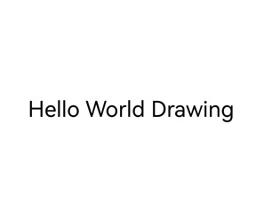

## 场景介绍

在一个简单的用户界面中，可能只需要展示几行静态文本，例如标签、按钮上的文字、菜单项或状态栏中的提示信息。此时，开发者只需要选择合适的字体、大小和颜色即可完成渲染。

## 接口说明

| 接口定义 | 描述 |
| --- | --- |
| OH\_Drawing\_TextStyle\* OH\_Drawing\_CreateTextStyle(void) | 创建指向OH\_Drawing\_TextStyle对象的指针。 |
| void OH\_Drawing\_SetTextStyleFontSize(OH\_Drawing\_TextStyle\* style, double fontSize) | 设置字号。 |
| void OH\_Drawing\_SetTextStyleFontWeight(OH\_Drawing\_TextStyle\* style, int fontWeight) | 设置字重。目前只有系统默认字体支持字重的调节，其他字体设置字重值小于semi-bold时字体粗细无变化，当设置字重值大于等于semi-bold时可能会触发伪加粗效果。 |

## 开发步骤

1. 创建Canvas画布对象，画布Canvas对象创建方法具体可见[画布的获取与绘制结果的显示](/docs/dev/app-dev/graphics/arkgraphics-2d/graphic-drawing-and-display/canvas-get-result-draw/canvas-get-result-draw-c)。
2. 初始化段落样式，设置文本对齐方式为居中对齐。

   ```
   // 创建一个 TypographyStyle 创建 Typography 时需要使用
   OH_Drawing_TypographyStyle *typoStyle = OH_Drawing_CreateTypographyStyle();
   // 设置文本对齐方式为居中
   OH_Drawing_SetTypographyTextAlign(typoStyle, TEXT_ALIGN_CENTER);
   ```

   

<div class="source-link-wrapper"><a href="https://gitcode.com/HarmonyOS_Samples/guide-snippets/blob/HarmonyOS-feature-20260402/ArkGraphics2D/TextEngine/NDKDrawingSimpleText/entry/src/main/cpp/samples/sample_bitmap.cpp#L165-L170" target="_blank" rel="noopener noreferrer" class="source-link"><svg class="source-link-icon" width="14" height="14" viewBox="0 0 24 24" fill="none" stroke="currentColor" strokeWidth="2" strokeLinecap="round" strokeLinejoin="round">\<path d="M18 13v6a2 2 0 0 1-2 2H5a2 2 0 0 1-2-2V8a2 2 0 0 1 2-2h6" /\>\<polyline points="15 3 21 3 21 9" /\>\<line x1="10" y1="14" x2="21" y2="3" /\></svg> 查看源码：sample_bitmap.cpp</a></div>

3. 初始化文本样式，此处设置字体颜色为纯黑色，字体大小为60，字重为400。

   ```
   // 设置文字颜色、大小、字重，不设置 TextStyle 会使用 TypographyStyle 中的默认 TextStyle
   OH_Drawing_TextStyle *txtStyle = OH_Drawing_CreateTextStyle();
   OH_Drawing_SetTextStyleColor(txtStyle, OH_Drawing_ColorSetArgb(0xFF, 0x00, 0x00, 0x00));
   OH_Drawing_SetTextStyleFontSize(txtStyle, 60);
   OH_Drawing_SetTextStyleFontWeight(txtStyle, FONT_WEIGHT_400);
   ```

   

<div class="source-link-wrapper"><a href="https://gitcode.com/HarmonyOS_Samples/guide-snippets/blob/HarmonyOS-feature-20260402/ArkGraphics2D/TextEngine/NDKDrawingSimpleText/entry/src/main/cpp/samples/sample_bitmap.cpp#L172-L178" target="_blank" rel="noopener noreferrer" class="source-link"><svg class="source-link-icon" width="14" height="14" viewBox="0 0 24 24" fill="none" stroke="currentColor" strokeWidth="2" strokeLinecap="round" strokeLinejoin="round">\<path d="M18 13v6a2 2 0 0 1-2 2H5a2 2 0 0 1-2-2V8a2 2 0 0 1 2-2h6" /\>\<polyline points="15 3 21 3 21 9" /\>\<line x1="10" y1="14" x2="21" y2="3" /\></svg> 查看源码：sample_bitmap.cpp</a></div>

4. 初始化段落对象，并添加文本。

   ```
   // 创建 FontCollection，FontCollection 用于管理字体匹配逻辑
   OH_Drawing_FontCollection *fc = OH_Drawing_CreateFontCollection();
   // 使用 FontCollection 和 之前创建的 TypographyStyle 创建 TypographyCreate。TypographyCreate 用于创建 Typography
   OH_Drawing_TypographyCreate *handler = OH_Drawing_CreateTypographyHandler(typoStyle, fc);

   // 将之前创建的 TextStyle 加入 handler 中
   OH_Drawing_TypographyHandlerPushTextStyle(handler, txtStyle);
   // 设置文本内容，并将文本添加到 handler 中
   const char *text = "Hello World Drawing\n";
   OH_Drawing_TypographyHandlerAddText(handler, text);

   OH_Drawing_Typography *typography = OH_Drawing_CreateTypography(handler);
   ```

   

<div class="source-link-wrapper"><a href="https://gitcode.com/HarmonyOS_Samples/guide-snippets/blob/HarmonyOS-feature-20260402/ArkGraphics2D/TextEngine/NDKDrawingSimpleText/entry/src/main/cpp/samples/sample_bitmap.cpp#L180-L193" target="_blank" rel="noopener noreferrer" class="source-link"><svg class="source-link-icon" width="14" height="14" viewBox="0 0 24 24" fill="none" stroke="currentColor" strokeWidth="2" strokeLinecap="round" strokeLinejoin="round">\<path d="M18 13v6a2 2 0 0 1-2 2H5a2 2 0 0 1-2-2V8a2 2 0 0 1 2-2h6" /\>\<polyline points="15 3 21 3 21 9" /\>\<line x1="10" y1="14" x2="21" y2="3" /\></svg> 查看源码：sample_bitmap.cpp</a></div>

5. 排版段落并进行文本绘制。

   ```
   // 设置页面最大宽度
   double maxWidth = width_;
   OH_Drawing_TypographyLayout(typography, maxWidth);
   // 将文本绘制到画布上
   OH_Drawing_TypographyPaint(typography, cCanvas_, 0, 100);
   ```

   

<div class="source-link-wrapper"><a href="https://gitcode.com/HarmonyOS_Samples/guide-snippets/blob/HarmonyOS-feature-20260402/ArkGraphics2D/TextEngine/NDKDrawingSimpleText/entry/src/main/cpp/samples/sample_bitmap.cpp#L195-L201" target="_blank" rel="noopener noreferrer" class="source-link"><svg class="source-link-icon" width="14" height="14" viewBox="0 0 24 24" fill="none" stroke="currentColor" strokeWidth="2" strokeLinecap="round" strokeLinejoin="round">\<path d="M18 13v6a2 2 0 0 1-2 2H5a2 2 0 0 1-2-2V8a2 2 0 0 1 2-2h6" /\>\<polyline points="15 3 21 3 21 9" /\>\<line x1="10" y1="14" x2="21" y2="3" /\></svg> 查看源码：sample_bitmap.cpp</a></div>

6. 释放内存

   ```
   // 释放内存
   OH_Drawing_DestroyTypographyStyle(typoStyle);
   OH_Drawing_DestroyTextStyle(txtStyle);
   OH_Drawing_DestroyFontCollection(fc);
   OH_Drawing_DestroyTypographyHandler(handler);
   OH_Drawing_DestroyTypography(typography);
   ```

   

<div class="source-link-wrapper"><a href="https://gitcode.com/HarmonyOS_Samples/guide-snippets/blob/HarmonyOS-feature-20260402/ArkGraphics2D/TextEngine/NDKDrawingSimpleText/entry/src/main/cpp/samples/sample_bitmap.cpp#L203-L210" target="_blank" rel="noopener noreferrer" class="source-link"><svg class="source-link-icon" width="14" height="14" viewBox="0 0 24 24" fill="none" stroke="currentColor" strokeWidth="2" strokeLinecap="round" strokeLinejoin="round">\<path d="M18 13v6a2 2 0 0 1-2 2H5a2 2 0 0 1-2-2V8a2 2 0 0 1 2-2h6" /\>\<polyline points="15 3 21 3 21 9" /\>\<line x1="10" y1="14" x2="21" y2="3" /\></svg> 查看源码：sample_bitmap.cpp</a></div>


## 效果展示


