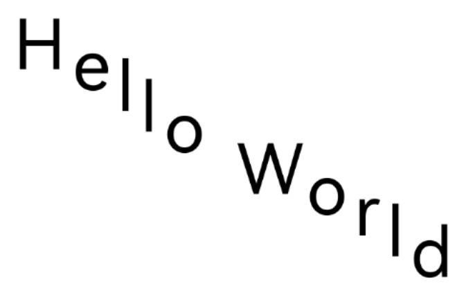

在复杂的文本排版场景中，当系统提供的标准文本组件无法满足特定的视觉或交互需求时，开发者可以利用ArkGraphics 2D提供的底层文本绘制能力，通过直接控制画布（Canvas）和文本样式，实现对文本外观、布局的精细控制。这种能力适用于需要高度定制化文本渲染效果的场景，例如艺术字体、复杂的富文本编排或特殊的动态文字效果。

字体引擎作为图形系统中的核心组件，负责将字符代码转换为可视化的字形，并精确计算每个字形的布局和位置，为自定义文本绘制提供底层支持。通过文本测量接口，开发者可以获取文本的精确尺寸，这是实现精准布局（如居中显示）的基础。

## 文本塑形

### 场景介绍

文本塑形是字体引擎提供的一项关键能力，它允许开发者不经过系统默认的文本排版流程，直接获取文本的底层字形信息（如宽度、方向等测量信息）。这使得开发者能够基于这些原始数据，实现完全自定义的排版逻辑、绘制操作以及断行策略。

这种能力适用于以下场景：

* 自定义富文本渲染：例如在社交媒体、新闻客户端等应用中，需要实现图文混排、多样式文本混合显示。
* 跨平台一致性排版需求应用：确保文本在不同平台或设备上呈现一致的视觉效果。
* 精细化排版管理：如实现艺术排版、动态文字布局等系统标准文本组件难以达到的效果。

### 接口说明

文本塑形中常用接口如下表所示，详细接口说明参考[drawing\_text\_typography.h](https://developer.huawei.com/consumer/cn/doc/harmonyos-references/capi-drawing-text-typography-h)和[drawing\_text\_blob.h](https://developer.huawei.com/consumer/cn/doc/harmonyos-references/capi-drawing-text-blob-h)。

| 接口名 | 描述 |
| --- | --- |
| OH\_Drawing\_LineTypography\* OH\_Drawing\_CreateLineTypography(OH\_Drawing\_TypographyCreate\* handler) | 创建一个排版行对象OH\_Drawing\_LineTypography的指针，排版行对象保存着文本内容以及样式的载体，可以用于计算单行排版信息。 |
| OH\_Drawing\_TextLine\* OH\_Drawing\_LineTypographyCreateLine(OH\_Drawing\_LineTypography\* lineTypography,size\_t startIndex, size\_t count) | 根据指定区间文本内容创建一个指向文本行对象OH\_Drawing\_TextLine的指针。 |
| OH\_Drawing\_Array\* OH\_Drawing\_TextLineGetGlyphRuns(OH\_Drawing\_TextLine\* line) | 获取文本行对象中的文本渲染单元数组。 |
| OH\_Drawing\_Array\* OH\_Drawing\_GetRunGlyphs(OH\_Drawing\_Run\* run, int64\_t start, int64\_t length) | 获取渲染单元指定范围内的字形数组。 |
| OH\_Drawing\_Font\* OH\_Drawing\_GetRunFont(OH\_Drawing\_Run\* run) | 获取渲染单元字体对象。 |
| OH\_Drawing\_Array\* OH\_Drawing\_GetRunGlyphAdvances(OH\_Drawing\_Run\* run, uint32\_t start, uint32\_t length) | 获取渲染单元字体宽度数组。 |
| OH\_Drawing\_TextBlobBuilder\* OH\_Drawing\_TextBlobBuilderCreate(void) | 用于创建一个文本构造器对象。 |
| OH\_Drawing\_TextBlob\* OH\_Drawing\_TextBlobBuilderMake(OH\_Drawing\_TextBlobBuilder\* textBlobBuilder) | 用于从文本构造器中创建文本对象。 |
| void OH\_Drawing\_CanvasDrawTextBlob(OH\_Drawing\_Canvas\* canvas, const OH\_Drawing\_TextBlob\* textBlob, float x, float y) | 用于画一段文字。 |

### 开发步骤

从API version 18开始，支持获取文字塑形结果能力。从API version 20开始，支持获取文字排版方向和文字字形宽度。关键代码如下：

1. 在工程的src/main/cpp/CMakeLists.txt文件中添加以下lib。

   ```
   libnative_drawing.so
   ```
2. 导入依赖的相关头文件。

   ```
   #include <native_drawing/drawing_font_collection.h>
   #include <native_drawing/drawing_text_typography.h>
   #include <native_drawing/drawing_text_blob.h>
   #include <native_drawing/drawing_text_line.h>
   #include <native_drawing/drawing_text_run.h>
   #include <native_drawing/drawing_text_lineTypography.h>
   #include <native_drawing/drawing_rect.h>
   #include <native_drawing/drawing_point.h>
   ```
3. 创建段落样式，并使用构造段落生成器ParagraphBuilder生成段落实例。

   ```
   // 创建一个 TypographyStyle，创建 TypographyCreate 时需要使用
   OH_Drawing_TypographyStyle *typoStyle = OH_Drawing_CreateTypographyStyle();
   // 设置文字颜色、大小、字重，不设置 TextStyle 会使用 TypographyStyle 中的默认 TextStyle
   OH_Drawing_TextStyle *txtStyle = OH_Drawing_CreateTextStyle();
   OH_Drawing_SetTextStyleFontSize(txtStyle, DIV_TEN(width_));

   // 创建 FontCollection，FontCollection 用于管理字体匹配逻辑
   OH_Drawing_FontCollection *fc = OH_Drawing_CreateSharedFontCollection();
   // 使用 FontCollection 和 之前创建的 TypographyStyle 创建 TypographyCreate。TypographyCreate 用于创建 Typography
   OH_Drawing_TypographyCreate *handler = OH_Drawing_CreateTypographyHandler(typoStyle, fc);
   ```

   

<div class="source-link-wrapper"><a href="https://gitcode.com/HarmonyOS_Samples/guide-snippets/blob/HarmonyOS-feature-20260402/ArkGraphics2D/TextEngine/NDKComplexText1/entry/src/main/cpp/samples/draw_text_impl.cpp#L1096-L1107" target="_blank" rel="noopener noreferrer" class="source-link"><svg class="source-link-icon" width="14" height="14" viewBox="0 0 24 24" fill="none" stroke="currentColor" strokeWidth="2" strokeLinecap="round" strokeLinejoin="round">\<path d="M18 13v6a2 2 0 0 1-2 2H5a2 2 0 0 1-2-2V8a2 2 0 0 1 2-2h6" /\>\<polyline points="15 3 21 3 21 9" /\>\<line x1="10" y1="14" x2="21" y2="3" /\></svg> 查看源码：draw_text_impl.cpp</a></div>

4. 设置文本样式，添加文本内容。

   ```
   // 设置文本内容，并将文本添加到 handler 中
   OH_Drawing_TypographyHandlerPushTextStyle(handler, txtStyle);
   const char *text = "Hello World";
   OH_Drawing_TypographyHandlerAddText(handler, text);
   ```

   

<div class="source-link-wrapper"><a href="https://gitcode.com/HarmonyOS_Samples/guide-snippets/blob/HarmonyOS-feature-20260402/ArkGraphics2D/TextEngine/NDKComplexText1/entry/src/main/cpp/samples/draw_text_impl.cpp#L1108-L1113" target="_blank" rel="noopener noreferrer" class="source-link"><svg class="source-link-icon" width="14" height="14" viewBox="0 0 24 24" fill="none" stroke="currentColor" strokeWidth="2" strokeLinecap="round" strokeLinejoin="round">\<path d="M18 13v6a2 2 0 0 1-2 2H5a2 2 0 0 1-2-2V8a2 2 0 0 1 2-2h6" /\>\<polyline points="15 3 21 3 21 9" /\>\<line x1="10" y1="14" x2="21" y2="3" /\></svg> 查看源码：draw_text_impl.cpp</a></div>

5. 创建行对象。获取行中所有文字的塑形结果。

   使用OH\_Drawing\_LineTypographyCreateLine()方法创建一个单行对象，通过行对象OH\_Drawing\_TextLineGetGlyphRuns()方法获取相同样式的文字单元。

   ```
   // 通过 handler 创建一个 Typography
   OH_Drawing_LineTypography *lineTypography = OH_Drawing_CreateLineTypography(handler);
   // 创建一个 TextLine，取(0, 11)的字符
   OH_Drawing_TextLine *textLine = OH_Drawing_LineTypographyCreateLine(lineTypography, 0, 11);

   // 获取塑形结果
   OH_Drawing_Array *runs = OH_Drawing_TextLineGetGlyphRuns(textLine);
   ```

   

<div class="source-link-wrapper"><a href="https://gitcode.com/HarmonyOS_Samples/guide-snippets/blob/HarmonyOS-feature-20260402/ArkGraphics2D/TextEngine/NDKComplexText1/entry/src/main/cpp/samples/draw_text_impl.cpp#L1115-L1123" target="_blank" rel="noopener noreferrer" class="source-link"><svg class="source-link-icon" width="14" height="14" viewBox="0 0 24 24" fill="none" stroke="currentColor" strokeWidth="2" strokeLinecap="round" strokeLinejoin="round">\<path d="M18 13v6a2 2 0 0 1-2 2H5a2 2 0 0 1-2-2V8a2 2 0 0 1 2-2h6" /\>\<polyline points="15 3 21 3 21 9" /\>\<line x1="10" y1="14" x2="21" y2="3" /\></svg> 查看源码：draw_text_impl.cpp</a></div>

6. 该步骤是文本塑形流程中的自定义绘制环节。通过调用OH\_Drawing\_GetRunGlyphs()方法获取文本中每个字符对应的字形序号，再结合OH\_Drawing\_GetRunFont()方法获取的字体对象，即可唯一确定每个字形的具体图形信息。

   从 API version 20 开始，新增的OH\_Drawing\_GetRunGlyphAdvances()方法能够返回一个数组，其中包含了每个字形在绘制时建议占用的宽度和高度。依赖这些精确的测量数据，开发者可以自由地计算并定义每个字形的绘制位置，从而实现复杂的文本布局效果，如自定义字符间距、垂直偏移或特殊排版。

   ```
   size_t runsLength = OH_Drawing_GetDrawingArraySize(runs);
   for (int i = 0; i < runsLength; i++) {
       OH_Drawing_Run *run = OH_Drawing_GetRunByIndex(runs, i);
       // 获取所有字形数据
       OH_Drawing_Array *glyphs = OH_Drawing_GetRunGlyphs(run, 0, 0);
       size_t glyphsLength = OH_Drawing_GetDrawingArraySize(glyphs);
       // 获取相同绘制单元字体
       OH_Drawing_Font *font = OH_Drawing_GetRunFont(run);
       OH_Drawing_Array *advances = OH_Drawing_GetRunGlyphAdvances(run, 0, 0);

       OH_Drawing_TextBlobBuilder *builder = OH_Drawing_TextBlobBuilderCreate();
       // 创建一个20*20的矩形
       OH_Drawing_Rect *rect = OH_Drawing_RectCreate(0, 0, 20, 20);
       const OH_Drawing_RunBuffer *buffer = OH_Drawing_TextBlobBuilderAllocRunPos(builder, font, glyphsLength, rect);

       // 创建字形buffer，通过drawing接口进行字形独立绘制
       int x = 0;
       int y = 0;
       for (int index = 0; index < glyphsLength; index++) {
           buffer->glyphs[index] = OH_Drawing_GetRunGlyphsByIndex(glyphs, index);
           // 设置字形位置
           buffer->pos[index * TWO_INT] = x;
           buffer->pos[index * TWO_INT + 1] = y;

           OH_Drawing_Point *advance = OH_Drawing_GetRunGlyphAdvanceByIndex(advances, index);
           float pos = 0;
           OH_Drawing_PointGetX(advance, &pos);
           x += pos + 10; // 每个字形间水平间隔10px
           OH_Drawing_PointGetY(advance, &pos);
           y += pos + 30; // 每个字形间垂直间隔30px
       }

       // 自定义绘制一串具有相同属性的一系列连续字形
       OH_Drawing_TextBlob *textBlob = OH_Drawing_TextBlobBuilderMake(builder);
       // 将文本绘制到画布(20,100)上
       OH_Drawing_CanvasDrawTextBlob(cCanvas_, textBlob, 20, 100);

       // 释放内存
       OH_Drawing_TextBlobDestroy(textBlob);
       OH_Drawing_FontDestroy(font);
       OH_Drawing_DestroyRunGlyphAdvances(advances);
       OH_Drawing_DestroyRunGlyphs(glyphs);
   }
   ```

   

<div class="source-link-wrapper"><a href="https://gitcode.com/HarmonyOS_Samples/guide-snippets/blob/HarmonyOS-feature-20260402/ArkGraphics2D/TextEngine/NDKComplexText1/entry/src/main/cpp/samples/draw_text_impl.cpp#L1124-L1168" target="_blank" rel="noopener noreferrer" class="source-link"><svg class="source-link-icon" width="14" height="14" viewBox="0 0 24 24" fill="none" stroke="currentColor" strokeWidth="2" strokeLinecap="round" strokeLinejoin="round">\<path d="M18 13v6a2 2 0 0 1-2 2H5a2 2 0 0 1-2-2V8a2 2 0 0 1 2-2h6" /\>\<polyline points="15 3 21 3 21 9" /\>\<line x1="10" y1="14" x2="21" y2="3" /\></svg> 查看源码：draw_text_impl.cpp</a></div>

7. 释放内存

   ```
   // 释放内存
   OH_Drawing_DestroyTypographyStyle(typoStyle);
   OH_Drawing_DestroyTextStyle(txtStyle);
   OH_Drawing_DestroyFontCollection(fc);
   OH_Drawing_DestroyTypographyHandler(handler);
   OH_Drawing_DestroyLineTypography(lineTypography);
   OH_Drawing_DestroyTextLine(textLine);
   OH_Drawing_DestroyRuns(runs);
   ```

   

<div class="source-link-wrapper"><a href="https://gitcode.com/HarmonyOS_Samples/guide-snippets/blob/HarmonyOS-feature-20260402/ArkGraphics2D/TextEngine/NDKComplexText1/entry/src/main/cpp/samples/draw_text_impl.cpp#L1170-L1179" target="_blank" rel="noopener noreferrer" class="source-link"><svg class="source-link-icon" width="14" height="14" viewBox="0 0 24 24" fill="none" stroke="currentColor" strokeWidth="2" strokeLinecap="round" strokeLinejoin="round">\<path d="M18 13v6a2 2 0 0 1-2 2H5a2 2 0 0 1-2-2V8a2 2 0 0 1 2-2h6" /\>\<polyline points="15 3 21 3 21 9" /\>\<line x1="10" y1="14" x2="21" y2="3" /\></svg> 查看源码：draw_text_impl.cpp</a></div>


效果展示：


