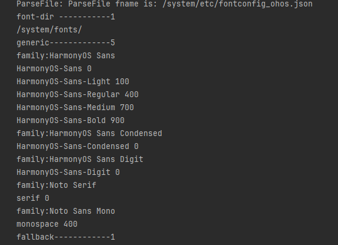

## 场景介绍

系统字体是指操作系统预设的字体，用于在没有指定自定义字体时显示文本，确保文本的可读性和一致性。

**使用系统字体**的情况通常是在应用未注册自定义字体，或在没有显式指定文本样式时，系统会使用默认的系统字体。另外，系统字体有多种，开发者可以先获取系统字体的配置信息，并根据信息中的字体家族名来进行系统字体的切换和使用。

当前ArkTS侧暂不支持禁用系统字体，Native侧支持禁用系统字体。

## 接口说明

以下是系统字体相关的常用接口和结构体，ArkTS侧对外接口由ArkUI提供，详细接口说明请见[@ohos.font](https://developer.huawei.com/consumer/cn/doc/harmonyos-references/js-apis-font)。

| 接口名 | 描述 |
| --- | --- |
| getUIFontConfig() : UIFontConfig | 获取系统字体配置。 |

## 获取系统字体信息

1. 导入依赖的相关模块。

   ```
   import { font } from '@kit.ArkUI'
   ```
2. 获取系统字体信息。

   ```
   let fontConfig = font.getUIFontConfig();
   ```

   

<div class="source-link-wrapper"><a href="https://gitcode.com/HarmonyOS_Samples/guide-snippets/blob/HarmonyOS-feature-20260402/ArkGraphics2D/TextEngine/SystemFontInfoGet/entry/src/main/ets/pages/Index.ets#L140-L142" target="_blank" rel="noopener noreferrer" class="source-link"><svg class="source-link-icon" width="14" height="14" viewBox="0 0 24 24" fill="none" stroke="currentColor" strokeWidth="2" strokeLinecap="round" strokeLinejoin="round">\<path d="M18 13v6a2 2 0 0 1-2 2H5a2 2 0 0 1-2-2V8a2 2 0 0 1 2-2h6" /\>\<polyline points="15 3 21 3 21 9" /\>\<line x1="10" y1="14" x2="21" y2="3" /\></svg> 查看源码：Index.ets</a></div>

3. 在获取系统字体信息之后通过日志打印字体信息。

   ```
   console.info('sysFontMfg::font-dir -----------' + String(fontConfig.fontDir.length));
   for (let i = 0; i < fontConfig.fontDir.length; i++) {
     console.info(fontConfig.fontDir[i]);
   }
   console.info('sysFontMfg::generic-------------' + String(fontConfig.generic.length));
   for (let i = 0; i < fontConfig.generic.length; i++) {
     console.info('sysFontMfg::family:' + fontConfig.generic[i].family);
     for (let j = 0; j < fontConfig.generic[i].alias.length; j++) {
       console.info(fontConfig.generic[i].alias[j].name + ' ' + fontConfig.generic[i].alias[j].weight);
     }
   }
   console.info('sysFontMfg::fallback------------' + String(fontConfig.fallbackGroups.length));
   for (let i = 0; i < fontConfig.fallbackGroups.length; i++) {
     console.info('sysFontMfg::fontSetName:' + fontConfig.fallbackGroups[i].fontSetName);
     for (let j = 0; j < fontConfig.fallbackGroups[i].fallback.length; j++) {
       console.info('sysFontMfg::language:' + fontConfig.fallbackGroups[i].fallback[j].language + ' family:' +
         fontConfig.fallbackGroups[i].fallback[j].family);
     }
   }
   ```

   

<div class="source-link-wrapper"><a href="https://gitcode.com/HarmonyOS_Samples/guide-snippets/blob/HarmonyOS-feature-20260402/ArkGraphics2D/TextEngine/SystemFontInfoGet/entry/src/main/ets/pages/Index.ets#L144-L164" target="_blank" rel="noopener noreferrer" class="source-link"><svg class="source-link-icon" width="14" height="14" viewBox="0 0 24 24" fill="none" stroke="currentColor" strokeWidth="2" strokeLinecap="round" strokeLinejoin="round">\<path d="M18 13v6a2 2 0 0 1-2 2H5a2 2 0 0 1-2-2V8a2 2 0 0 1 2-2h6" /\>\<polyline points="15 3 21 3 21 9" /\>\<line x1="10" y1="14" x2="21" y2="3" /\></svg> 查看源码：Index.ets</a></div>


以下打印的示例为应用设备系统对应的部分系统字体配置信息情况，不同设备系统配置信息可能不同，此处仅示意。



## 使用或切换系统字体

系统字体可以有多种，可以先获取系统字体配置信息，再根据其中的字体家族名（即TextStyle中的fontFamilies）来进行系统字体的切换和使用。

如果不指定使用任何字体时，会使用系统默认字体“HarmonyOS Sans”显示文本。

1. 导入依赖的相关模块。

   ```
   import { text } from '@kit.ArkGraphics2D';
   ```
2. 创建textStyle1，指定fontFamilies为“HarmonyOS Sans SC”，默认中文字体为“HarmonyOS Sans SC”。

   ```
   let textStyle1: text.TextStyle = {
     color: { alpha: 255, red: 255, green: 0, blue: 0 },
     fontSize: 100,
     fontFamilies: ['HarmonyOS Sans SC']
   };
   ```

   

<div class="source-link-wrapper"><a href="https://gitcode.com/HarmonyOS_Samples/guide-snippets/blob/HarmonyOS-feature-20260402/ArkGraphics2D/TextEngine/SystemFontInfoGet/entry/src/main/ets/pages/Index.ets#L28-L34" target="_blank" rel="noopener noreferrer" class="source-link"><svg class="source-link-icon" width="14" height="14" viewBox="0 0 24 24" fill="none" stroke="currentColor" strokeWidth="2" strokeLinecap="round" strokeLinejoin="round">\<path d="M18 13v6a2 2 0 0 1-2 2H5a2 2 0 0 1-2-2V8a2 2 0 0 1 2-2h6" /\>\<polyline points="15 3 21 3 21 9" /\>\<line x1="10" y1="14" x2="21" y2="3" /\></svg> 查看源码：Index.ets</a></div>

3. 创建textStyle2，指定fontFamilies为“HarmonyOS Sans TC”（该两种字体易于观察同一文字字型差异）。

   ```
   let textStyle2: text.TextStyle = {
     color: { alpha: 255, red: 255, green: 0, blue: 0 },
     fontSize: 100,
     fontFamilies: ['HarmonyOS Sans TC']
   };
   ```

   

<div class="source-link-wrapper"><a href="https://gitcode.com/HarmonyOS_Samples/guide-snippets/blob/HarmonyOS-feature-20260402/ArkGraphics2D/TextEngine/SystemFontInfoGet/entry/src/main/ets/pages/Index.ets#L36-L42" target="_blank" rel="noopener noreferrer" class="source-link"><svg class="source-link-icon" width="14" height="14" viewBox="0 0 24 24" fill="none" stroke="currentColor" strokeWidth="2" strokeLinecap="round" strokeLinejoin="round">\<path d="M18 13v6a2 2 0 0 1-2 2H5a2 2 0 0 1-2-2V8a2 2 0 0 1 2-2h6" /\>\<polyline points="15 3 21 3 21 9" /\>\<line x1="10" y1="14" x2="21" y2="3" /\></svg> 查看源码：Index.ets</a></div>

4. 创建段落生成器。

   ```
   // 创建一个段落样式对象，以设置排版风格
   let myParagraphStyle: text.ParagraphStyle = {
     textStyle: textStyle1,
     align: 3,
     wordBreak: text.WordBreak.NORMAL
   };
   // 获取全局字体集实例
   let fontCollection = text.FontCollection.getGlobalInstance(); //获取Arkui全局FC
   // 创建一个段落生成器
   let ParagraphGraphBuilder = new text.ParagraphBuilder(myParagraphStyle, fontCollection);
   ```

   

<div class="source-link-wrapper"><a href="https://gitcode.com/HarmonyOS_Samples/guide-snippets/blob/HarmonyOS-feature-20260402/ArkGraphics2D/TextEngine/SystemFontInfoGet/entry/src/main/ets/pages/Index.ets#L44-L55" target="_blank" rel="noopener noreferrer" class="source-link"><svg class="source-link-icon" width="14" height="14" viewBox="0 0 24 24" fill="none" stroke="currentColor" strokeWidth="2" strokeLinecap="round" strokeLinejoin="round">\<path d="M18 13v6a2 2 0 0 1-2 2H5a2 2 0 0 1-2-2V8a2 2 0 0 1 2-2h6" /\>\<polyline points="15 3 21 3 21 9" /\>\<line x1="10" y1="14" x2="21" y2="3" /\></svg> 查看源码：Index.ets</a></div>

5. 先后将textStyle1和textStyle2添加到段落样式中并添加文字。

   ```
   let str:string = '模块描述\n';
   // 添加第一种文本样式和对应文本内容
   ParagraphGraphBuilder.pushStyle(textStyle1);
   ParagraphGraphBuilder.addText(str);
   // 添加第二种文本样式和对应文本内容
   ParagraphGraphBuilder.pushStyle(textStyle2);
   ParagraphGraphBuilder.addText(str);
   ```

   

<div class="source-link-wrapper"><a href="https://gitcode.com/HarmonyOS_Samples/guide-snippets/blob/HarmonyOS-feature-20260402/ArkGraphics2D/TextEngine/SystemFontInfoGet/entry/src/main/ets/pages/Index.ets#L57-L65" target="_blank" rel="noopener noreferrer" class="source-link"><svg class="source-link-icon" width="14" height="14" viewBox="0 0 24 24" fill="none" stroke="currentColor" strokeWidth="2" strokeLinecap="round" strokeLinejoin="round">\<path d="M18 13v6a2 2 0 0 1-2 2H5a2 2 0 0 1-2-2V8a2 2 0 0 1 2-2h6" /\>\<polyline points="15 3 21 3 21 9" /\>\<line x1="10" y1="14" x2="21" y2="3" /\></svg> 查看源码：Index.ets</a></div>

6. 生成段落，用于后续绘制使用。

   ```
   let paragraph = ParagraphGraphBuilder.build();
   ```

   

<div class="source-link-wrapper"><a href="https://gitcode.com/HarmonyOS_Samples/guide-snippets/blob/HarmonyOS-feature-20260402/ArkGraphics2D/TextEngine/SystemFontInfoGet/entry/src/main/ets/pages/Index.ets#L68-L70" target="_blank" rel="noopener noreferrer" class="source-link"><svg class="source-link-icon" width="14" height="14" viewBox="0 0 24 24" fill="none" stroke="currentColor" strokeWidth="2" strokeLinecap="round" strokeLinejoin="round">\<path d="M18 13v6a2 2 0 0 1-2 2H5a2 2 0 0 1-2-2V8a2 2 0 0 1 2-2h6" /\>\<polyline points="15 3 21 3 21 9" /\>\<line x1="10" y1="14" x2="21" y2="3" /\></svg> 查看源码：Index.ets</a></div>


效果展示如下：


