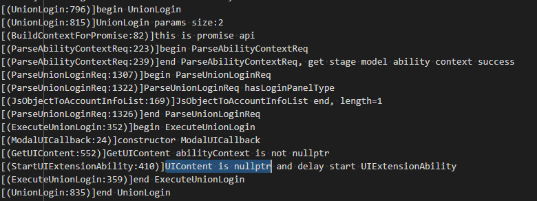
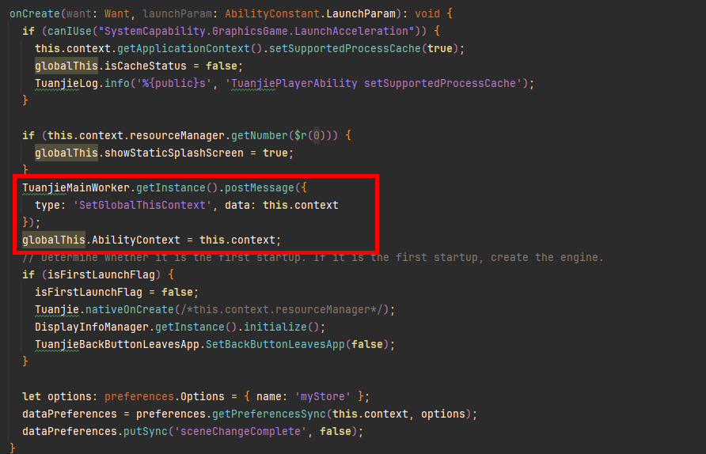

该报错通常是由于游戏在秒级启动后未重新获取并更新[UIAbilityContext](https://developer.huawei.com/consumer/cn/doc/harmonyos-references/js-apis-inner-application-uiabilitycontext)，导致后续逻辑仍使用旧的Context对象。当[UIAbility](https://developer.huawei.com/consumer/cn/doc/harmonyos-guides/uiability)被重新创建时，如果相关模块或三方SDK继续使用旧的UIAbilityContext，可能会导致接口调用异常、资源访问失败或SDK功能异常。

排查要点：

1. 游戏启动后进入onCreate生命周期时，是否重新更新UIAbilityContext。

   以[示例工程](https://gitcode.com/HarmonyOS_Codelabs/graphics-accelerate-kit-launch-acceleration-codelab-arkts/blob/master/entry/src/main/ets/ability/TuanjiePlayerAbilityBase.ets)为例，AbilityContext的赋值应放在isFirstLaunchFlag判断之外，以确保每次启动（包括秒级启动）都能更新为当前UIAbility的UIAbilityContext。

   
2. 对于依赖UIAbilityContext的三方SDK，是否在每次启动时同步更新Context。

   若三方SDK在初始化或调用过程中依赖UIAbilityContext，需要在UIAbility重新创建时，将最新的UIAbilityContext重新传递给SDK，避免继续使用旧的Context实例。
