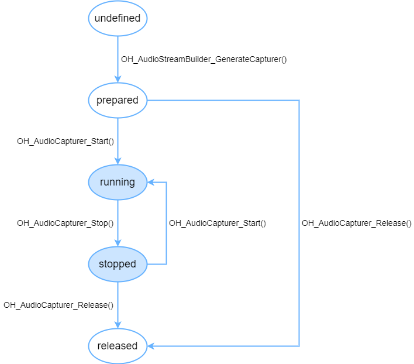

OHAudio是系统在API version 10中引入的一套C API，此API在设计上实现归一，同时支持普通音频通路和低时延通路。仅支持PCM格式，适用于依赖Native层实现音频输入功能的场景。

OHAudio音频录制状态变化示意图：



当音频流处于工作状态（非released状态）时，需要占用系统的音频流资源。由于系统对音频流数量有限制，所以当客户端暂时不使用音频流时，调用OH\_AudioCapturer\_Release()回收音频资源，做好资源利用，避免后续创建音频流失败。

## 使用入门

开发者要使用OHAudio提供的录制能力，需要添加对应的头文件。

以下各步骤示例为片段代码，可通过示例代码右下方链接获取[完整示例](https://gitcode.com/openharmony/applications_app_samples/blob/master/code/DocsSample/Media/Audio/AudioCapturerSampleC)。

### 在 CMake 脚本中链接动态库

```
target_link_libraries(sample PUBLIC libohaudio.so)
```

### 添加头文件

开发者通过引入[native\_audiostreambuilder.h](https://developer.huawei.com/consumer/cn/doc/harmonyos-references/capi-native-audiostreambuilder-h)和[native\_audiocapturer.h](https://developer.huawei.com/consumer/cn/doc/harmonyos-references/capi-native-audiocapturer-h)头文件，使用音频录制相关API。

```
#include <ohaudio/native_audiocapturer.h>
#include <ohaudio/native_audiostreambuilder.h>
```


<div class="source-link-wrapper"><a href="https://gitcode.com/HarmonyOS_Samples/guide-snippets/blob/HarmonyOS-feature-20260402/Media/Audio/AudioCapturerSampleC/entry/src/main/cpp/AudioCapture.cpp#L18-L21" target="_blank" rel="noopener noreferrer" class="source-link"><svg class="source-link-icon" width="14" height="14" viewBox="0 0 24 24" fill="none" stroke="currentColor" strokeWidth="2" strokeLinecap="round" strokeLinejoin="round">\<path d="M18 13v6a2 2 0 0 1-2 2H5a2 2 0 0 1-2-2V8a2 2 0 0 1 2-2h6" /\>\<polyline points="15 3 21 3 21 9" /\>\<line x1="10" y1="14" x2="21" y2="3" /\></svg> 查看源码：AudioCapture.cpp</a></div>


## 开发步骤

详细的API说明请参考[OHAudio](https://developer.huawei.com/consumer/cn/doc/harmonyos-references/capi-ohaudio)。

### 音频流构造器

OHAudio提供OH\_AudioStreamBuilder接口，遵循构造器设计模式，用于构建音频流。开发者需要根据业务场景，指定对应的[OH\_AudioStream\_Type](https://developer.huawei.com/consumer/cn/doc/harmonyos-references/capi-native-audiostream-base-h#oh_audiostream_type)。

OH\_AudioStream\_Type包含两种类型：

* AUDIOSTREAM\_TYPE\_RENDERER
* AUDIOSTREAM\_TYPE\_CAPTURER

使用[OH\_AudioStreamBuilder\_Create](https://developer.huawei.com/consumer/cn/doc/harmonyos-references/capi-native-audiostreambuilder-h#oh_audiostreambuilder_create)创建构造器示例：

```
OH_AudioStreamBuilder* builder;
OH_AudioStreamBuilder_Create(&builder, streamType);
```


<div class="source-link-wrapper"><a href="https://gitcode.com/HarmonyOS_Samples/guide-snippets/blob/HarmonyOS-feature-20260402/Media/Audio/AudioCapturerSampleC/entry/src/main/cpp/AudioCapture.cpp#L280-L283" target="_blank" rel="noopener noreferrer" class="source-link"><svg class="source-link-icon" width="14" height="14" viewBox="0 0 24 24" fill="none" stroke="currentColor" strokeWidth="2" strokeLinecap="round" strokeLinejoin="round">\<path d="M18 13v6a2 2 0 0 1-2 2H5a2 2 0 0 1-2-2V8a2 2 0 0 1 2-2h6" /\>\<polyline points="15 3 21 3 21 9" /\>\<line x1="10" y1="14" x2="21" y2="3" /\></svg> 查看源码：AudioCapture.cpp</a></div>


在音频业务结束之后，开发者应该执行[OH\_AudioStreamBuilder\_Destroy](https://developer.huawei.com/consumer/cn/doc/harmonyos-references/capi-native-audiostreambuilder-h#oh_audiostreambuilder_destroy)接口来销毁构造器。

```
OH_AudioStreamBuilder_Destroy(builder);
```


<div class="source-link-wrapper"><a href="https://gitcode.com/HarmonyOS_Samples/guide-snippets/blob/HarmonyOS-feature-20260402/Media/Audio/AudioCapturerSampleC/entry/src/main/cpp/AudioCapture.cpp#L183-L185" target="_blank" rel="noopener noreferrer" class="source-link"><svg class="source-link-icon" width="14" height="14" viewBox="0 0 24 24" fill="none" stroke="currentColor" strokeWidth="2" strokeLinecap="round" strokeLinejoin="round">\<path d="M18 13v6a2 2 0 0 1-2 2H5a2 2 0 0 1-2-2V8a2 2 0 0 1 2-2h6" /\>\<polyline points="15 3 21 3 21 9" /\>\<line x1="10" y1="14" x2="21" y2="3" /\></svg> 查看源码：AudioCapture.cpp</a></div>


开发者可以通过以下几个步骤来实现一个简单的录制功能。

### 实现音频录制

1. 创建构造器。

   ```
   OH_AudioStreamBuilder* builder;
   OH_AudioStreamBuilder_Create(&builder, AUDIOSTREAM_TYPE_CAPTURER);
   ```

   

<div class="source-link-wrapper"><a href="https://gitcode.com/HarmonyOS_Samples/guide-snippets/blob/HarmonyOS-feature-20260402/Media/Audio/AudioCapturerSampleC/entry/src/main/cpp/AudioCapture.cpp#L144-L147" target="_blank" rel="noopener noreferrer" class="source-link"><svg class="source-link-icon" width="14" height="14" viewBox="0 0 24 24" fill="none" stroke="currentColor" strokeWidth="2" strokeLinecap="round" strokeLinejoin="round">\<path d="M18 13v6a2 2 0 0 1-2 2H5a2 2 0 0 1-2-2V8a2 2 0 0 1 2-2h6" /\>\<polyline points="15 3 21 3 21 9" /\>\<line x1="10" y1="14" x2="21" y2="3" /\></svg> 查看源码：AudioCapture.cpp</a></div>

2. 配置音频流参数。

   创建音频录制构造器后，可以设置音频流所需要的参数，可以参考下面的案例。

   ```
   // 设置音频采样率。
   const int SAMPLING_RATE_48K = 48000;
   OH_AudioStreamBuilder_SetSamplingRate(builder, SAMPLING_RATE_48K);
   // 设置音频声道。
   const int channelCount = 2;
   OH_AudioStreamBuilder_SetChannelCount(builder, channelCount);
   // 设置音频采样格式。
   OH_AudioStreamBuilder_SetSampleFormat(builder, AUDIOSTREAM_SAMPLE_S16LE);
   // 设置音频流的编码类型。
   OH_AudioStreamBuilder_SetEncodingType(builder, AUDIOSTREAM_ENCODING_TYPE_RAW);
   // 设置输入音频流的工作场景。
   OH_AudioStreamBuilder_SetCapturerInfo(builder, AUDIOSTREAM_SOURCE_TYPE_MIC);
   ```

   

<div class="source-link-wrapper"><a href="https://gitcode.com/HarmonyOS_Samples/guide-snippets/blob/HarmonyOS-feature-20260402/Media/Audio/AudioCapturerSampleC/entry/src/main/cpp/AudioCapture.cpp#L149-L162" target="_blank" rel="noopener noreferrer" class="source-link"><svg class="source-link-icon" width="14" height="14" viewBox="0 0 24 24" fill="none" stroke="currentColor" strokeWidth="2" strokeLinecap="round" strokeLinejoin="round">\<path d="M18 13v6a2 2 0 0 1-2 2H5a2 2 0 0 1-2-2V8a2 2 0 0 1 2-2h6" /\>\<polyline points="15 3 21 3 21 9" /\>\<line x1="10" y1="14" x2="21" y2="3" /\></svg> 查看源码：AudioCapture.cpp</a></div>


   注意，音频录制的音频数据需要通过回调接口读入，开发者要实现回调接口，从API version 12开始支持使用[OH\_AudioStreamBuilder\_SetCapturerReadDataCallback](https://developer.huawei.com/consumer/cn/doc/harmonyos-references/capi-native-audiostreambuilder-h#oh_audiostreambuilder_setcapturerreaddatacallback)设置回调函数。回调函数的声明请查看[OH\_AudioCapturer\_OnReadDataCallback](https://developer.huawei.com/consumer/cn/doc/harmonyos-references/capi-native-audiocapturer-h#oh_audiocapturer_onreaddatacallback)。
3. 设置音频回调函数。

   多音频并发处理可参考文档[处理音频焦点事件](/docs/dev/app-dev/media/audio-kit/audio-session/audio-playback-concurrency)，仅接口语言差异。

   ```
   void MyOnReadData_NewAPI(
       OH_AudioCapturer* capturer,
       void* userData,
       void* audioData,
       int32_t audioDataSize)
   {
       // 从buffer中取出length长度的录音数据。
   }

   void MyOnInterruptEvent_NewAPI(
       OH_AudioCapturer* capturer,
       void* userData,
       OH_AudioInterrupt_ForceType type,
       OH_AudioInterrupt_Hint hint)
   {
       // 根据type和hint表示的音频中断信息，更新录制器状态和界面。
   }

   void MyOnError_NewAPI(
       OH_AudioCapturer* capturer,
       void* userData,
       OH_AudioStream_Result error)
   {
       // 根据error表示的音频异常信息，做出相应的处理。
   }
   // ...
       // 配置音频中断事件回调函数。
       OH_AudioCapturer_OnInterruptCallback OnInterruptCb = MyOnInterruptEvent_NewAPI;
       OH_AudioStreamBuilder_SetCapturerInterruptCallback(builder, OnInterruptCb, nullptr);

       // 配置音频异常回调函数。
       OH_AudioCapturer_OnErrorCallback OnErrorCb = MyOnError_NewAPI;
       OH_AudioStreamBuilder_SetCapturerErrorCallback(builder, OnErrorCb, nullptr);

       // 配置音频输入流的回调。
       OH_AudioCapturer_OnReadDataCallback OnReadDataCb = MyOnReadData_NewAPI;
       OH_AudioStreamBuilder_SetCapturerReadDataCallback(builder, OnReadDataCb, nullptr);
   ```

   

<div class="source-link-wrapper"><a href="https://gitcode.com/HarmonyOS_Samples/guide-snippets/blob/HarmonyOS-feature-20260402/Media/Audio/AudioCapturerSampleC/entry/src/main/cpp/AudioCapture.cpp#L25-L176" target="_blank" rel="noopener noreferrer" class="source-link"><svg class="source-link-icon" width="14" height="14" viewBox="0 0 24 24" fill="none" stroke="currentColor" strokeWidth="2" strokeLinecap="round" strokeLinejoin="round">\<path d="M18 13v6a2 2 0 0 1-2 2H5a2 2 0 0 1-2-2V8a2 2 0 0 1 2-2h6" /\>\<polyline points="15 3 21 3 21 9" /\>\<line x1="10" y1="14" x2="21" y2="3" /\></svg> 查看源码：AudioCapture.cpp</a></div>

4. 构造录制音频流。

   ```
   OH_AudioCapturer* audioCapturer;
   OH_AudioStreamBuilder_GenerateCapturer(builder, &audioCapturer);
   ```

   

<div class="source-link-wrapper"><a href="https://gitcode.com/HarmonyOS_Samples/guide-snippets/blob/HarmonyOS-feature-20260402/Media/Audio/AudioCapturerSampleC/entry/src/main/cpp/AudioCapture.cpp#L178-L181" target="_blank" rel="noopener noreferrer" class="source-link"><svg class="source-link-icon" width="14" height="14" viewBox="0 0 24 24" fill="none" stroke="currentColor" strokeWidth="2" strokeLinecap="round" strokeLinejoin="round">\<path d="M18 13v6a2 2 0 0 1-2 2H5a2 2 0 0 1-2-2V8a2 2 0 0 1 2-2h6" /\>\<polyline points="15 3 21 3 21 9" /\>\<line x1="10" y1="14" x2="21" y2="3" /\></svg> 查看源码：AudioCapture.cpp</a></div>

5. 使用音频流。

   录制音频流中包含以下接口，用来实现对音频流的控制。

   | 接口 | 说明 |
   | --- | --- |
   | OH\_AudioStream\_Result OH\_AudioCapturer\_Start(OH\_AudioCapturer\* capturer) | 开始录制。 |
   | OH\_AudioStream\_Result OH\_AudioCapturer\_Pause(OH\_AudioCapturer\* capturer) | 暂停录制。 |
   | OH\_AudioStream\_Result OH\_AudioCapturer\_Stop(OH\_AudioCapturer\* capturer) | 停止录制。 |
   | OH\_AudioStream\_Result OH\_AudioCapturer\_Flush(OH\_AudioCapturer\* capturer) | 释放缓存数据。 |
   | OH\_AudioStream\_Result OH\_AudioCapturer\_Release(OH\_AudioCapturer\* capturer) | 释放录制实例。 |

   

   音频流控制接口执行会有耗时（例如OH\_AudioCapturer\_Stop接口单次执行普遍超过50ms），应避免在主线程中直接调用，以免造成界面显示卡顿。
6. 释放构造器。

   构造器不再使用时，需要释放相关资源。

   ```
   OH_AudioStreamBuilder_Destroy(builder);
   ```

   

<div class="source-link-wrapper"><a href="https://gitcode.com/HarmonyOS_Samples/guide-snippets/blob/HarmonyOS-feature-20260402/Media/Audio/AudioCapturerSampleC/entry/src/main/cpp/AudioCapture.cpp#L183-L185" target="_blank" rel="noopener noreferrer" class="source-link"><svg class="source-link-icon" width="14" height="14" viewBox="0 0 24 24" fill="none" stroke="currentColor" strokeWidth="2" strokeLinecap="round" strokeLinejoin="round">\<path d="M18 13v6a2 2 0 0 1-2 2H5a2 2 0 0 1-2-2V8a2 2 0 0 1 2-2h6" /\>\<polyline points="15 3 21 3 21 9" /\>\<line x1="10" y1="14" x2="21" y2="3" /\></svg> 查看源码：AudioCapture.cpp</a></div>


### 设置低时延模式

当设备支持低时延通路时，开发者可以使用低时延模式创建音频录制构造器，获得更低时延的音频体验。

开发流程与普通录制（[实现音频录制](#实现音频录制)）场景一致，仅需要在步骤1创建音频录制构造器时，调用[OH\_AudioStreamBuilder\_SetLatencyMode()](https://developer.huawei.com/consumer/cn/doc/harmonyos-references/capi-native-audiostreambuilder-h#oh_audiostreambuilder_setlatencymode)设置低时延模式。


* 当音频录制场景[OH\_AudioStream\_SourceType](https://developer.huawei.com/consumer/cn/doc/harmonyos-references/capi-native-audiostream-base-h#oh_audiostream_sourcetype)为AUDIOSTREAM\_SOURCE\_TYPE\_VOICE\_COMMUNICATION时，不支持主动设置低时延模式，系统会根据设备的能力，决策输入的音频通路。
* 部分场景（如通话来电）下系统能力受限会回落至普通音频通路模式，缓冲区大小也会发生变化，此时应同普通音频通路模式一样根据缓冲区大小将缓冲区中数据一次性全部取走，否则录制的数据会出现不连续，导致杂音。

```
OH_AudioStream_LatencyMode latencyMode = AUDIOSTREAM_LATENCY_MODE_FAST;
OH_AudioStreamBuilder_SetLatencyMode(builder, latencyMode);
```


<div class="source-link-wrapper"><a href="https://gitcode.com/HarmonyOS_Samples/guide-snippets/blob/HarmonyOS-feature-20260402/Media/Audio/AudioCapturerSampleC/entry/src/main/cpp/AudioCapture.cpp#L285-L288" target="_blank" rel="noopener noreferrer" class="source-link"><svg class="source-link-icon" width="14" height="14" viewBox="0 0 24 24" fill="none" stroke="currentColor" strokeWidth="2" strokeLinecap="round" strokeLinejoin="round">\<path d="M18 13v6a2 2 0 0 1-2 2H5a2 2 0 0 1-2-2V8a2 2 0 0 1 2-2h6" /\>\<polyline points="15 3 21 3 21 9" /\>\<line x1="10" y1="14" x2="21" y2="3" /\></svg> 查看源码：AudioCapture.cpp</a></div>


### 设置静音打断模式

静音打断模式提供将打断策略从停止录音切换为静音录制的功能，可以实现录音全程不被系统基于焦点并发规则打断的效果，并且录音过程中也不影响其他应用启动录音。开发者在创建音频录制构造器时，调用[OH\_AudioStreamBuilder\_SetCapturerWillMuteWhenInterrupted](https://developer.huawei.com/consumer/cn/doc/harmonyos-references/capi-native-audiostreambuilder-h#oh_audiostreambuilder_setcapturerwillmutewheninterrupted)接口设置是否开启静音打断模式。默认不开启，此时由音频焦点策略管理并发音频流的执行顺序。开启后，被其他应用打断导致停止或暂停录制时会进入静音录制状态，在此状态下录制的音频没有声音。

### 回声消除功能

回声消除功能可在支持的设备上有效消除录音过程中的回声干扰，提升音频采集质量。开发者可通过指定特定的音频输入源类型[OH\_AudioStream\_SourceType](https://developer.huawei.com/consumer/cn/doc/harmonyos-references/capi-native-audiostream-base-h#oh_audiostream_sourcetype)（AUDIOSTREAM\_SOURCE\_TYPE\_VOICE\_COMMUNICATION、AUDIOSTREAM\_SOURCE\_TYPE\_LIVE）来启用该功能，系统将会自动对采集的音频信号进行回声消除处理。

在启用前，建议先调用[OH\_AudioStreamManager\_IsAcousticEchoCancelerSupported](https://developer.huawei.com/consumer/cn/doc/harmonyos-references/capi-native-audio-stream-manager-h#oh_audiostreammanager_isacousticechocancelersupported)接口（从API version 20开始支持）查询当前设备对音频输入源类型[OH\_AudioStream\_SourceType](https://developer.huawei.com/consumer/cn/doc/harmonyos-references/capi-native-audiostream-base-h#oh_audiostream_sourcetype)是否支持回声消除功能，以确保功能的可用性。若支持，则可在创建音频录制构造器时通过[OH\_AudioStreamBuilder\_SetCapturerInfo](https://developer.huawei.com/consumer/cn/doc/harmonyos-references/capi-native-audiostreambuilder-h#oh_audiostreambuilder_setcapturerinfo) 设置相应的音频输入源类型，从而激活回声消除处理流程。

## 注意事项

从API version 12开始**不再推荐**使用[OH\_AudioCapturer\_Callbacks](https://developer.huawei.com/consumer/cn/doc/harmonyos-references/capi-ohaudio-oh-audiocapturer-callbacks-struct)的方式设置音频回调函数。若必须使用，需要注意在设置音频回调函数时，通过下面两种方式中的任意一种来设置音频回调函数，避免不可预期的行为。

* 方式1：请确保[OH\_AudioCapturer\_Callbacks](https://developer.huawei.com/consumer/cn/doc/harmonyos-references/capi-ohaudio-oh-audiocapturer-callbacks-struct)的每一个回调都被**自定义的回调方法**或**空指针**初始化。

  ```
  int32_t MyOnReadData_Legacy(
      OH_AudioCapturer* capturer,
      void* userData,
      void* buffer,
      int32_t length)
  {
      // 从buffer中取出length长度的录音数据。
      return 0;
  }
  int32_t MyOnInterruptEvent_Legacy(
      OH_AudioCapturer* capturer,
      void* userData,
      OH_AudioInterrupt_ForceType type,
      OH_AudioInterrupt_Hint hint)
  {
      // 根据type和hint表示的音频中断信息，更新录制器状态和界面。
      return 0;
  }
  // ...
      // 配置回调函数，如果需要监听，则赋值。
      callbacks.OH_AudioCapturer_OnReadData = MyOnReadData_Legacy;
      callbacks.OH_AudioCapturer_OnInterruptEvent = MyOnInterruptEvent_Legacy;

      // （必选）如果不需要监听，使用空指针初始化。
      callbacks.OH_AudioCapturer_OnStreamEvent = nullptr;
      callbacks.OH_AudioCapturer_OnError = nullptr;
  ```

  

<div class="source-link-wrapper"><a href="https://gitcode.com/HarmonyOS_Samples/guide-snippets/blob/HarmonyOS-feature-20260402/Media/Audio/AudioCapturerSampleC/entry/src/main/cpp/AudioCapture.cpp#L53-L223" target="_blank" rel="noopener noreferrer" class="source-link"><svg class="source-link-icon" width="14" height="14" viewBox="0 0 24 24" fill="none" stroke="currentColor" strokeWidth="2" strokeLinecap="round" strokeLinejoin="round">\<path d="M18 13v6a2 2 0 0 1-2 2H5a2 2 0 0 1-2-2V8a2 2 0 0 1 2-2h6" /\>\<polyline points="15 3 21 3 21 9" /\>\<line x1="10" y1="14" x2="21" y2="3" /\></svg> 查看源码：AudioCapture.cpp</a></div>

* 方式2：使用前，初始化并清零结构体。

  ```
  int32_t MyOnReadData_Legacy(
      OH_AudioCapturer* capturer,
      void* userData,
      void* buffer,
      int32_t length)
  {
      // 从buffer中取出length长度的录音数据。
      return 0;
  }
  int32_t MyOnInterruptEvent_Legacy(
      OH_AudioCapturer* capturer,
      void* userData,
      OH_AudioInterrupt_ForceType type,
      OH_AudioInterrupt_Hint hint)
  {
      // 根据type和hint表示的音频中断信息，更新录制器状态和界面。
      return 0;
  }
  // ...
      // 使用前，初始化并清零结构体。
      OH_AudioCapturer_Callbacks callbacks = {0};
      // 配置需要的回调函数。
      callbacks.OH_AudioCapturer_OnReadData = MyOnReadData_Legacy;
      callbacks.OH_AudioCapturer_OnInterruptEvent = MyOnInterruptEvent_Legacy;
  ```

  

<div class="source-link-wrapper"><a href="https://gitcode.com/HarmonyOS_Samples/guide-snippets/blob/HarmonyOS-feature-20260402/Media/Audio/AudioCapturerSampleC/entry/src/main/cpp/AudioCapture.cpp#L54-L260" target="_blank" rel="noopener noreferrer" class="source-link"><svg class="source-link-icon" width="14" height="14" viewBox="0 0 24 24" fill="none" stroke="currentColor" strokeWidth="2" strokeLinecap="round" strokeLinejoin="round">\<path d="M18 13v6a2 2 0 0 1-2 2H5a2 2 0 0 1-2-2V8a2 2 0 0 1 2-2h6" /\>\<polyline points="15 3 21 3 21 9" /\>\<line x1="10" y1="14" x2="21" y2="3" /\></svg> 查看源码：AudioCapture.cpp</a></div>


## 示例代码

* [音频低时延录制与播放](https://gitcode.com/HarmonyOS_Samples/audio-native)
