# 双折叠应用开发

相对于直板机，双折叠有以下明显特点：

* 设备屏幕尺寸可变，具有不同大小和形态的UX界面。
* 具有特殊的折叠状态和交互事件。包含三种状态：折叠态，展开态和悬停态。
  + 展开态：双折叠完全展开后的形态。有更大的屏幕尺寸，可充分显示应用内容。
  + 折叠态：双折叠折叠后的形态。折叠后屏幕尺寸变小。
  + 悬停态：双折叠处于完全展开和折叠的中间状态，可平稳放置。
* 不同折叠状态下，可用的相机，相机的位置会发生变化。

双折叠目前主要的产品有Mate X系列，示意图如下。

| 产品名称 | 示意图 |
| --- | --- |
| Mate X系列 | 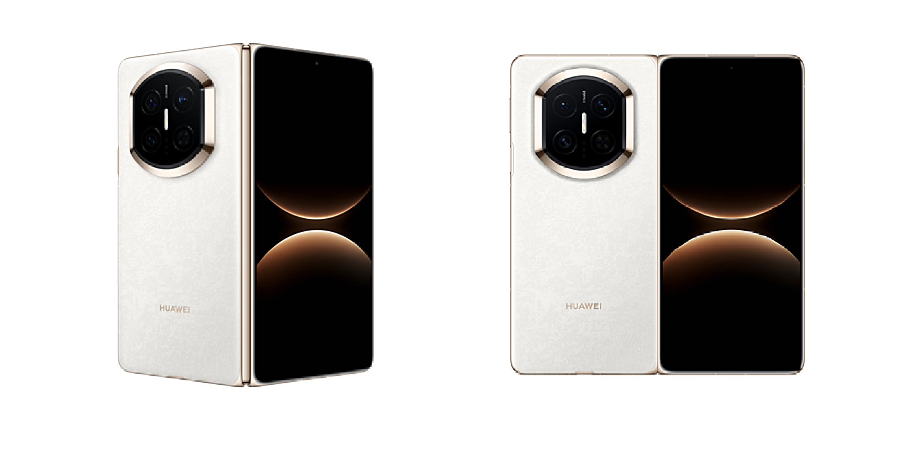 |

本文聚焦于双折叠应用的体验提升开发指导。如需多设备开发的基础通用能力指导，请参考“[一次开发，多端部署概览](https://developer.huawei.com/consumer/cn/doc/best-practices/bpta-multi-device-overview)”系列文章。

## 产品硬件说明

本章以Mate X5产品为例，介绍双折叠的屏幕方向、屏幕尺寸以及相机硬件参数等信息。

###屏幕规格信息

**折叠态屏幕规格信息**

|  |  |  |  |  |
| --- | --- | --- | --- | --- |
| 屏幕旋转角度(rotation) | 0(0度) | 1(90度) | 2(180度) | 3(270度) |
| 折叠态示意图 | 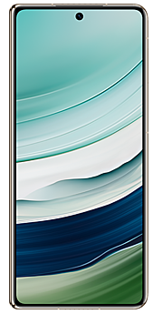 | 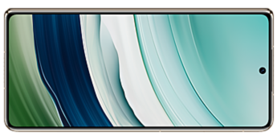 | 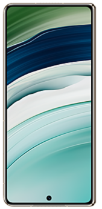 | 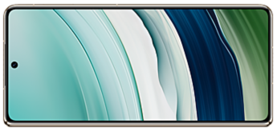 |
| 屏幕方向([Orientation](https://developer.huawei.com/consumer/cn/doc/harmonyos-references/js-apis-display#orientation10)) | 竖屏PORTRAIT | 横屏LANDSCAPE | 反向竖屏PORTRAIT\_INVERTED | 反向横屏LANDSCAPE\_INVERTED |
| 屏幕ID | 0 | 0 | 0 | 0 |
| 分辨率(vp)(向下取整) | 345\*801 | 801\*345 | 345\*801 | 801\*345 |
| 分辨率(px**)(宽\*高**) | 1080\*2504 | 2504\*1080 | 1080\*2504 | 2504\*1080 |
| 横纵断点 | 横向断点sm，纵向断点lg | 横向断点md，纵向断点sm | 横向断点sm，纵向断点lg | 横向断点md，纵向断点sm |

**展开态屏幕规格信息**

|  |  |  |  |  |
| --- | --- | --- | --- | --- |
| 屏幕旋转角度(rotation) | 0(0度) | 1(90度) | 2(180度) | 3(270度) |
| 展开态示意图 | 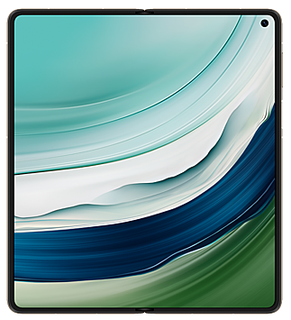 | 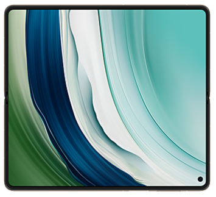 | 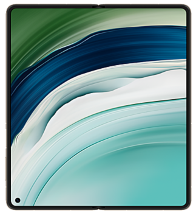 | 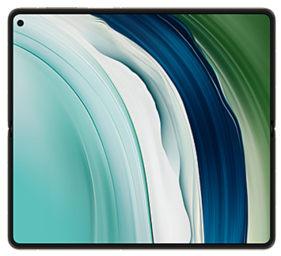 |
| 屏幕方向([Orientation](https://developer.huawei.com/consumer/cn/doc/harmonyos-references/js-apis-display#orientation10)) | 竖屏PORTRAIT | 横屏LANDSCAPE | 反向竖屏PORTRAIT\_INVERTED | 反向横屏LANDSCAPE\_INVERTED |
| 屏幕ID | 0 | 0 | 0 | 0 |
| 分辨率(vp)(向下取整) | 711\*798 | 798\*711 | 711\*798 | 798\*711 |
| 分辨率(px**)(宽\*高**) | 2224\*2496 | 2496\*2224 | 2224\*2496 | 2496\*2224 |
| 横纵断点 | 横向断点md，纵向断点md | 横向断点md，纵向断点md | 横向断点md，纵向断点md | 横向断点md，纵向断点md |

* 上述双折叠屏幕尺寸参数以Mate X5产品为例展示属性，其它双折叠产品可通过[display](https://developer.huawei.com/consumer/cn/doc/harmonyos-references/js-apis-display)的[getDefaultDisplaySync()](https://developer.huawei.com/consumer/cn/doc/harmonyos-references/js-apis-display#displaygetdefaultdisplaysync9)方法获取设备屏幕分辨率(px)，再调用[px2vp()](https://developer.huawei.com/consumer/cn/doc/harmonyos-references/arkts-apis-uicontext-uicontext#px2vp12)接口转换为vp值。
* 悬停态在不同旋转角度下的硬件参数和展开态一致，适配悬停态可参考[折叠屏悬停态](https://developer.huawei.com/consumer/cn/doc/best-practices/bpta-folded-hover)。
* 设备屏幕和窗口方向详细信息可参考[窗口方向](https://developer.huawei.com/consumer/cn/doc/best-practices/bpta-multi-device-window-direction)。

###相机硬件信息

双折叠有默认的[相机镜头安装角度](https://developer.huawei.com/consumer/cn/doc/harmonyos-guides/camera-rotation-term#相机镜头安装角度)，在使用时需要考虑镜头角度和设备的旋转角度，具体定义可参考[预览旋转角度](https://developer.huawei.com/consumer/cn/doc/harmonyos-guides/camera-rotation-term#预览旋转角度)。双折叠相机前置和后置镜头角度以及需要设置的预览流旋转角度如下，折叠态和展开态下的相机参数一致。

**折叠态相机硬件信息**

|  |  |  |  |  |
| --- | --- | --- | --- | --- |
| 屏幕旋转角度(rotation) | 0(0度) | 1(90度) | 2(180度) | 3(270度) |
| 折叠态示意图 | 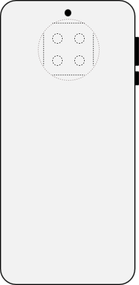 | 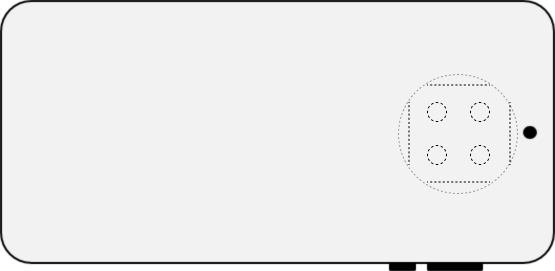 | 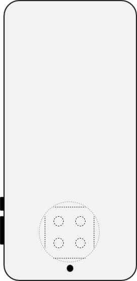 | 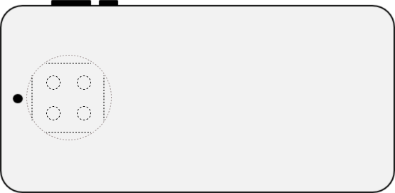 |
| 后置相机镜头角度 | 90度 | 90度 | 90度 | 90度 |
| 后置相机拍摄预览流旋转角度 | 90度 | 180度 | 270度 | 0度 |
| 前置相机镜头角度 | 270度 | 270度 | 270度 | 270度 |
| 前置相机拍摄预览流旋转角度 | 270度 | 0度 | 90度 | 180度 |

**展开态相机硬件信息**

|  |  |  |  |  |
| --- | --- | --- | --- | --- |
| 屏幕旋转角度(rotation) | 0(0度) | 1(90度) | 2(180度) | 3(270度) |
| 展开态示意图 | 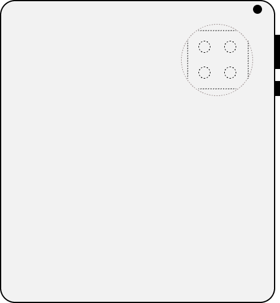 | 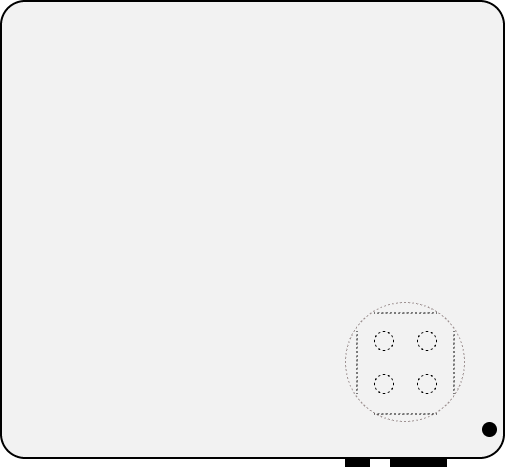 | 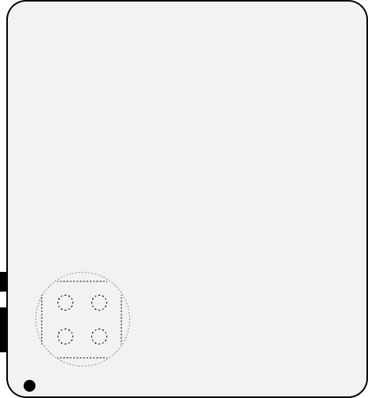 | 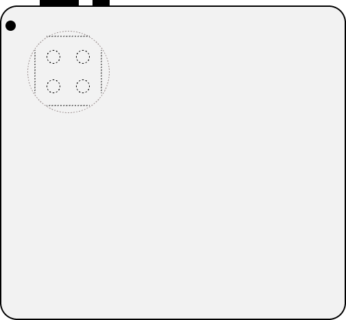 |
| 后置相机镜头角度 | 90度 | 90度 | 90度 | 90度 |
| 后置相机拍摄预览流旋转角度 | 90度 | 180度 | 270度 | 0度 |
| 前置相机镜头角度 | 270度 | 270度 | 270度 | 270度 |
| 前置相机拍摄预览流旋转角度 | 270度 | 0度 | 90度 | 180度 |

* 双折叠后置相机安装角度为90°，前置相机安装角度为270°，和折叠状态无关。可通过[CameraDevice](https://developer.huawei.com/consumer/cn/doc/harmonyos-references/arkts-apis-camera-i#cameradevice)接口获取相机安装角度cameraOrientation。
* 更多相机硬件差异和开发详情可参考[相机硬件差异](https://developer.huawei.com/consumer/cn/doc/best-practices/bpta-multi-device-camera)。

###设备折叠能力

双折叠具备独特的折叠功能，在不同折叠状态下展现出不同的特性。

通过[display.isFoldable()](https://developer.huawei.com/consumer/cn/doc/harmonyos-references/js-apis-display#displayisfoldable10)接口可判断设备是否支持折叠，若支持则返回true，否则返回false。通过[display.getFoldStatus()](https://developer.huawei.com/consumer/cn/doc/harmonyos-references/js-apis-display#displaygetfoldstatus10)接口可获取折叠设备当前的折叠状态，返回结果可参考[FoldStatus](https://developer.huawei.com/consumer/cn/doc/harmonyos-references/js-apis-display#foldstatus10)。下表以Mate X5产品为例，展示了双折叠的折叠状态和属性。

|  | 折叠态 | 悬停态 | 展开态 |
| --- | --- | --- | --- |
| **示意图** | 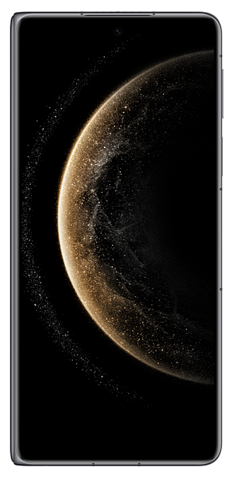 | 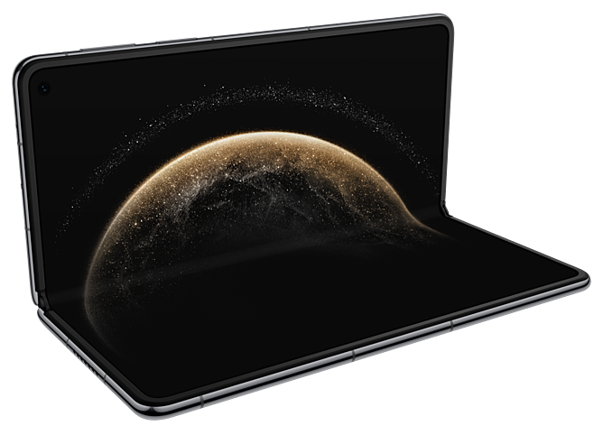 | 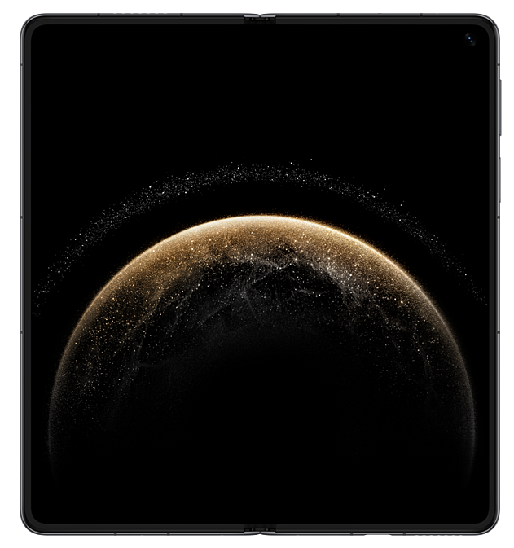 |
| **isFoldable** | true | | |
| **FoldStatus** | FOLD\_STATUS\_FOLDED | FOLD\_STATUS\_HALF\_FOLDED | FOLD\_STATUS\_EXPANDED |

###小折叠硬件说明

**概述**

相对于直板机，小折叠有以下特点：

* 具有特殊的折叠状态和交互事件。包含三种状态：折叠态，展开态和悬停态。
  + 展开态：小折叠完全展开后的形态。形态为直板机。
  + 折叠态：小折叠折叠后的形态。折叠后屏幕尺寸很小，有一定的交互空间。
  + 悬停态：小折叠处于完全展开和折叠的中间状态，可平稳放置。

小折叠目前共有两款产品，Pocket系列和Nova Flip系列，示意图如下。

| 产品名称 | 示意图 |
| --- | --- |
| Pocket系列 | 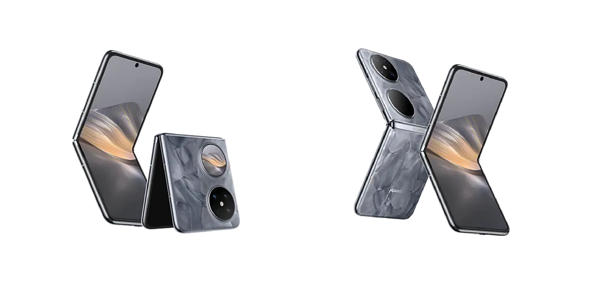 |
| Nova Flip系列 | 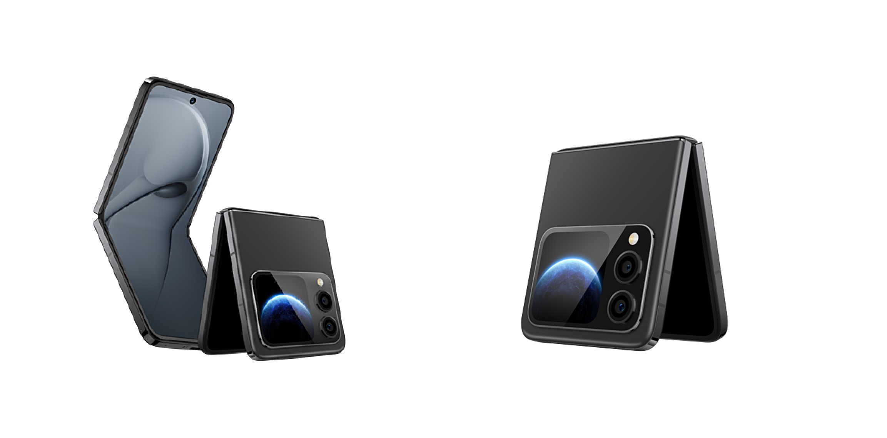 |

**设备折叠能力**

通过[display.isFoldable()](https://developer.huawei.com/consumer/cn/doc/harmonyos-references/js-apis-display#displayisfoldable10)接口可判断设备是否支持折叠，若支持则返回true，否则返回false。通过[display.getFoldStatus()](https://developer.huawei.com/consumer/cn/doc/harmonyos-references/js-apis-display#displaygetfoldstatus10)接口可获取折叠设备当前的折叠状态，返回结果可参考[FoldStatus](https://developer.huawei.com/consumer/cn/doc/harmonyos-references/js-apis-display#foldstatus10)。下表以Pocket系列产品为例，展示了小折叠的折叠状态和属性。

|  | 折叠态 | 悬停态 | 展开态 |
| --- | --- | --- | --- |
| **示意图** | 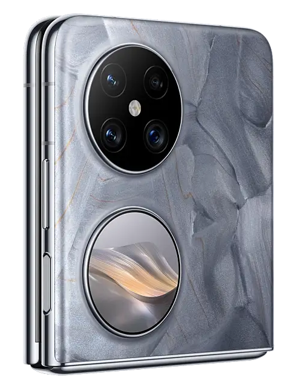 | 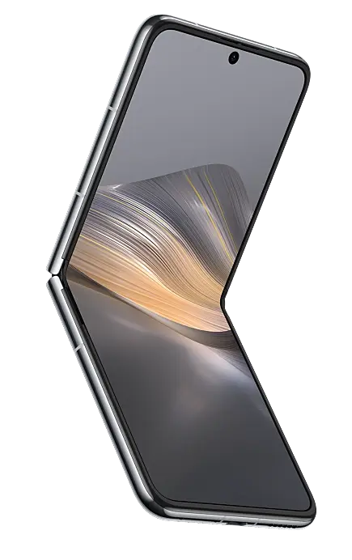 | 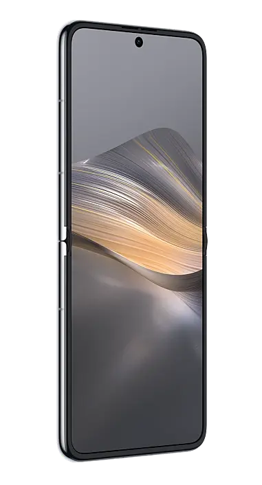 |
| **isFoldable** | false | | |
| **FoldStatus** | FOLD\_STATUS\_FOLDED | FOLD\_STATUS\_HALF\_FOLDED | FOLD\_STATUS\_EXPANDED |

小折叠折叠态外屏屏幕较小，外屏的开发与ArtTS卡片开发一致，实现可参考[ArkTS卡片开发](https://developer.huawei.com/consumer/cn/doc/harmonyos-guides/arkts-ui)，需要注意将form\_config.json配置文件中的supportShapes字段设置为“circle”。卡片的设计标准可参考[服务卡片](https://developer.huawei.com/consumer/cn/doc/design-guides/system-features-service-widget-0000002087671904)。

## 创新与体验提升

###交互跟手

双折叠展开态拥有更宽广的显示视野，信息承载量更大，用户可操作范围也更广。为进一步提升双折叠的使用体验，建议适配系统全新交互能力，通过接入智感握姿、跟手弹窗和跟手半模态等新特性，让用户操作更快捷、高效。

1. **智感握姿**：系统提供感知用户当前握持手信息的能力，应用可依据获取的手部信息，自适应调整核心交互组件的显示位置，有效提升用户单手操作便捷性。

   

   通过订阅握持手状态变化感知事件[motion.on('holdingHandChanged')](https://developer.huawei.com/consumer/cn/doc/harmonyos-references/js-apis-awareness-motion#motiononholdinghandchanged-20)，获取到握持手信息后，更改组件的显示位置。
2. **跟手弹框**：为了减少用户操作路径过长的情况，在折叠态和展开态可通过跟手弹窗进行展示，弹出框的弹出位置离手更近，以便用户能够快速操作。

   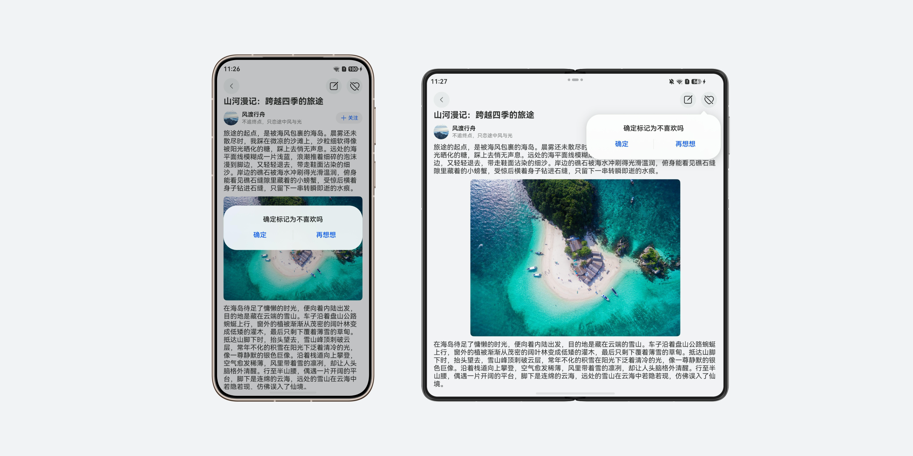

   构建UI布局时，可通过条件表达式判断：当横向断点为sm时，使用普通居中弹框；否则，使用跟手弹框[PopoverDialog](https://developer.huawei.com/consumer/cn/doc/harmonyos-references/ohos-arkui-advanced-dialog#popoverdialog14)，提升大屏设备的操作效率。
3. **跟手半模态**：在折叠态，半模态窗口通常从屏幕底部弹出；在展开态，可以考虑跟手半模态窗口或者居中半模态窗口显示，具体根据业务需要选择。

   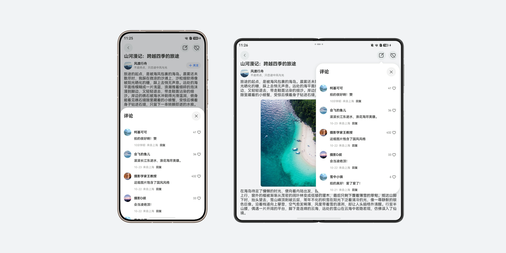

   使用[bindSheet](https://developer.huawei.com/consumer/cn/doc/harmonyos-references/ts-universal-attributes-sheet-transition#bindsheet)绑定半模态转场时，设置半模态属性preferType为[SheetType](https://developer.huawei.com/consumer/cn/doc/harmonyos-references/ts-universal-attributes-sheet-transition#sheettype11枚举说明).POPUP。设置该属性后，窗口宽度小于600vp的设备将默认显示底部弹窗，其他设备则自动适配为跟手弹窗。

###悬停态适配

双折叠展开态时可切换至悬停态。悬停态支持设备平稳放置于桌面，实现免手持体验，常用于视频通话、视频播放、拍照、听歌等不需要频繁交互的场景。这种状态下，应用需要对中间折痕区域进行避让，并对上下两个界面进行悬停态布局适配。悬停态的实现方案可参考[折叠屏悬停态](https://developer.huawei.com/consumer/cn/doc/best-practices/bpta-folded-hover)。

###开合适配

开合连续指应用在屏幕形态与窗口状态切换时，保持页面内容连贯，延续任务进度与运行状态。支持用户快速接续切换前的操作，打造流畅的切换体验。例如双折叠设备在折叠态和展开态之间切换时，应用页面内容保持不变、状态无缝接续，保障使用体验不受影响。具体实现方案，可参考[开合连续](https://developer.huawei.com/consumer/cn/doc/best-practices/bpta-multi-device-screen-diff#section16541144511135)章节。

###悬浮组件

在双折叠设备上，可以借助[HdsTabs](https://developer.huawei.com/consumer/cn/doc/harmonyos-references/ui-design-hdstabs)组件的[barFloatingStyle](https://developer.huawei.com/consumer/cn/doc/harmonyos-references/ui-design-hdstabs#barfloatingstyle)属性实现悬浮导航栏，可适配各类形态切换场景，充分释放屏幕可视区域；通过悬浮材质参数[SystemMaterialParams](https://developer.huawei.com/consumer/cn/doc/harmonyos-references/ui-design-hdstabs#systemmaterialparams)配置透明磨砂材质效果，提升界面通透感，适配沉浸式浏览体验。搭配[HdsTabsMiniBar](https://developer.huawei.com/consumer/cn/doc/harmonyos-references/ui-design-hdstabs#hdstabsminibar)可扩展迷你标签栏，拓展多维度快捷入口，适配展开态的分区操作，同时保障折叠态和展开态下交互逻辑统一，降低用户切换成本，有效提升操作效率与使用体验。

###视频自适应沉浸

双折叠设备可以切换折叠态和展开态，且窗口模式可以转换分屏、悬浮窗，为避免视频播放画面在形态切换时出现拉伸、裁剪、显示比例错乱等问题，可采用自适应沉浸全屏播放方案，精简界面元素、减少视觉干扰，让用户聚焦视频画面，充分利用大屏开阔视野，有效提升观看体验。具体实现方案，可参考[视频适配不同尺寸屏幕](https://developer.huawei.com/consumer/cn/doc/best-practices/bpta-multi-device-screen-diff#section1452572513130)章节。

###全景多窗

[全景多窗](https://developer.huawei.com/consumer/cn/doc/harmonyos-guides/multi-window-intro#全景多窗)旨在帮助用户高效处理多个任务。通过全景多窗，用户可以突破物理屏幕局限，在同一屏幕内并行运行多款应用，实现应用间快捷切换，提升操作效率。双折叠可依托全景多窗能力，充分利用大屏空间优势，最高支持三个窗口同屏并行运行，助力用户一边浏览资讯、一边编辑内容、一边沟通办公，多任务同步处理、互不冲突，实现办公、娱乐、日常操作一站式协同。

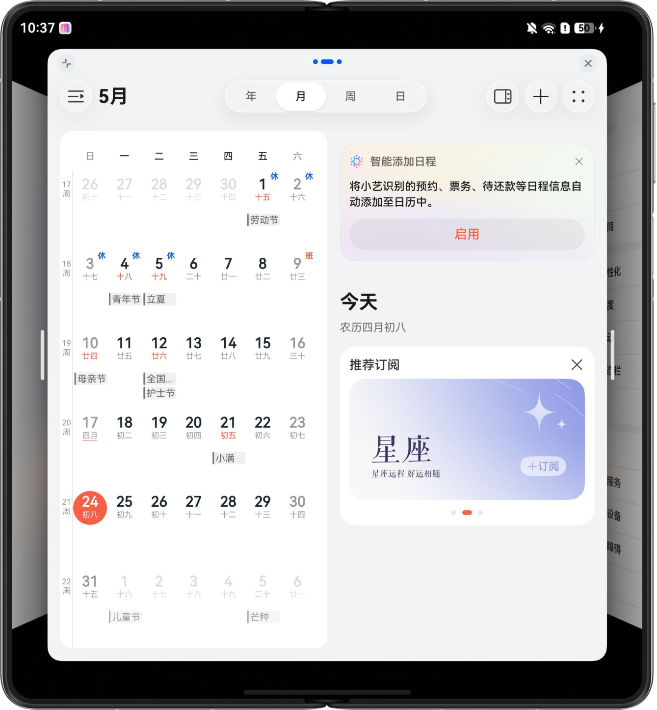

## 设备常见适配问题

###截断/留白

**应用启动页面未铺满屏幕或出现异常布局**

问题描述：在双折叠展开态启动应用时，应用的启动页面未铺满整个屏幕，出现白屏区域或者启动页面被截断。

解决方案：应用需要[配置增强启动页](https://developer.huawei.com/consumer/cn/doc/harmonyos-guides/launch-page-config#配置增强启动页)，配置后启动页面中的背景、图片和图标等资源能根据窗口大小自适应填充，保证启动页面在不同设备形态上正常显示，配置中各标签的说明可参考[startWindow标签](https://developer.huawei.com/consumer/cn/doc/harmonyos-guides/module-configuration-file#startwindow标签)。

**如何实现不同折叠状态下的页面布局**

问题描述：应用页面布局在不同折叠状态下适配方式不明确或适配出现异常。

解决方案：推荐使用断点适配页面布局。依据不同断点对应的UX设计规范，分别开发对应的页面布局。通过[window.on('windowSizeChange')](https://developer.huawei.com/consumer/cn/doc/harmonyos-references/arkts-apis-window-window#onwindowsizechange7)监听页面的断点变化，即可实现不同折叠状态下的页面布局适配，详细开发方案参考[断点](https://developer.huawei.com/consumer/cn/doc/best-practices/bpta-multi-device-responsive-layout#section1532120147301)的开发案例。
