# 折叠电脑应用开发

## 概述

HarmonyOS折叠电脑凭借其独特的折叠设计、全屏触控和[虚拟键盘](/docs/design/multi-device-design/2in1/foldable-pc#虚拟键盘)的交互方式，融合了一体机、笔记本和平板三种设备的使用体验，在形态创新与交互体验方面有所提升。

除传统电脑的基础功能外，该设备还具备以下核心特性：

1. 设备形态：支持唤起全尺寸键盘的半折叠态、关闭全尺寸键盘的半折叠态、横向展开态、竖向展开态和外接显示器五种使用形态。
2. 交互设计：在半折叠态下，上下两块屏幕均可独立操作。用户可点击桌面右下角键盘图标，或通过八指及以上多指触控屏幕唤起全尺寸虚拟键盘，获得传统电脑的操作体验。
3. 屏幕显示方向：半折叠态仅支持固定显示方向，不支持屏幕旋转；展开态支持三种屏幕显示方向（[display.Orientation](https://developer.huawei.com/consumer/cn/doc/harmonyos-references/js-apis-display#orientation10)）：横屏（1-LANDSCAPE）、反向横屏（3-LANDSCAPE\_INVERTED）和竖屏（0-PORTRAIT），且默认开启屏幕旋转，无法关闭。

当磁吸键盘贴附在下屏时，设备进入半折叠态（唤起全尺寸键盘），此时下屏无法使用。

当前折叠电脑产品主要为MateBook Fold系列。

| 产品名称 | 示意图 |
| --- | --- |
| **MateBook Fold系列** | 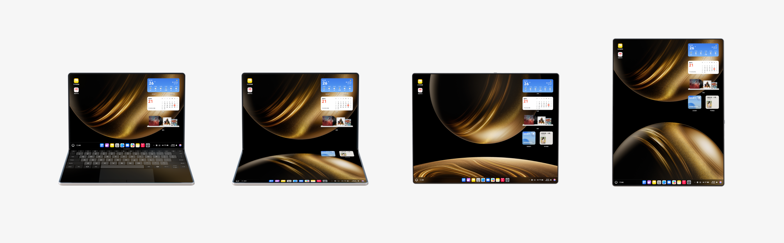 |

本文聚焦于折叠电脑应用体验提升的开发指导。如需多设备开发的基础通用能力指导，请参考“[一次开发，多端部署概览](/docs/dev/app-dev/multi-device/bpta-multi-device-overview)”系列文章。

## 产品硬件参数

本章将以MateBook Fold产品为例，介绍折叠电脑的屏幕尺寸、相机、折叠能力等硬件参数信息。

###屏幕规格信息

折叠电脑在不同折叠状态下，分辨率、屏幕宽度等属性存在差异，具体说明如下：

* 在半折叠态（关闭全尺寸键盘）下，设备拥有上下两个屏幕，其中上屏的displayId为0，下屏的displayId为999；而在半折叠态（唤起全尺寸键盘）和展开态下，仅显示displayId为0的屏幕。
* 折叠电脑底部工具栏高度固定为118px，但在不同折叠电脑形态下，工具栏占用的宽度和位置不同，屏幕可用宽高（[availableWidth/availableHeight](https://developer.huawei.com/consumer/cn/doc/harmonyos-references/js-apis-display#属性)）也会随之变化。
* 折叠电脑外接显示器时，会自动进入横向展开态布局，且屏幕方向为反向横屏，此时折叠电脑默认作为主显示器（displayId为0），外接屏幕作为副显示器（displayId与接入的端口有关）。可使用[getWindowProperties()](https://developer.huawei.com/consumer/cn/doc/harmonyos-references/arkts-apis-window-window#getwindowproperties9)方法获取当前窗口的属性[WindowProperties](https://developer.huawei.com/consumer/cn/doc/harmonyos-references/arkts-apis-window-i#windowproperties)，通过其中的displayId字段，判断窗口所在的显示器。

**半折叠态屏幕规格信息**

|  |  |  |  |  |  |  |
| --- | --- | --- | --- | --- | --- | --- |
| [屏幕旋转角度（rotation）](https://developer.huawei.com/consumer/cn/doc/harmonyos-references/js-apis-display#属性) | 0(0度) | | | 1(90度) | 2(180度) | 3(270度) |
| 设备形态 | 半折叠态（唤起全尺寸键盘） | 半折叠态（关闭全尺寸键盘） | | NA | NA | NA |
| 半折叠态效果图 |  |  | | NA | NA | NA |
| [屏幕方向（Orientation）](https://developer.huawei.com/consumer/cn/doc/harmonyos-references/js-apis-display#orientation10) | 竖屏PORTRAIT | | | NA | NA | NA |
| 屏幕ID | displayId：0 | displayId：0 | displayId：999 | NA | NA | NA |
| 分辨率（px） | 2472\*1608 | 2472\*1608 | 2472\*1606 | NA | NA | NA |
| 分辨率（vp）（向下取整） | 1373\*893 | 1373\*893 | 1373\*892 | NA | NA | NA |
| 屏幕可用宽高（px） | 2472\*1490（底部工具栏高度118px） | 2472\*1608 | 2472\*1488（底部工具栏高度118px） | NA | NA | NA |
| 屏幕可用宽高（vp）（向下取整） | 1373\*827 | 1373\*893 | 1373\*826 | NA | NA | NA |
| [横纵断点](/docs/dev/app-dev/multi-device/bpta-multi-device-responsive-layout#section1532120147301) | 横向断点lg，纵向断点sm | 横向断点lg，纵向断点sm | 横向断点lg，纵向断点sm | NA | NA | NA |

**展开态屏幕规格信息**

|  |  |  |  |  |  |
| --- | --- | --- | --- | --- | --- |
| [屏幕旋转角度（rotation）](https://developer.huawei.com/consumer/cn/doc/harmonyos-references/js-apis-display#属性) | 0(0度) | 1(90度) | 2(180度) | 3(270度) | |
| 设备形态 | 竖向展开态 | 横向展开态 | NA | 横向展开态 | 外接显示器 |
| 展开态效果图 | 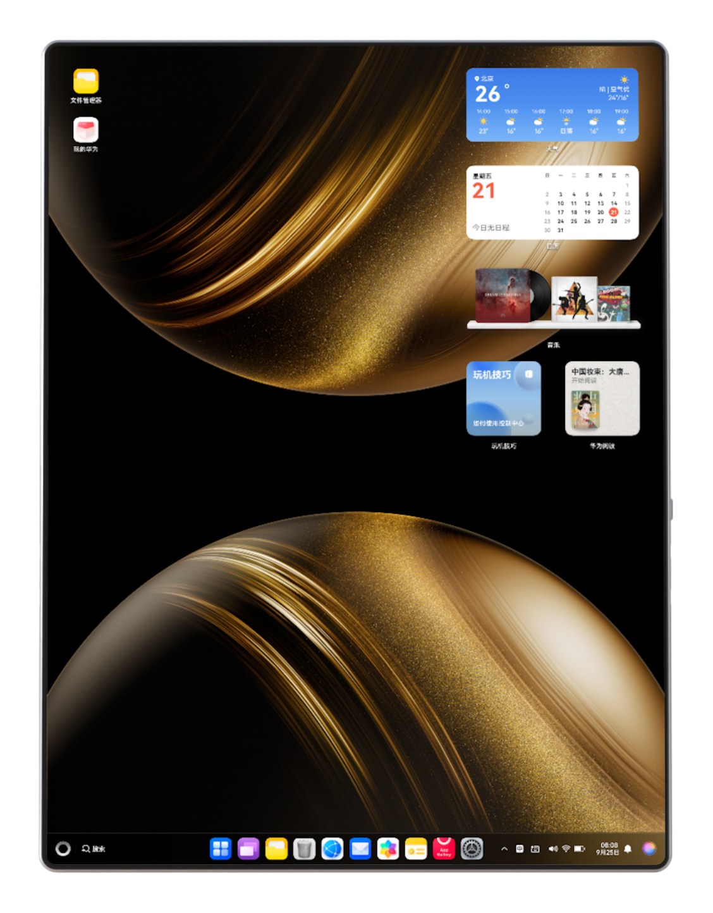 |  | NA | 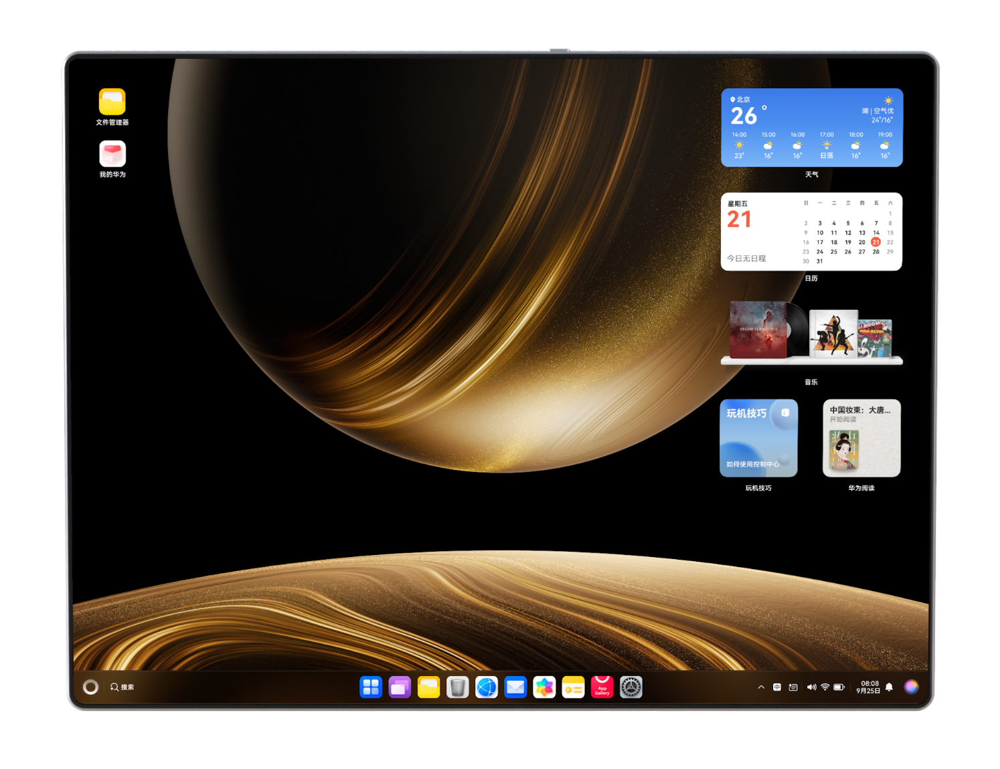 | 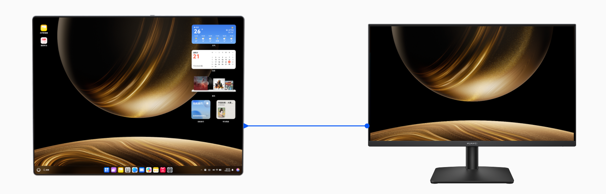 |
| [屏幕方向（Orientation）](https://developer.huawei.com/consumer/cn/doc/harmonyos-references/js-apis-display#orientation10) | 竖屏PORTRAIT | 横屏LANDSCAPE | NA | 反向横屏LANDSCAPE\_INVERTED | |
| 屏幕ID | displayId：0 | displayId：0 | NA | displayId：0 | 主显示器：displayId为0  外接显示器：displayId与接入的端口有关 |
| 分辨率（px） | 2472\*3296 | 3296\*2472 | NA | 3296\*2472 | 3296\*2472 |
| 分辨率（vp）（向下取整） | 1373\*1831 | 1831\*1373 | NA | 1831\*1373 | 1831\*1373 |
| 屏幕可用宽高（px） | 2472\*3178（底部工具栏高度118px） | 3296\*2354（底部工具栏高度118px） | NA | 3296\*2354（底部工具栏高度118px） | 3296\*2354（底部工具栏高度118px） |
| 屏幕可用宽高（vp）（向下取整） | 1373\*1765 | 1831\*1307 | NA | 1831\*1307 | 1831\*1307 |
| [横纵断点](/docs/dev/app-dev/multi-device/bpta-multi-device-responsive-layout#section1532120147301) | 横向断点lg，纵向断点lg | 横向断点xl，纵向断点sm | NA | 横向断点xl，纵向断点sm | 横向断点xl，纵向断点sm |

**常用接口**

* 获取屏幕对象相关接口

  [Display](https://developer.huawei.com/consumer/cn/doc/harmonyos-references/js-apis-display#display)对象中包含屏幕宽高，屏幕可用区域宽高等重要信息，对应的Display区域如下图所示。

  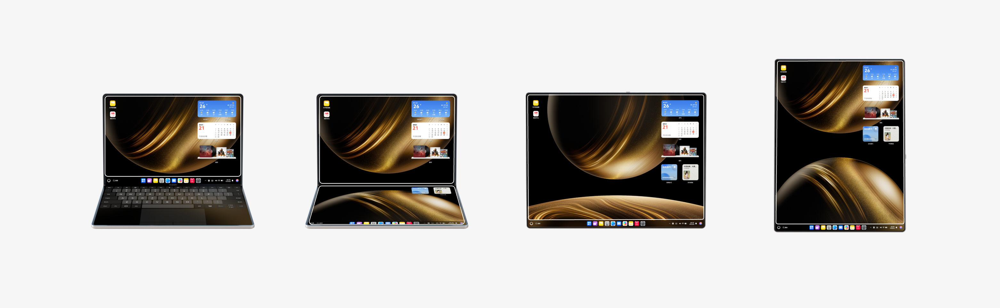

  | API | 说明 |
  | --- | --- |
  | [display.getAllDisplays()](https://developer.huawei.com/consumer/cn/doc/harmonyos-references/js-apis-display#displaygetalldisplays9) | 获取所有的Display对象。不同设备形态下对应的Display区域如上图所示。 |
  | [display.getDisplayByIdSync()](https://developer.huawei.com/consumer/cn/doc/harmonyos-references/js-apis-display#displaygetdisplaybyidsync12) | 根据displayId获取对应的Display对象。具体的displayId可参考[屏幕规格信息](#section05491630111312)表格中屏幕ID行。  除半折叠态（关闭全尺寸键盘）分为上下两屏，上屏displayId为0，下屏displayId为999，其余状态折叠电脑屏幕的displayId均为0。 |
  | [display.getDefaultDisplaySync()](https://developer.huawei.com/consumer/cn/doc/harmonyos-references/js-apis-display#displaygetdefaultdisplaysync9) | 获取当前默认的Display对象。除半折叠态（关闭全尺寸键盘）获取的Display对象为displayId为0的上屏，其余设备形态下获取的Display区域如上图所示。 |
  | [display.getPrimaryDisplaySync()](https://developer.huawei.com/consumer/cn/doc/harmonyos-references/js-apis-display#displaygetprimarydisplaysync14) | 获取主屏信息。对于折叠电脑，当外接屏幕时，获取的是当前主屏幕的Display对象；当没有外接屏幕时，获取的是设备自带屏幕中displayId为0的Display对象。 |
  | [display.on('add'|'remove'|'change')](https://developer.huawei.com/consumer/cn/doc/harmonyos-references/js-apis-display#displayonaddremovechange) | 开启显示设备新增、移除、变化的监听。 |

  

  display.on('add'|'remove'|'change')触发场景如下：
  + display.on('add')：半折叠态（唤起全尺寸键盘）->半折叠态（关闭全尺寸键盘），展开态->半折叠态，外接显示器。
  + display.on('change')：涉及Display变化，包括折叠状态、屏幕方向、可用区域变化等。
  + display.on('remove')：半折叠态（关闭全尺寸键盘）->半折叠态（唤起全尺寸键盘），半折叠态->展开态，取消外接显示器。

###相机硬件信息

折叠电脑相机已预设默认的[镜头安装角度](/docs/dev/app-dev/media/camera-kit/camera-dev-arkts/camera-rotation/camera-rotation-term#相机镜头安装角度)，使用时需结合镜头角度与设备旋转角度进行适配，具体定义可参考[预览旋转角度](/docs/dev/app-dev/media/camera-kit/camera-dev-arkts/camera-rotation/camera-rotation-term#预览旋转角度)。当屏幕方向一致时，前置镜头角度与需设置的预览流旋转角度如下，不同设备状态下的相机参数保持一致。

|  |  |  |  |
| --- | --- | --- | --- |
| 屏幕旋转角度（rotation） | 0(0度) | 1(90度) | 3(270度) |
| 示意图 | 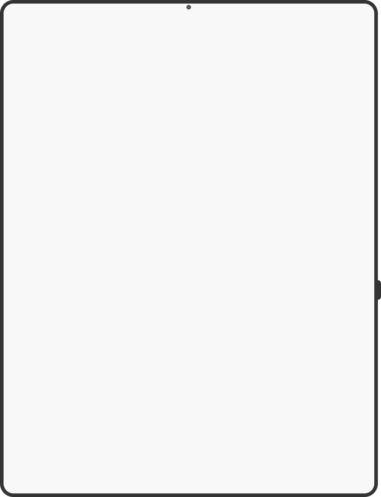    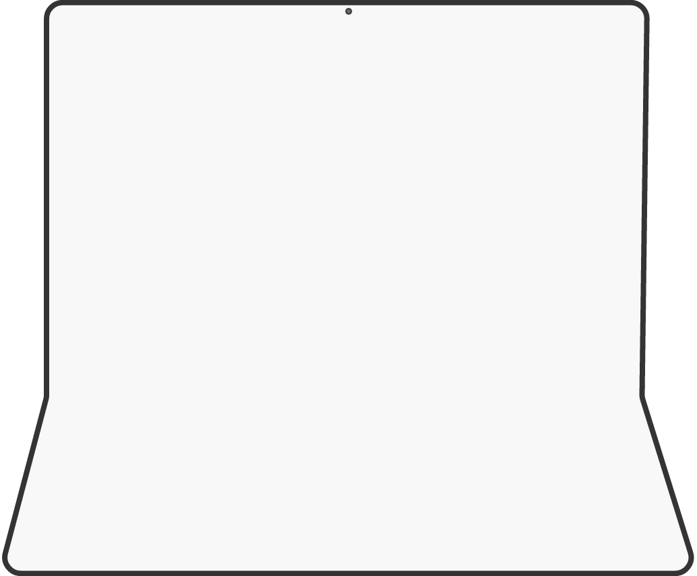 | 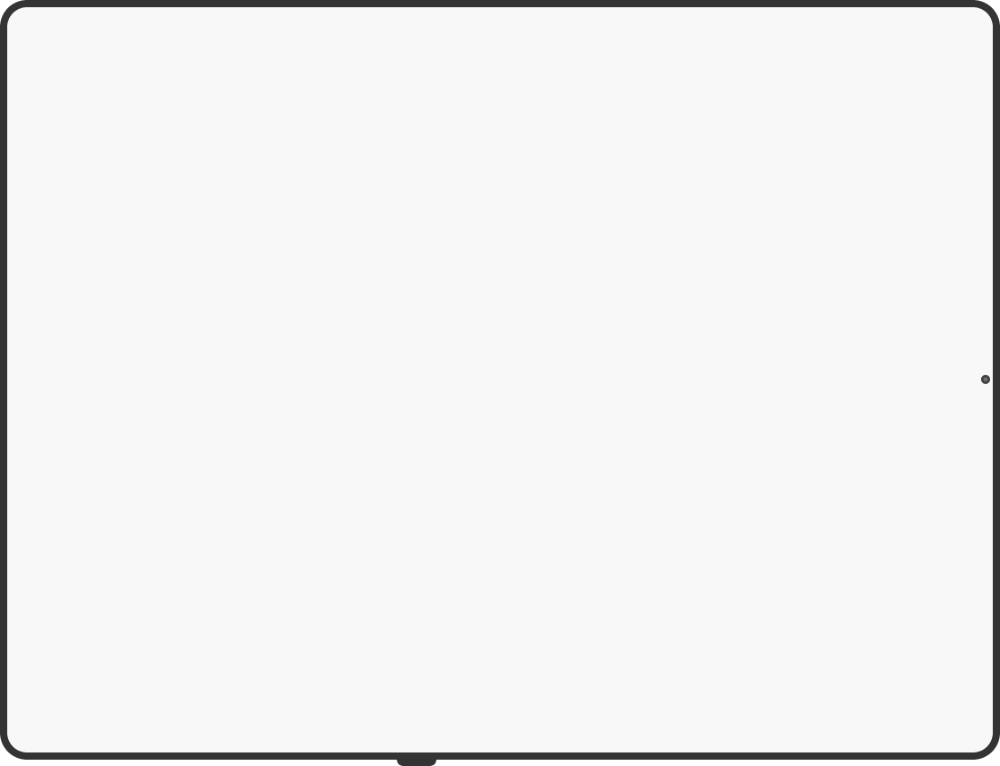 | 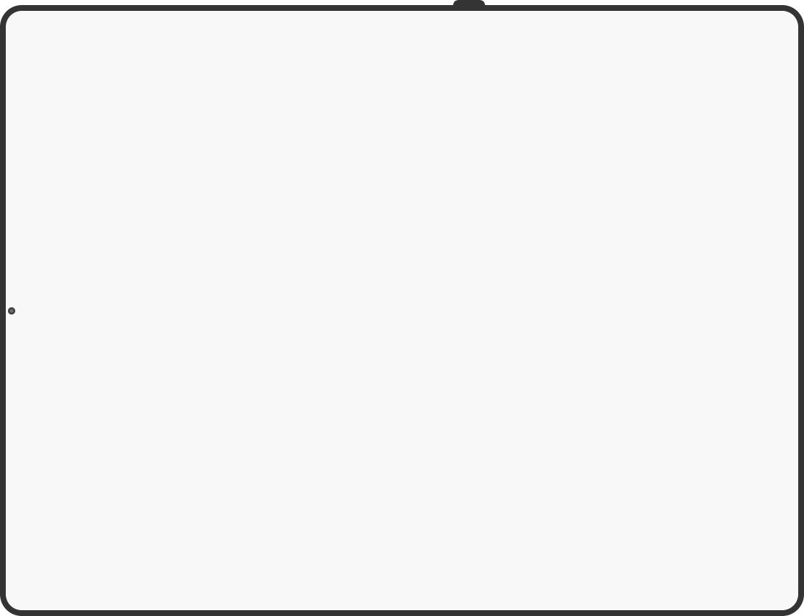 |
| 前置相机镜头角度 | 270° | 270° | 270° |
| 预览旋转角度 | 270°+0°=270° | 270°+90° = 0° | 270°+270° = 180° |
| 后置相机镜头角度 | 无后置相机 | | |

###设备折叠能力

折叠电脑具备独特的折叠功能，在不同折叠状态下展现出不同的特性。

通过[display.isFoldable()](https://developer.huawei.com/consumer/cn/doc/harmonyos-references/js-apis-display#displayisfoldable10)接口可判断设备是否支持折叠，若支持则返回true，否则返回false。通过[display.getFoldStatus()](https://developer.huawei.com/consumer/cn/doc/harmonyos-references/js-apis-display#displaygetfoldstatus10)接口可获取折叠设备当前的折叠状态，返回结果可参考[FoldStatus](https://developer.huawei.com/consumer/cn/doc/harmonyos-references/js-apis-display#foldstatus10)。下表以Matebook Fold产品为例，展示了折叠电脑的折叠状态和属性。

|  |  |  |  |  |  |
| --- | --- | --- | --- | --- | --- |
| 设备形态 | 半折叠态（唤起全尺寸键盘） | 半折叠态（关闭全尺寸键盘） | | 横向展开态 | 竖向展开态 |
| 效果图 | 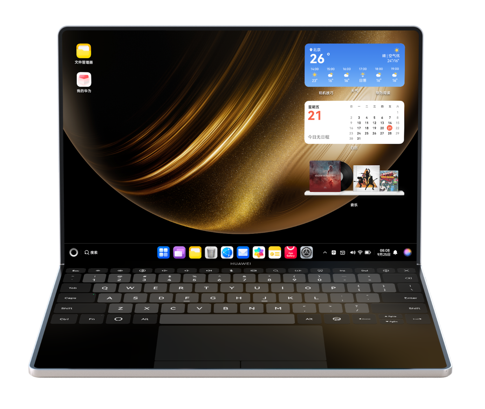 | 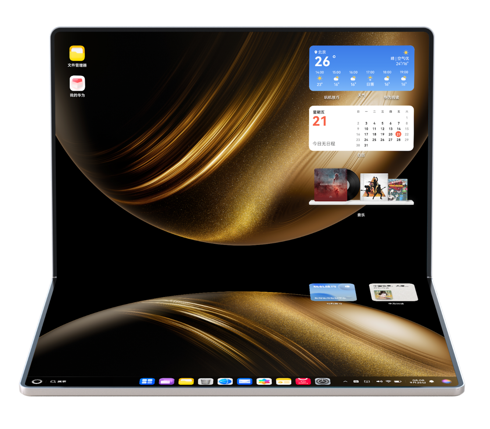 | |  |  |
| isFoldable | true | | | | |
| [FoldStatus](https://developer.huawei.com/consumer/cn/doc/harmonyos-references/js-apis-display#foldstatus10) | FOLD\_STATUS\_HALF\_FOLDED | | | FOLD\_STATUS\_EXPANDED | |
| [FoldCreaseRegion](https://developer.huawei.com/consumer/cn/doc/harmonyos-references/js-apis-display#foldcreaseregion10) | {"left":0,"top":1608,"width":2472,"height":82} | | | | |

设备折叠能力常用接口如下：

* 获取设备折叠状态相关接口

  | API | 说明 |
  | --- | --- |
  | [display.getFoldStatus()](https://developer.huawei.com/consumer/cn/doc/harmonyos-references/js-apis-display#displaygetfoldstatus10) | 主动获取可折叠设备的当前折叠状态。具体折叠状态可参考上表中的FoldStatus行。 |
  | [display.on('foldStatusChange')](https://developer.huawei.com/consumer/cn/doc/harmonyos-references/js-apis-display#displayonfoldstatuschange10) | 开启折叠设备折叠状态变化的监听。当前设备物理折叠状态FoldStatus变化时，触发回调函数，返回折叠设备当前折叠状态。 |
* 获取可用区域相关接口

  | API | 说明 |
  | --- | --- |
  | display.[getAvailableArea()](https://developer.huawei.com/consumer/cn/doc/harmonyos-references/js-apis-display#getavailablearea12) | 获取当前设备屏幕的可用区域，使用Promise异步回调，仅支持电脑设备。 |
  | display.[on('availableAreaChange')](https://developer.huawei.com/consumer/cn/doc/harmonyos-references/js-apis-display#onavailableareachange12) | 开启当前设备屏幕的可用区域监听。当前设备屏幕有可用区域变化时，触发回调函数，返回可用区域，仅支持电脑设备。 |
  | [display.getDisplayByIdSync()](https://developer.huawei.com/consumer/cn/doc/harmonyos-references/js-apis-display#displaygetdisplaybyidsync12) | 返回displayId对应的display对象。其中包含电脑设备上屏幕的可用区域宽度availableWidth和高度availableHeight。display对应的区域可参考[屏幕规格信息](#section05491630111312)中的常用接口部分。 |
* 获取折痕区域相关接口

  | API | 说明 |
  | --- | --- |
  | [display.getCurrentFoldCreaseRegion()](https://developer.huawei.com/consumer/cn/doc/harmonyos-references/js-apis-display#displaygetcurrentfoldcreaseregion10) | 在当前显示模式下获取折叠折痕区域。返回[FoldCreaseRegion](https://developer.huawei.com/consumer/cn/doc/harmonyos-references/js-apis-display#foldcreaseregion10)对象，即设备在当前显示模式下的折叠折痕区域。具体返回数据可参考[设备特有能力](#section1792714518428)表中的FoldCreaseRegion行。 |

## 创新与体验提升

###悬停态适配

悬停态支持设备平稳放置于桌面，实现免手持体验，常用于视频通话、视频播放、拍照、听歌等不需要频繁交互的场景。这种状态下，应用需要对中间折痕区域进行避让，并对上下两个界面进行悬停态布局适配。

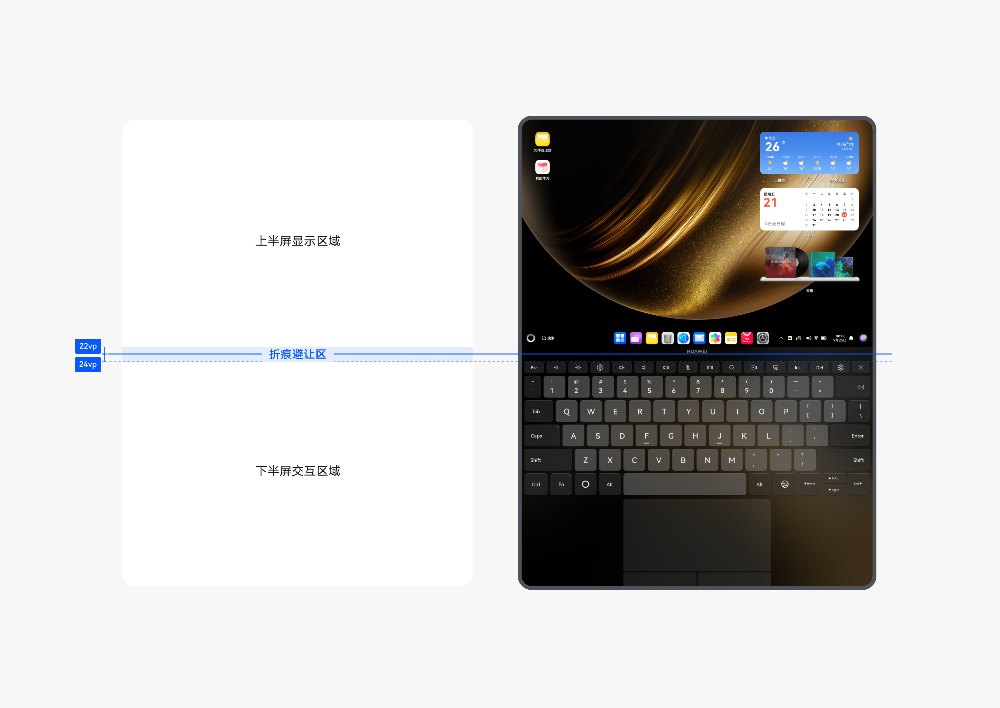

###开合适配

开合连续指应用在屏幕形态与窗口状态切换时，保持页面内容连贯，延续任务进度与运行状态。支持用户快速接续切换前的操作，打造流畅的切换体验。例如折叠电脑在半折叠态和展开态之间切换时，应用页面内容保持不变、状态无缝接续，保障使用体验不受影响。具体实现方案，可参考[开合连续](/docs/dev/app-dev/multi-device/bpta-multi-device-screen-diff#section16541144511135)章节。

###焦点导航

折叠电脑支持唤起全尺寸键盘，也可外接磁吸键盘，应用应支持通过键盘实现焦点导航，并配置获焦视觉效果，清晰指示当前焦点位置，以保证交互体验。开发方案请参考[焦点事件](/docs/dev/app-dev/multi-device/bpta-multi-interaction#section168661941154220)。

###音频焦点适配

折叠电脑上前后台应用需从以下四个方面处理音频焦点问题：[音频焦点抢占流程](https://developer.huawei.com/consumer/cn/doc/best-practices/bpta-audio-focus-management#section1747213761316)，[音频流类型正确配置](https://developer.huawei.com/consumer/cn/doc/best-practices/bpta-audio-focus-management#section2888185819153)，[自定义焦点策略设置](https://developer.huawei.com/consumer/cn/doc/best-practices/bpta-audio-focus-management#section048671914296)，[焦点中断事件正确处理](https://developer.huawei.com/consumer/cn/doc/best-practices/bpta-audio-focus-management#section1664171514332)。

音频焦点的管理机制与其他设备大体相同，主要区别在于系统默认策略不一样，开发者可参考[自定义焦点策略设置](https://developer.huawei.com/consumer/cn/doc/best-practices/bpta-audio-focus-management#section048671914296)查看电脑与其他设备间的差异。

## 设备常见适配问题

###设备类型区分

**如何区分MateBook Pro和MateBook Fold**

* 页面布局类问题：页面布局由窗口形态、窗口宽高、宽高比决定，无需区分具体产品型号或设备类型。例如：MateBook Fold横向展开态布局应与MateBook Pro保持一致；MateBook Fold其余状态对应lg横向断点，布局需与平板保持一致。因此布局适配只需判断断点、实现响应式布局即可，详情可参考[断点](/docs/dev/app-dev/multi-device/bpta-multi-device-responsive-layout#section1532120147301)的使用。
* 非页面布局或功能类问题：MateBook Pro与 MateBook Fold的设备类型[deviceType](https://developer.huawei.com/consumer/cn/doc/harmonyos-references/js-apis-device-info#常量)均为2in1。因此，需要通过[isFoldable()](https://developer.huawei.com/consumer/cn/doc/harmonyos-references/js-apis-display#displayisfoldable10)判断是否为可折叠设备，MateBook Fold返回true，MateBook Pro返回false。

###页面异常

**折叠状态变化导致页面异常**

问题描述：当折叠电脑的折叠状态发生变化时，应用的页面布局出现异常。

可能原因：设备折叠状态发生变化时，窗口尺寸会同步改变。若应用未针对不同窗口尺寸适配页面布局，可能出现布局异常的问题。

解决措施：折叠电脑不同窗口尺寸的页面布局适配思路如下：

1. 使用[自适应布局](/docs/dev/app-dev/multi-device/bpta-multi-device-adaptive-layout)或百分比大小实现页面布局，当窗口尺寸发生变化时，可自适应调整宽高；
2. 结合业务场景，通过[constraintSize](https://developer.huawei.com/consumer/cn/doc/harmonyos-references/ts-universal-attributes-size#constraintsize)约束组件最小宽高，避免内容被截断；
3. 设置自由窗口的最小宽高，防止窗口过小导致界面异常。

###窗口适配

**如何实现跨屏幕移动窗口**

问题描述：折叠电脑在半折叠状态（关闭全尺寸键盘）下，上下两块屏幕均可独立操作。如果想将位于下屏的应用跨屏移动到上屏，应该如何操作？

解决措施：使用[moveWindowToGlobal()](https://developer.huawei.com/consumer/cn/doc/harmonyos-references/arkts-apis-window-window#movewindowtoglobal15)接口实现跨屏幕移动窗口，将窗口从下屏移动至上屏。详情可参考[窗口模式](#section8155133712178)章节。

**窗口变化时，应用对可用区域变化感知不及时**

问题描述：应用无法感知可用区域变化或感知存在延迟，直接调用moveTo()、resize()调整窗口大小或位置，导致窗口大小或位置异常。

解决措施：使用以下三种方法均可解决该问题：

* 调用[display.getDisplayByIdSync()](https://developer.huawei.com/consumer/cn/doc/harmonyos-references/js-apis-display#displaygetdisplaybyidsync12)，根据displayId主动获取对应可用区域的[display](https://developer.huawei.com/consumer/cn/doc/harmonyos-references/js-apis-display#display)对象。
* 调用[display.getAvailableArea()](https://developer.huawei.com/consumer/cn/doc/harmonyos-references/js-apis-display#getavailablearea12)，主动获取当前设备屏幕的可用区域。
* 注册[on('availableAreaChange')](https://developer.huawei.com/consumer/cn/doc/harmonyos-references/js-apis-display#onavailableareachange12)监听，实时监听设备屏幕可用区域的变化。

###相机开发

**相机预览画面旋转异常**

问题描述：折叠电脑屏幕旋转后，相机预览画面显示异常。

可能原因：屏幕旋转后，相机预览流未适配旋转后的预览角度，导致预览画面未同步更新。

解决措施：折叠电脑在不同设备形态下，屏幕状态存在差异，因此相机预览输出的原始图像需调整对应旋转角度，保证画面方向正确。（预览旋转角度 = 镜头安装角度 + 屏幕显示补偿角度，其中屏幕显示补偿角度与屏幕旋转角度一致；如需获取镜头安装角度，可参考：[getSupportedCameras()](https://developer.huawei.com/consumer/cn/doc/harmonyos-references/arkts-apis-camera-cameramanager#getsupportedcameras)）

* 相机预览旋转角度与屏幕显示旋转角度（[Display](https://developer.huawei.com/consumer/cn/doc/harmonyos-references/js-apis-display#属性).rotation）相关，适配步骤如下：
  1. 调用session.[commitConfig()](https://developer.huawei.com/consumer/cn/doc/harmonyos-references/arkts-apis-camera-session#commitconfig11)完成配流。
  2. 通过[display.getDefaultDisplaySync()](https://developer.huawei.com/consumer/cn/doc/harmonyos-references/js-apis-display#displaygetdefaultdisplaysync9)接口获取[Display](https://developer.huawei.com/consumer/cn/doc/harmonyos-references/js-apis-display#属性)对象并读取其rotation属性值，获得显示设备的屏幕旋转角度。
  3. 并根据[相机镜头安装角度](/docs/dev/app-dev/media/camera-kit/camera-dev-arkts/camera-rotation/camera-rotation-term#相机镜头安装角度)+[屏幕显示旋转角度](/docs/dev/app-dev/media/camera-kit/camera-dev-arkts/camera-rotation/camera-rotation-term#屏幕旋转角度)的值计算[预览旋转角度](/docs/dev/app-dev/media/camera-kit/camera-dev-arkts/camera-rotation/camera-rotation-term#预览旋转角度)，可参考[相机硬件信息](#section9425185473318)确认对应数值。
  4. 再调用[setPreviewRotation()](https://developer.huawei.com/consumer/cn/doc/harmonyos-references/arkts-apis-camera-previewoutput#setpreviewrotation12)接口，设置图像的预览旋转角度。

  具体开发指导可参考适配相机旋转角度-[预览](/docs/dev/app-dev/media/camera-kit/camera-dev-arkts/camera-rotation/camera-rotation-angle-adaptation#预览)。
* 若三方应用对接预览流进行二次处理，导致无法直接使用系统的现有能力，将镜头安装角度补充到预览旋转角度中，可通过如下两种方案解决：
  + 若应用不需要非镜像成像，建议应用在预览流二次处理后，直接套用系统现有的角度计算方法，自行补偿相机镜头安装角度进行适配。
  + 若应用需要非镜像成像，建议应用在预览流二次处理后，自主实现角度计算逻辑进行适配。（非镜像成像场景下，自主适配的性能大大优于补偿相机镜头安装角度的方法）
