# 三折叠应用开发

## 概述

华为推出的“三折叠”旗舰折叠手机，拥有三块可联动显示的屏幕，且三块屏幕均可折叠。相对于直板机，三折叠设备有以下明显特点：

* 设备屏幕尺寸可变，具有不同大小和形态的UX界面。常见的三种使用状态分别为：单屏态（F态）、双屏态（M态）和三屏态（G态）。
* 具有特殊的折叠状态和交互事件。三折叠具备折叠的能力，共有9种折叠状态，具体描述可以参考[设备折叠能力](#section15762231134610)章节。
* 不同折叠状态下，可用的相机，相机的位置会发生变化。

三折叠主要产品为Mate XT系列，产品示意图如下。

| 产品名称 | 示意图 |
| --- | --- |
| **Mate XT系列** | 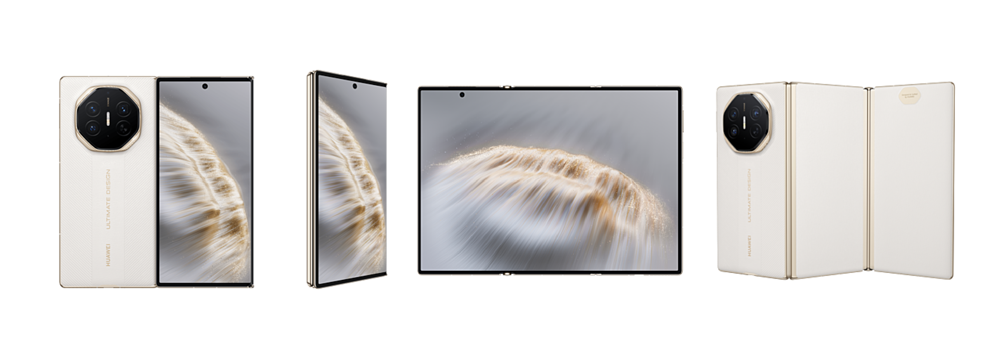 |

本文聚焦于三折叠应用的体验提升开发指导。如需多设备开发的基础通用能力指导，请参考“[一次开发，多端部署概览](https://developer.huawei.com/consumer/cn/doc/best-practices/bpta-multi-device-overview)”系列文章。

## 产品硬件说明

本章以Mate XTs产品为例，介绍三折叠的屏幕方向、屏幕尺寸以及相机硬件参数等信息。

###屏幕规格信息

以下是三折叠在单屏态、双屏态和三屏态下的屏幕方向和屏幕尺寸等参数信息。

**单屏态屏幕规格信息**

|  |  |  |  |  |
| --- | --- | --- | --- | --- |
| 屏幕旋转角度(rotation) | 0(0度) | 1(90度) | 2(180度) | 3(270度) |
| 单屏态示意图 | 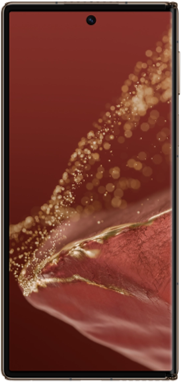 | 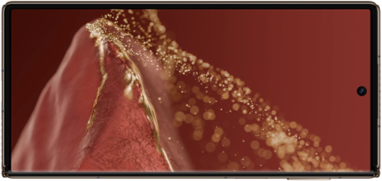 | 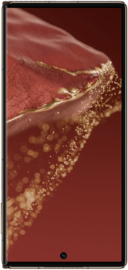 | 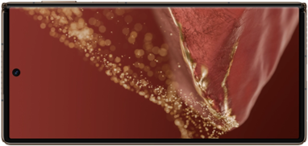 |
| 屏幕方向([Orientation](https://developer.huawei.com/consumer/cn/doc/harmonyos-references/js-apis-display#orientation10)) | 竖屏PORTRAIT | 横屏LANDSCAPE | 反向竖屏PORTRAIT\_INVERTED | 反向横屏LANDSCAPE\_INVERTED |
| 屏幕ID | 0 | 0 | 0 | 0 |
| 分辨率(vp)(向下取整) | 350\*776 | 776\*350 | 350\*776 | 776\*350 |
| 分辨率(px**)(宽\*高**) | 1008\*2232 | 2232\*1008 | 1008\*2232 | 2232\*1008 |
| 横纵断点 | 横向断点sm，纵向断点lg | 横向断点md，纵向断点sm | 横向断点sm，纵向断点lg | 横向断点md，纵向断点sm |

**双屏态屏幕规格信息**

|  |  |  |  |  |
| --- | --- | --- | --- | --- |
| 屏幕旋转角度(rotation) | 0(0度) | 1(90度) | 2(180度) | 3(270度) |
| 双屏态示意图 | 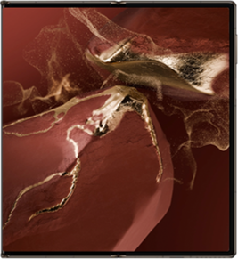 | 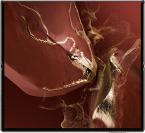 | 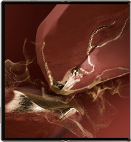 | 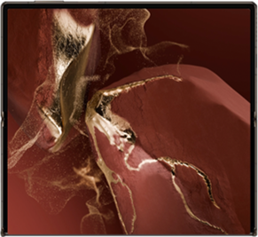 |
| 屏幕方向([Orientation](https://developer.huawei.com/consumer/cn/doc/harmonyos-references/js-apis-display#orientation10)) | 竖屏PORTRAIT | 横屏LANDSCAPE | 反向竖屏PORTRAIT\_INVERTED | 反向横屏LANDSCAPE\_INVERTED |
| 屏幕ID | 0 | 0 | 0 | 0 |
| 分辨率(vp)(向下取整) | 712\*776 | 776\*712 | 712\*776 | 776\*712 |
| 分辨率(px**)(宽\*高**) | 2048\*2232 | 2232\*2048 | 2048\*2232 | 2232\*2048 |
| 横纵断点 | 横向断点md，纵向断点md | 横向断点md，纵向断点md | 横向断点md，纵向断点md | 横向断点md，纵向断点md |

**三屏态屏幕规格信息**

|  |  |  |  |  |
| --- | --- | --- | --- | --- |
| 屏幕旋转角度(rotation) | 0(0度) | 1(90度) | 2(180度) | 3(270度) |
| 三屏态示意图 | 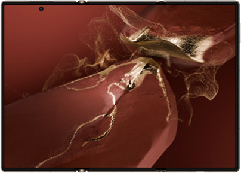 | 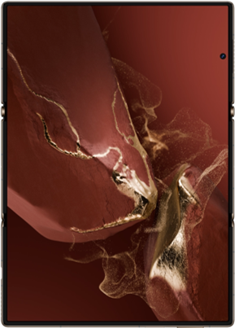 | 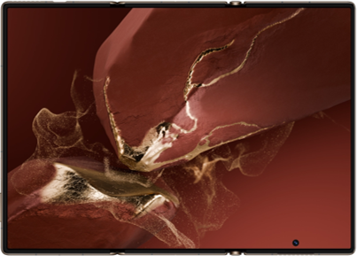 | 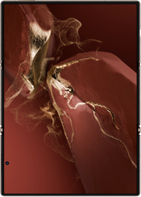 |
| 屏幕方向([Orientation](https://developer.huawei.com/consumer/cn/doc/harmonyos-references/js-apis-display#orientation10)) | 反向横屏LANDSCAPE\_INVERTED | 竖屏PORTRAIT | 横屏LANDSCAPE | 反向竖屏PORTRAIT\_INVERTED |
| 屏幕ID | 0 | 0 | 0 | 0 |
| 分辨率(vp)(向下取整) | 1107\*776 | 776\*1107 | 1107\*776 | 776\*1107 |
| 分辨率(px**)(宽\*高**) | 3184\*2232 | 2232\*3184 | 3184\*2232 | 2232\*3184 |
| 横纵断点 | 横向断点lg，纵向断点sm | 横向断点md，纵向断点lg | 横向断点lg，纵向断点sm | 横向断点md，纵向断点lg |

###相机硬件信息

相机有默认的[相机镜头安装角度](https://developer.huawei.com/consumer/cn/doc/harmonyos-guides/camera-rotation-term#相机镜头安装角度)，使用时需结合镜头角度与设备旋转角度综合考量，具体定义可参考[预览旋转角度](https://developer.huawei.com/consumer/cn/doc/harmonyos-guides/camera-rotation-term#预览旋转角度)。

**单屏态相机硬件信息**

三折叠单屏态配置前置相机和后置相机，前置和后置相机镜头安装角度以及需要设置的预览流旋转角度如下。

|  |  |  |  |  |
| --- | --- | --- | --- | --- |
| 屏幕旋转角度(rotation) | 0(0度) | 1(90度) | 2(180度) | 3(270度) |
| 单屏态示意图 | 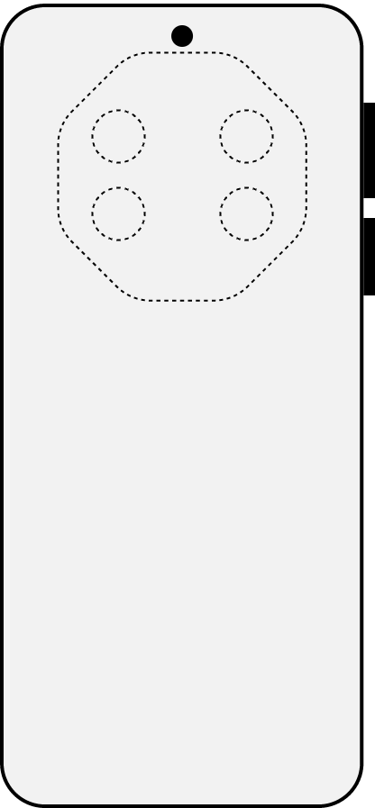 | 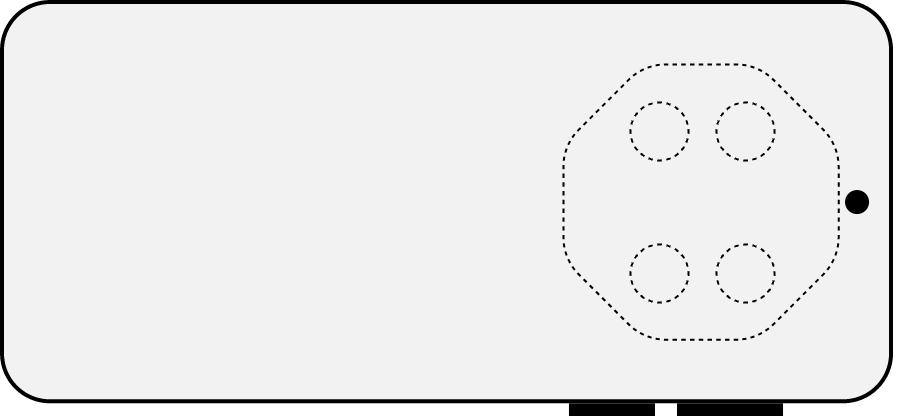 | 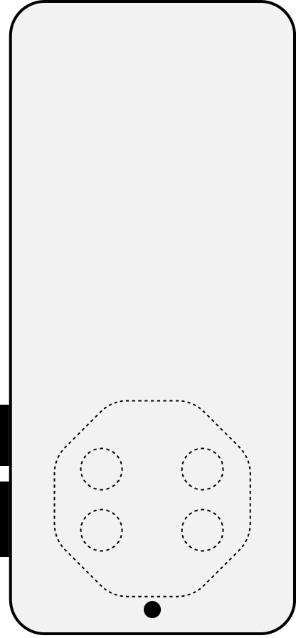 | 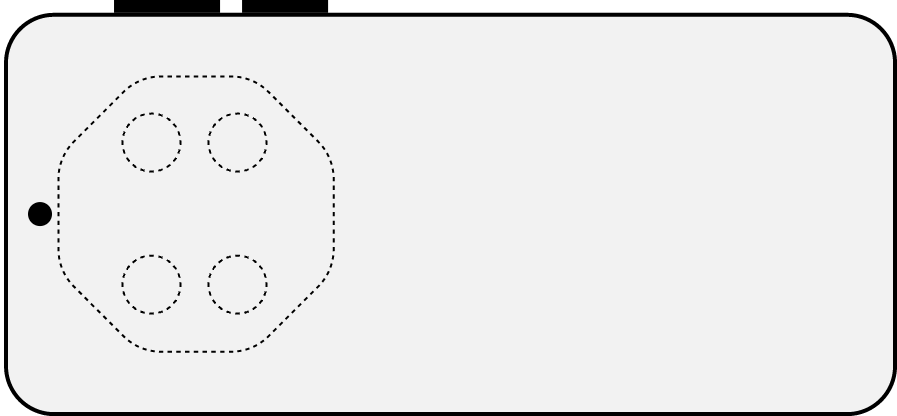 |
| 后置相机镜头角度 | 90度 | 90度 | 90度 | 90度 |
| 后置相机拍摄预览流旋转角度 | 90度 | 180度 | 270度 | 0度 |
| 前置相机镜头角度 | 270度 | 270度 | 270度 | 270度 |
| 前置相机拍摄预览流旋转角度 | 270度 | 0度 | 90度 | 180度 |

**双屏态****相机硬件信息**

三折叠双屏态后置相机镜头安装角度以及需要设置的预览流旋转角度如下。

|  |  |  |  |  |
| --- | --- | --- | --- | --- |
| 屏幕旋转角度(rotation) | 0(0度) | 1(90度) | 2(180度) | 3(270度) |
| 双屏态示意图 | 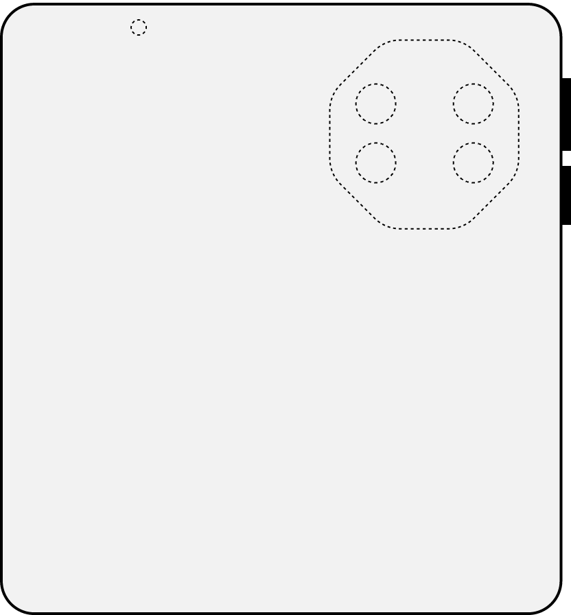 | 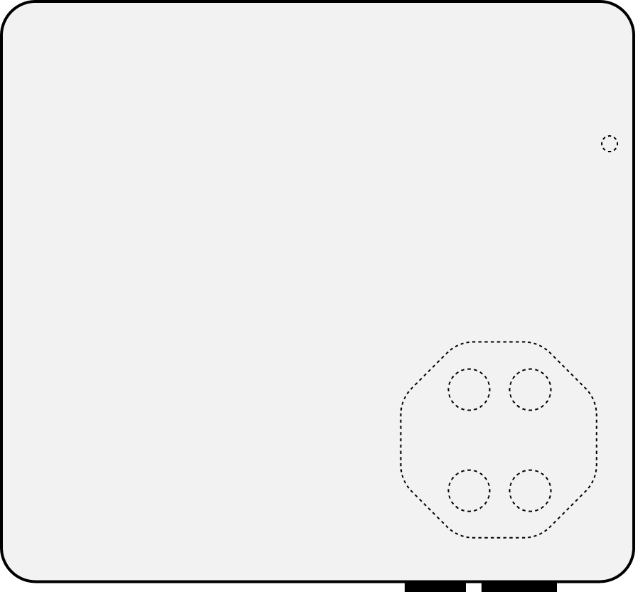 | 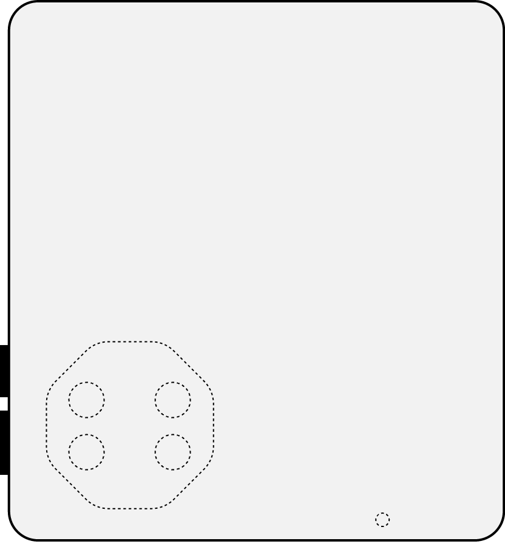 | 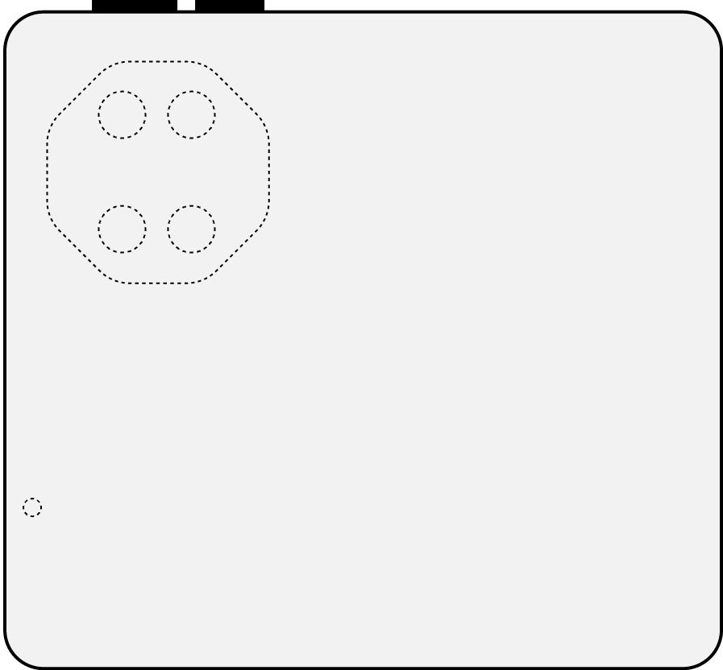 |
| 后置相机镜头角度 | 90度 | 90度 | 90度 | 90度 |
| 后置相机拍摄预览流旋转角度 | 90度 | 180度 | 270度 | 0度 |
| 前置相机镜头角度 | 270度 | 270度 | 270度 | 270度 |
| 前置相机拍摄预览流旋转角度 | 270度 | 0度 | 90度 | 180度 |

三折叠设备处于双屏态时，前置相机功能可用，但由于设备开合角度和用户位置的限制，成像效果或使用体验可能不理想，因此不推荐在双屏态下使用前置相机。

**三屏态****相机硬件信息**

三折叠三屏配置前置相机和后置相机，前置和后置相机镜头安装角度以及需要设置的预览流旋转角度如下。

|  |  |  |  |  |
| --- | --- | --- | --- | --- |
| 屏幕旋转角度(rotation) | 0(0度) | 1(90度) | 2(180度) | 3(270度) |
| 三屏态示意图 | 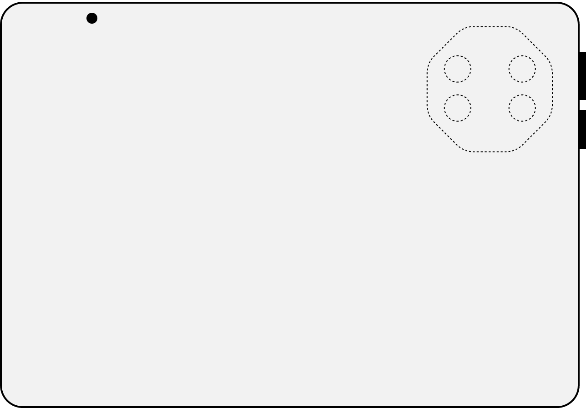 | 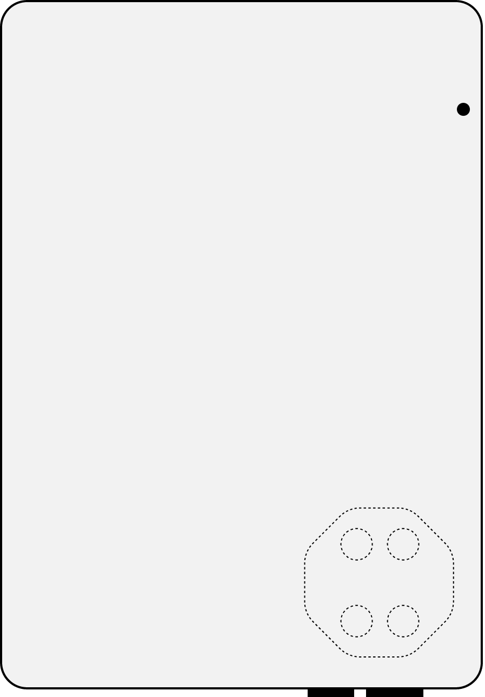 | 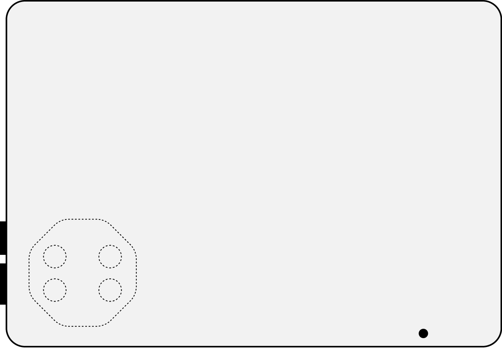 | 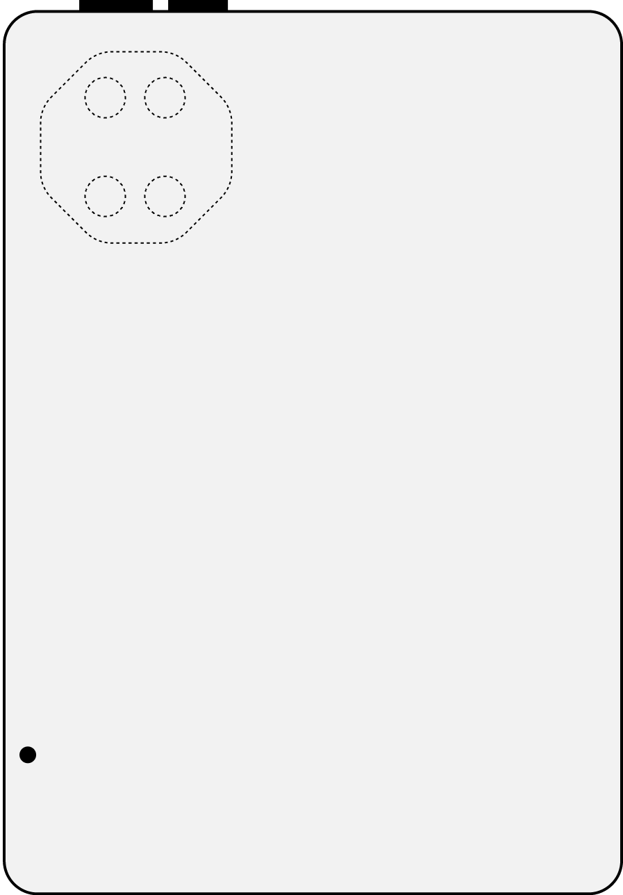 |
| 后置相机镜头角度 | 90度 | 90度 | 90度 | 90度 |
| 后置相机拍摄预览流旋转角度 | 90度 | 180度 | 270度 | 0度 |
| 前置相机镜头角度 | 270度 | 270度 | 270度 | 270度 |
| 前置相机拍摄预览流旋转角度 | 270度 | 0度 | 90度 | 180度 |

###设备折叠能力

三折叠屏拥有9种折叠状态，在不同折叠状态下展现出不同的特性；可将其理解为左右两块双折叠屏组合而成，左右两块折叠屏各自包含3种折叠状态（折叠态/展开态/半折态），整体即为3×3=9种折叠状态。

通过[display.getFoldStatus()](https://developer.huawei.com/consumer/cn/doc/harmonyos-references/js-apis-display#displaygetfoldstatus10)接口可获取折叠设备当前的折叠状态，返回结果可参考[FoldStatus](https://developer.huawei.com/consumer/cn/doc/harmonyos-references/js-apis-display#foldstatus10)。通过[display.getFoldDisplayMode()](https://developer.huawei.com/consumer/cn/doc/harmonyos-references/js-apis-display#displaygetfolddisplaymode10)接口可获取折叠设备当前的折叠状态，返回结果可参考[FoldDisplayMode](https://developer.huawei.com/consumer/cn/doc/harmonyos-references/js-apis-display#folddisplaymode10)。下表以Mate XTs产品为例，展示了三折叠的折叠状态和属性。

| [FoldStatus](https://developer.huawei.com/consumer/cn/doc/harmonyos-references/js-apis-display#foldstatus10) | [FoldDisplayMode](https://developer.huawei.com/consumer/cn/doc/harmonyos-references/js-apis-display#folddisplaymode10) | 效果图 |
| --- | --- | --- |
| FOLD\_STATUS\_EXPANDED | FOLD\_DISPLAY\_MODE\_FULL | 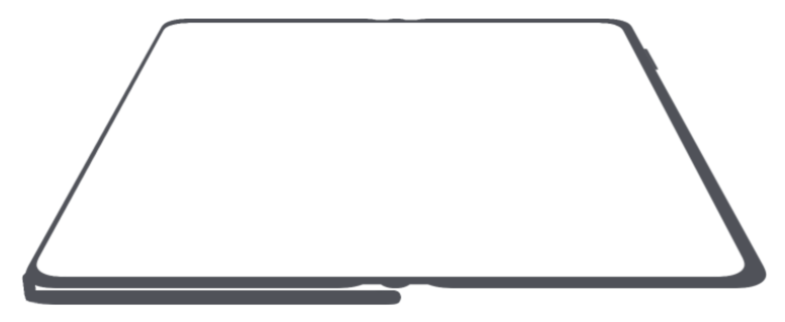 |
| FOLD\_STATUS\_FOLDED | FOLD\_DISPLAY\_MODE\_MAIN | 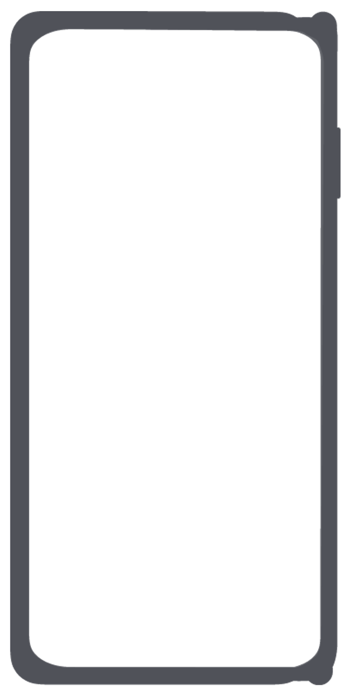 |
| FOLD\_STATUS\_HALF\_FOLDED | FOLD\_DISPLAY\_MODE\_FULL | 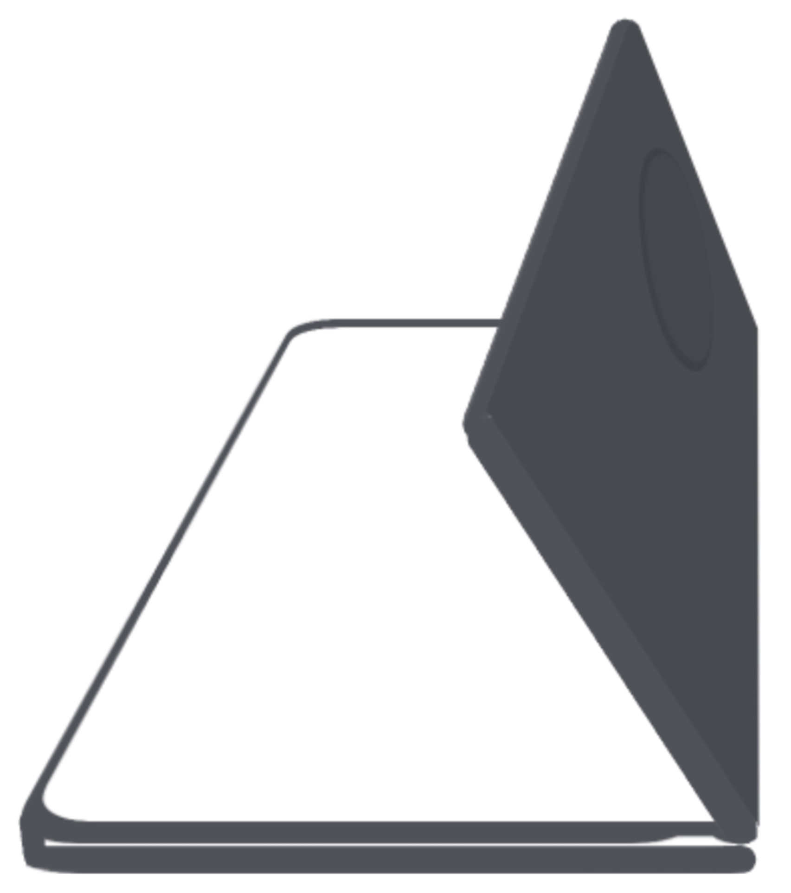 |
| FOLD\_STATUS\_EXPANDED\_WITH\_SECOND\_EXPANDED | FOLD\_DISPLAY\_MODE\_FULL | 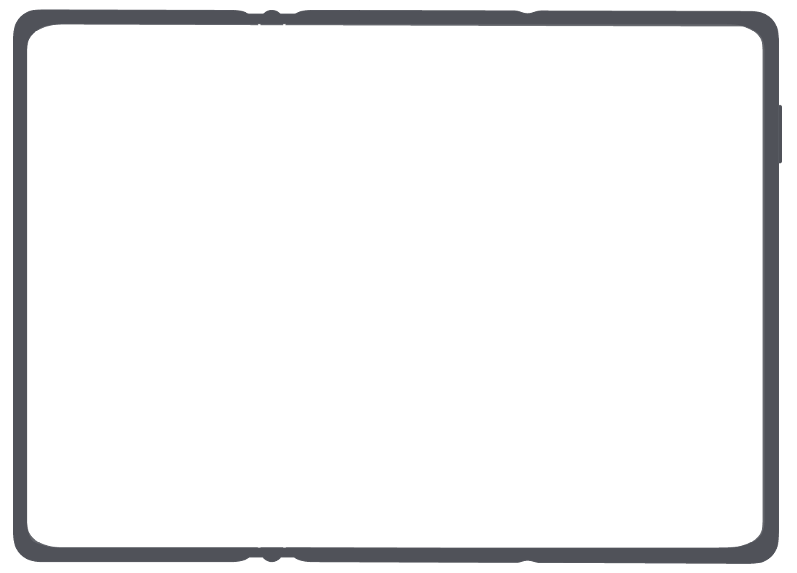 |
| FOLD\_STATUS\_EXPANDED\_WITH\_SECOND\_HALF\_FOLDED | FOLD\_DISPLAY\_MODE\_FULL | 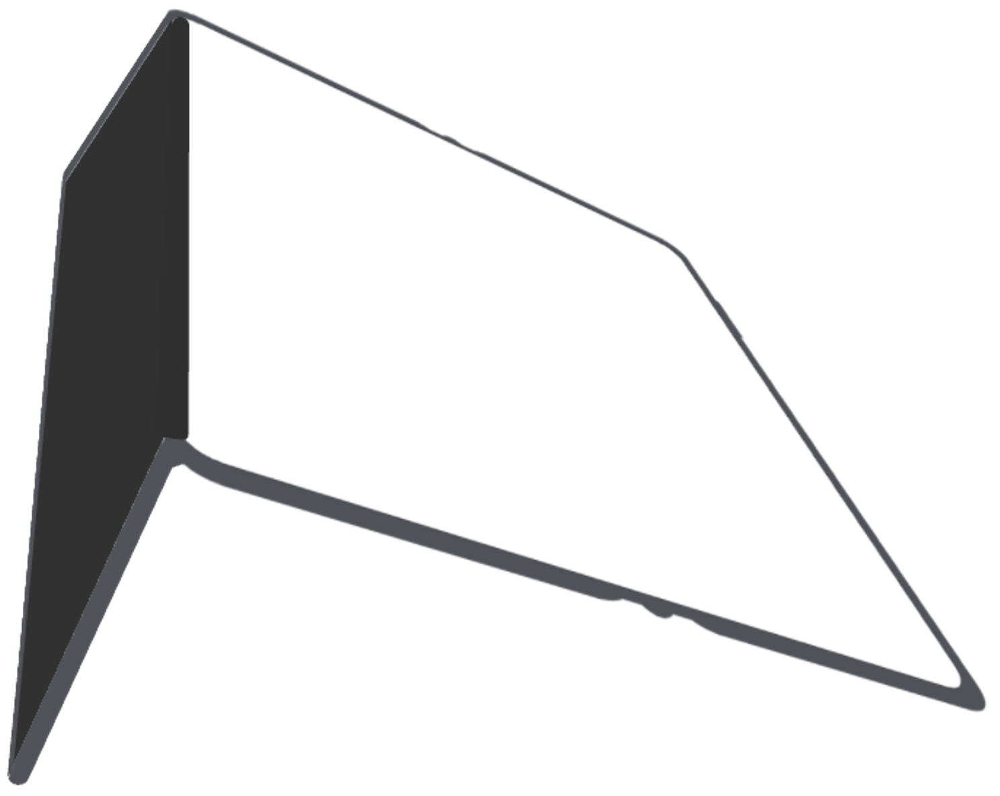 |
| FOLD\_STATUS\_FOLDED\_WITH\_SECOND\_EXPANDED | FOLD\_DISPLAY\_MODE\_MAIN | 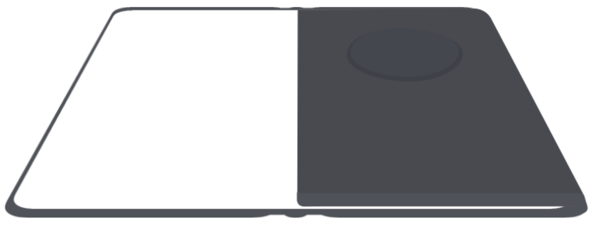 |
| FOLD\_STATUS\_FOLDED\_WITH\_SECOND\_HALF\_FOLDED | FOLD\_DISPLAY\_MODE\_MAIN | 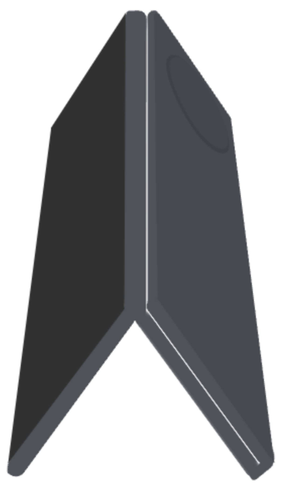 |
| FOLD\_STATUS\_HALF\_FOLDED\_WITH\_SECOND\_EXPANDED | FOLD\_DISPLAY\_MODE\_FULL | 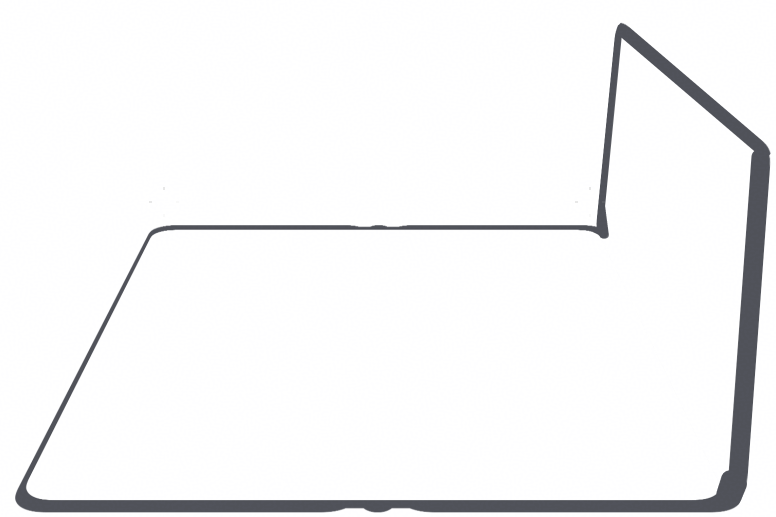 |
| FOLD\_STATUS\_HALF\_FOLDED\_WITH\_SECOND\_HALF\_FOLDED | FOLD\_DISPLAY\_MODE\_FULL | 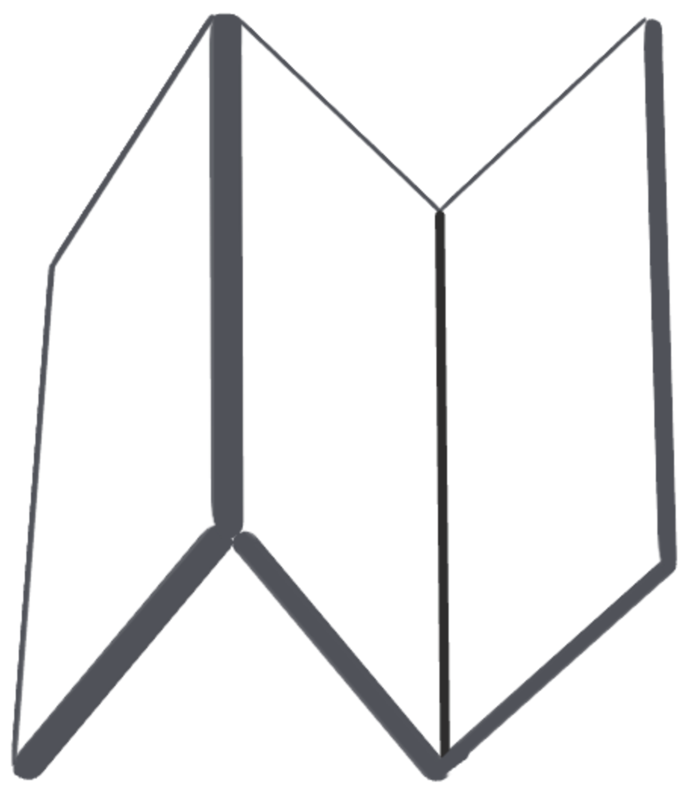 |

* 布局适配应优先基于响应式断点，而非设备折叠状态。统一通过横纵向[断点](https://developer.huawei.com/consumer/cn/doc/best-practices/bpta-multi-device-responsive-layout#section1532120147301)判断页面布局，确保在不同屏幕状态下实现一致的响应式表现。切勿直接以设备折叠状态作为布局判断依据，避免因设备差异导致显示异常（如Pura X的FOLD\_STATUS\_EXPANDED状态对应的是展开态，为直板机布局；而三折叠的FOLD\_STATUS\_EXPANDED状态对应的是双屏态，应为大方形屏布局）。
* 仅悬停态等特殊场景可针对性优化，此类场景可借助折叠状态实现专属布局设计，效果可参考[典型悬停适配案例](https://developer.huawei.com/consumer/cn/doc/design-guides/foldable-0000002352875141#section12307164615117)。

## 创新与体验提升

###交互跟手

三折叠的双屏态和三屏态拥有更宽广的显示视野，信息承载量更大，用户可操作范围也更广。为进一步提升双屏态和三屏态下的使用体验，建议适配系统全新交互能力，通过接入智感握姿、跟手弹窗和跟手半模态等新特性，让用户操作更快捷、高效。

1. **智感握姿**：系统提供感知用户当前握持手信息的能力，应用可依据获取的手部信息，自适应调整核心交互组件的显示位置，有效提升用户单手操作便捷性。

   

   通过订阅握持手状态变化感知事件[motion.on('holdingHandChanged')](https://developer.huawei.com/consumer/cn/doc/harmonyos-references/js-apis-awareness-motion#motiononholdinghandchanged-20)，获取到握持手信息后，更改组件的显示位置。
2. **跟手弹框**：为了减少用户操作路径过长的情况，在双屏态和三屏态可通过跟手弹窗进行展示，弹出框的弹出位置离手更近，以便用户能够快速操作。

   

   构建UI布局时，可通过条件表达式判断：当横向断点为sm时，使用普通居中弹框；否则，使用跟手弹框[PopoverDialog](https://developer.huawei.com/consumer/cn/doc/harmonyos-references/ohos-arkui-advanced-dialog#popoverdialog14)，提升大屏设备的操作效率。
3. **跟手半模态**：在单屏态，半模态窗口通常从屏幕底部弹出；在双屏态，建议窗口居中显示；而在三屏态，可以考虑跟手半模态窗口或者居中半模态窗口显示，具体根据业务需要选择。

   使用[bindSheet](https://developer.huawei.com/consumer/cn/doc/harmonyos-references/ts-universal-attributes-sheet-transition#bindsheet)绑定半模态转场时，设置半模态属性preferType为[SheetType](https://developer.huawei.com/consumer/cn/doc/harmonyos-references/ts-universal-attributes-sheet-transition#sheettype11枚举说明).POPUP。设置该属性后，窗口宽度小于600vp的设备将默认显示底部弹窗，其他设备则自动适配为跟手弹窗。

   

###悬停态适配

三折叠在双屏态下可切换至悬停态。悬停态支持设备平稳放置于桌面，实现免手持体验，常用于视频通话、视频播放、拍照、听歌等不需要频繁交互的场景。这种状态下，应用需要对中间折痕区域进行避让，并对上下两个界面进行悬停态布局适配。悬停态的实现方案可参考[折叠屏悬停态](https://developer.huawei.com/consumer/cn/doc/best-practices/bpta-folded-hover)。

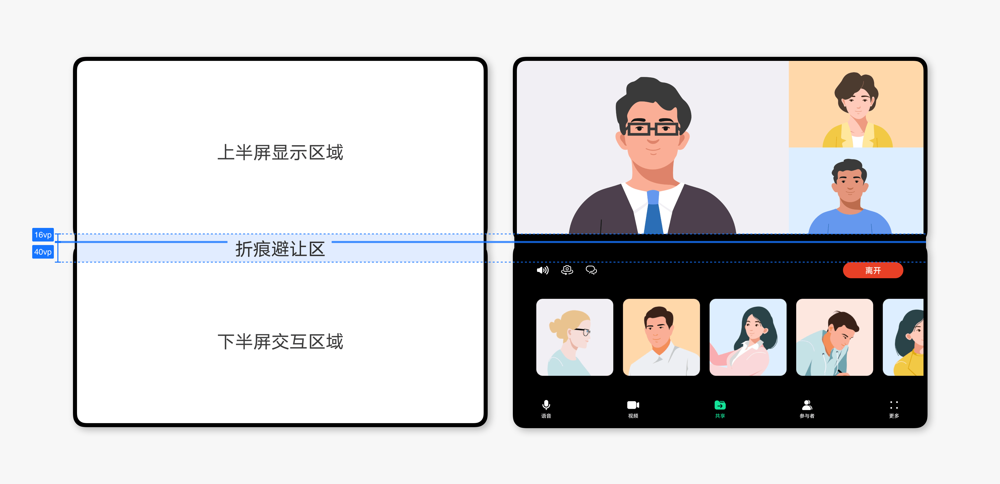

###开合适配

开合连续指应用在屏幕形态与窗口状态切换时，保持页面内容连贯，延续任务进度与运行状态。支持用户快速接续切换前的操作，打造流畅的切换体验。例如三折叠设备在单屏态、双屏态和三屏态之间切换时，应用页面内容保持不变、状态无缝接续，保障使用体验不受影响。具体实现方案，可参考[开合连续](https://developer.huawei.com/consumer/cn/doc/best-practices/bpta-multi-device-screen-diff#section16541144511135)章节。

###悬浮组件

三折叠设备具备单屏、双屏、三屏三种形态，借助[HdsTab](https://developer.huawei.com/consumer/cn/doc/harmonyos-references/ui-design-hdstabs)组件的[barFloatingStyle](https://developer.huawei.com/consumer/cn/doc/harmonyos-references/ui-design-hdstabs#barfloatingstyle)属性实现悬浮导航栏，可适配各类形态切换场景，充分释放屏幕可视区域；通过悬浮材质参数[SystemMaterialParams](https://developer.huawei.com/consumer/cn/doc/harmonyos-references/ui-design-hdstabs#systemmaterialparams)配置透明磨砂材质效果，提升界面通透感，适配沉浸式浏览体验。搭配[HdsTabsMiniBar](https://developer.huawei.com/consumer/cn/doc/harmonyos-references/ui-design-hdstabs#hdstabsminibar)可扩展迷你标签栏，拓展多维度快捷入口，适配双屏态和三屏态的分区操作，同时保障单屏、双屏、三屏形态下交互逻辑统一，降低用户切换成本，有效提升操作效率与使用体验。

###视频自适应沉浸

三折叠设备具备单屏、双屏、三屏三种形态，为避免视频播放画面在形态切换时出现拉伸、裁剪、显示比例错乱等问题，可采用自适应沉浸全屏播放方案，精简界面元素、减少视觉干扰，让用户聚焦视频画面，充分利用大屏开阔视野，有效提升观看体验。具体实现方案，可参考[视频适配不同尺寸屏幕](https://developer.huawei.com/consumer/cn/doc/best-practices/bpta-multi-device-screen-diff#section1452572513130)章节。

###手写笔适配

三折叠的交互方式主要为触控屏，常见的操作有点击、双击、长按、拖拽等，应用可根据这些操作进行功能适配，详情可参考[多设备交互](https://developer.huawei.com/consumer/cn/doc/best-practices/bpta-multi-interaction)。

Mate XTs产品搭载手写笔，支持无感连接与低延迟传输，开盒即用，适用于全局批注、提笔速记及按键遥控等功能场景，实现流畅自然的书写与交互体验。系统提供的[Pen Kit](https://developer.huawei.com/consumer/cn/doc/harmonyos-guides/pen-introduction)能力，可助力开发者灵活接入手写套件、全局取色、一笔成形等接口，提升书写交互的扩展性与创作效率。

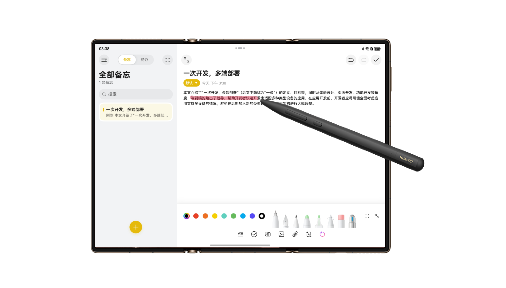

###键鼠适配

除触控屏交互外，三折叠还支持外接键鼠进行交互。以Mate XTs产品为例，键鼠交互事件的适配应包含：

* 鼠标悬浮效果：三折叠设备中，应用内可交互UI组件建议适配鼠标悬浮效果。开发方案请参考[交互归一](https://developer.huawei.com/consumer/cn/doc/best-practices/bpta-multi-interaction#section088812013815)进行适配。
* 键盘快捷键：应用需支持常用快捷键响应，提升用户操作效率。开发方案请参考[交互归一](https://developer.huawei.com/consumer/cn/doc/best-practices/bpta-multi-interaction#section088812013815)进行适配。

外接键盘时，系统默认提供ESC按键事件，若应用未监听ESC事件，则返回上一页。onKeyEvent事件是默认冒泡的，在其回调方法中，若按键事件已完成处理，建议返回true完成事件消费，避免事件继续向上冒泡，造成上层节点重复响应，导致按键事件被触发多次。

###焦点导航

三折叠设备接入键盘与应用程序进行间接交互时，建议将页面中可操作元素设置为可获焦状态，并配置获焦视觉效果，清晰指示当前焦点位置，以保证交互体验。开发方案请参考[焦点事件](https://developer.huawei.com/consumer/cn/doc/best-practices/bpta-multi-interaction#section168661941154220)。

通常情况下，三折叠设备以触控交互为主，可通过[交互归一](https://developer.huawei.com/consumer/cn/doc/best-practices/bpta-multi-interaction#section088812013815)完成基础适配；当外接键鼠时，可额外适配鼠标悬浮效果、键盘快捷键及焦点导航，完善多输入方式的操作体验。

###全景多窗

[全景多窗](https://developer.huawei.com/consumer/cn/doc/harmonyos-guides/multi-window-intro#全景多窗)旨在帮助用户高效处理多个任务。通过全景多窗，用户可以突破物理屏幕局限，在同一屏幕内并行运行多款应用，实现应用间快捷切换，提升操作效率。以Mate XTs产品为例，该产品三屏态横屏状态下拥有更大的显示视野，具备更强的信息展示与内容承载能力。该产品可依托全景多窗能力，充分利用大屏空间优势，最高支持三个窗口同屏并行运行，助力用户一边浏览资讯、一边编辑内容、一边沟通办公，多任务同步处理、互不冲突，实现办公、娱乐、日常操作一站式协同。

## 设备常见适配问题

###截断/留白

**平板布局正常，但是三折叠G态布局异常**

问题描述：应用页面在平板上显示正常，但在三折叠G态下出现图片过大、字体偏大、画面拉伸/压缩、界面留白等布局异常问题。

可能原因：开发者使用“deviceType === tablet”作为lg断点布局的判断条件，仅适配了平板设备，导致三折叠G态无法匹配正确布局，出现显示异常。

解决方案：UX布局应依据窗口尺寸与窗口形状判断，而非物理设备类型。同一套UX布局需在不同设备的相同尺寸窗口下保持一致：三折叠G态与平板布局保持一致，M态与双折叠展开态布局保持一致，F态与直板机布局保持一致。建议使用断点方案替代设备形态接口，实现统一的UX布局判断逻辑，详细说明可参考[断点](https://developer.huawei.com/consumer/cn/doc/best-practices/bpta-multi-device-responsive-layout#section1532120147301)。

三折叠不同折叠状态下展示的页面布局，统一使用一多横向断点进行判断。下列方式不推荐作为判断UX布局的条件：

1. deviceInfo.deviceType：通过设备类型区分UX布局，会导致同一种UX布局无法实现一次开发、多设备适配。
2. display.isFoldable、display.getFoldStatus、display.getFoldDisplayMode等折叠状态接口：该类接口无法区分双折叠、小折叠、阔折叠与三折叠设备，扩展性较差。多数折叠屏开合过程中出现的布局异常，均是直接以折叠状态、折叠显示模式作为布局判断条件所致；不同折叠屏即便处于同一折叠状态，屏幕实际属性差异较大，若共用一套布局易引发显示问题。

**展开态应用启动页面未铺满屏幕，出现异常布局**

问题描述：在折叠屏展开态启动应用时，应用的启动页面未铺满整个屏幕，出现白屏区域或者启动页被截断。

可能原因：应用未配置增强启动页。

解决方案：应用需要[配置增强启动页](https://developer.huawei.com/consumer/cn/doc/harmonyos-guides/launch-page-config#配置增强启动页)，配置后启动页面中的背景、图片和图标等资源能根据窗口大小自适应填充，保证启动页面在不同设备形态上正常显示，配置中各标签的说明可参考[startWindow标签](https://developer.huawei.com/consumer/cn/doc/harmonyos-guides/module-configuration-file#startwindow标签)。

###异常旋转

**三折叠G态仅支持竖屏，无法旋转**

问题描述：三折叠设备在G态下，页面仅支持竖屏展示，无法旋转。

可能原因：开发者通过判断双折叠设备的折叠状态为FoldStatus.FOLD\_STATUS\_EXPANDED（展开态）时开启旋转支持，其余状态默认竖屏；但三折叠G态对应的折叠状态为FoldStatus.FOLD\_STATUS\_EXPANDED\_WITH\_SECOND\_EXPANDED，与双折叠判定逻辑不匹配，因此无法触发旋转，仅能竖屏显示。

解决方案：应用可使用[跟随桌面的旋转策略](https://developer.huawei.com/consumer/cn/doc/best-practices/bpta-multi-device-window-direction#section3434202623320)，通过修改module.json5配置文件中的orientation属性为FOLLOW\_DESKTOP解决该问题。

**折叠开合过程导致屏幕显示方向变化**

问题描述：三折叠设备在默认使用、未主动旋转屏幕的情况下，进行折叠开合操作时，屏幕显示方向会自动发生改变。

可能原因：三折叠设备在不同折叠形态下，即便屏幕旋转角度一致，系统对显示方向的定义也存在差异。

解决方案：开发时需留意三折叠不同折叠状态下默认显示方向的差异，避免因方向判断错误，引发页面布局或功能异常。

| **三折叠折叠状态** | 单屏态(F态) | 双屏态(M态) | 三屏态(G态) |
| --- | --- | --- | --- |
| **效果图(充电口朝下)** | 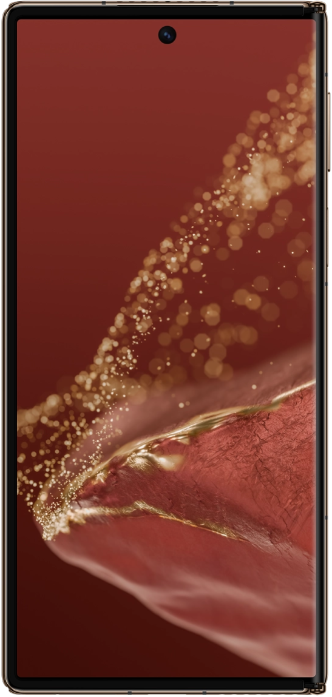 | 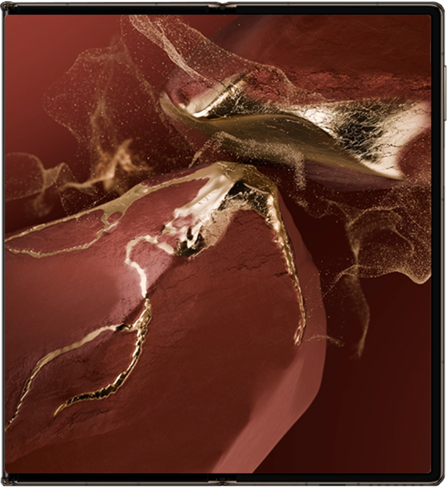 | 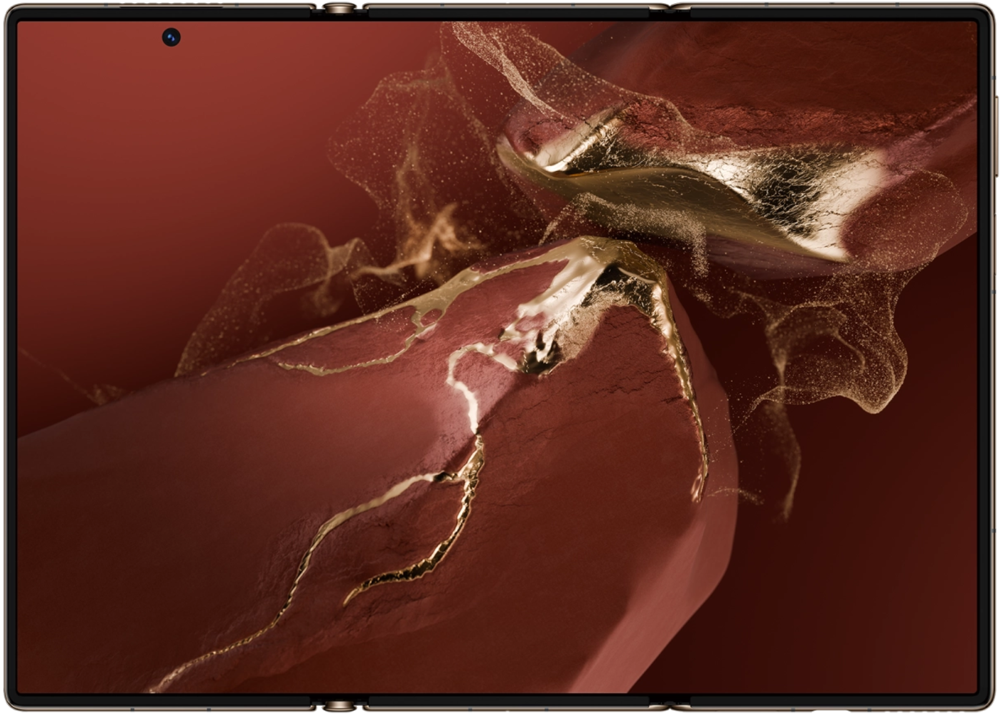 |
| **屏幕旋转角度(rotation)** | 0 | 0 | 0 |
| **屏幕显示方向([Orientation](https://developer.huawei.com/consumer/cn/doc/harmonyos-references/js-apis-display#orientation10))** | PORTRAIT竖屏 | PORTRAIT竖屏 | LANDSCAPE\_INVERTED反向横屏 |
