# 组件布局场景

## 概述

HarmonyOS的ArkUI框架基于声明式UI范式，提供了一套响应式组件体系。该体系通过断点机制与组件的属性绑定对应关系，使开发者能够为不同窗口尺寸区间预定义差异化的布局参数（如columns/span）和样式表现（如字体大小/边距）。当检测到窗口尺寸跨越断点时，触发组件实例的布局重计算和样式切换，实现从手机竖屏到横屏、折叠屏折叠状态切换以及窗口分屏等场景布局转换的实时适配，实现“一次开发，多端部署”的全景体验。

ArkUI框架常用的响应式组件及能够实现的布局场景的对应关系如下表：

| 响应式组件 | 布局场景 | 响应式布局方式 |
| --- | --- | --- |
| List | 重复列表 | 重复布局 |
| WaterFlow | 重复瀑布流 |
| Swiper | 重复轮播视图 |
| Grid | 重复网格 |
| SideBarContainer | 侧边栏 | 分栏布局 |
| Navigation | 单/双栏 |
| Navigation+SideBarContainer | 三分栏 |
| Tabs | 底部/侧边导航 | 挪移布局 |
| GridRow/GridCol | 插图和文字组合 |
| 单列列表 | 缩进布局 |

下文将介绍响应式组件如何在一多适配体系中动态调整属性，以适应不同的显示需求。本文仅介绍响应式组件中常用的属性。

## List

| 属性 | 说明 |
| --- | --- |
| [lanes](https://developer.huawei.com/consumer/cn/doc/harmonyos-references/ts-container-list#lanes9) | 设置不同断点对应list组件布局的列数或行数，及列间距。 |

重复列表布局效果如下图，实现方案和示例代码请参考[列表布局](/docs/dev/app-dev/multi-device/bpta-multi-device-page-layout#section122004555383)。

| 横向断点 | sm | md | lg |
| --- | --- | --- | --- |
| 布局效果 | 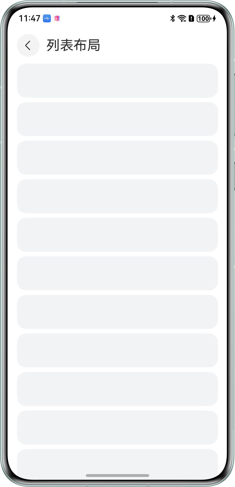 | 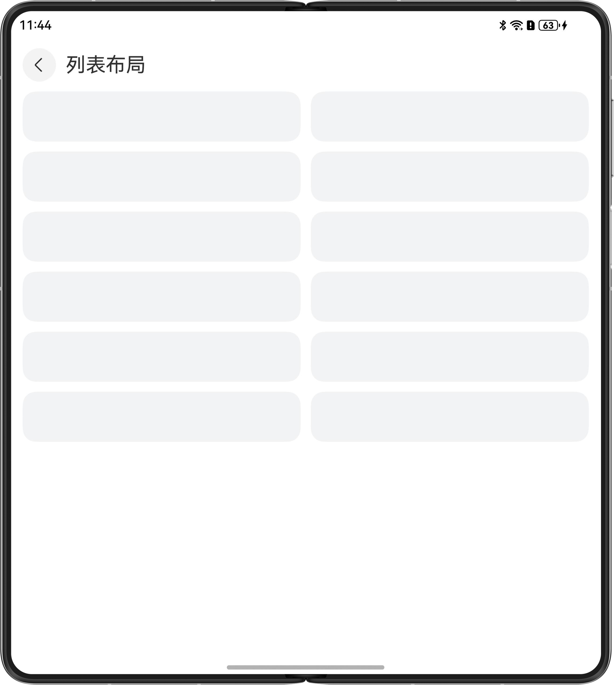 | 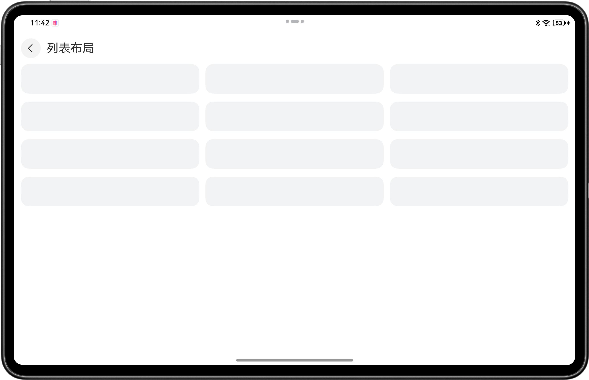 |

## WaterFlow

| 属性 | 说明 |
| --- | --- |
| [WaterFlowLayoutMode](https://developer.huawei.com/consumer/cn/doc/harmonyos-references/ts-container-waterflow#waterflowlayoutmode12枚举说明) | 优先考虑视窗内布局信息或涉及动态切换列数时，建议使用SLIDING\_WINDOW模式，详情请参考[动态切换列数](/docs/dev/app-dev/application-framework/arkui/arkts-ui-development/arkts-list-and-grid/arkts-layout-development-create-waterflow#动态切换列数)。 |
| [columnsTemplate](https://developer.huawei.com/consumer/cn/doc/harmonyos-references/ts-container-waterflow#columnstemplate) | 设置不同断点下瀑布流布局的列数。 |
| [columnsGap](https://developer.huawei.com/consumer/cn/doc/harmonyos-references/ts-container-waterflow#columnsgap) | 设置不同断点下列间距。 |
| [itemConstraintSize](https://developer.huawei.com/consumer/cn/doc/harmonyos-references/ts-container-waterflow#itemconstraintsize) | 设置不同断点下WaterFlow所有子组件的约束尺寸。 |

重复瀑布流布局效果如下图，实现方案和示例代码请参考[瀑布流布局](/docs/dev/app-dev/multi-device/bpta-multi-device-page-layout#section4502451713)。

| 横向断点 | sm | md | lg |
| --- | --- | --- | --- |
| 展示布局 | 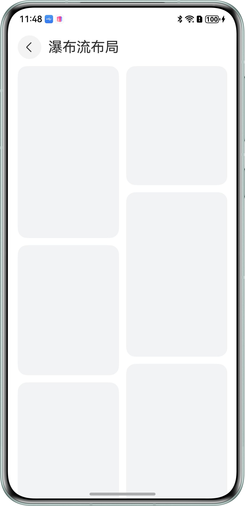 | 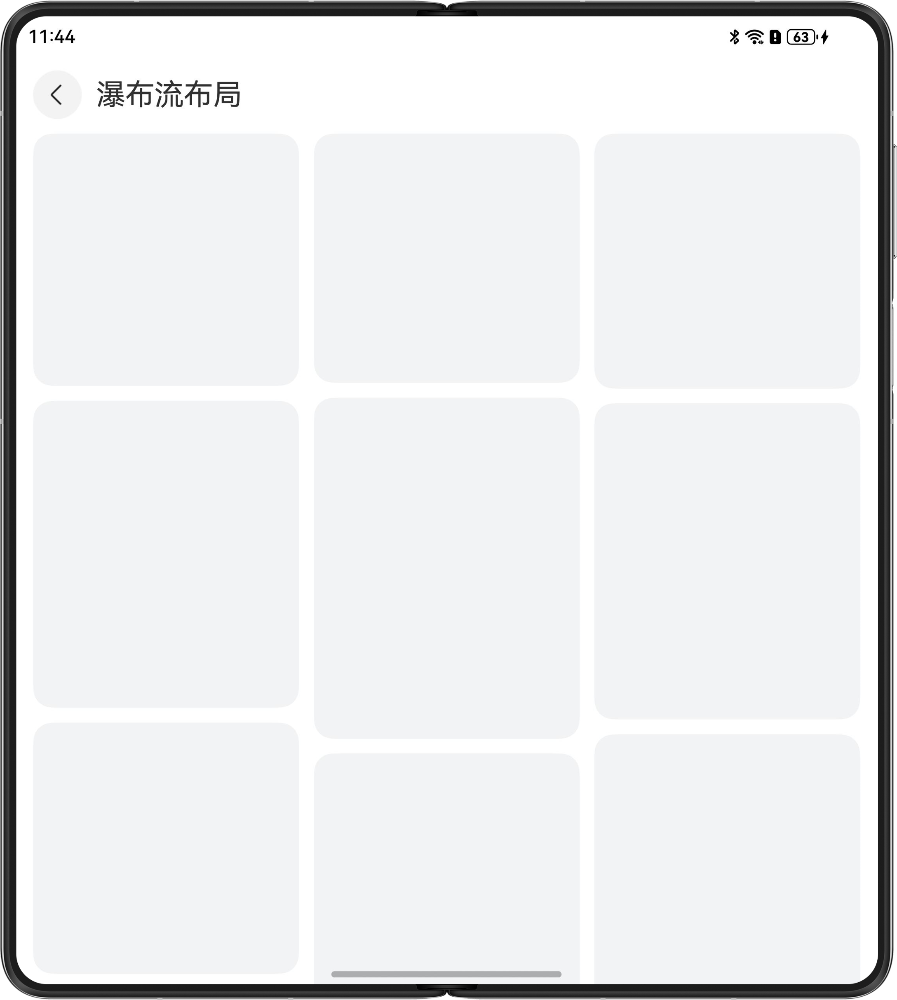 | 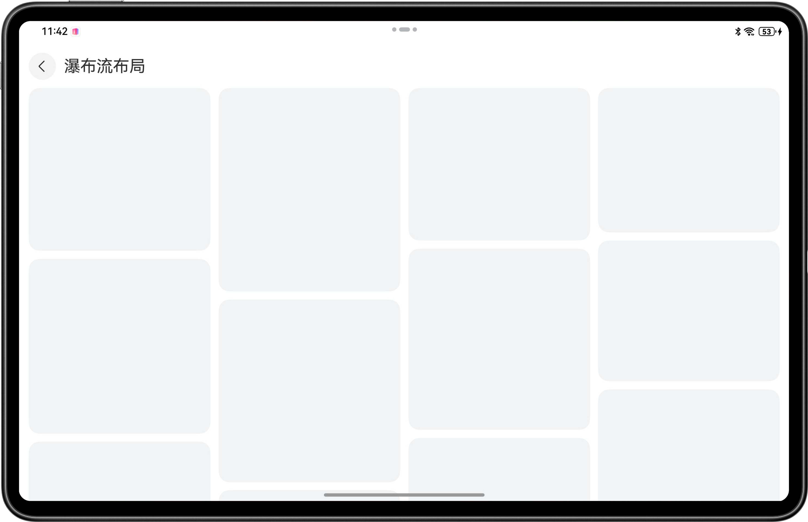 |

## Swiper

| 属性 | 说明 |
| --- | --- |
| [index](https://developer.huawei.com/consumer/cn/doc/harmonyos-references/ts-container-swiper#index) | 设置不同断点下默认展示的子组件索引值。 |
| [indicator](https://developer.huawei.com/consumer/cn/doc/harmonyos-references/ts-container-swiper#indicator) | 设置不同断点下是否显示导航点指示器和不同样式。 |
| [displayCount](https://developer.huawei.com/consumer/cn/doc/harmonyos-references/ts-container-swiper#displaycount8) | 设置不同断点下Swiper视窗内元素显示的个数。 |
| [nextMargin](https://developer.huawei.com/consumer/cn/doc/harmonyos-references/ts-container-swiper#nextmargin10) | 设置不同断点下的后边距，用于露出后一项的一小部分。 |
| [prevMargin](https://developer.huawei.com/consumer/cn/doc/harmonyos-references/ts-container-swiper#prevmargin10) | 设置不同断点下的前边距，用于露出前一项的一小部分。 |
| [onChange()](https://developer.huawei.com/consumer/cn/doc/harmonyos-references/ts-container-swiper#onchange) | 根据不同断点，设置索引值。例如lg横向断点下展示3张图片，即当displayCount=3时，当前显示索引为index的图片组（包含index, index+1, index+2），此时返回最右侧索引应为index+2。 |

重复轮播布局效果如下图，实现方案和示例代码请参考[轮播布局](/docs/dev/app-dev/multi-device/bpta-multi-device-page-layout#section17659141914012)。

| 横向断点 | sm | md | lg |
| --- | --- | --- | --- |
| 展示布局 | 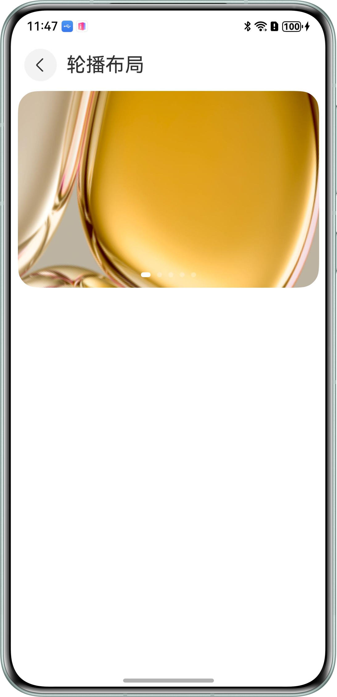 | 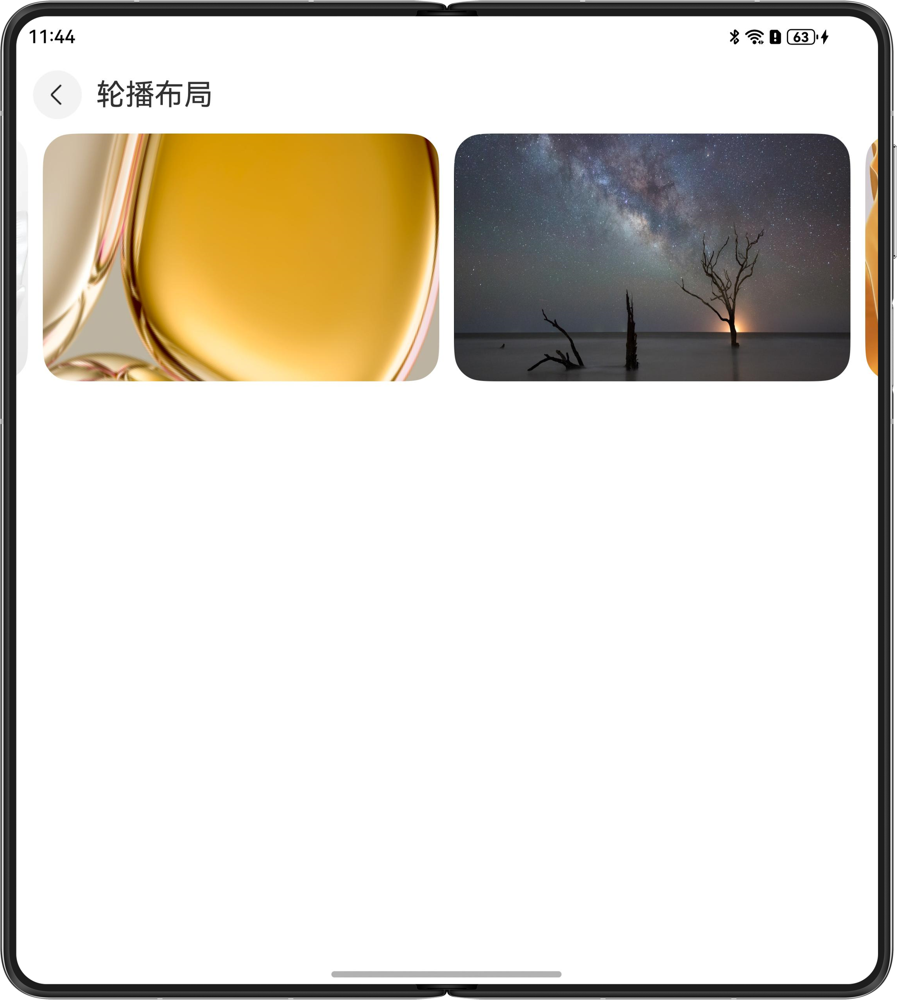 | 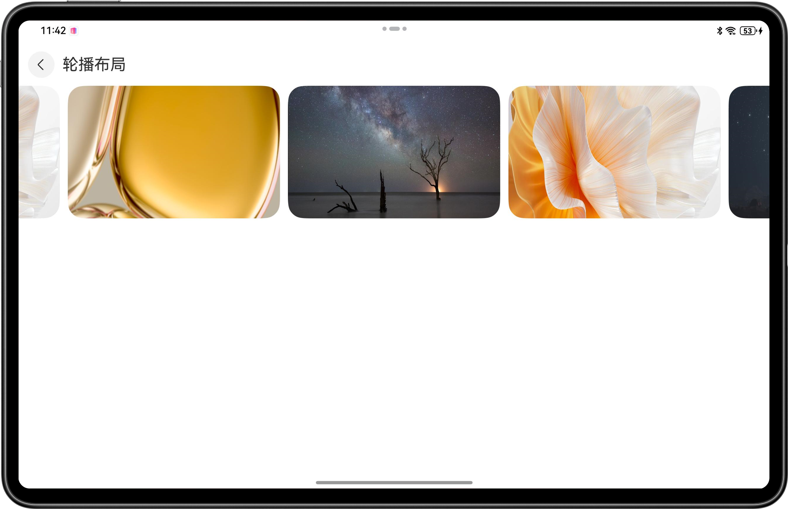 |

## Grid

| 属性 | 说明 |
| --- | --- |
| [columnsTemplate](https://developer.huawei.com/consumer/cn/doc/harmonyos-references/ts-container-grid#columnstemplate) | 设置不同断点下网格布局列的数量。 |
| [rowsTemplate](https://developer.huawei.com/consumer/cn/doc/harmonyos-references/ts-container-grid#rowstemplate) | 设置不同断点下网格布局行的数量。 |
| [columnsGap](https://developer.huawei.com/consumer/cn/doc/harmonyos-references/ts-container-grid#columnsgap) | 设置不同断点下的列间距。 |
| [rowsGap](https://developer.huawei.com/consumer/cn/doc/harmonyos-references/ts-container-grid#rowsgap) | 设置不同断点下的行间距。 |

重复网格布局效果如下图，实现方案和示例代码请参考[网格布局](/docs/dev/app-dev/multi-device/bpta-multi-device-page-layout#section1373617413916)。

| 横向断点 | sm | md | lg |
| --- | --- | --- | --- |
| 展示布局 | 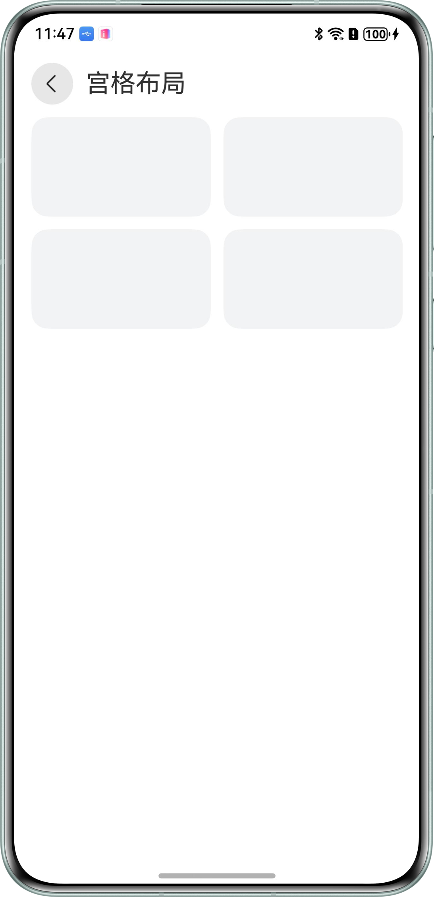 | 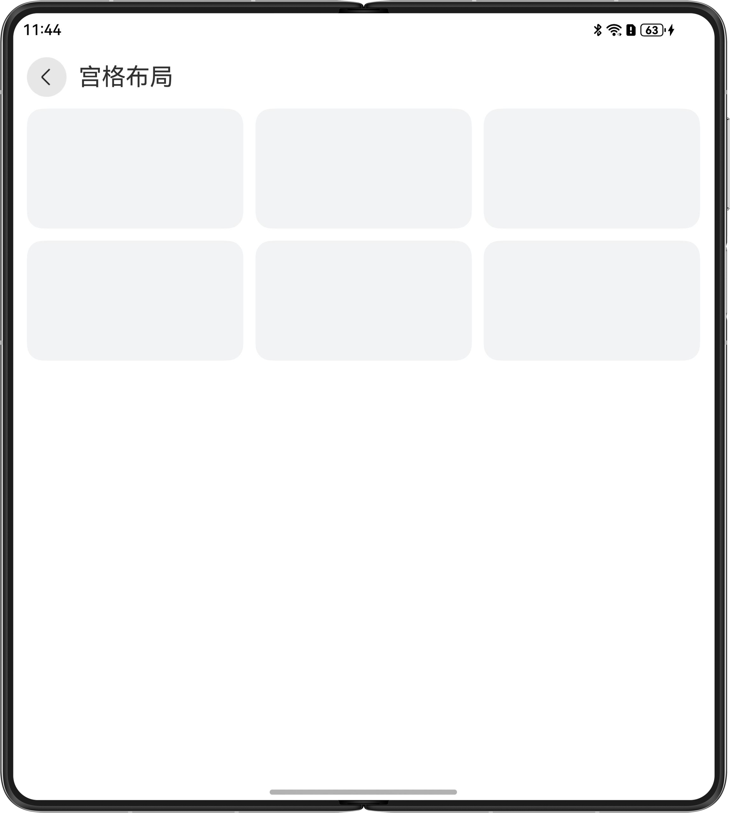 | 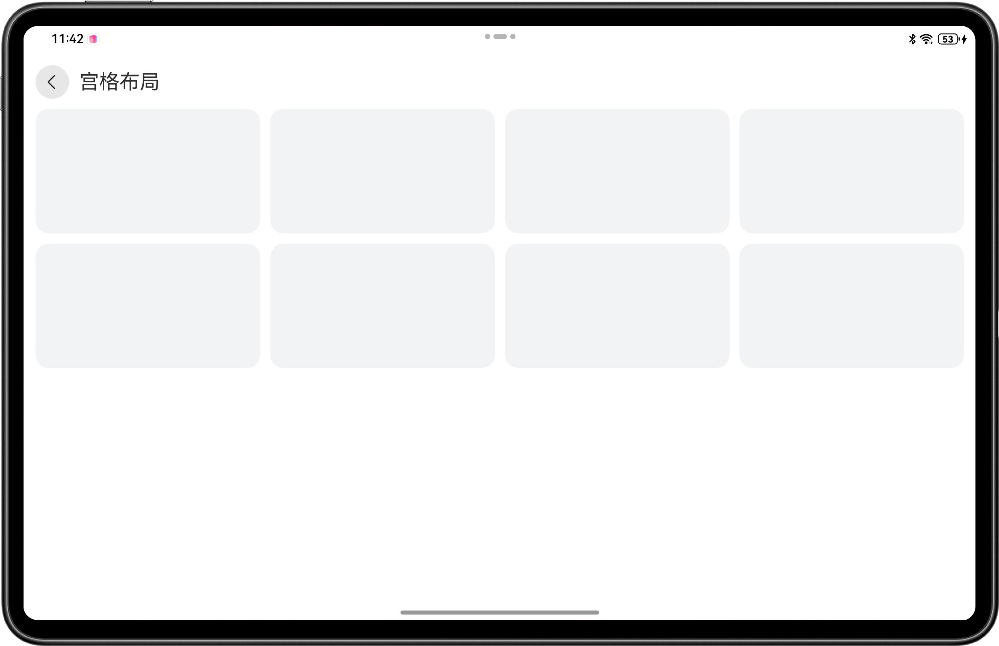 |

## SideBarContainer

| 属性 | 说明 |
| --- | --- |
| [showSideBar](https://developer.huawei.com/consumer/cn/doc/harmonyos-references/ts-container-sidebarcontainer#showsidebar) | 设置不同断点下侧边栏是否默认显示。 |
| [SideBarContainerType](https://developer.huawei.com/consumer/cn/doc/harmonyos-references/ts-container-sidebarcontainer#sidebarcontainertype枚举说明) | 设置不同断点下容器内侧边栏样式。 |
| [sideBarWidth](https://developer.huawei.com/consumer/cn/doc/harmonyos-references/ts-container-sidebarcontainer#sidebarwidth) | 设置不同断点下侧边栏的宽度。 |
| [minSideBarWidth](https://developer.huawei.com/consumer/cn/doc/harmonyos-references/ts-container-sidebarcontainer#minsidebarwidth) | 设置不同断点下侧边栏最小宽度。 |
| [maxSideBarWidth](https://developer.huawei.com/consumer/cn/doc/harmonyos-references/ts-container-sidebarcontainer#maxsidebarwidth) | 设置不同断点下侧边栏最大宽度。 |

侧边栏布局效果如下图，实现方案和示例代码请参考[侧边栏](/docs/dev/app-dev/multi-device/bpta-multi-device-page-layout#section10393142415418)。

| 横向断点 | sm | md | lg |
| --- | --- | --- | --- |
| 展示布局 | 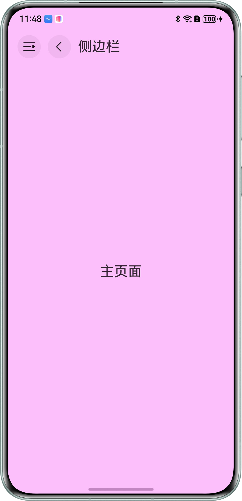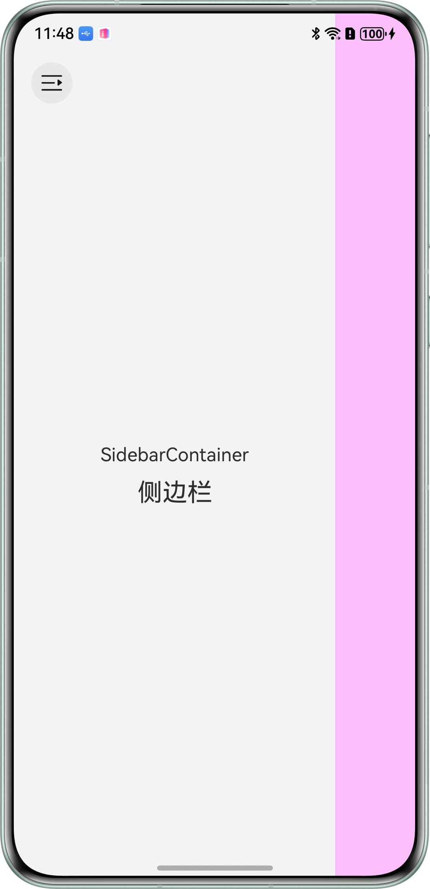 | 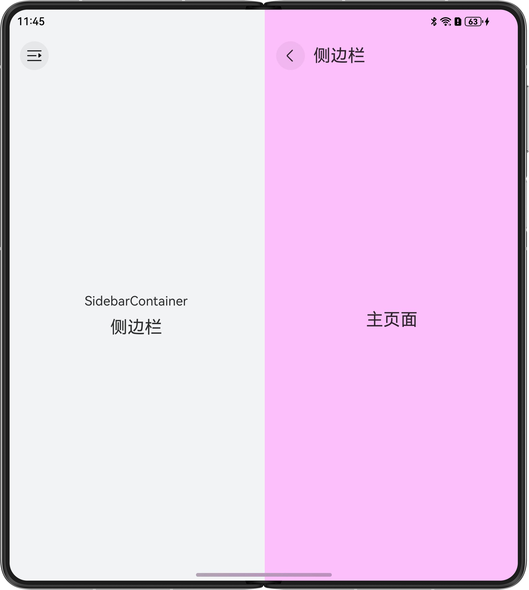 | 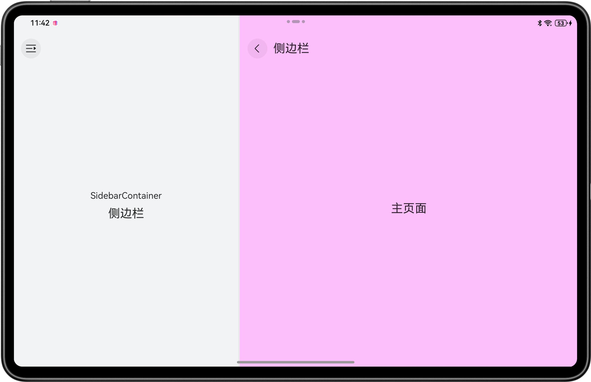 |

## Navigation

| 属性 | 说明 |
| --- | --- |
| [mode](https://developer.huawei.com/consumer/cn/doc/harmonyos-references/ts-basic-components-navigation#mode9) | 设置不同断点下导航栏的显示模式：单栏或双栏。 |
| [navBarWidth](https://developer.huawei.com/consumer/cn/doc/harmonyos-references/ts-basic-components-navigation#navbarwidth9) | 设置不同断点下导航栏的宽度。 |

单/双栏布局效果如下图，实现方案和示例代码请参考[单/双栏](/docs/dev/app-dev/multi-device/bpta-multi-device-page-layout#section631723412132)。

| 横向断点 | sm | md | lg |
| --- | --- | --- | --- |
| 属性 | 导航栏和内容区单栏显示 | 导航栏和内容区分栏显示  导航栏宽度50% | 导航栏和内容区分栏显示  导航栏宽度50% |
| 展示布局 | 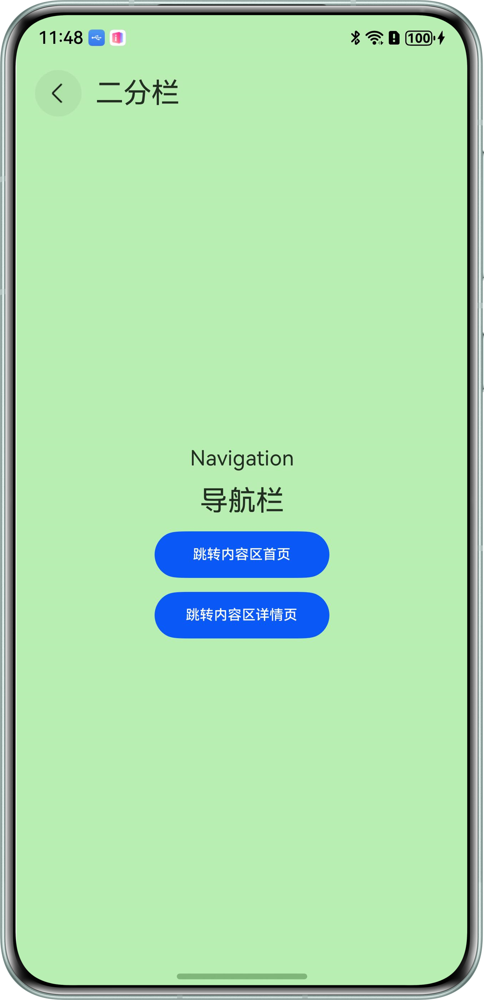 | 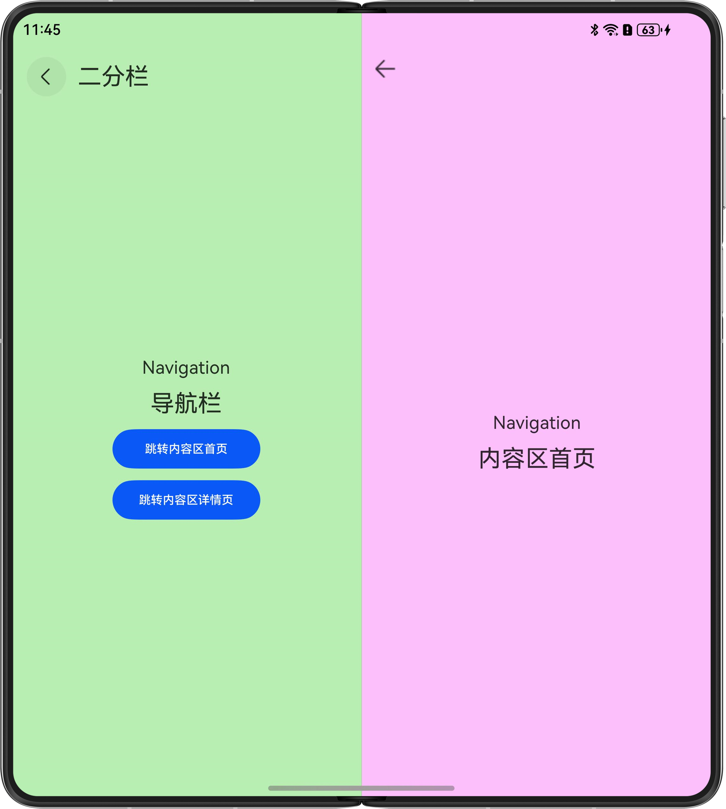 | 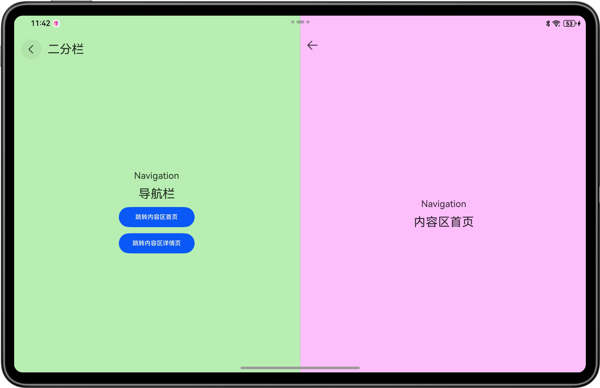 |

## SideBarContainer+Navigation

| SideBarContainer属性 | 说明 |
| --- | --- |
| [showSideBar](https://developer.huawei.com/consumer/cn/doc/harmonyos-references/ts-container-sidebarcontainer#showsidebar) | 设置不同断点下侧边栏是否默认显示。 |
| [sideBarWidth](https://developer.huawei.com/consumer/cn/doc/harmonyos-references/ts-container-sidebarcontainer#sidebarwidth) | 设置不同断点下侧边栏的宽度。 |
| [minSideBarWidth](https://developer.huawei.com/consumer/cn/doc/harmonyos-references/ts-container-sidebarcontainer#minsidebarwidth) | 设置不同断点下侧边栏最小宽度。 |
| [maxSideBarWidth](https://developer.huawei.com/consumer/cn/doc/harmonyos-references/ts-container-sidebarcontainer#maxsidebarwidth) | 设置不同断点下侧边栏最大宽度。 |

| Navigation属性 | 说明 |
| --- | --- |
| [mode](https://developer.huawei.com/consumer/cn/doc/harmonyos-references/ts-basic-components-navigation#mode9) | 设置不同断点下导航栏的显示模式：单栏或双栏。 |
| [navBarWidth](https://developer.huawei.com/consumer/cn/doc/harmonyos-references/ts-basic-components-navigation#navbarwidth9) | 设置不同断点下导航栏的宽度。 |

三分栏布局效果如下图，实现方案和示例代码请参考[三分栏](/docs/dev/app-dev/multi-device/bpta-multi-device-page-layout#section5436540101314)。

| 横向断点 | sm | md | lg |
| --- | --- | --- | --- |
| 展示布局 | 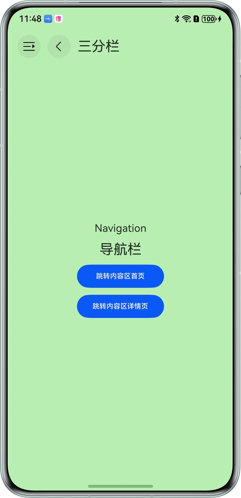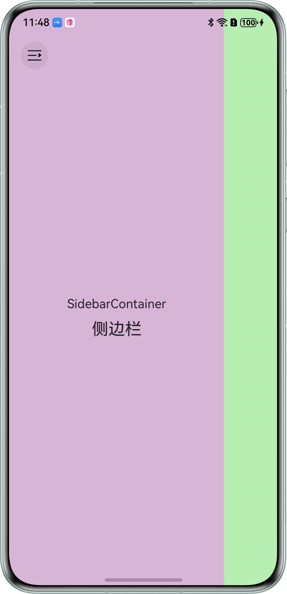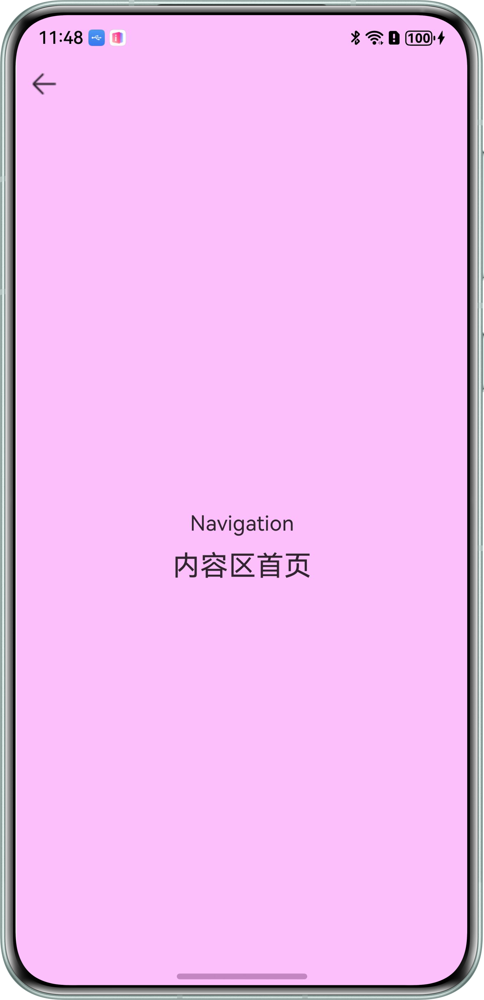 | 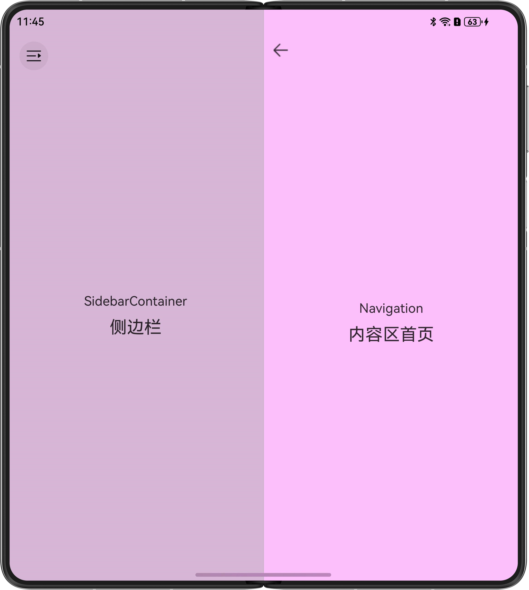 | 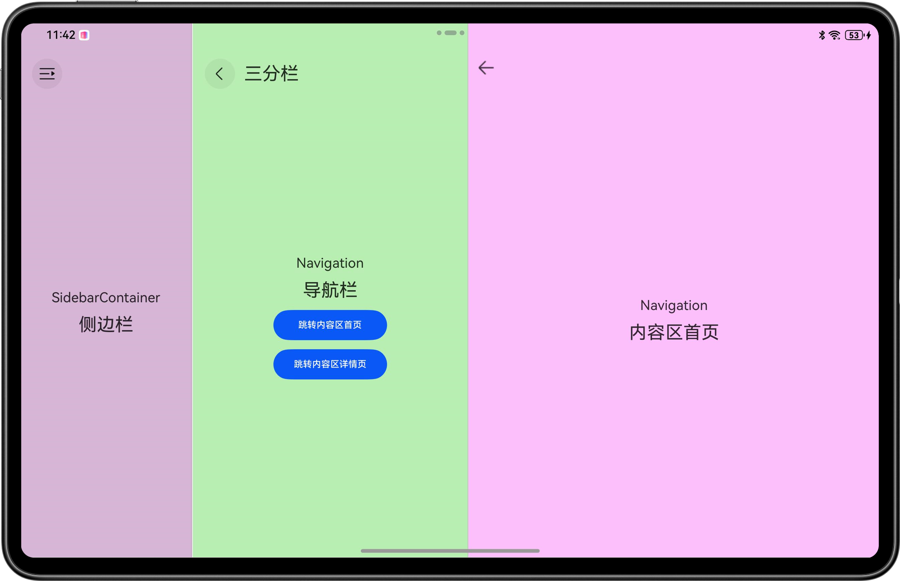 |

## Tabs

| 属性 | 说明 |
| --- | --- |
| [vertical](https://developer.huawei.com/consumer/cn/doc/harmonyos-references/ts-container-tabs#vertical) | 设置不同断点下Tabs为横向或纵向。 |
| [barPosition](https://developer.huawei.com/consumer/cn/doc/harmonyos-references/ts-container-tabs#tabsoptions15) | 设置不同断点下Tabs的页签位置。 |
| [barMode](https://developer.huawei.com/consumer/cn/doc/harmonyos-references/ts-container-tabs#barmode) | 设置不同断点下TabBar的布局模式，以及Scrollable模式下TabBar的布局样式。 |
| [barWidth](https://developer.huawei.com/consumer/cn/doc/harmonyos-references/ts-container-tabs#barwidth) | 设置不同断点下TabBar的宽度。 |
| [barHeight](https://developer.huawei.com/consumer/cn/doc/harmonyos-references/ts-container-tabs#barheight) | 设置不同断点下TabBar的高度。 |

底部/侧边导航布局效果如下图，实现方案和示例代码请参考[底部/侧边导航](/docs/dev/app-dev/multi-device/bpta-multi-device-page-layout#section498443175014)。

| 横向断点 | sm | md | lg |
| --- | --- | --- | --- |
| 布局效果 | 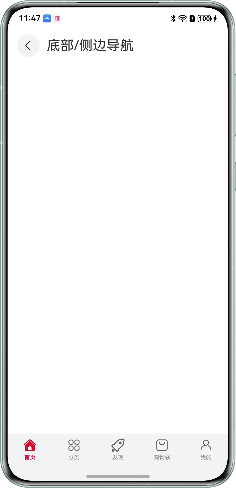 | 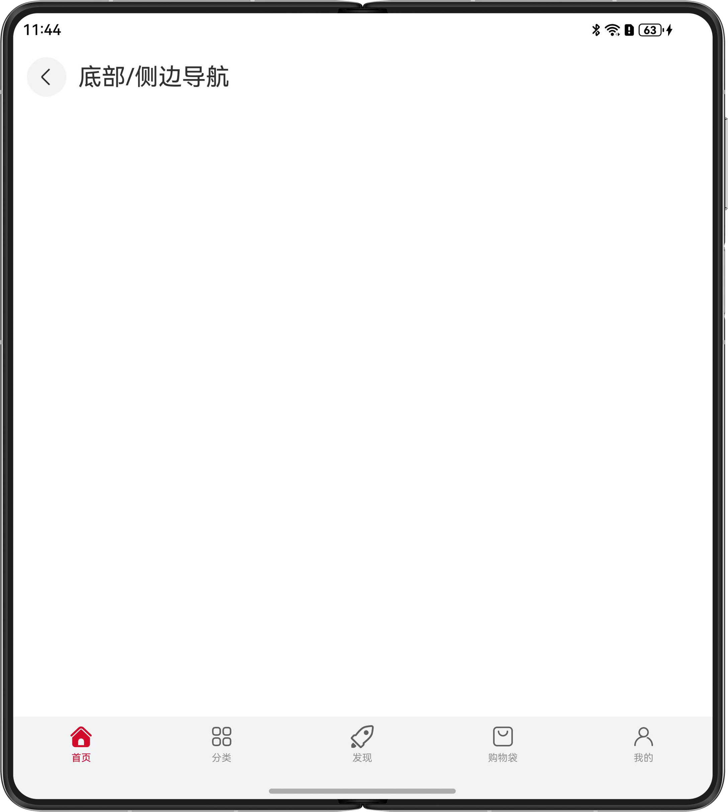 | 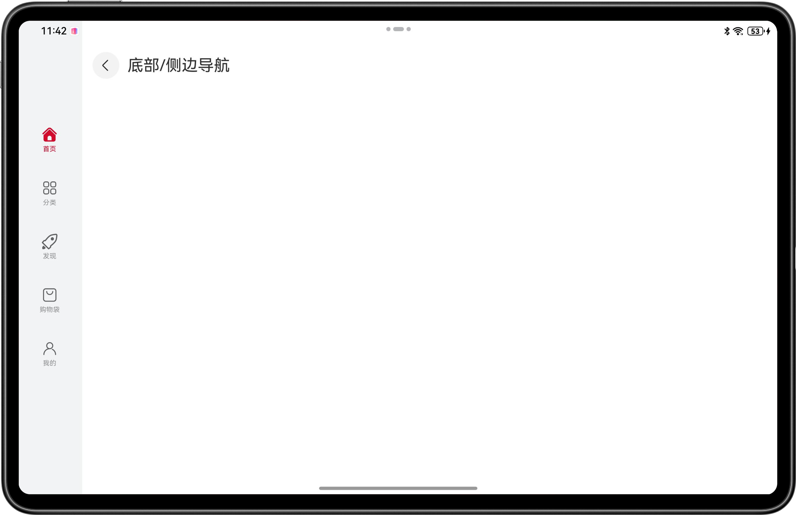 |

## GridRow/GridCol

栅格布局分为栅格容器组件GridRow和栅格子组件GridCol，通过调整不同的属性可以实现挪移布局和缩进布局。

| GridRow属性 | 说明 |
| --- | --- |
| [columns](https://developer.huawei.com/consumer/cn/doc/harmonyos-references/ts-container-gridrow#gridrowoptions对象说明) | 设置不同断点下栅格容器划分的布局列数。 |
| [breakpoints](https://developer.huawei.com/consumer/cn/doc/harmonyos-references/ts-container-gridrow#gridrowoptions对象说明) | 设置断点的划分阈值与横向断点一致。 |

| GridCol属性 | 说明 |
| --- | --- |
| [span](https://developer.huawei.com/consumer/cn/doc/harmonyos-references/ts-container-gridcol#gridcoloptions对象说明) | 设置不同断点下栅格子组件的占用列数。 |
| [offset](https://developer.huawei.com/consumer/cn/doc/harmonyos-references/ts-container-gridcol#gridcoloptions对象说明) | 设置不同断点下栅格子组件的偏移列数。 |
| [order](https://developer.huawei.com/consumer/cn/doc/harmonyos-references/ts-container-gridcol#gridcoloptions对象说明) | 设置不同断点下栅格子组件的序号。 |

**挪移布局**

插图和文字组合布局效果如下图，实现方案和示例代码请参考[插图和文字组合布局](/docs/dev/app-dev/multi-device/bpta-multi-device-page-layout#section12847170175118)。

| 横向断点 | sm | md | lg |
| --- | --- | --- | --- |
| 展示布局 | 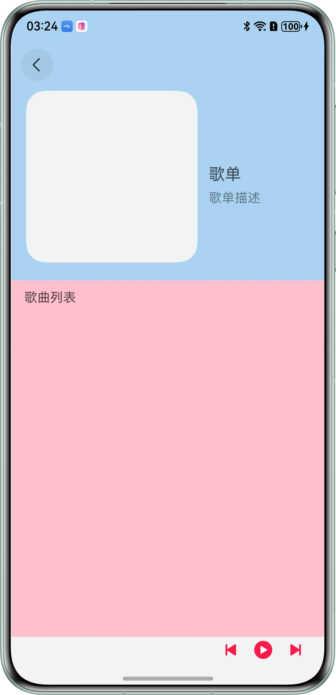 | 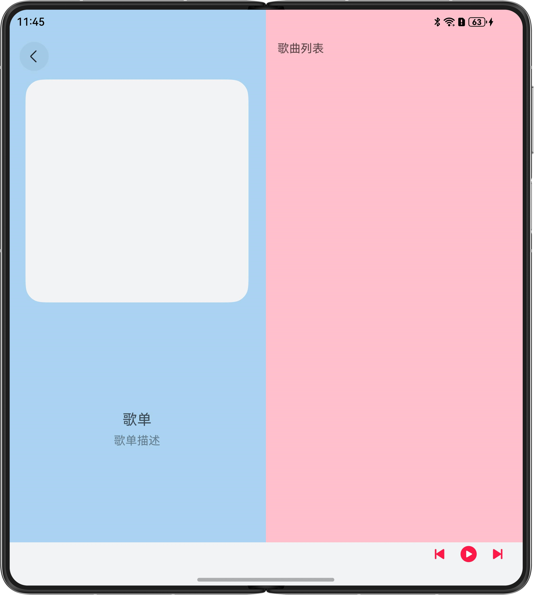 | 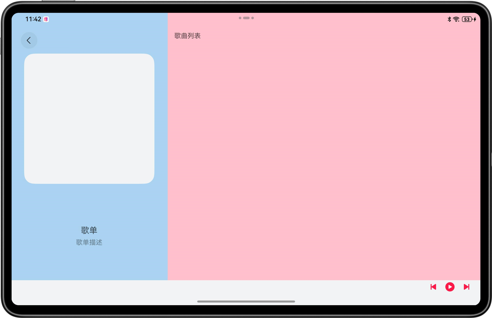 |

**缩进布局**

单列列表布局效果如下图，实现方案和示例代码请参考[缩进布局](/docs/dev/app-dev/multi-device/bpta-multi-device-page-layout#section74801750591)。

| 横向断点 | sm | md | lg |
| --- | --- | --- | --- |
| 展示布局 | 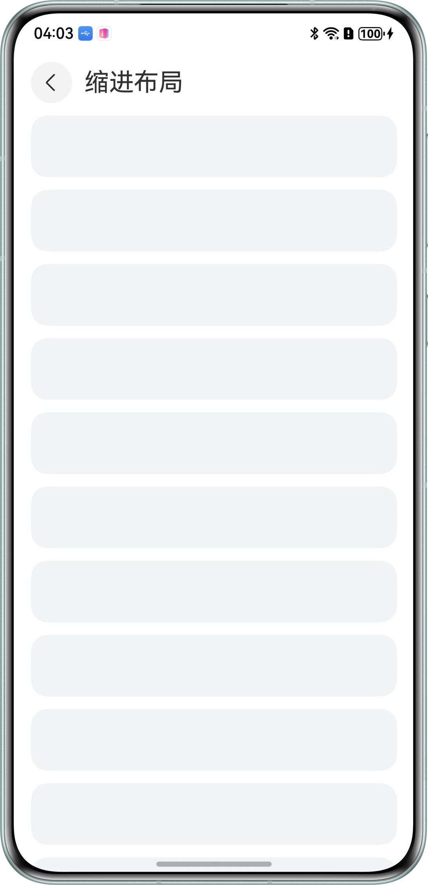 | 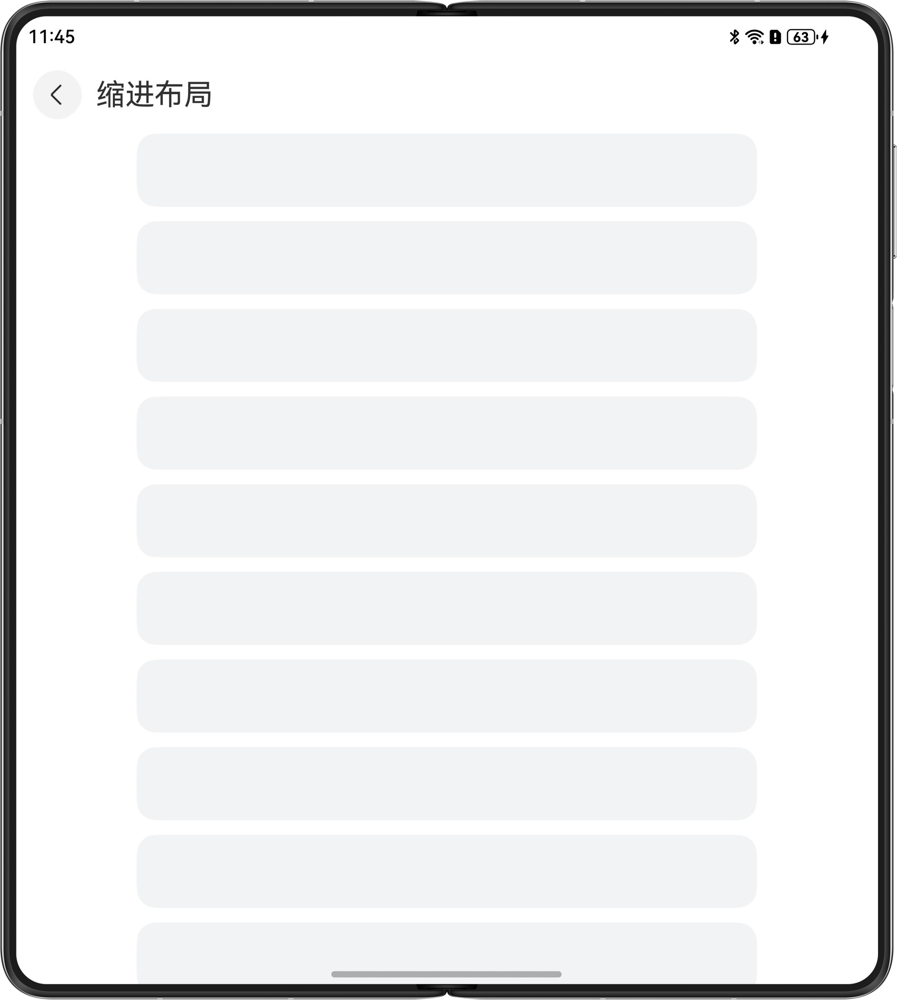 | 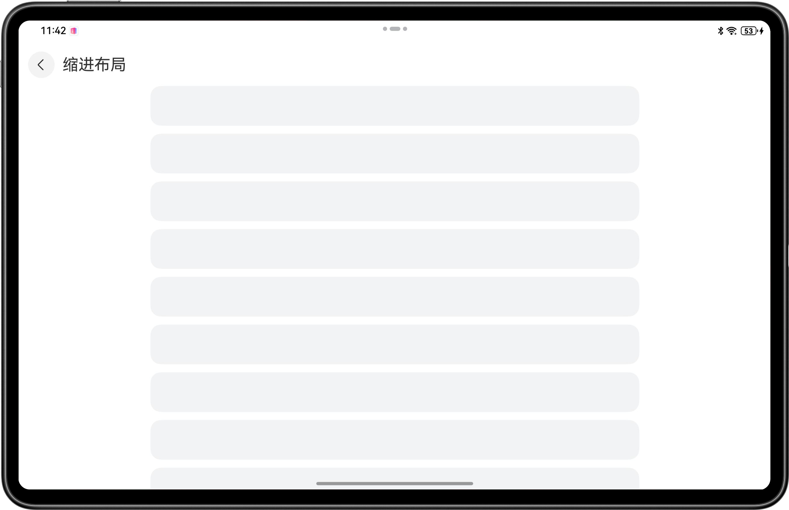 |

## 示例代码

* [基于一多能力实现响应式布局](https://gitcode.com/harmonyos_samples/ResponsiveLayout)
