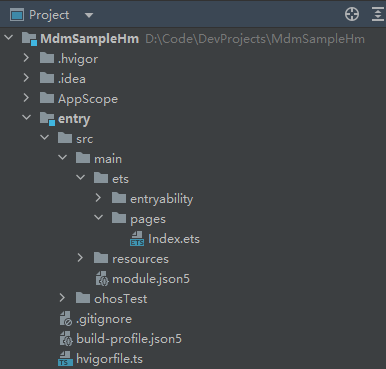
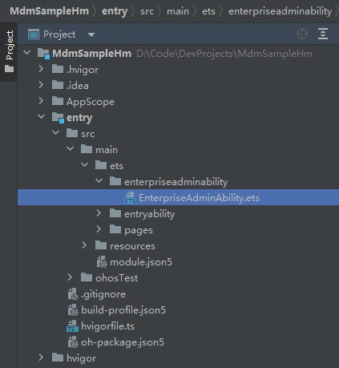

## 概述

企业设备管理扩展能力组件，是设备管理应用必备组件。当开发者为企业开发设备管理应用时，需继承EnterpriseAdminExtensionAbility，在EnterpriseAdminExtensionAbility实例中实现MDM业务逻辑，EnterpriseAdminExtensionAbility实现了系统管理状态变化通知功能，并定义了管理应用激活、去激活、应用安装、卸载事件等回调接口。

## 接口说明

以下为本次开发示例所使用的接口，更多接口及使用方式请见[企业设备管理扩展能力接口文档](https://developer.huawei.com/consumer/cn/doc/harmonyos-references/js-apis-enterpriseadminextensionability)。

| 接口名称 | 描述 |
| --- | --- |
| [onAdminEnabled(): void](https://developer.huawei.com/consumer/cn/doc/harmonyos-references/js-apis-enterpriseadminextensionability#onadminenabled) | 设备管理应用被激活回调方法。 |
| [onAdminDisabled(): void](https://developer.huawei.com/consumer/cn/doc/harmonyos-references/js-apis-enterpriseadminextensionability#onadmindisabled) | 设备管理应用被解除激活回调方法。 |
| [onBundleAdded(bundleName: string): void](https://developer.huawei.com/consumer/cn/doc/harmonyos-references/js-apis-enterpriseadminextensionability#onbundleadded) | 应用安装回调方法。 |
| [onBundleRemoved(bundleName: string): void](https://developer.huawei.com/consumer/cn/doc/harmonyos-references/js-apis-enterpriseadminextensionability#onbundleremoved) | 应用卸载回调方法。 |
| [onDeviceAdminEnabled(bundleName: string): void](https://developer.huawei.com/consumer/cn/doc/harmonyos-references/js-apis-enterpriseadminextensionability#ondeviceadminenabled23) | 普通设备管理应用被激活回调方法。 |
| [onDeviceAdminDisabled(bundleName: string): void](https://developer.huawei.com/consumer/cn/doc/harmonyos-references/js-apis-enterpriseadminextensionability#ondeviceadmindisabled23) | 普通设备管理应用被解除激活回调方法。 |

## 开发步骤

新建一个工程后，结构如下：



首先，创建一个EnterpriseAdmin类型的ExtensionAbility（也就是EnterpriseAdminExtensionAbility）。



其次，打开新建的EnterpriseAdminAbility文件，导入EnterpriseAdminExtensionAbility模块，使其继承EnterpriseAdminExtensionAbility并加上需要的应用通知回调方法，如onAdminEnabled()、onAdminDisabled()等回调方法。当设备管理应用激活或者解除激活时，可以在对应回调方法中接收系统发送通知。

```
import { EnterpriseAdminExtensionAbility } from '@kit.MDMKit';
// ···

export default class EnterpriseAdminAbility extends EnterpriseAdminExtensionAbility {
// ···

  // 设备管理器应用激活回调方法，应用可在此回调函数中进行初始化策略设置。
  onAdminEnabled() {
    console.info('onAdminEnabled');
    // ···
  }

  // 设备管理器应用去激活回调方法，应用可在此回调函数中通知企业管理员设备已脱管。
  onAdminDisabled() {
    console.info('onAdminDisabled');
    // ···
  }

  // 应用安装回调方法，应用可在此回调函数中进行事件上报，通知企业管理员。
  onBundleAdded(bundleName: string) {
    console.info('EnterpriseAdminAbility onBundleAdded bundleName:' + bundleName);
  }

  // 应用卸载回调方法，应用可在此回调函数中进行事件上报，通知企业管理员。
  onBundleRemoved(bundleName: string) {
    console.info('EnterpriseAdminAbility onBundleRemoved bundleName' + bundleName);
  }

  // 普通设备管理应用激活回调方法，应用可在此回调函数中进行初始化策略设置
  onDeviceAdminEnabled(bundleName: string) {
    console.info("EnterpriseAdminAbility onDeviceAdminEnabled bundleName:" + bundleName);
  }

  // 普通设备管理应用解除激活回调方法，应用可在此回调函数中通知企业管理员设备已脱管
  onDeviceAdminDisabled(bundleName: string) {
    console.info("EnterpriseAdminAbility onDeviceAdminDisabled bundleName" + bundleName);
  }
};
```


<div class="source-link-wrapper"><a href="https://gitcode.com/HarmonyOS_Samples/guide-snippets/blob/HarmonyOS-feature-20260402/EnterpriseAdminExtensionAbility/EnterpriseAdminExtensionAbility/entry/src/main/ets/enterpriseadminability/EnterpriseAdminAbility.ets#L27-L199" target="_blank" rel="noopener noreferrer" class="source-link"><svg class="source-link-icon" width="14" height="14" viewBox="0 0 24 24" fill="none" stroke="currentColor" strokeWidth="2" strokeLinecap="round" strokeLinejoin="round"><path d="M18 13v6a2 2 0 0 1-2 2H5a2 2 0 0 1-2-2V8a2 2 0 0 1 2-2h6" /><polyline points="15 3 21 3 21 9" /><line x1="10" y1="14" x2="21" y2="3" /></svg> 查看源码：EnterpriseAdminAbility.ets</a></div>


最后，在工程Module对应的[module.json5](https://developer.huawei.com/consumer/cn/doc/harmonyos-guides/module-configuration-file)配置文件中将EnterpriseAdminAbility注册为ExtensionAbility，type标签需要设置为“enterpriseAdmin”，srcEntry标签表示当前ExtensionAbility组件所对应的代码路径。

```
"extensionAbilities": [
  {
    "name": "EnterpriseAdminAbility",
    "type": "enterpriseAdmin",
    "exported": true,
    "srcEntry": "./ets/enterpriseadminability/EnterpriseAdminAbility.ets"
  }
],
```


<div class="source-link-wrapper"><a href="https://gitcode.com/HarmonyOS_Samples/guide-snippets/blob/HarmonyOS-feature-20260402/EnterpriseAdminExtensionAbility/EnterpriseAdminExtensionAbility/entry/src/main/module.json5#L51-L60" target="_blank" rel="noopener noreferrer" class="source-link"><svg class="source-link-icon" width="14" height="14" viewBox="0 0 24 24" fill="none" stroke="currentColor" strokeWidth="2" strokeLinecap="round" strokeLinejoin="round"><path d="M18 13v6a2 2 0 0 1-2 2H5a2 2 0 0 1-2-2V8a2 2 0 0 1 2-2h6" /><polyline points="15 3 21 3 21 9" /><line x1="10" y1="14" x2="21" y2="3" /></svg> 查看源码：module.json5</a></div>
