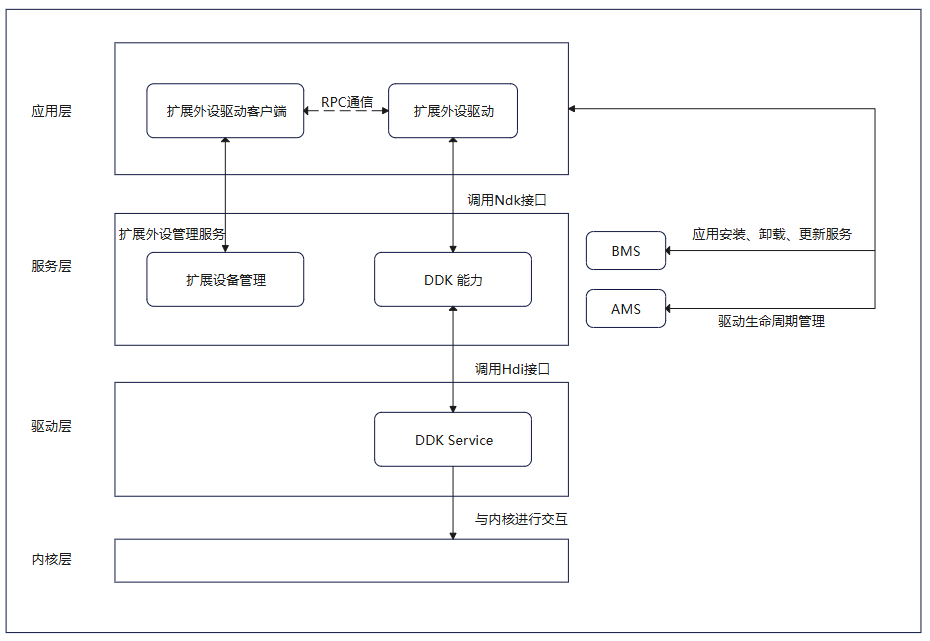

## 简介

HidDdk（HID Driver Development Kit）是为开发者提供的HID设备驱动程序开发套件，支持开发者基于用户态，在应用层开发HID设备驱动。提供了一系列主机侧访问设备的接口，包括创建设备、向设备发送事件、销毁设备、打开关闭设备、读取写入报告、获取设备信息等。

凡是采用USB总线，通过HID协议传输数据的设备，或者通过扩展外设驱动创建虚拟设备，来实现与非标设备的信息交互都可以使用HidDdk开发设备驱动。

### 基本概念

在进行HidDdk开发前，开发者应了解以下基本概念：

* **HID**

  HID（Human Interface Device），中文意思是“人机接口设备”。它是一类用于实现人与计算机或其他电子设备交互的硬件设备。HID 设备的主要功能是将用户的输入（如按键、点击、移动等）转换为数据信号，并将这些信号发送给主机设备（如计算机、平板、游戏机等），从而实现用户对设备的控制和操作。
* **DDK**

  DDK（Driver Development Kit）是HarmonyOS基于扩展外设框架，为开发者提供的驱动应用开发的工具包，可针对非标USB串口设备，开发对应的驱动。

### 实现原理

非标外设应用通过扩展外设管理服务获取HID设备的ID，通过RPC将ID和要操作的动作下发给HID设备驱动应用，驱动应用通过调用HidDdk接口可创建、销毁HID设备，以及对HID设备发送事件，获取HID报文，解析报文等，DDK接口使用HDI服务将指令下发至内核驱动，内核驱动使用指令与设备通信。

**图1** HidDdk调用原理



## 约束与限制

* HidDdk开放API支持非标HID类外设扩展驱动开发场景。
* HidDdk开放API仅允许DriverExtensionAbility生命周期内使用。
* 使用HidDdk开放API需要在module.json5中声明匹配的ACL权限，例如ohos.permission.ACCESS\_DDK\_HID。

## 接口说明

| 名称 | 描述 |
| --- | --- |
| OH\_Hid\_CreateDevice(Hid\_Device \*hidDevice, Hid\_EventProperties \*hidEventProperties) | 创建HID设备。请在设备使用完后使用OH\_Hid\_DestroyDevice销毁设备。 |
| OH\_Hid\_EmitEvent(int32\_t deviceId, const Hid\_EmitItem items[], uint16\_t length) | 向指定deviceId的HID设备发送事件。 |
| OH\_Hid\_DestroyDevice(int32\_t deviceId) | 销毁指定deviceId的HID设备。 |
| int32\_t OH\_Hid\_Init(void) | 初始化HidDdk。 |
| int32\_t OH\_Hid\_Release(void) | 释放HidDdk。 |
| int32\_t OH\_Hid\_Open(uint64\_t deviceId, uint8\_t interfaceIndex, Hid\_DeviceHandle \*\*dev) | 打开deviceId和interfaceIndex指定的设备。 |
| int32\_t OH\_Hid\_Close(Hid\_DeviceHandle \*\*dev) | 关闭设备。 |
| int32\_t OH\_Hid\_Write(Hid\_DeviceHandle \*dev, uint8\_t \*data, uint32\_t length, uint32\_t \*bytesWritten) | 向设备写入报告。 |
| int32\_t OH\_Hid\_ReadTimeout(Hid\_DeviceHandle \*dev, uint8\_t \*data, uint32\_t buffSize, int timeout, uint32\_t \*bytesRead) | 在指定的超时时间内从设备读取报告。 |
| int32\_t OH\_Hid\_Read(Hid\_DeviceHandle \*dev, uint8\_t \*data, uint32\_t buffSize, uint32\_t \*bytesRead) | 从设备读取报告，默认为阻塞模式（阻塞等待直到有数据可读取），可以调用OH\_Hid\_SetNonBlocking改变模式。 |
| int32\_t OH\_Hid\_SetNonBlocking(Hid\_DeviceHandle \*dev, int nonblock) | 设置设备读取模式为非阻塞。 |
| int32\_t OH\_Hid\_GetRawInfo(Hid\_DeviceHandle \*dev, Hid\_RawDevInfo \*rawDevInfo) | 获取设备原始信息。 |
| int32\_t OH\_Hid\_GetRawName(Hid\_DeviceHandle \*dev, char \*data, uint32\_t buffSize) | 获取设备原始名称。 |
| int32\_t OH\_Hid\_GetPhysicalAddress(Hid\_DeviceHandle \*dev, char \*data, uint32\_t buffSize) | 获取设备物理地址。 |
| int32\_t OH\_Hid\_GetRawUniqueId(Hid\_DeviceHandle \*dev, uint8\_t \*data, uint32\_t buffSize) | 获取设备原始唯一标识符。 |
| int32\_t OH\_Hid\_SendReport(Hid\_DeviceHandle \*dev, Hid\_ReportType reportType, const uint8\_t \*data, uint32\_t length) | 向设备发送报告。 |
| int32\_t OH\_Hid\_GetReport(Hid\_DeviceHandle \*dev, Hid\_ReportType reportType, uint8\_t \*data, uint32\_t buffSize) | 获取设备报告。 |
| int32\_t OH\_Hid\_GetReportDescriptor(Hid\_DeviceHandle \*dev, uint8\_t \*buf, uint32\_t buffSize, uint32\_t \*bytesRead) | 获取设备报告描述符。 |

详细的接口说明请参考[HidDdk](https://developer.huawei.com/consumer/cn/doc/harmonyos-references/capi-hidddk)。

## 开发步骤

### HID基础驱动能力开发

以下步骤描述了如何使用 **HidDdk**开发HID设备驱动：

**添加动态链接库**

CMakeLists.txt中添加以下lib。

```
libhid.z.so
```

**头文件**

```
#include <hid/hid_ddk_api.h>
#include <hid/hid_ddk_types.h>
```

1. 创建设备。

   使用 **hid\_ddk\_api.h** 的 **OH\_Hid\_CreateDevice** 接口创建HID设备，成功返回设备deviceId，失败返回[Hid\_DdkErrCode](https://developer.huawei.com/consumer/cn/doc/harmonyos-references/capi-hid-ddk-types-h#hid_ddkerrcode)。

   ```
   Hid_Device hidDevice = {
       .deviceName = deviceName.c_str(),
       .vendorId = 0x6006,
       .productId = 0x6008,
       .version = 1,
       .bustype = BUS_USB
   };
   std::vector<Hid_EventType> eventType = {HID_EV_KEY};
   Hid_EventTypeArray eventTypeArray = {.hidEventType = eventType.data(), .length = (uint16_t)eventType.size()};
   std::vector<Hid_KeyCode> keyCode = {
       HID_KEY_1,          HID_KEY_SPACE,       HID_KEY_BACKSPACE,   HID_KEY_ENTER,     HID_KEY_ESC, HID_KEY_SYSRQ,
       HID_KEY_LEFT_SHIFT, HID_KEY_RIGHT_SHIFT, HID_KEY_VOLUME_DOWN, HID_KEY_VOLUME_UP, HID_KEY_0,   HID_KEY_2,
       HID_KEY_3,          HID_KEY_4,           HID_KEY_5,           HID_KEY_6,         HID_KEY_7,   HID_KEY_8,
       HID_KEY_9,          HID_KEY_A,           HID_KEY_B,           HID_KEY_C,         HID_KEY_D,   HID_KEY_E,
       HID_KEY_F,          HID_KEY_G,           HID_KEY_H,           HID_KEY_I,         HID_KEY_J,   HID_KEY_K,
       HID_KEY_L,          HID_KEY_M,           HID_KEY_N,           HID_KEY_O,         HID_KEY_P,   HID_KEY_Q,
       HID_KEY_R,          HID_KEY_S,           HID_KEY_T,           HID_KEY_U,         HID_KEY_V,   HID_KEY_W,
       HID_KEY_X,          HID_KEY_Y,           HID_KEY_Z,           HID_KEY_DELETE};
   Hid_KeyCodeArray keyCodeArray = {.hidKeyCode = keyCode.data(), .length = (uint16_t)keyCode.size()};
   Hid_EventProperties hidEventProp = {.hidEventTypes = eventTypeArray, .hidKeys = keyCodeArray};
   int deviceId = OH_Hid_CreateDevice(&hidDevice, &hidEventProp);
   ```

   

<div class="source-link-wrapper"><a href="https://gitcode.com/HarmonyOS_Samples/guide-snippets/blob/HarmonyOS-feature-20260402/DriverDevelopmentKit/UsbDriverDemo/entry/src/main/cpp/inject_thread.cpp#L152-L174" target="_blank" rel="noopener noreferrer" class="source-link"><svg class="source-link-icon" width="14" height="14" viewBox="0 0 24 24" fill="none" stroke="currentColor" strokeWidth="2" strokeLinecap="round" strokeLinejoin="round">\<path d="M18 13v6a2 2 0 0 1-2 2H5a2 2 0 0 1-2-2V8a2 2 0 0 1 2-2h6" /\>\<polyline points="15 3 21 3 21 9" /\>\<line x1="10" y1="14" x2="21" y2="3" /\></svg> 查看源码：inject_thread.cpp</a></div>

2. 向指定deviceId的HID设备发送事件。

   使用 **hid\_ddk\_api.h** 的 **OH\_Hid\_EmitEvent** 向指定的deviceId的设备发送事件。

   ```
   // 向指定deviceId的设备发送事件，事件来源于物理外设，通过InjectEvent方法注入
   int32_t ret = OH_Hid_EmitEvent(item.first, item.second.data(), (uint16_t)item.second.size());
   if (ret != HID_DDK_SUCCESS) {
       OH_LOG_ERROR(LOG_APP, "OH_Hid_EmitEvent failed, deviceId:%{public}d", item.first);
   }
   ```

   

<div class="source-link-wrapper"><a href="https://gitcode.com/HarmonyOS_Samples/guide-snippets/blob/HarmonyOS-feature-20260402/DriverDevelopmentKit/UsbDriverDemo/entry/src/main/cpp/inject_thread.cpp#L66-L72" target="_blank" rel="noopener noreferrer" class="source-link"><svg class="source-link-icon" width="14" height="14" viewBox="0 0 24 24" fill="none" stroke="currentColor" strokeWidth="2" strokeLinecap="round" strokeLinejoin="round">\<path d="M18 13v6a2 2 0 0 1-2 2H5a2 2 0 0 1-2-2V8a2 2 0 0 1 2-2h6" /\>\<polyline points="15 3 21 3 21 9" /\>\<line x1="10" y1="14" x2="21" y2="3" /\></svg> 查看源码：inject_thread.cpp</a></div>

3. 释放资源。

   在所有请求处理完毕，程序退出前，使用 **hid\_ddk\_api.h** 的 **OH\_Hid\_DestroyDevice** 接口销毁HID设备。

   ```
   // 销毁HID设备
   int32_t res = OH_Hid_DestroyDevice(deviceId);
   ```

   

<div class="source-link-wrapper"><a href="https://gitcode.com/HarmonyOS_Samples/guide-snippets/blob/HarmonyOS-feature-20260402/DriverDevelopmentKit/UsbDriverDemo/entry/src/main/cpp/inject_thread.cpp#L127-L130" target="_blank" rel="noopener noreferrer" class="source-link"><svg class="source-link-icon" width="14" height="14" viewBox="0 0 24 24" fill="none" stroke="currentColor" strokeWidth="2" strokeLinecap="round" strokeLinejoin="round">\<path d="M18 13v6a2 2 0 0 1-2 2H5a2 2 0 0 1-2-2V8a2 2 0 0 1 2-2h6" /\>\<polyline points="15 3 21 3 21 9" /\>\<line x1="10" y1="14" x2="21" y2="3" /\></svg> 查看源码：inject_thread.cpp</a></div>


### HID报文通信驱动能力开发

以下步骤描述了如何使用 **HidDdk** 开发HID报文通信驱动：

**添加动态链接库**

CMakeLists.txt中添加以下lib。

```
libhid.z.so
```

**头文件**

```
#include <hid/hid_ddk_api.h>
#include <hid/hid_ddk_types.h>
```

1. 初始化DDK。

   使用 **hid\_ddk\_api.h** 的 **OH\_Hid\_Init** 初始化HidDdk。

   ```
   // 初始化HID DDK
   int32_t ret = OH_Hid_Init();
   if (ret != HID_DDK_SUCCESS) {
       OH_LOG_ERROR(LOG_APP, "OH_Hid_Init() return failed: %{public}d", ret);
       return ret;
   }
   ```

   

<div class="source-link-wrapper"><a href="https://gitcode.com/HarmonyOS_Samples/guide-snippets/blob/HarmonyOS-feature-20260402/DriverDevelopmentKit/HidDriverDemo/entry/src/main/cpp/data_parser.cpp#L36-L43" target="_blank" rel="noopener noreferrer" class="source-link"><svg class="source-link-icon" width="14" height="14" viewBox="0 0 24 24" fill="none" stroke="currentColor" strokeWidth="2" strokeLinecap="round" strokeLinejoin="round">\<path d="M18 13v6a2 2 0 0 1-2 2H5a2 2 0 0 1-2-2V8a2 2 0 0 1 2-2h6" /\>\<polyline points="15 3 21 3 21 9" /\>\<line x1="10" y1="14" x2="21" y2="3" /\></svg> 查看源码：data_parser.cpp</a></div>

2. 打开设备。

   初始化HidDdk后，使用 **hid\_ddk\_api.h** 的 **OH\_Hid\_Open** 打开HID设备。

   ```
   uint32_t bInterfaceNum1 = 0x00;
   // 打开deviceId和interfaceIndex1指定的HID设备（一般为/dev/hidraw0设备文件）
   ret = OH_Hid_Open(deviceID_, bInterfaceNum1, &hid_);
   if (ret != 0) {
       OH_LOG_ERROR(LOG_APP, "Failed to open hid device, interface number:%{public}u ret:%{public}d",
           bInterfaceNum1, ret);
       return ret;
   }
   uint32_t bInterfaceNum2 = 0x01;
   // 打开deviceId和interfaceIndex2指定的HID设备（一般为/dev/hidraw1设备文件）
   ret = OH_Hid_Open(deviceID_, bInterfaceNum2, &hid2_);
   if (ret != 0) {
       OH_LOG_ERROR(LOG_APP, "Failed to open hid device, interface number:%{public}u ret:%{public}d",
           bInterfaceNum2, ret);
       return ret;
   }
   ```

   

<div class="source-link-wrapper"><a href="https://gitcode.com/HarmonyOS_Samples/guide-snippets/blob/HarmonyOS-feature-20260402/DriverDevelopmentKit/HidDriverDemo/entry/src/main/cpp/data_parser.cpp#L45-L62" target="_blank" rel="noopener noreferrer" class="source-link"><svg class="source-link-icon" width="14" height="14" viewBox="0 0 24 24" fill="none" stroke="currentColor" strokeWidth="2" strokeLinecap="round" strokeLinejoin="round">\<path d="M18 13v6a2 2 0 0 1-2 2H5a2 2 0 0 1-2-2V8a2 2 0 0 1 2-2h6" /\>\<polyline points="15 3 21 3 21 9" /\>\<line x1="10" y1="14" x2="21" y2="3" /\></svg> 查看源码：data_parser.cpp</a></div>

3. 向HID设备写入/发送报告（HID设备与主机之间交换的数据包）（可选）。

   * 当报告类型为HID\_OUTPUT\_REPORT（输出报告）时，支持如下两种写入/发送方式。
     + 使用 **hid\_ddk\_api.h** 的 **OH\_Hid\_Write** 向HID设备写入一个输出报告。

       ```
       uint32_t bytesWritten;
       // 写入报告
       int32_t ret = OH_Hid_Write(DataParser::GetInstance().getHidObject(), dataBuff, sizeof(dataBuff), &bytesWritten);
       if (ret != HID_DDK_SUCCESS) {
           OH_LOG_ERROR(LOG_APP, "OH_Hid_Write failed. ret: %{public}u", ret);
       }
       ```

       

<div class="source-link-wrapper"><a href="https://gitcode.com/HarmonyOS_Samples/guide-snippets/blob/HarmonyOS-feature-20260402/DriverDevelopmentKit/HidDriverDemo/entry/src/main/cpp/hello.cpp#L470-L477" target="_blank" rel="noopener noreferrer" class="source-link"><svg class="source-link-icon" width="14" height="14" viewBox="0 0 24 24" fill="none" stroke="currentColor" strokeWidth="2" strokeLinecap="round" strokeLinejoin="round">\<path d="M18 13v6a2 2 0 0 1-2 2H5a2 2 0 0 1-2-2V8a2 2 0 0 1 2-2h6" /\>\<polyline points="15 3 21 3 21 9" /\>\<line x1="10" y1="14" x2="21" y2="3" /\></svg> 查看源码：hello.cpp</a></div>

     + 使用 **hid\_ddk\_api.h** 的 **OH\_Hid\_SendReport** 向HID设备发送一个输出报告。

       ```
       // 发送输出报告
       int32_t ret = OH_Hid_SendReport(DataParser::GetInstance().getHidObject(), HID_OUTPUT_REPORT, dataBuff,
                                       sizeof(dataBuff));
       if (ret != HID_DDK_SUCCESS) {
           OH_LOG_ERROR(LOG_APP, "OH_Hid_SendReport failed. ret: %{public}u", ret);
       }
       ```

       

<div class="source-link-wrapper"><a href="https://gitcode.com/HarmonyOS_Samples/guide-snippets/blob/HarmonyOS-feature-20260402/DriverDevelopmentKit/HidDriverDemo/entry/src/main/cpp/hello.cpp#L408-L415" target="_blank" rel="noopener noreferrer" class="source-link"><svg class="source-link-icon" width="14" height="14" viewBox="0 0 24 24" fill="none" stroke="currentColor" strokeWidth="2" strokeLinecap="round" strokeLinejoin="round">\<path d="M18 13v6a2 2 0 0 1-2 2H5a2 2 0 0 1-2-2V8a2 2 0 0 1 2-2h6" /\>\<polyline points="15 3 21 3 21 9" /\>\<line x1="10" y1="14" x2="21" y2="3" /\></svg> 查看源码：hello.cpp</a></div>

     + 当报告类型为HID\_FEATURE\_REPORT（特性报告）时，使用 **hid\_ddk\_api.h** 的 **OH\_Hid\_SendReport** 向HID设备发送一个特性报告。

       ```
       uint8_t dataBuff[NUM_EIGHT] = { 0x00 };
       string str(hexFormat);
       HexStringToUint8Array(str, dataBuff, sizeof(dataBuff));
       // 发送特性报告
       int32_t ret = OH_Hid_SendReport(DataParser::GetInstance().getHid2Object(), HID_FEATURE_REPORT, dataBuff,
                                       sizeof(dataBuff));
       if (ret != HID_DDK_SUCCESS) {
           OH_LOG_ERROR(LOG_APP, "OH_Hid_SendReport failed. ret: %{public}u", ret);
       }
       ```

       

<div class="source-link-wrapper"><a href="https://gitcode.com/HarmonyOS_Samples/guide-snippets/blob/HarmonyOS-feature-20260402/DriverDevelopmentKit/HidDriverDemo/entry/src/main/cpp/hello.cpp#L570-L580" target="_blank" rel="noopener noreferrer" class="source-link"><svg class="source-link-icon" width="14" height="14" viewBox="0 0 24 24" fill="none" stroke="currentColor" strokeWidth="2" strokeLinecap="round" strokeLinejoin="round">\<path d="M18 13v6a2 2 0 0 1-2 2H5a2 2 0 0 1-2-2V8a2 2 0 0 1 2-2h6" /\>\<polyline points="15 3 21 3 21 9" /\>\<line x1="10" y1="14" x2="21" y2="3" /\></svg> 查看源码：hello.cpp</a></div>

4. 从HID设备读取报告（可选）。

   * 当报告类型为HID\_INPUT\_REPORT（输入报告）时，支持如下三种读取方式。
     + 使用 **hid\_ddk\_api.h** 的 **OH\_Hid\_SetNonBlocking** 设置读取模式。

       ```
       // nonblock取值：1启用非阻塞，0禁用非阻塞
       ret = OH_Hid_SetNonBlocking(DataParser::GetInstance().getHidObject(), nonblockTag);
       if (ret != HID_DDK_SUCCESS) {
           OH_LOG_ERROR(LOG_APP, "OH_Hid_SetNonBlocking failed. ret: %{public}u", ret);
           return false;
       }
       ```

       

<div class="source-link-wrapper"><a href="https://gitcode.com/HarmonyOS_Samples/guide-snippets/blob/HarmonyOS-feature-20260402/DriverDevelopmentKit/HidDriverDemo/entry/src/main/cpp/hello.cpp#L252-L259" target="_blank" rel="noopener noreferrer" class="source-link"><svg class="source-link-icon" width="14" height="14" viewBox="0 0 24 24" fill="none" stroke="currentColor" strokeWidth="2" strokeLinecap="round" strokeLinejoin="round">\<path d="M18 13v6a2 2 0 0 1-2 2H5a2 2 0 0 1-2-2V8a2 2 0 0 1 2-2h6" /\>\<polyline points="15 3 21 3 21 9" /\>\<line x1="10" y1="14" x2="21" y2="3" /\></svg> 查看源码：hello.cpp</a></div>

     + 使用 **hid\_ddk\_api.h** 的 **OH\_Hid\_Read** 或者 **OH\_Hid\_ReadTimeout** 以非阻塞模式或者阻塞模式从HID设备读取一个输入报告。

       ```
       if (nonblock) {
           ret = OH_Hid_Read(DataParser::GetInstance().getHidObject(), dataBuff, sizeof(dataBuff), &bytesRead);
       } else {
           ret = OH_Hid_ReadTimeout(DataParser::GetInstance().getHidObject(), dataBuff, sizeof(dataBuff),
                                    CONST_TIMEOUT, &bytesRead);
       }
       ```

       

<div class="source-link-wrapper"><a href="https://gitcode.com/HarmonyOS_Samples/guide-snippets/blob/HarmonyOS-feature-20260402/DriverDevelopmentKit/HidDriverDemo/entry/src/main/cpp/hello.cpp#L333-L340" target="_blank" rel="noopener noreferrer" class="source-link"><svg class="source-link-icon" width="14" height="14" viewBox="0 0 24 24" fill="none" stroke="currentColor" strokeWidth="2" strokeLinecap="round" strokeLinejoin="round">\<path d="M18 13v6a2 2 0 0 1-2 2H5a2 2 0 0 1-2-2V8a2 2 0 0 1 2-2h6" /\>\<polyline points="15 3 21 3 21 9" /\>\<line x1="10" y1="14" x2="21" y2="3" /\></svg> 查看源码：hello.cpp</a></div>

     + 使用 **hid\_ddk\_api.h** 的 **OH\_Hid\_GetReport** 从HID设备读取一个输入报告。

       ```
       uint8_t dataBuff[NUM_NINE] = { 0x00 };
       // 读取输入报告
       int32_t ret = OH_Hid_GetReport(DataParser::GetInstance().getHidObject(), HID_INPUT_REPORT, dataBuff,
                                      sizeof(dataBuff));
       if (ret != HID_DDK_SUCCESS) {
           OH_LOG_ERROR(LOG_APP, "OH_Hid_GetReport failed. ret: %{public}u", ret);
           return nullptr;
       }
       ```

       

<div class="source-link-wrapper"><a href="https://gitcode.com/HarmonyOS_Samples/guide-snippets/blob/HarmonyOS-feature-20260402/DriverDevelopmentKit/HidDriverDemo/entry/src/main/cpp/hello.cpp#L185-L194" target="_blank" rel="noopener noreferrer" class="source-link"><svg class="source-link-icon" width="14" height="14" viewBox="0 0 24 24" fill="none" stroke="currentColor" strokeWidth="2" strokeLinecap="round" strokeLinejoin="round">\<path d="M18 13v6a2 2 0 0 1-2 2H5a2 2 0 0 1-2-2V8a2 2 0 0 1 2-2h6" /\>\<polyline points="15 3 21 3 21 9" /\>\<line x1="10" y1="14" x2="21" y2="3" /\></svg> 查看源码：hello.cpp</a></div>

     + 当报告类型为HID\_FEATURE\_REPORT（特性报告）时，使用 **hid\_ddk\_api.h** 的 **OH\_Hid\_GetReport** 从HID设备读取一个特性报告。

       ```
       uint8_t dataBuff[NUM_EIGHT] = { 0x00 };
       // 指定报告编号
       dataBuff[0] = 0x07;
       // 读取特性报告
       int32_t ret = OH_Hid_GetReport(DataParser::GetInstance().getHid2Object(), HID_FEATURE_REPORT, dataBuff,
                                      sizeof(dataBuff));
       if (ret != HID_DDK_SUCCESS) {
           OH_LOG_ERROR(LOG_APP, "OH_Hid_GetReport failed. ret: %{public}u", ret);
           return nullptr;
       }
       ```

       

<div class="source-link-wrapper"><a href="https://gitcode.com/HarmonyOS_Samples/guide-snippets/blob/HarmonyOS-feature-20260402/DriverDevelopmentKit/HidDriverDemo/entry/src/main/cpp/hello.cpp#L489-L500" target="_blank" rel="noopener noreferrer" class="source-link"><svg class="source-link-icon" width="14" height="14" viewBox="0 0 24 24" fill="none" stroke="currentColor" strokeWidth="2" strokeLinecap="round" strokeLinejoin="round">\<path d="M18 13v6a2 2 0 0 1-2 2H5a2 2 0 0 1-2-2V8a2 2 0 0 1 2-2h6" /\>\<polyline points="15 3 21 3 21 9" /\>\<line x1="10" y1="14" x2="21" y2="3" /\></svg> 查看源码：hello.cpp</a></div>

5. 获取设备原始信息、原始名称、物理地址、原始唯一标识符（可选）。

   使用 **hid\_ddk\_api.h** 的 **OH\_Hid\_GetRawInfo** 获取HID设备原始信息，使用 **OH\_Hid\_GetRawName** 获取HID设备原始名称，使用 **OH\_Hid\_GetPhysicalAddress** 获取HID设备物理地址，使用 **OH\_Hid\_GetRawUniqueId** 获取HID设备原始唯一标识符。这些信息可被上层应用引用，例如在界面中展示设备信息等。

   ```
   Hid_RawDevInfo rawDevInfo;
   int32_t ret = OH_Hid_GetRawInfo(DataParser::GetInstance().getHidObject(), &rawDevInfo);
   if (ret != HID_DDK_SUCCESS) {
       OH_LOG_ERROR(LOG_APP, "OH_Hid_GetRawInfo failed, ret:%{public}d", ret);
       return nullptr;
   }
   ```

   

<div class="source-link-wrapper"><a href="https://gitcode.com/HarmonyOS_Samples/guide-snippets/blob/HarmonyOS-feature-20260402/DriverDevelopmentKit/HidDriverDemo/entry/src/main/cpp/hello.cpp#L80-L87" target="_blank" rel="noopener noreferrer" class="source-link"><svg class="source-link-icon" width="14" height="14" viewBox="0 0 24 24" fill="none" stroke="currentColor" strokeWidth="2" strokeLinecap="round" strokeLinejoin="round">\<path d="M18 13v6a2 2 0 0 1-2 2H5a2 2 0 0 1-2-2V8a2 2 0 0 1 2-2h6" /\>\<polyline points="15 3 21 3 21 9" /\>\<line x1="10" y1="14" x2="21" y2="3" /\></svg> 查看源码：hello.cpp</a></div>


   ```
   char dataBuff[DATA_BUFF_SIZE];
   int32_t ret = OH_Hid_GetRawName(DataParser::GetInstance().getHidObject(), dataBuff, sizeof(dataBuff));
   if (ret != HID_DDK_SUCCESS) {
       OH_LOG_ERROR(LOG_APP, "OH_Hid_GetRawName failed, ret:%{public}d", ret);
       return nullptr;
   }
   ```

   

<div class="source-link-wrapper"><a href="https://gitcode.com/HarmonyOS_Samples/guide-snippets/blob/HarmonyOS-feature-20260402/DriverDevelopmentKit/HidDriverDemo/entry/src/main/cpp/hello.cpp#L103-L110" target="_blank" rel="noopener noreferrer" class="source-link"><svg class="source-link-icon" width="14" height="14" viewBox="0 0 24 24" fill="none" stroke="currentColor" strokeWidth="2" strokeLinecap="round" strokeLinejoin="round">\<path d="M18 13v6a2 2 0 0 1-2 2H5a2 2 0 0 1-2-2V8a2 2 0 0 1 2-2h6" /\>\<polyline points="15 3 21 3 21 9" /\>\<line x1="10" y1="14" x2="21" y2="3" /\></svg> 查看源码：hello.cpp</a></div>


   ```
   char dataBuff[DATA_BUFF_SIZE];
   int32_t ret = OH_Hid_GetPhysicalAddress(DataParser::GetInstance().getHidObject(), dataBuff, sizeof(dataBuff));
   if (ret != HID_DDK_SUCCESS) {
       OH_LOG_ERROR(LOG_APP, "OH_Hid_GetPhysicalAddress failed, ret:%{public}d", ret);
       return nullptr;
   }
   ```

   

<div class="source-link-wrapper"><a href="https://gitcode.com/HarmonyOS_Samples/guide-snippets/blob/HarmonyOS-feature-20260402/DriverDevelopmentKit/HidDriverDemo/entry/src/main/cpp/hello.cpp#L121-L128" target="_blank" rel="noopener noreferrer" class="source-link"><svg class="source-link-icon" width="14" height="14" viewBox="0 0 24 24" fill="none" stroke="currentColor" strokeWidth="2" strokeLinecap="round" strokeLinejoin="round">\<path d="M18 13v6a2 2 0 0 1-2 2H5a2 2 0 0 1-2-2V8a2 2 0 0 1 2-2h6" /\>\<polyline points="15 3 21 3 21 9" /\>\<line x1="10" y1="14" x2="21" y2="3" /\></svg> 查看源码：hello.cpp</a></div>


   ```
   uint8_t dataBuff[NUM_SIXTY_FOUR];
   int32_t ret = OH_Hid_GetRawUniqueId(DataParser::GetInstance().getHidObject(), dataBuff, sizeof(dataBuff));
   if (ret != HID_DDK_SUCCESS) {
       OH_LOG_ERROR(LOG_APP, "OH_Hid_GetRawUniqueId failed, ret:%{public}d", ret);
       return nullptr;
   }
   ```

   

<div class="source-link-wrapper"><a href="https://gitcode.com/HarmonyOS_Samples/guide-snippets/blob/HarmonyOS-feature-20260402/DriverDevelopmentKit/HidDriverDemo/entry/src/main/cpp/hello.cpp#L139-L146" target="_blank" rel="noopener noreferrer" class="source-link"><svg class="source-link-icon" width="14" height="14" viewBox="0 0 24 24" fill="none" stroke="currentColor" strokeWidth="2" strokeLinecap="round" strokeLinejoin="round">\<path d="M18 13v6a2 2 0 0 1-2 2H5a2 2 0 0 1-2-2V8a2 2 0 0 1 2-2h6" /\>\<polyline points="15 3 21 3 21 9" /\>\<line x1="10" y1="14" x2="21" y2="3" /\></svg> 查看源码：hello.cpp</a></div>

6. 获取报告描述符（可选）。

   使用 **hid\_ddk\_api.h** 的 **OH\_Hid\_GetReportDescriptor** 获取HID设备报告描述符。

   ```
   uint8_t dataBuff[DATA_BUFF_SIZE1];
   uint32_t bytesRead;
   int32_t ret = OH_Hid_GetReportDescriptor(DataParser::GetInstance().getHidObject(), dataBuff, sizeof(dataBuff),
                                            &bytesRead);
   if (ret != HID_DDK_SUCCESS) {
       OH_LOG_ERROR(LOG_APP, "OH_Hid_GetReportDescriptor failed, ret:%{public}d", ret);
       return nullptr;
   }
   ```

   

<div class="source-link-wrapper"><a href="https://gitcode.com/HarmonyOS_Samples/guide-snippets/blob/HarmonyOS-feature-20260402/DriverDevelopmentKit/HidDriverDemo/entry/src/main/cpp/hello.cpp#L591-L600" target="_blank" rel="noopener noreferrer" class="source-link"><svg class="source-link-icon" width="14" height="14" viewBox="0 0 24 24" fill="none" stroke="currentColor" strokeWidth="2" strokeLinecap="round" strokeLinejoin="round">\<path d="M18 13v6a2 2 0 0 1-2 2H5a2 2 0 0 1-2-2V8a2 2 0 0 1 2-2h6" /\>\<polyline points="15 3 21 3 21 9" /\>\<line x1="10" y1="14" x2="21" y2="3" /\></svg> 查看源码：hello.cpp</a></div>

7. 关闭设备。

   在所有请求处理完毕后，使用 **hid\_ddk\_api.h** 的 **OH\_Hid\_Close** 关闭设备。

   ```
   Hid_DeviceHandle *hid = DataParser::GetInstance().getHidObject();
   int32_t ret1 = OH_Hid_Close(&hid);
   DataParser::GetInstance().UpdateHid(hid);
   ```

   

<div class="source-link-wrapper"><a href="https://gitcode.com/HarmonyOS_Samples/guide-snippets/blob/HarmonyOS-feature-20260402/DriverDevelopmentKit/HidDriverDemo/entry/src/main/cpp/hello.cpp#L622-L626" target="_blank" rel="noopener noreferrer" class="source-link"><svg class="source-link-icon" width="14" height="14" viewBox="0 0 24 24" fill="none" stroke="currentColor" strokeWidth="2" strokeLinecap="round" strokeLinejoin="round">\<path d="M18 13v6a2 2 0 0 1-2 2H5a2 2 0 0 1-2-2V8a2 2 0 0 1 2-2h6" /\>\<polyline points="15 3 21 3 21 9" /\>\<line x1="10" y1="14" x2="21" y2="3" /\></svg> 查看源码：hello.cpp</a></div>

8. 释放DDK。

   在关闭HID设备后，使用 **hid\_ddk\_api.h** 的 **OH\_Hid\_Release** 释放HidDdk。

   ```
   ret1 = OH_Hid_Release();
   if (ret1 != HID_DDK_SUCCESS) {
       OH_LOG_ERROR(LOG_APP, "OH_Hid_Init() return failed: %{public}d", ret1);
   }
   ```

   

<div class="source-link-wrapper"><a href="https://gitcode.com/HarmonyOS_Samples/guide-snippets/blob/HarmonyOS-feature-20260402/DriverDevelopmentKit/HidDriverDemo/entry/src/main/cpp/hello.cpp#L635-L640" target="_blank" rel="noopener noreferrer" class="source-link"><svg class="source-link-icon" width="14" height="14" viewBox="0 0 24 24" fill="none" stroke="currentColor" strokeWidth="2" strokeLinecap="round" strokeLinejoin="round">\<path d="M18 13v6a2 2 0 0 1-2 2H5a2 2 0 0 1-2-2V8a2 2 0 0 1 2-2h6" /\>\<polyline points="15 3 21 3 21 9" /\>\<line x1="10" y1="14" x2="21" y2="3" /\></svg> 查看源码：hello.cpp</a></div>
