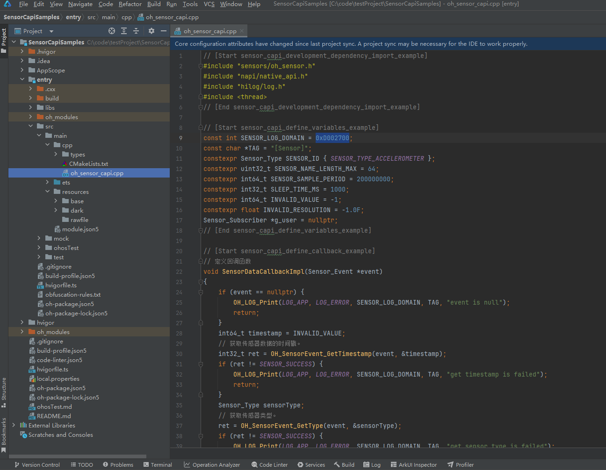

## 场景介绍

当设备需要获取传感器数据时，可以使用sensor模块，例如：通过订阅方向传感器数据感知用户设备当前的朝向，通过订阅计步传感器数据统计用户的步数等。

详细的接口介绍请参考[Sensor](https://developer.huawei.com/consumer/cn/doc/harmonyos-references/capi-sensor)。

## 函数说明

| 名称 | 描述 |
| --- | --- |
| OH\_Sensor\_GetInfos(Sensor\_Info \*\*infos, uint32\_t \*count) | 获取设备上所有传感器的信息。 |
| OH\_Sensor\_Subscribe(const Sensor\_SubscriptionId \*id, const Sensor\_SubscriptionAttribute \*attribute, const Sensor\_Subscriber \*subscriber) | 订阅传感器数据。系统将以指定的频率向用户上报传感器数据。  订阅加速度传感器，需要申请ohos.permission.ACCELEROMETER权限；  订阅陀螺仪传感器，需要申请ohos.permission.GYROSCOPE权限；  订阅计步器相关传感器时，需要申请ohos.permission.ACTIVITY\_MOTION权限；  订阅与健康相关的传感器时，比如心率传感器需要申请ohos.permission.READ\_HEALTH\_DATA权限，否则订阅失败;  订阅其余传感器不需要申请权限。 |
| OH\_Sensor\_Unsubscribe(const Sensor\_SubscriptionId \*id, const Sensor\_Subscriber \*subscriber) | 取消订阅传感器数据。  取消订阅加速度传感器，需要申请ohos.permission.ACCELEROMETER权限；  取消订阅陀螺仪传感器，需要申请ohos.permission.GYROSCOPE权限；  取消订阅计步器相关传感器时，需要申请ohos.permission.ACTIVITY\_MOTION权限；  取消订阅与健康相关的传感器时，需要申请ohos.permission.READ\_HEALTH\_DATA权限，否则取消订阅失败。  取消订阅其余传感器不需要申请权限。 |
| OH\_Sensor\_CreateInfos(uint32\_t count) | 用给定的数字创建一个实例数组，请参考[Sensor\_Info](https://developer.huawei.com/consumer/cn/doc/harmonyos-references/capi-sensor-sensor-info)。 |
| OH\_Sensor\_DestroyInfos(Sensor\_Info \*\*sensors, uint32\_t count) | 销毁实例数组并回收内存，请参考[Sensor\_Info](https://developer.huawei.com/consumer/cn/doc/harmonyos-references/capi-sensor-sensor-info)。 |
| OH\_SensorInfo\_GetName(Sensor\_Info \*sensor, char \*sensorName, uint32\_t \*length) | 获取传感器名称。 |
| OH\_SensorInfo\_GetVendorName(Sensor\_Info\* sensor, char \*vendorName, uint32\_t \*length) | 获取传感器的厂商名称。 |
| OH\_SensorInfo\_GetType(Sensor\_Info\* sensor, Sensor\_Type \*sensorType) | 获取传感器类型。 |
| OH\_SensorInfo\_GetResolution(Sensor\_Info\* sensor, float \*resolution) | 获取传感器分辨率。 |
| OH\_SensorInfo\_GetMinSamplingInterval(Sensor\_Info\* sensor, int64\_t \*minSamplingInterval) | 获取传感器的最小数据上报间隔。 |
| OH\_SensorInfo\_GetMaxSamplingInterval(Sensor\_Info\* sensor, int64\_t \*maxSamplingInterval) | 获取传感器的最大数据上报间隔时间。 |
| OH\_SensorEvent\_GetType(Sensor\_Event\* sensorEvent, Sensor\_Type \*sensorType) | 获取传感器类型。 |
| OH\_SensorEvent\_GetTimestamp(Sensor\_Event\* sensorEvent, int64\_t \*timestamp) | 获取传感器数据的时间戳。 |
| OH\_SensorEvent\_GetAccuracy(Sensor\_Event\* sensorEvent, Sensor\_Accuracy \*accuracy) | 获取传感器数据的精度。 |
| OH\_SensorEvent\_GetData(Sensor\_Event\* sensorEvent, float \*\*data, uint32\_t \*length) | 获取传感器数据。  数据的长度和内容依赖于监听的传感器类型，传感器上报的数据格式如下：  1.SENSOR\_TYPE\_ACCELEROMETER:data[0]、data[1]、data[2]分别表示设备x、y、z轴的加速度分量，单位m/s²；  2.SENSOR\_TYPE\_GYROSCOPE:data[0]、data[1]、data[2]分别表示设备x、y、z轴的旋转角速度，单位弧度/s；  3.SENSOR\_TYPE\_AMBIENT\_LIGHT:data[0]表示环境光强度，单位lux；从API Version 12开始，将返回两个额外的数据，其中data[1]表示色温，单位kelvin；data[2]表示红外亮度，单位cd/m²；  4.SENSOR\_TYPE\_MAGNETIC\_FIELD:data[0]、data[1]、data[2]分别表示设备x、y、z轴的地磁分量，单位微特斯拉；  5.SENSOR\_TYPE\_BAROMETER:data[0]表示气压值，单位hPa；  6.SENSOR\_TYPE\_HALL:data[0]表示皮套吸合状态，0表示打开，大于0表示吸附；  7.SENSOR\_TYPE\_PROXIMITY:data[0]表示接近状态，0表示接近，大于0表示远离；  8.SENSOR\_TYPE\_ORIENTATION:data[0]、data[1]、data[2]分别表示设备绕z、x、y轴的角度，单位度；  9.SENSOR\_TYPE\_GRAVITY:data[0]、data[1]、data[2]分别表示设备x、y、z轴的重力加速度分量，单位m/s²；  10.SENSOR\_TYPE\_ROTATION\_VECTOR:data[0]、data[1]、data[2]分别表示设备x、y、z轴的旋转角度，单位度，data[3]表示旋转向量元素；  11.SENSOR\_TYPE\_PEDOMETER\_DETECTION:data[0]表示计步检测状态，1表示检测到了步数变化；  12.SENSOR\_TYPE\_PEDOMETER:data[0]表示步数；  13.SENSOR\_TYPE\_HEART\_RATE:data[0]表示心率数值。 |
| OH\_Sensor\_CreateSubscriptionId(void) | 创建一个Sensor\_SubscriptionId 实例。 |
| OH\_Sensor\_DestroySubscriptionId(Sensor\_SubscriptionId \*id) | 销毁Sensor\_SubscriptionId 实例并回收内存。 |
| OH\_SensorSubscriptionId\_SetType(Sensor\_SubscriptionId\* id, const Sensor\_Type sensorType) | 设置传感器类型。 |
| OH\_Sensor\_CreateSubscriptionAttribute(void) | 创建Sensor\_SubscriptionAttribute实例。 |
| OH\_Sensor\_DestroySubscriptionAttribute(Sensor\_SubscriptionAttribute \*attribute) | 销毁Sensor\_SubscriptionAttribute实例并回收内存。 |
| OH\_SensorSubscriptionAttribute\_SetSamplingInterval(Sensor\_SubscriptionAttribute\* attribute, const int64\_t samplingInterval) | 设置传感器数据上报间隔。 |
| OH\_Sensor\_CreateSubscriber(void) | 创建一个Sensor\_Subscriber实例。 |
| OH\_Sensor\_DestroySubscriber(Sensor\_Subscriber \*subscriber) | 销毁Sensor\_Subscriber实例并回收内存。 |
| OH\_SensorSubscriber\_SetCallback(Sensor\_Subscriber\* subscriber, const Sensor\_EventCallback callback) | 设置一个回调函数来上报传感器数据。 |

## 开发步骤

开发步骤以加速度传感器为例。

1. 新建一个Native C++工程。

   
2. 配置加速度传感器权限，具体配置方式请参考[声明权限](/docs/dev/app-dev/system/system-security/access-control/app-permission-mgmt/request-app-permissions/declare-permissions)。

   ```
   "requestPermissions": [
     {
       "name": "ohos.permission.ACCELEROMETER"
     }
   ]
   ```

   

<div class="source-link-wrapper"><a href="https://gitcode.com/HarmonyOS_Samples/guide-snippets/blob/HarmonyOS-feature-20260402/Sensor/SensorCapiSamples/entry/src/main/module.json5#L65-L71" target="_blank" rel="noopener noreferrer" class="source-link"><svg class="source-link-icon" width="14" height="14" viewBox="0 0 24 24" fill="none" stroke="currentColor" strokeWidth="2" strokeLinecap="round" strokeLinejoin="round">\<path d="M18 13v6a2 2 0 0 1-2 2H5a2 2 0 0 1-2-2V8a2 2 0 0 1 2-2h6" /\>\<polyline points="15 3 21 3 21 9" /\>\<line x1="10" y1="14" x2="21" y2="3" /\></svg> 查看源码：module.json5</a></div>

3. CMakeLists.txt文件中引入动态依赖库。

   ```
   target_link_libraries(entry PUBLIC libace_napi.z.so)
   target_link_libraries(entry PUBLIC libhilog_ndk.z.so)
   target_link_libraries(entry PUBLIC libohsensor.so)
   ```
4. 在oh\_sensor\_capi.cpp文件中编码，首先导入模块。

   ```
   #include "sensors/oh_sensor.h"
   #include "napi/native_api.h"
   #include "hilog/log.h"
   #include <thread>
   ```

   

<div class="source-link-wrapper"><a href="https://gitcode.com/HarmonyOS_Samples/guide-snippets/blob/HarmonyOS-feature-20260402/Sensor/SensorCapiSamples/entry/src/main/cpp/oh_sensor_capi.cpp#L16-L21" target="_blank" rel="noopener noreferrer" class="source-link"><svg class="source-link-icon" width="14" height="14" viewBox="0 0 24 24" fill="none" stroke="currentColor" strokeWidth="2" strokeLinecap="round" strokeLinejoin="round">\<path d="M18 13v6a2 2 0 0 1-2 2H5a2 2 0 0 1-2-2V8a2 2 0 0 1 2-2h6" /\>\<polyline points="15 3 21 3 21 9" /\>\<line x1="10" y1="14" x2="21" y2="3" /\></svg> 查看源码：oh_sensor_capi.cpp</a></div>

5. 定义常量。

   ```
   const int SENSOR_LOG_DOMAIN = 0xD002700;
   const char *TAG = "[Sensor]";
   constexpr Sensor_Type SENSOR_ID { SENSOR_TYPE_ACCELEROMETER };
   constexpr uint32_t SENSOR_NAME_LENGTH_MAX = 64;
   constexpr int64_t SENSOR_SAMPLE_PERIOD = 200000000;
   constexpr int32_t SLEEP_TIME_MS = 1000;
   constexpr int64_t INVALID_VALUE = -1;
   constexpr float INVALID_RESOLUTION = -1.0F;
   Sensor_Subscriber *g_user = nullptr;
   ```

   

<div class="source-link-wrapper"><a href="https://gitcode.com/HarmonyOS_Samples/guide-snippets/blob/HarmonyOS-feature-20260402/Sensor/SensorCapiSamples/entry/src/main/cpp/oh_sensor_capi.cpp#L23-L33" target="_blank" rel="noopener noreferrer" class="source-link"><svg class="source-link-icon" width="14" height="14" viewBox="0 0 24 24" fill="none" stroke="currentColor" strokeWidth="2" strokeLinecap="round" strokeLinejoin="round">\<path d="M18 13v6a2 2 0 0 1-2 2H5a2 2 0 0 1-2-2V8a2 2 0 0 1 2-2h6" /\>\<polyline points="15 3 21 3 21 9" /\>\<line x1="10" y1="14" x2="21" y2="3" /\></svg> 查看源码：oh_sensor_capi.cpp</a></div>

6. 定义一个回调函数用来接收传感器数据。

   ```
   // 定义回调函数
   void SensorDataCallbackImpl(Sensor_Event *event)
   {
       if (event == nullptr) {
           OH_LOG_Print(LOG_APP, LOG_ERROR, SENSOR_LOG_DOMAIN, TAG, "event is null");
           return;
       }
       int64_t timestamp = INVALID_VALUE;
       // 获取传感器数据的时间戳。
       int32_t ret = OH_SensorEvent_GetTimestamp(event, &timestamp);
       if (ret != SENSOR_SUCCESS) {
           OH_LOG_Print(LOG_APP, LOG_ERROR, SENSOR_LOG_DOMAIN, TAG, "get timestamp failed");
           return;
       }
       Sensor_Type sensorType;
       // 获取传感器类型。
       ret = OH_SensorEvent_GetType(event, &sensorType);
       if (ret != SENSOR_SUCCESS) {
           OH_LOG_Print(LOG_APP, LOG_ERROR, SENSOR_LOG_DOMAIN, TAG, "get sensor type failed");
           return;
       }
       Sensor_Accuracy accuracy = SENSOR_ACCURACY_UNRELIABLE;
       // 获取传感器数据的精度。
       ret = OH_SensorEvent_GetAccuracy(event, &accuracy);
       if (ret != SENSOR_SUCCESS) {
           OH_LOG_Print(LOG_APP, LOG_ERROR, SENSOR_LOG_DOMAIN, TAG, "get sensor accuracy failed");
           return;
       }
       float *data = nullptr;
       uint32_t length = 0;
       // 获取传感器数据。
       ret = OH_SensorEvent_GetData(event, &data, &length);
       if (ret != SENSOR_SUCCESS) {
           OH_LOG_Print(LOG_APP, LOG_ERROR, SENSOR_LOG_DOMAIN, TAG, "get sensor data failed");
           return;
       }
       if (data == nullptr) {
           OH_LOG_Print(LOG_APP, LOG_ERROR, SENSOR_LOG_DOMAIN, TAG, "sensor data is null");
           return;
       }
       OH_LOG_Print(LOG_APP, LOG_INFO, SENSOR_LOG_DOMAIN, TAG,
           "sensorType:%{public}d, dataLen:%{public}d, accuracy:%{public}d", sensorType, length, accuracy);
       for (uint32_t i = 0; i < length; ++i) {
           OH_LOG_Print(LOG_APP, LOG_INFO, SENSOR_LOG_DOMAIN, TAG, "data[%{public}d]:%{public}f", i, data[i]);
       }
   }
   ```

   

<div class="source-link-wrapper"><a href="https://gitcode.com/HarmonyOS_Samples/guide-snippets/blob/HarmonyOS-feature-20260402/Sensor/SensorCapiSamples/entry/src/main/cpp/oh_sensor_capi.cpp#L35-L82" target="_blank" rel="noopener noreferrer" class="source-link"><svg class="source-link-icon" width="14" height="14" viewBox="0 0 24 24" fill="none" stroke="currentColor" strokeWidth="2" strokeLinecap="round" strokeLinejoin="round">\<path d="M18 13v6a2 2 0 0 1-2 2H5a2 2 0 0 1-2-2V8a2 2 0 0 1 2-2h6" /\>\<polyline points="15 3 21 3 21 9" /\>\<line x1="10" y1="14" x2="21" y2="3" /\></svg> 查看源码：oh_sensor_capi.cpp</a></div>

7. 获取设备上所有传感器的信息。

   ```
   static int32_t GetSensorInfo(Sensor_Info *sensorInfoTemp)
   {
       char sensorName[SENSOR_NAME_LENGTH_MAX] = {};
       uint32_t length = SENSOR_NAME_LENGTH_MAX;
       // 获取传感器名称。
       int32_t ret = OH_SensorInfo_GetName(sensorInfoTemp, sensorName, &length);
       if (ret != SENSOR_SUCCESS) {
           OH_LOG_Print(LOG_APP, LOG_ERROR, SENSOR_LOG_DOMAIN, TAG, "get sensor name failed");
           return ret;
       }
       char vendorName[SENSOR_NAME_LENGTH_MAX] = {};
       length = SENSOR_NAME_LENGTH_MAX;
       // 获取传感器的厂商名称。
       ret = OH_SensorInfo_GetVendorName(sensorInfoTemp, vendorName, &length);
       if (ret != SENSOR_SUCCESS) {
           OH_LOG_Print(LOG_APP, LOG_ERROR, SENSOR_LOG_DOMAIN, TAG, "get sensor vendor name failed");
           return ret;
       }
       Sensor_Type sensorType;
       // 获取传感器类型。
       ret = OH_SensorInfo_GetType(sensorInfoTemp, &sensorType);
       if (ret != SENSOR_SUCCESS) {
           OH_LOG_Print(LOG_APP, LOG_ERROR, SENSOR_LOG_DOMAIN, TAG, "get sensor type failed");
           return ret;
       }
       float resolution = INVALID_RESOLUTION;
       // 获取传感器分辨率。
       ret = OH_SensorInfo_GetResolution(sensorInfoTemp, &resolution);
       if (ret != SENSOR_SUCCESS) {
           OH_LOG_Print(LOG_APP, LOG_ERROR, SENSOR_LOG_DOMAIN, TAG, "get sensor resolution failed");
           return ret;
       }
       int64_t minSamplePeriod = INVALID_VALUE;
       // 获取传感器的最小数据上报间隔。
       ret = OH_SensorInfo_GetMinSamplingInterval(sensorInfoTemp, &minSamplePeriod);
       if (ret != SENSOR_SUCCESS) {
           OH_LOG_Print(LOG_APP, LOG_ERROR, SENSOR_LOG_DOMAIN, TAG, "get sensor min sampling interval failed");
           return ret;
       }
       int64_t maxSamplePeriod = INVALID_VALUE;
       // 获取传感器的最大数据上报间隔时间。
       ret = OH_SensorInfo_GetMaxSamplingInterval(sensorInfoTemp, &maxSamplePeriod);
       if (ret != SENSOR_SUCCESS) {
           OH_LOG_Print(LOG_APP, LOG_ERROR, SENSOR_LOG_DOMAIN, TAG, "get sensor max sampling interval failed");
       }
       return ret;
   }

   static napi_value GetSensorInfos(napi_env env, napi_callback_info info)
   {
       uint32_t count = 0;
       // 获取设备上所有传感器的个数。
       int32_t ret = OH_Sensor_GetInfos(nullptr, &count);
       if (ret != SENSOR_SUCCESS) {
           OH_LOG_Print(LOG_APP, LOG_ERROR, SENSOR_LOG_DOMAIN, TAG, "get sensor count failed");
           return nullptr;
       }
       // 用给定的数字创建一个实例数组。
       Sensor_Info **sensors = OH_Sensor_CreateInfos(count);
       if (sensors == nullptr) {
           OH_LOG_Print(LOG_APP, LOG_ERROR, SENSOR_LOG_DOMAIN, TAG, "create sensorInfo array failed");
           return nullptr;
       }
       // 获取设备上所有传感器的信息。
       ret = OH_Sensor_GetInfos(sensors, &count);
       if (ret != SENSOR_SUCCESS) {
           OH_LOG_Print(LOG_APP, LOG_ERROR, SENSOR_LOG_DOMAIN, TAG, "get all sensor info failed");
           return nullptr;
       }
       for (uint32_t i = 0; i < count; ++i) {
           Sensor_Info *sensorInfoTemp = sensors[i];
           ret = GetSensorInfo(sensorInfoTemp);
           if (ret != SENSOR_SUCCESS) {
               OH_LOG_Print(LOG_APP, LOG_ERROR, SENSOR_LOG_DOMAIN, TAG, "get sensor info failed");
               return nullptr;
           }
       }
       OH_LOG_Print(LOG_APP, LOG_INFO, SENSOR_LOG_DOMAIN, TAG, "GetSensorInfos successful");
       // 销毁实例数组并回收内存。
       ret = OH_Sensor_DestroyInfos(sensors, count);
       if (ret != SENSOR_SUCCESS) {
           OH_LOG_Print(LOG_APP, LOG_ERROR, SENSOR_LOG_DOMAIN, TAG, "destroy sensor info failed");
           return nullptr;
       }
       return nullptr;
   }
   ```

   

<div class="source-link-wrapper"><a href="https://gitcode.com/HarmonyOS_Samples/guide-snippets/blob/HarmonyOS-feature-20260402/Sensor/SensorCapiSamples/entry/src/main/cpp/oh_sensor_capi.cpp#L84-L171" target="_blank" rel="noopener noreferrer" class="source-link"><svg class="source-link-icon" width="14" height="14" viewBox="0 0 24 24" fill="none" stroke="currentColor" strokeWidth="2" strokeLinecap="round" strokeLinejoin="round">\<path d="M18 13v6a2 2 0 0 1-2 2H5a2 2 0 0 1-2-2V8a2 2 0 0 1 2-2h6" /\>\<polyline points="15 3 21 3 21 9" /\>\<line x1="10" y1="14" x2="21" y2="3" /\></svg> 查看源码：oh_sensor_capi.cpp</a></div>

8. 订阅和取消订阅传感器数据。

   ```
   static napi_value Subscriber(napi_env env, napi_callback_info info)
   {
       // 创建Sensor_Subscriber实例。
       g_user = OH_Sensor_CreateSubscriber();
       // 设置回调函数来报告传感器数据。
       int32_t ret = OH_SensorSubscriber_SetCallback(g_user, SensorDataCallbackImpl);
       if (ret != SENSOR_SUCCESS) {
           OH_LOG_Print(LOG_APP, LOG_ERROR, SENSOR_LOG_DOMAIN, TAG, "OH_SensorSubscriber_SetCallback failed");
           return nullptr;
       }
       // 创建Sensor_SubscriptionId实例。
       Sensor_SubscriptionId *id = OH_Sensor_CreateSubscriptionId();
       // 设置传感器类型,示例中设置的是SENSOR_TYPE_ACCELEROMETER类型，需开通ohos.permission.ACCELEROMETER权限
       // 参考传感器开发指导中 开发步骤第2点配置加速度传感器权限。
       ret = OH_SensorSubscriptionId_SetType(id, SENSOR_ID);
       if (ret != SENSOR_SUCCESS) {
           OH_LOG_Print(LOG_APP, LOG_ERROR, SENSOR_LOG_DOMAIN, TAG, "OH_SensorSubscriptionId_SetType failed");
           return nullptr;
       }
       // 创建Sensor_SubscriptionAttribute实例。
       Sensor_SubscriptionAttribute *attr = OH_Sensor_CreateSubscriptionAttribute();
       // 设置传感器数据报告间隔。
       ret = OH_SensorSubscriptionAttribute_SetSamplingInterval(attr, SENSOR_SAMPLE_PERIOD);
       if (ret != SENSOR_SUCCESS) {
           OH_LOG_Print(LOG_APP, LOG_ERROR, SENSOR_LOG_DOMAIN, TAG,
               "OH_SensorSubscriptionAttribute_SetSamplingInterval failed");
           return nullptr;
       }
       // 订阅传感器数据。
       ret = OH_Sensor_Subscribe(id, attr, g_user);
       if (ret != SENSOR_SUCCESS) {
           OH_LOG_Print(LOG_APP, LOG_ERROR, SENSOR_LOG_DOMAIN, TAG, "OH_Sensor_Subscribe failed");
           return nullptr;
       }
       OH_LOG_Print(LOG_APP, LOG_INFO, SENSOR_LOG_DOMAIN, TAG, "OH_Sensor_Subscribe successful");
       std::this_thread::sleep_for(std::chrono::milliseconds(SLEEP_TIME_MS));
       // 取消订阅传感器数据。
       ret = OH_Sensor_Unsubscribe(id, g_user);
       if (ret != SENSOR_SUCCESS) {
           OH_LOG_Print(LOG_APP, LOG_ERROR, SENSOR_LOG_DOMAIN, TAG, "OH_Sensor_Unsubscribe failed");
           return nullptr;
       }
       OH_LOG_Print(LOG_APP, LOG_INFO, SENSOR_LOG_DOMAIN, TAG, "OH_Sensor_Unsubscribe successful");
       if (id != nullptr) {
           // 销毁Sensor_SubscriptionId实例。
           OH_Sensor_DestroySubscriptionId(id);
       }
       if (attr != nullptr) {
           // 销毁Sensor_SubscriptionAttribute实例。
           OH_Sensor_DestroySubscriptionAttribute(attr);
       }
       if (g_user != nullptr) {
           // 销毁Sensor_Subscriber实例并回收内存。
           OH_Sensor_DestroySubscriber(g_user);
           g_user = nullptr;
       }
       return nullptr;
   }
   ```

   

<div class="source-link-wrapper"><a href="https://gitcode.com/HarmonyOS_Samples/guide-snippets/blob/HarmonyOS-feature-20260402/Sensor/SensorCapiSamples/entry/src/main/cpp/oh_sensor_capi.cpp#L173-L232" target="_blank" rel="noopener noreferrer" class="source-link"><svg class="source-link-icon" width="14" height="14" viewBox="0 0 24 24" fill="none" stroke="currentColor" strokeWidth="2" strokeLinecap="round" strokeLinejoin="round">\<path d="M18 13v6a2 2 0 0 1-2 2H5a2 2 0 0 1-2-2V8a2 2 0 0 1 2-2h6" /\>\<polyline points="15 3 21 3 21 9" /\>\<line x1="10" y1="14" x2="21" y2="3" /\></svg> 查看源码：oh_sensor_capi.cpp</a></div>

9. 在Init函数中补充接口。

   ```
   EXTERN_C_START
   static napi_value Init(napi_env env, napi_value exports)
   {
       napi_property_descriptor desc[] = {
           {"getSensorInfos", nullptr, GetSensorInfos, nullptr, nullptr, nullptr, napi_default, nullptr},
           {"subscriber", nullptr, Subscriber, nullptr, nullptr, nullptr, napi_default, nullptr}
       };
       napi_define_properties(env, exports, sizeof(desc) / sizeof(desc[0]), desc);
       return exports;
   }
   EXTERN_C_END
   ```

   

<div class="source-link-wrapper"><a href="https://gitcode.com/HarmonyOS_Samples/guide-snippets/blob/HarmonyOS-feature-20260402/Sensor/SensorCapiSamples/entry/src/main/cpp/oh_sensor_capi.cpp#L234-L246" target="_blank" rel="noopener noreferrer" class="source-link"><svg class="source-link-icon" width="14" height="14" viewBox="0 0 24 24" fill="none" stroke="currentColor" strokeWidth="2" strokeLinecap="round" strokeLinejoin="round">\<path d="M18 13v6a2 2 0 0 1-2 2H5a2 2 0 0 1-2-2V8a2 2 0 0 1 2-2h6" /\>\<polyline points="15 3 21 3 21 9" /\>\<line x1="10" y1="14" x2="21" y2="3" /\></svg> 查看源码：oh_sensor_capi.cpp</a></div>

10. 在types/libentry路径下index.d.ts文件中引入Napi接口。

    ```
    export const getSensorInfos: () => object;
    export const subscriber: () => object;
    ```

    

<div class="source-link-wrapper"><a href="https://gitcode.com/HarmonyOS_Samples/guide-snippets/blob/HarmonyOS-feature-20260402/Sensor/SensorCapiSamples/entry/src/main/cpp/types/libentry/Index.d.ts#L16-L19" target="_blank" rel="noopener noreferrer" class="source-link"><svg class="source-link-icon" width="14" height="14" viewBox="0 0 24 24" fill="none" stroke="currentColor" strokeWidth="2" strokeLinecap="round" strokeLinejoin="round">\<path d="M18 13v6a2 2 0 0 1-2 2H5a2 2 0 0 1-2-2V8a2 2 0 0 1 2-2h6" /\>\<polyline points="15 3 21 3 21 9" /\>\<line x1="10" y1="14" x2="21" y2="3" /\></svg> 查看源码：Index.d.ts</a></div>

11. 编写程序入口调用代码。

    ```
    import { BusinessError } from '@kit.BasicServicesKit';
    import { hilog } from '@kit.PerformanceAnalysisKit';
    import sensorCapi from 'libentry.so';

    const DOMAIN = 0xD002700;
    // ...
              try {
                sensorCapi.getSensorInfos();
                // ...
              } catch (error) {
                let e: BusinessError = error as BusinessError;
                hilog.error(DOMAIN, 'testTag', `Failed to invoke getSensorInfos. Code: ${e.code}, message: ${e.message}`);
              }
              // ...
              try {
                sensorCapi.subscriber();
                // ...
              } catch (error) {
                let e: BusinessError = error as BusinessError;
                hilog.error(DOMAIN, 'testTag', `Failed to invoke subscriber. Code: ${e.code}, message: ${e.message}`);
              }
    ```

    

<div class="source-link-wrapper"><a href="https://gitcode.com/HarmonyOS_Samples/guide-snippets/blob/HarmonyOS-feature-20260402/Sensor/SensorCapiSamples/entry/src/main/ets/pages/Index.ets#L16-L71" target="_blank" rel="noopener noreferrer" class="source-link"><svg class="source-link-icon" width="14" height="14" viewBox="0 0 24 24" fill="none" stroke="currentColor" strokeWidth="2" strokeLinecap="round" strokeLinejoin="round">\<path d="M18 13v6a2 2 0 0 1-2 2H5a2 2 0 0 1-2-2V8a2 2 0 0 1 2-2h6" /\>\<polyline points="15 3 21 3 21 9" /\>\<line x1="10" y1="14" x2="21" y2="3" /\></svg> 查看源码：Index.ets</a></div>
