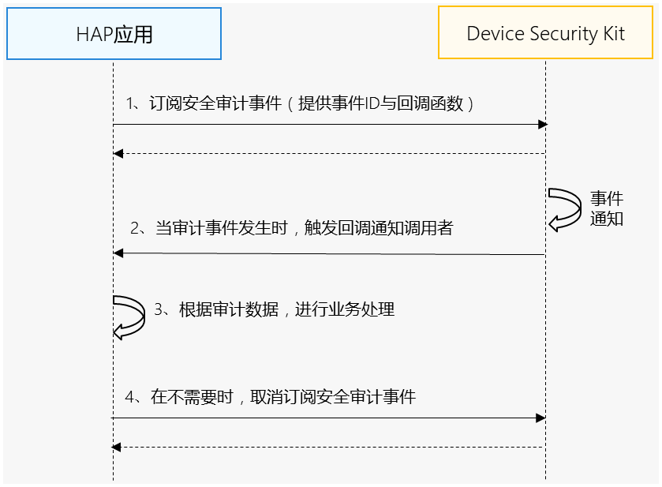

## еңәжҷҜд»Ӣз»Қ

жҸҗдҫӣз»ҹдёҖзҡ„е®үе…Ёе®Ўи®Ўж•°жҚ®еҚ•е®ўжҲ·з«Ҝи®ўйҳ…дёҺеҸ–ж¶Ҳи®ўйҳ…жҺҘеҸЈпјҢеә”з”ЁеҸҜд»ҘиҺ·еҸ–и®ҫеӨҮдёҠзҡ„е®үе…Ёе®Ўи®Ўж•°жҚ®пјҲеҰӮдёӢиЎЁпјүпјҢд»Ҙж”Ҝж’‘е®Ўи®Ўзӣёе…ідёҡеҠЎгҖӮ

| е®Ўи®ЎдәӢ件ID | иҜҙжҳҺ |
| --- | --- |
| 0x027000000 | еүӘеҲҮжқҝеӨҚеҲ¶зІҳиҙҙдәӢ件 |
| 0x810800800 | иҙҰеҸ·зҷ»еҪ•зҷ»еҮәдәӢ件 |
| 0x007000000 | зӘ—еҸЈжҲӘеұҸеҪ•еұҸжҠ•еұҸдәӢ件 |
| 0x00F000000 | 移еҠЁеӯҳеӮЁжҸ’жӢ”дәӢ件пјҢеҰӮUзӣҳгҖҒеӯҳеӮЁеҚЎзӯүе…·жңүеӯҳеӮЁеҠҹиғҪзҡ„еӨ–и®ҫжҸ’жӢ”дәӢ件 |
| 0x02E000000 | жү“еҚ°жңәдәӢ件 |
| 0x01C000007 | ж–Ү件дәӢ件 |
| 0x01C000008 | иҝӣзЁӢеҲӣе»әйҖҖеҮәдәӢ件 |
| 0x01C000009 | зҪ‘з»ңдәӢ件 |
| 0x01C00000A | KIAж–Ү件жӢҰжҲӘдәӢ件 |
| 0x02D000000 | зӣёжңәдәӢ件 |
| 0x010000000 | еә”з”ЁдәӢ件 |
| 0x011000000 | edmдәӢ件 |
| 0x012003000 | иҜҒд№Ұж“ҚдҪңдәӢ件 |
| 0x01C00000B | KIAж–Ү件新еўһдәӢ件 |
| 0x01C00000C | KIAж–Ү件еҸҳз§ҚдәӢ件 |
| 0x01C00000E | зҪ‘з»ңжөҒйҮҸдәӢ件 |
| 0x01C00000F | зҪ‘з»ңиҝһжҺҘдәӢ件 |
| 0x00B000000 | еә”з”ЁжқғйҷҗеҸҳжӣҙдәӢ件 |
| 0x003000001 | DNSе®Ўи®ЎдәӢ件 |

## зәҰжқҹдёҺйҷҗеҲ¶

еҪ“еүҚиғҪеҠӣд»…ж”ҜжҢҒ2in1и®ҫеӨҮгҖӮ

## дёҡеҠЎжөҒзЁӢ



**жөҒзЁӢиҜҙжҳҺпјҡ**

1. ејҖеҸ‘иҖ…еә”з”Ёи®ўйҳ…е®үе…Ёе®Ўи®Ўж•°жҚ®гҖӮ
2. Device Security Kitи°ғз”Ёеӣһи°ғеҮҪж•°йҖҡзҹҘејҖеҸ‘иҖ…еә”з”ЁпјҢејҖеҸ‘иҖ…еә”з”Ёж №жҚ®е®Ўи®Ўж•°жҚ®иҝӣиЎҢдёҡеҠЎеӨ„зҗҶгҖӮ
3. еҪ“ејҖеҸ‘иҖ…еә”з”ЁдёҚйңҖиҰҒдҪҝз”ЁиҜҘе®Ўи®Ўж•°жҚ®ж—¶пјҢеҸ–ж¶Ҳи®ўйҳ…е®үе…Ёе®Ўи®Ўж•°жҚ®гҖӮ

## жҺҘеҸЈиҜҙжҳҺ

д»ҘдёӢжҳҜе®үе…Ёе®Ўи®Ўж•°жҚ®и®ўйҳ…дёҺеҸ–ж¶Ҳи®ўйҳ…жҺҘеҸЈпјҢжӣҙеӨҡжҺҘеҸЈеҸҠдҪҝз”Ёж–№жі•иҜ·еҸӮи§Ғ[APIеҸӮиҖғ](https://developer.huawei.com/consumer/cn/doc/harmonyos-references/devicesecurity-securityaudit-api#onauditeventoccur)гҖӮ

| жҺҘеҸЈеҗҚ | жҸҸиҝ° |
| --- | --- |
| on(type: 'auditEventOccur', auditEventInfo: AuditEventInfo, callback: Callback\<AuditEvent\>): void | и®ўйҳ…е®үе…Ёе®Ўи®Ўж•°жҚ® |
| off(type: 'auditEventOccur', auditEventInfo: AuditEventInfo, callback?: Callback\<AuditEvent\>): void | еҸ–ж¶Ҳи®ўйҳ…е®үе…Ёе®Ўи®Ўж•°жҚ® |

## ејҖеҸ‘жӯҘйӘӨ


* еңЁејҖеҸ‘еҮҶеӨҮиҝҮзЁӢдёӯпјҢйңҖиҰҒз”іиҜ·жқғйҷҗпјҡohos.permission.QUERY\_AUDIT\_EVENTгҖӮ
* еҸӘе…Ғи®ёжё…еҚ•еҶ…зҡ„дјҒдёҡзұ»еә”з”Ёз”іиҜ·иҜҘжқғйҷҗпјҢз”іиҜ·ж–№ејҸиҜ·еҸӮиҖғпјҡ[з”іиҜ·дҪҝз”ЁдјҒдёҡзұ»еә”з”ЁеҸҜз”Ёжқғйҷҗ](/docs/dev/app-dev/system/system-security/access-control/app-permission-mgmt/app-permissions/permissions-for-enterprise-apps)гҖӮ

1. еҜје…ҘDevice Security KitжЁЎеқ—еҸҠзӣёе…іе…¬е…ұжЁЎеқ—гҖӮ

   ```
   import { securityAudit } from '@kit.DeviceSecurityKit';
   import { BusinessError} from '@kit.BasicServicesKit';
   import { hilog } from '@kit.PerformanceAnalysisKit';
   ```
2. и®ўйҳ…е®үе…Ёе®Ўи®ЎдәӢ件гҖӮ

   ```
   const TAG = "SecurityAuditJsTest";
   const callback = (event: securityAudit.AuditEvent) => {
     hilog.info(0x0000, TAG, '%{public}s', 'Security_SecurityAudit_JsApi_Func eventId= ' + event.eventId);
     hilog.info(0x0000, TAG, '%{public}s', 'Security_SecurityAudit_JsApi_Func version= ' + event.version);
     hilog.info(0x0000, TAG, '%{public}s', 'Security_SecurityAudit_JsApi_Func content= ' + event.content);
     hilog.info(0x0000, TAG, '%{public}s', 'Security_SecurityAudit_JsApi_Func timestamp= ' + event.timestamp);
     hilog.info(0x0000, TAG, '%{public}s', 'Security_SecurityAudit_JsApi_Func userId= ' + event.userId);
     hilog.info(0x0000, TAG, '%{public}s', 'Security_SecurityAudit_JsApi_Func deviceId= ' + event.deviceId);
   };
   let auditEventInfo: securityAudit.AuditEventInfo = {
      eventId: 0x810800800
   };

   try {
     hilog.info(0x0000, TAG, 'on begin.');
     securityAudit.on('auditEventOccur', auditEventInfo, callback);
     hilog.info(0x0000, TAG, 'Succeeded in on.');
   } catch (err) {
     let e: BusinessError = err as BusinessError;
     hilog.error(0x0000, TAG, 'on failed: %{public}d %{public}s', e.code, e.message);
   }
   ```
3. еҸ–ж¶Ҳи®ўйҳ…е®үе…Ёе®Ўи®ЎдәӢ件гҖӮ

   ```
   try {
     hilog.info(0x0000, TAG, 'off begin.');
     securityAudit.off('auditEventOccur', auditEventInfo, callback);
     hilog.info(0x0000, TAG, 'Succeeded in off.');
   } catch (err) {
     let e: BusinessError = err as BusinessError;
     hilog.error(0x0000, TAG, 'off failed: %{public}d %{public}s', e.code, e.message);
   }
   ```
