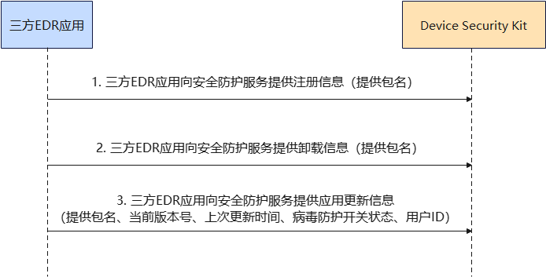
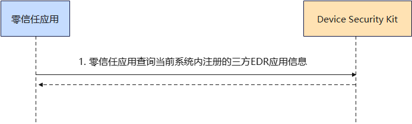
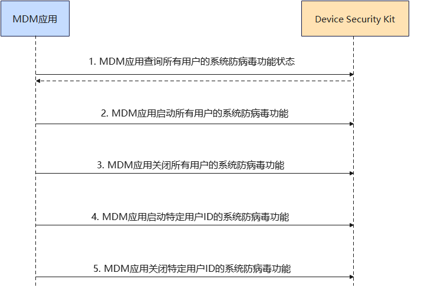

## 场景介绍

从6.0.0(20)开始，三方EDR（Endpoint Detection and Response）应用在Device Security Kit上注册后，可以调用注册、更新、卸载（删除数据）接口，将自身应用信息提交至HarmonyOS安全防护服务进行统一管理；零信任应用在Device Security Kit上注册后，可以查询所有注册的EDR信息列表（包含包名、当前版本号、上次更新时间、病毒防护开关状态、用户ID）；MDM应用在Device Security Kit上注册后，企业管理员可通过MDM（Mobile Device Management）应用启用或禁用HarmonyOS自带的安全防护服务。

## 约束与限制

1. 当前能力仅支持PC/2in1设备。
2. 不支持并发场景，同一时间仅允许一个三方EDR应用或MDM应用调用该模块接口。

## 业务流程







**流程说明**：

1. 三方EDR应用注册、更新、卸载时调用该模块接口向HarmonyOS安全防护服务进行应用信息同步。
2. 零信任应用调用该模块接口查询当前注册的所有三方EDR应用的信息。
3. MDM应用调用该模块接口实现HarmonyOS安全防护功能的启停。

## 接口说明

以下是病毒防护服务管理的相关接口，更多接口及使用方法请参见[API参考](https://developer.huawei.com/consumer/cn/doc/harmonyos-references/devicesecurity-capi-securityantivirus)。

| 接口名 | 描述 |
| --- | --- |
| SecurityAntivirus\_ErrCode HMS\_SecurityAntivirus\_RegisterAntivirus(const char\* bundleName) | 三方EDR应用向HarmonyOS安全防护服务注册。 |
| SecurityAntivirus\_ErrCode HMS\_SecurityAntivirus\_UnregisterAntivirus(const char\* bundleName) | 三方EDR应用从HarmonyOS安全防护服务注销。 |
| SecurityAntivirus\_ErrCode HMS\_SecurityAntivirus\_UpdateAntivirus(const SecurityAntivirus\_Antivirus\* antivirus) | 三方EDR应用向HarmonyOS安全防护服务更新自身应用信息，包含包名、当前版本号、上次更新时间、病毒防护开关状态、用户ID。 |
| SecurityAntivirus\_ErrCode HMS\_SecurityAntivirus\_QueryAntivirus(SecurityAntivirus\_Antivirus\*\* list, uint32\_t\* length) | 零信任应用向HarmonyOS安全防护服务查询当前所有三方EDR注册信息。 |
| SecurityAntivirus\_ErrCode HMS\_SecurityAntivirus\_QueryPreinstalledAntivirus  (SecurityAntivirus\_Antivirus\*\* list, uint32\_t\* length) | MDM应用向HarmonyOS安全防护服务查询所有用户的防病毒功能状态。 |
| SecurityAntivirus\_ErrCode HMS\_SecurityAntivirus\_EnablePreinstalledAntivirus(void) | MDM应用启用HarmonyOS安全防护服务所有用户的防病毒功能。 |
| SecurityAntivirus\_ErrCode HMS\_SecurityAntivirus\_DisablePreinstalledAntivirus(void) | MDM应用禁用HarmonyOS安全防护服务所有用户的防病毒功能。 |
| SecurityAntivirus\_ErrCode HMS\_SecurityAntivirus\_EnablePreinstalledAntivirusByAccount(int32\_t accountId) | MDM应用启用HarmonyOS安全防护服务中用户ID为accountId的防病毒功能。 |
| SecurityAntivirus\_ErrCode HMS\_SecurityAntivirus\_DisablePreinstalledAntivirusByAccount(int32\_t accountId) | MDM应用禁用HarmonyOS安全防护服务中用户ID为accountId的防病毒功能。 |

## 开发步骤


* 在开发准备过程中，需要申请权限：ohos.permission.REGISTER\_ANTIVIRUS、ohos.permission.MANAGE\_ANTIVIRUS、ohos.permission.MANAGE\_PREINSTALLED\_ANTIVIRUS。
* 只允许名单内的应用申请该权限，申请方式请参考：[申请使用企业类应用可用权限](https://developer.huawei.com/consumer/cn/doc/harmonyos-guides/permissions-for-enterprise-apps)，[申请使用仅MDM应用可用权限](https://developer.huawei.com/consumer/cn/doc/harmonyos-guides/permissions-for-mdm-apps)

1. 在CMakeLists.txt中导入病毒防护服务管理共享库，并链接该库。

   ```
   find_library(dsm-lib libsecurityantivirus_ndk.z.so)
   target_link_libraries(entry PUBLIC libace_napi.z.so ${dsm-lib})
   ```
2. 导入病毒防护服务管理的头文件。

   ```
   #include <cstdio>
   #include <cstdlib>
   #include "DeviceSecurityKit/security_antivirus.h"
   ```
3. EDR应用执行接口调用，分别向HarmonyOS安全防护服务中同步注册、卸载、更新信息，需要ohos.permission.REGISTER\_ANTIVIRUS权限。

   ```
   const char *regisBundleName = GetStringFromJS(env, args[0]); // 构造注册接口入参
   int ret = HMS_SecurityAntivirus_RegisterAntivirus(regisBundleName);
   printf("HMS_SecurityAntivirus_RegisterAntivirus ret = %d \n", ret);

   const char *unRegisBundleName = GetStringFromJS(env, args[0]); // 构造卸载接口入参
   ret = HMS_SecurityAntivirus_UnregisterAntivirus(unRegisBundleName);
   printf("HMS_SecurityAntivirus_UnregisterAntivirus ret = %d \n", ret);

   SecurityAntivirus_Antivirus updateAntivirus; // 构造更新接口入参
   ret = HMS_SecurityAntivirus_UpdateAntivirus(&updateAntivirus);
   printf("HMS_SecurityAntivirus_UpdateAntivirus ret = %d \n", ret);
   ```
4. 零信任应用执行接口调用，查询当前所有在HarmonyOS安全防护服务中注册的三方EDR应用信息，需要ohos.permission.MANAGE\_ANTIVIRUS权限。

   

   零信任应用在根据应用进程信息进行业务处理后，需要释放查询接口出入参的内存。

   ```
   SecurityAntivirus_Antivirus *list = nullptr; // 构造查询接口出参1
   uint32_t length = 0; // 构造查询接口出参2
   int ret = HMS_SecurityAntivirus_QueryAntivirus(&list, &length);
   printf("HMS_SecurityAntivirus_QueryAntivirus ret = %d \n", ret);
   for (uint32_t i = 0; i < length; ++i) {
       free((char*)(list[i].bundleName)); // 释放出参内部字符串
       free((char*)(list[i].metadata));
   }
   free(list); // 释放出参数组本身
   ```
5. MDM应用执行接口调用，实现HarmonyOS安全防护服务的启停，需要ohos.permission.MANAGE\_PREINSTALLED\_ANTIVIRUS权限。

   

   MDM应用在根据应用进程信息进行业务处理后，需要释放查询接口出入参的内存。

   ```
   SecurityAntivirus_Antivirus *list = nullptr; // 构造查询接口出参1
   uint32_t length = 0; // 构造查询接口出参2
   int ret = HMS_SecurityAntivirus_QueryPreinstalledAntivirus(&list, &length);
   printf("HMS_SecurityAntivirus_QueryPreinstalledAntivirus ret = %d \n", ret);
   for (uint32_t i = 0; i < length; ++i) {
       free((char*)(list[i].bundleName)); // 释放出参内部字符串
       free((char*)(list[i].metadata));
   }
   free(list); // 释放出参数组本身

   ret = HMS_SecurityAntivirus_EnablePreinstalledAntivirus();
   printf("HMS_SecurityAntivirus_EnablePreinstalledAntivirus ret = %d \n", ret);

   ret = HMS_SecurityAntivirus_DisablePreinstalledAntivirus();
   printf("HMS_SecurityAntivirus_DisablePreinstalledAntivirus ret = %d \n", ret);

   int32_t accountId = 0; // 构造合法的用户ID
   ret = HMS_SecurityAntivirus_EnablePreinstalledAntivirusByAccount(accountId);
   printf("HMS_SecurityAntivirus_EnablePreinstalledAntivirusByAccount ret = %d \n", ret);

   ret = HMS_SecurityAntivirus_DisablePreinstalledAntivirusByAccount(accountId );
   printf("HMS_SecurityAntivirus_DisablePreinstalledAntivirusByAccount ret = %d \n", ret);
   ```
