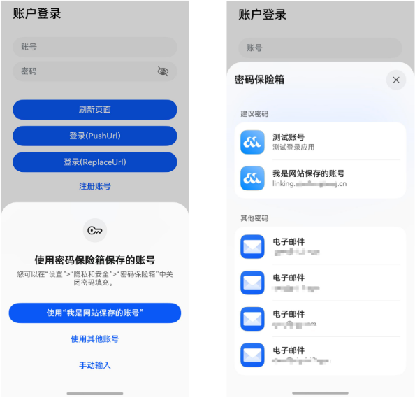
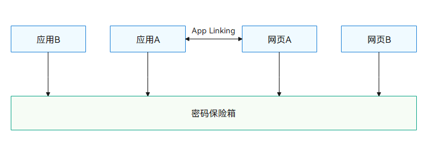

## 简介

密码保险箱支持在应用和网页中保存和填充账号密码，为了提供更好的密码管理体验，提供了应用和网页共用账号数据的能力。

当接入本能力后，触发填充能力将优先推荐当前应用/网页的保存的账号，如当前应用/网页没有保存的账号时，则会推荐关联网页/应用的账号。

同时，选择密码时也会将关联网站/应用的密码展示为推荐密码。

## 适用场景

当应用和网页均存在账号密码登录场景，且已经接入密码保险箱能力的情况下，期望其中一方保存密码之后，能够直接在另一方进行使用时，可以通过本能力进行实现。

## 接入方式

应用及网页接入App Linking后绑定关联关系，密码保险箱将基于这个关系完成识别。

完成如下配置，即可实现共用密码的能力：

1. 应用和网页均已接入密码保险箱自动填充能力。

   接入参考：[应用接入密码保险箱](/docs/dev/app-dev/system/system-security/passwordvault/passwordvault-apps/passwordvault-quick-adaptation)、[网页接入密码保险箱](/docs/dev/app-dev/system/system-security/passwordvault/arkweb-access-password-safe)
2. 应用和网页通过App Linking完成关联关系的绑定。

   接入需完成三步：[在AGC控制台开通App Linking服务](/docs/dev/app-dev/application-services/app-linking-kit-guide/applinking-preparations/applinking-enable-applinking) > [建立域名与应用关联关系](/docs/dev/app-dev/application-services/app-linking-kit-guide/app-linking-startupapp#建立域名与应用关联关系) > [在AGC为应用创建关联的网址域名](/docs/dev/app-dev/application-services/app-linking-kit-guide/app-linking-startupapp#在agc为应用创建关联的网址域名)
