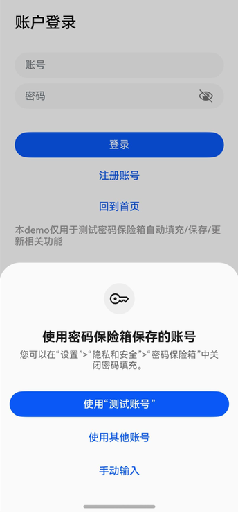
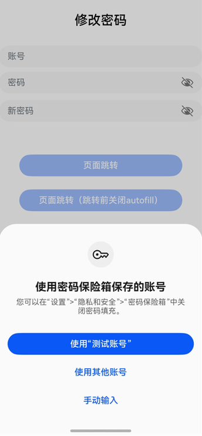

密码保险箱可以在登录或修改密码时，自动填充已保存的用户名和密码。

**触发条件及注意事项：**

* **已设置锁屏密码**并且开启密码保险箱中“自动填充和保存”开关。
* 界面中必须同时存在type为InputType.USER\_NAME（表示用户名输入框）和InputType.Password（表示普通密码输入框）的TextInput输入框组件。

  具体类型请参考[输入框类型说明](/docs/dev/app-dev/system/system-security/passwordvault/passwordvault-apps/passwordvault-quick-adaptation#约束与限制)。
* TextInput组件的enableAutoFill属性的值为true（默认true）。
* 密码保险箱中已保存过当前应用的用户名和密码。
* 用户在界面中首次点击用户名输入框或密码输入框时触发自动填充弹窗。

## 登录



示例代码如下：

```
@Entry
@Component
struct LoginExample {
  pathInfos: NavPathStack = new NavPathStack();
  @State ReserveAccount: string = '';
  @State ReservePassword: string = '';

  @Builder
  PageMap(name: string) {
    if (name === 'home_page') {
      HomePage()
    }
  }

  build() {
    Navigation(this.pathInfos) {
      Column() {
        Text("账户登录")
          .commonTitleStyles()

        TextInput({ placeholder: '用户名' })
          .commonInputStyles()
          .type(InputType.USER_NAME)// 账号框使用USER_NAME属性
          .onChange((value: string) => {
            this.ReserveAccount = value;
          })

        TextInput({ placeholder: '密码' })
          .showPasswordIcon(true)
          .commonInputStyles()
          .type(InputType.Password)// 密码框使用Password属性
          .onChange((value: string) => {
            this.ReservePassword = value;
          })

        Button('登录')
          .commonButtonStyles()
          .enabled((this.ReserveAccount !== '') && (this.ReservePassword !== ''))
          .onClick(() => {
            this.pathInfos.pushPathByName('home_page', null)
          })
      }
    }
    .navDestination(this.PageMap)
    .height('100%')
    .width('100%')
  }
}

@Component
struct HomePage {
  pathInfos: NavPathStack = new NavPathStack();

  build() {
    NavDestination() {
      Column() {
        Text("Home Page").commonTitleStyles()
      }.width('100%').height('100%')
    }.title("Home Page")
    .onReady((context: NavDestinationContext) => {
      this.pathInfos = context.pathStack;
    })
  }
}

@Extend(Text)
function commonTitleStyles() {
  .fontSize(24)
  .fontColor('#000000')
  .fontWeight(FontWeight.Medium)
  .margin({ top: 24, bottom: 16 })
}

@Extend(TextInput)
function commonInputStyles() {
  .placeholderColor(0x182431)
  .width('100%')
  .opacity(0.6)
  .placeholderFont({ size: 16, weight: FontWeight.Regular })
  .margin({ top: 16 })
}

@Extend(Button)
function commonButtonStyles() {
  .width('100%')
  .height(40)
  .borderRadius(20)
  .margin({ top: 24 })
}
```

## 修改密码



示例代码如下：

```
@Entry
@Component
struct RegisterExample {
  pathInfos: NavPathStack = new NavPathStack();
  @State ReserveAccount: string = '';
  @State ReservePassword: string = '';
  @State enableAutoFill: boolean = true;

  onBackPress() {
    // 当非成功登录、返回等页面跳转时，将enableAutoFill设置为false，密码保险箱将不启用自动填充功能
    this.enableAutoFill = false;
    return false;
  }

  @Builder
  PageMap(name: string) {
    if (name === 'register_result_page') {
      RegisterResultPage()
    }
  }

  build() {
    Navigation(this.pathInfos) {
      Column() {
        Text("修改密码")
          .commonTitleStyles()

        TextInput({ placeholder: '用户名' })
          .commonInputStyles()
          .type(InputType.USER_NAME) // 账号框使用USER_NAME属性
          .onChange((value: string) => {
            this.ReserveAccount = value;
          })

        TextInput({ placeholder: '密码' })
          .showPasswordIcon(true)
          .commonInputStyles()
          .type(InputType.Password)
          .onChange((value: string) => {
            this.ReservePassword = value;
          })

        TextInput({ placeholder: '新密码' })
          .showPasswordIcon(true)
          .commonInputStyles()
          .type(InputType.NEW_PASSWORD) // 密码框使用NEW_PASSWORD属性，可以触发生成强密码。
          .enableAutoFill(this.enableAutoFill)
          .passwordRules('begin:[upper],special:[yes],len:[maxlen:32,minlen:12]')
          .onChange((value: string) => {
            this.ReservePassword = value;
          })

        Button('页面跳转')
          .commonButtonStyles()
          .enabled((this.ReserveAccount !== '') && (this.ReservePassword !== ''))
          .onClick(() => {
            this.pathInfos.pushPathByName('register_result_page', null)
          })

        Button('页面跳转（跳转前关闭autofill）')
          .commonButtonStyles()
          .enabled((this.ReserveAccount !== '') && (this.ReservePassword !== ''))
          .onClick(() => {
            this.enableAutoFill = false;
            this.pathInfos.pushPathByName('register_result_page', null)
          })
      }
    }
    .navDestination(this.PageMap)
    .height('100%')
    .width('100%')
  }
}

@Component
struct RegisterResultPage {
  pathInfos: NavPathStack = new NavPathStack();

  build() {
    NavDestination() {
      Column() {
        Text("Result Page").commonTitleStyles()
      }.width('100%').height('100%')
    }.title("Result Page")
    .onReady((context: NavDestinationContext) => {
      this.pathInfos = context.pathStack;
    })
  }
}

@Extend(Text)
function commonTitleStyles() {
  .fontSize(24)
  .fontColor('#000000')
  .fontWeight(FontWeight.Medium)
  .margin({ top: 24, bottom: 16 })
}

@Extend(TextInput)
function commonInputStyles() {
  .placeholderColor(0x182431)
  .width('100%')
  .opacity(0.6)
  .placeholderFont({ size: 16, weight: FontWeight.Regular })
  .margin({ top: 16 })
}

@Extend(Button)
function commonButtonStyles() {
  .width('100%')
  .height(40)
  .borderRadius(20)
  .margin({ top: 24 })
}
```
