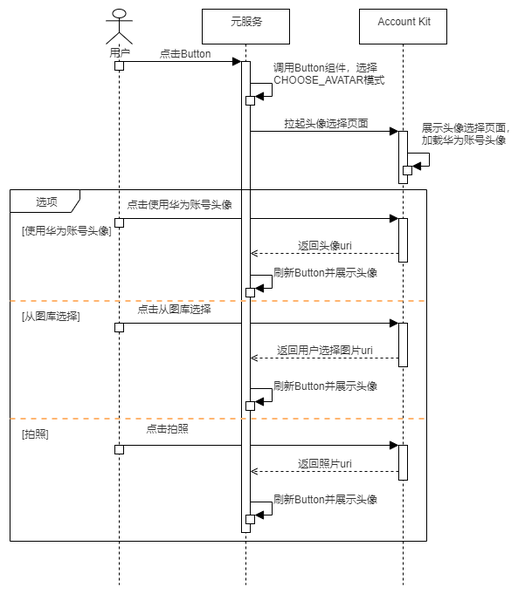

## 场景介绍

如元服务需要完善用户头像信息，可通过调用Scenario Fusion Kit提供的选择头像Button，拉起Account Kit头像选择页面，供用户完成华为账号头像或其他头像的选择，实现头像信息获取与展示。

## 业务流程

流程说明：

1. 元服务调用Scenario Fusion Kit对应的Button组件，选择CHOOSE\_AVATAR模式。
2. 用户点击Button，拉起头像选择页面。
3. 用户有三种获取头像的方式：使用华为账号头像、从图库选择、拍照，用户选择其中一种方式后，Account Kit返回头像uri给Button，元服务刷新Button并展示头像。

   

   使用华为账号头像时，如果用户更新头像，原用户头像链接会立即失效。为确保头像正常显示，建议先将头像下载保存后再使用，避免因用户头像链接失效而影响业务流程。

## 开发前提

在进行代码开发前，请确保已按照“开发准备”章节中的指导完成[配置签名和指纹](https://developer.huawei.com/consumer/cn/doc/atomic-guides/account-atomic-sign-fingerprints)、[配置Client ID](https://developer.huawei.com/consumer/cn/doc/atomic-guides/account-atomic-client-id)。该场景无需申请账号权限。

## 开发步骤

开发者可参考Scenario Fusion Kit的[选择头像Button](https://developer.huawei.com/consumer/cn/doc/harmonyos-guides/scenario-fusion-button-chooseavatar)开发指南完成代码开发。
