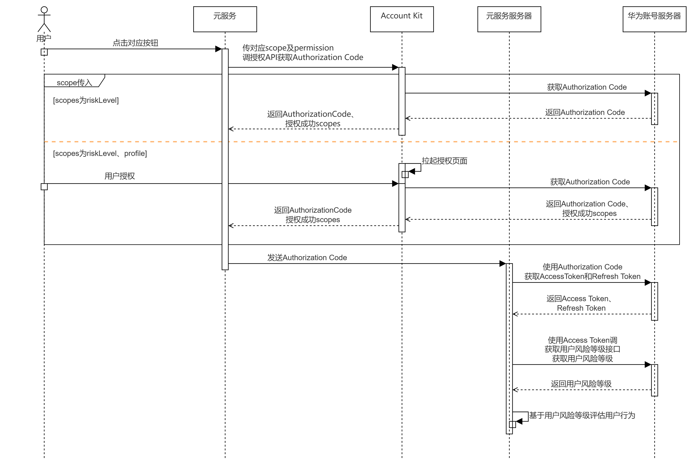

## 场景介绍

当元服务需要获取用户风险等级时，可使用Account Kit提供的获取用户风险等级能力，用于以下恶意场景识别：

1. 元服务登录风控场景：元服务使用华为账号关联登录时，获取华为账号风险等级，对高风险等级账号进行风控，提升元服务的安全等级。
2. 营销活动反作弊场景：元服务营销活动期间，如进行商户补贴、优惠券发放等商业营销活动时获取华为账号风险等级，协助开发者有效识别“薅羊毛”风险；保护营销资源合理使用，降低业务安全问题给营销方带来的损失，为相关活动保驾护航。

Account Kit提供的风险等级如下：

| 风险等级 | 说明 | 建议处置方案 |
| --- | --- | --- |
| 0 | 未发现显著风险项。例如通过合法途径注册，正常使用华为手机，无批量操作、使用自动机、养号等异常行为。 | 建议确认无风险后放通。 |
| 1 | 低风险。发现风险因素，结合总体评分后风险较低。 | 建议进行简单验证（如验证码、短信等），或人工审核。 |
| 2 | 中风险。发现风险因素，结合总体评分后风险中等。 | 建议根据业务场景采取一定措施规避伤害。例如，营销活动可降低高等级奖励的概率、打榜类活动对此类投票降低权重、登录注册要求二次验证等。 |
| 3 | 高风险。发现风险因素，结合总体评分后风险较高。 | 建议业务逻辑直接拦截。例如，红包类活动返回不中奖或最小额红包、打榜类活动不计算票数、登录/注册操作要求二次验证、高危业务可选择限制本次操作。 |
| 4 | 未知。暂无明确风险等级。 | 建议结合账号历史行为及业务场景做出最终决策。 |

## 约束与限制

获取用户风险等级scope仅支持与openid、profile组合使用，如果需要同时获取手机号和风险等级可参考场景化控件[获取手机号和风险等级Button](https://developer.huawei.com/consumer/cn/doc/harmonyos-guides/scenario-fusion-button-get-risklevel)，接口支持的全量scopes见[scope列表](https://developer.huawei.com/consumer/cn/doc/harmonyos-references/account-api-authentication#authorizationwithhuaweiidrequest)。

## 业务流程



流程说明：

1. 元服务通过传对应scope和permission调用授权API，如果已授权则直接返回临时登录凭证Authorization Code，如果未授权：

   1. scope传入riskLevel，则授权API直接返回Authorization Code。
   2. scope传入riskLevel、profile，则拉起授权页，用户点击同意后授权API返回Authorization Code。
2. 将Authorization Code传给服务端，使用Client ID、Client Secret、Authorization Code从华为账号服务器中获取Access Token，再使用Access Token请求获取用户的华为账号风险等级。

## 接口说明

获取用户风险等级关键接口如下表所示，具体API说明详见[API参考](https://developer.huawei.com/consumer/cn/doc/harmonyos-references/account-api-authentication)。

| 接口名 | 描述 |
| --- | --- |
| [createAuthorizationWithHuaweiIDRequest](https://developer.huawei.com/consumer/cn/doc/harmonyos-references/account-api-authentication#createauthorizationwithhuaweiidrequest)(): [AuthorizationWithHuaweiIDRequest](https://developer.huawei.com/consumer/cn/doc/harmonyos-references/account-api-authentication#authorizationwithhuaweiidrequest) | 获取授权接口，通过[AuthorizationWithHuaweiIDRequest](https://developer.huawei.com/consumer/cn/doc/harmonyos-references/account-api-authentication#authorizationwithhuaweiidrequest)传入风险等级的scope：riskLevel及Authorization Code的permission：serviceauthcode，即可在授权结果中获取到Authorization Code。 |
| [constructor](https://developer.huawei.com/consumer/cn/doc/harmonyos-references/account-api-authentication#constructor)(context?: [common.Context](https://developer.huawei.com/consumer/cn/doc/harmonyos-references/js-apis-app-ability-common#context)) | 创建授权请求Controller。 |
| [executeRequest](https://developer.huawei.com/consumer/cn/doc/harmonyos-references/account-api-authentication#executerequest-1)(request: [AuthenticationRequest](https://developer.huawei.com/consumer/cn/doc/harmonyos-references/account-api-authentication#authenticationrequest)): Promise<[AuthenticationResponse](https://developer.huawei.com/consumer/cn/doc/harmonyos-references/account-api-authentication#authenticationresponse)> | 通过Promise方式执行授权操作。可从[AuthenticationResponse](https://developer.huawei.com/consumer/cn/doc/harmonyos-references/account-api-authentication#authenticationresponse)的子类[AuthorizationWithHuaweiIDResponse](https://developer.huawei.com/consumer/cn/doc/harmonyos-references/account-api-authentication#authorizationwithhuaweiidresponse)中解析[AuthorizationWithHuaweiIDCredential](https://developer.huawei.com/consumer/cn/doc/harmonyos-references/account-api-authentication#authorizationwithhuaweiidcredential)，其中包含authorizedScopes，可确认风险等级是否授权成功。具体解析方法请参考[客户端开发](#客户端开发)的示例代码。 |

## 开发前提

1. 在进行代码开发前，请确保已按照“开发准备”章节中的指导完成[配置签名和指纹](https://developer.huawei.com/consumer/cn/doc/atomic-guides/account-atomic-sign-fingerprints)、[配置Client ID](https://developer.huawei.com/consumer/cn/doc/atomic-guides/account-atomic-client-id)。
2. 元服务在使用获取风险等级能力之前，需要完成对应的scope权限申请。

   scope权限申请审批未完成或未通过，将报错[1001502014 应用未申请scopes或permissions权限](https://developer.huawei.com/consumer/cn/doc/atomic-guides/account-guide-atomic-faq#section1001502014-应用未申请scopes或permissions权限的可能原因和解决方法)。当前可通过发送邮件至accountkit@huawei.com进行申请。

   请提供如下信息进行申请，我们会在1-2个工作日内回复申请结果，请您留意邮箱消息。

   **邮件主题**：【获取风险等级】权限申请

   **邮件正文**：（请在正文中描述下具体希望申请的权限）

   **企业名称**：\*\*\*

   **元服务名称**：\*\*\*

   **元服务包名**：com.\*\*\*.\*\*\*

   **APP ID**：1\*\*\*\*12

   **Client ID**：1\*\*\*\*14

   **背景介绍** ：（请提供元服务简单介绍，便于快速了解）

   **使用场景**：（请提供相关使用场景的文字描述、交互流程图或参考交互视频等，可提供类似元服务的使用场景进行说明）

   **使用该权限的必要性**：（请提供元服务需要该权限和信息的必要性）

## 客户端开发

1. 导入[authentication](https://developer.huawei.com/consumer/cn/doc/harmonyos-references/account-api-authentication)模块及相关公共模块。

   ```
   import { authentication } from '@kit.AccountKit';
   import { hilog } from '@kit.PerformanceAnalysisKit';
   import { util } from '@kit.ArkTS';
   import { BusinessError } from '@kit.BasicServicesKit';
   ```
2. 创建授权请求并设置参数。

   ```
   // 创建授权请求，并设置参数
   const authRequest = new authentication.HuaweiIDProvider().createAuthorizationWithHuaweiIDRequest();
   // 获取风险等级需要传如下scope
   authRequest.scopes = ['riskLevel'];
   // 获取authorizationCode需传如下permission
   authRequest.permissions = ['serviceauthcode'];
   // 用户是否需要登录授权，该值为true且用户未登录或未授权时，会拉起用户登录或授权页面
   authRequest.forceAuthorization = true;
   // 建议使用generateRandomUUID生成state，可用于一致性比对，防止跨站攻击
   authRequest.state = util.generateRandomUUID();
   ```
3. 调用[AuthenticationController](https://developer.huawei.com/consumer/cn/doc/harmonyos-references/account-api-authentication#authenticationcontroller)对象的[executeRequest](https://developer.huawei.com/consumer/cn/doc/harmonyos-references/account-api-authentication#executerequest-1)方法执行授权请求，并处理授权结果，从授权结果中解析出authorizedScopes和Authorization Code。

   ```
   // 执行授权请求
   try {
     // 此示例为代码片段，实际需在自定义组件实例中使用，并传入有效的Context上下文对象
     const controller = new authentication.AuthenticationController(this.getUIContext().getHostContext());
     controller.executeRequest(authRequest).then((data) => {
       const authorizationWithHuaweiIDResponse = data as authentication.AuthorizationWithHuaweiIDResponse;
       const state = authorizationWithHuaweiIDResponse.state;
       if (state && authRequest.state !== state) {
         hilog.error(0x0000, 'testTag', `Failed to authorize. The state is different, response state: ${state}`);
         return;
       }
       hilog.info(0x0000, 'testTag', 'Succeeded in authentication.');
       let riskLevelAuthorized: boolean = false;
       const authorizationWithHuaweiIDCredential = authorizationWithHuaweiIDResponse?.data;
       const authorizedScopes = authorizationWithHuaweiIDCredential?.authorizedScopes;
       // 判断授权成功scopes中是否包含riskLevel
       if (authorizedScopes?.includes('riskLevel')) {
           riskLevelAuthorized = true;
       }
       const authorizationCode = authorizationWithHuaweiIDCredential?.authorizationCode;
       // 开发者处理riskLevelAuthorized, authorizationCode
     }).catch((err: BusinessError) => {
       dealAllError(err);
     });
   } catch (error) {
     dealAllError(error);
   }
   ```

   ```
   // 错误处理
   function dealAllError(error: BusinessError): void {
     hilog.error(0x0000, 'testTag', `Failed to obtain userInfo. Code: ${error.code}, message: ${error.message}`);
     // 在元服务获取用户风险等级场景下，涉及UI交互时，建议按照如下错误码指导提示用户
     if (error.code === ErrorCode.ERROR_CODE_LOGIN_OUT) {
       // 用户未登录华为账号，请登录华为账号并重试或者尝试使用其他方式登录
     } else if (error.code === ErrorCode.ERROR_CODE_NETWORK_ERROR) {
       // 网络错误，请检查当前网络状态并重试
     } else if (error.code === ErrorCode.ERROR_CODE_INTERNAL_ERROR) {
       // 登录失败，请尝试使用其他方式登录
     } else if (error.code === ErrorCode.ERROR_CODE_USER_CANCEL) {
       // 用户取消授权
     } else if (error.code === ErrorCode.ERROR_CODE_SYSTEM_SERVICE) {
       // 系统服务异常，请稍后重试或者尝试使用其他方式登录
     } else if (error.code === ErrorCode.ERROR_CODE_REQUEST_REFUSE) {
       // 重复请求，元服务无需处理
     } else {
       // 元服务登录失败，请尝试使用其他方式登录
     }
   }

   export enum ErrorCode {
     // 账号未登录
     ERROR_CODE_LOGIN_OUT = 1001502001,
     // 网络错误
     ERROR_CODE_NETWORK_ERROR = 1001502005,
     // 内部错误
     ERROR_CODE_INTERNAL_ERROR = 1001502009,
     // 用户取消授权
     ERROR_CODE_USER_CANCEL = 1001502012,
     // 系统服务异常
     ERROR_CODE_SYSTEM_SERVICE = 12300001,
     // 重复请求
     ERROR_CODE_REQUEST_REFUSE = 1001500002
   }
   ```

## 服务端开发

1. 元服务服务器使用Client ID、Client Secret、Authorization Code调用[获取用户级凭证接口](https://developer.huawei.com/consumer/cn/doc/harmonyos-references/account-api-obtain-user-token#接口原型)向华为账号服务器请求获取Access Token、Refresh Token。
2. 使用Access Token调用[获取用户风险等级接口](https://developer.huawei.com/consumer/cn/doc/harmonyos-references/account-api-getuserrisklevel#接口原型)获取用户的风险等级。

   **Access Token过期处理**

   由于Access Token的有效期仅为60分钟，当Access Token失效或者即将失效时（可通过[REST API错误码](https://developer.huawei.com/consumer/cn/doc/harmonyos-references/account-api-getuserrisklevel#错误码)判断），可以使用Refresh Token（有效期180天）通过[刷新用户级凭证接口](https://developer.huawei.com/consumer/cn/doc/harmonyos-references/account-api-obtain-refresh-token#接口原型)向华为账号服务器请求获取新的Access Token。

   

   1. 当Access Token失效时，若元服务不使用Refresh Token向华为账号服务器请求获取新的Access Token，账号的授权信息将会失效，导致使用Access Token的功能都会失败。
   2. 当Access Token非正常失效（如修改密码、退出账号、删除设备）时，元服务可重新登录授权获取Authorization Code，向华为账号服务器请求获取新的Access Token。

   **Refresh Token过期处理**

   由于Refresh Token的有效期为180天，当Refresh Token失效后（可通过[REST API错误码](https://developer.huawei.com/consumer/cn/doc/harmonyos-references/account-api-obtain-refresh-token#错误码)判断），元服务服务器需要通知客户端，重新调用授权接口，请求用户重新授权。
3. 元服务基于风险等级判别用户风险程度，决定是否需要对用户进行额外验证或拦截用户行为。
