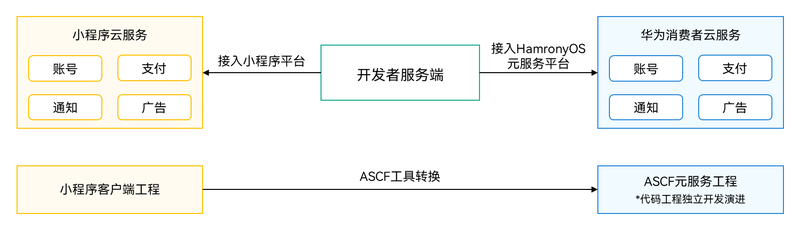
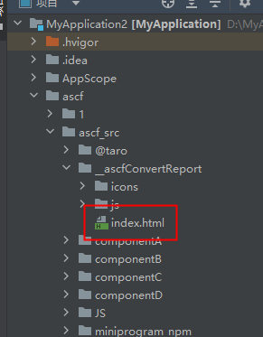
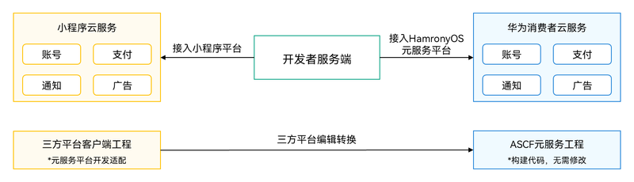

ASCF框架支持采用类似小程序开发技术开发元服务，详情请参考[ASCF框架概述](https://developer.huawei.com/consumer/cn/doc/atomic-ascf/ascf-overview)。在开始开发前，请先确保已[获取并安装ASCF插件](https://developer.huawei.com/consumer/cn/doc/atomic-ascf/ascf-plugin)。

ASCF框架支持复用小程序代码资产，支持通过转换工具转换为元服务，也支持使用[uniapp](https://uniapp.dcloud.net.cn/tutorial/mp-harmony/intro.html)、[Taro](https://docs.taro.zone/docs/GETTING-STARTED#ascf元服务)等三方框架编译为元服务。转换后都需要针对平台相关功能和特性做适配和修改。

## 小程序转换元服务

### 小程序转换元服务的流程

通过小程序转换成ASCF元服务的流程如图所示。



从小程序转换到ASCF元服务后，需要对转换后的工程文件进行处理：

1. 在[AppGallery Connect](https://developer.huawei.com/consumer/cn/service/josp/agc/index.html)（简称AGC）上申请注册元服务，如有需要配置域名、权限请参考[元服务开发准备](https://developer.huawei.com/consumer/cn/doc/atomic-guides/atomic-dev-preparation)。
2. 转换原来小程序平台的特有接口，如登录、支付等接口，将其替换成元服务生态接口。若元服务暂无替代的接口，需要在代码上删除相关功能。详细请参照[小程序转换后如何适配](#小程序转换后如何适配)。
3. 涉及云服务，需要接入元服务开放能力，请参考[适配平台功能和要求](#适配平台功能和要求)。

后续小程序平台工程与元服务ASCF框架工程需要各自独立维护演进，彼此互不影响。

### 小程序转换后如何适配

**ASCF转换器**会自动将文件和支持的接口替换为ASCF框架适配的文件与接口，“暂不支持”的接口会使用TODO标记添加到代码注释中，并且会生成ascf/ascf\_src/transform.log（转换日志）和ascf/ascf\_src/\_ascfConvertReport/index.html（转换报告）文件，转换日志中会说明不支持的接口位置，转换报告支持直接通过浏览器打开，其中会说明转换后的接口、组件支持情况，方便开发者根据平台差异适配为元服务支持的接口。

**图1** 转换报告位置



具体框架、组件和接口请参考ASCF的[API参考](https://developer.huawei.com/consumer/cn/doc/atomic-ascf/ascf-references)使用。处理完transform.log文件中的提示信息后，还需要作如下调整：

1. 按照IDE的错误提示对部分语法差异进行调整。例如：let 语法作用域、变量未定义使用、function、package关键字、以v开头的变量。
2. 对小程序私有变量进行调整。
3. 修改非整型的px单位值为整型，例如0.5px修改为1px，否则渲染效果会有差异。
4. 使用\&lt;toast\&gt;&lt;/toast&gt;组件的地方，使用has.showToast代替实现。
5. 如果接入小程序特有特性，需要修改为华为提供的能力，请参考[适配平台功能和要求](#适配平台功能和要求)。原来接入小程序特有插件或者云开发，将无法继续使用，需使用自定义组件的方式代替。
6. 如果是对支付宝小程序进行转换，需要做如下适配：

   * 默认情况下支付宝小程序中自定义组件可以直接使用页面的样式，但ASCF中不可以，这可能会带来样式上的差异。如需使用，请在自定义组件中声明：options: \&#123;styleIsolation: 'isolated'\&#125;
   * 自定义组件中如果使用了slot，请注意slot定义处声明的class在支付宝里是可以生效的，但ASCF中不会生效，这与微信一致，请对这类样式做单独处理。
   * 自定义组件中ASCF暂不支持$page、$slots属性，如有使用可能会因为无法取到有效值而导致业务问题，请自行去除并修改相关逻辑。


* 如果项目中在node\_modules中依赖了vant-weapp等开源库，需要将node\_modules中的小程序源码拷贝到源码目录，便于转换工具能够做转换处理。

  ASCF工具链提供了帮助开发者拷贝转换的方法，详见：[使用npm包](https://developer.huawei.com/consumer/cn/doc/atomic-ascf/run-ascf-cli#使用npm包)。
* 如果项目中有混淆的文件也需要转换，需要额外增加--notaddtodo参数，不修改js文件，避免引发代码错乱问题。

## 三方框架开发转换元服务

三方平台通过框架适配转换为元服务的流程如图所示。



三方平台代码导出ASCF框架源码，由三方平台自行处理。

开发者仍需要完成以下步骤适配平台的相关功能和要求：

1. 在[AppGallery Connect](https://developer.huawei.com/consumer/cn/service/josp/agc/index.html)（简称AGC）上申请注册元服务，如有需要配置域名、权限请参考[元服务开发准备](https://developer.huawei.com/consumer/cn/doc/atomic-guides/atomic-dev-preparation)。
2. 通过条件编译隔离元服务和其他平台代码，涉及云服务，需要接入元服务开放能力，请参考[适配平台功能和要求](#适配平台功能和要求)。

### Uniapp编译为元服务

请参考uniapp官方提供[HarmonyOS元服务](https://uniapp.dcloud.net.cn/tutorial/mp-harmony/intro.html)指南。

适配元服务的建议如下：

1. 了解项目代码，熟悉当前项目的页面布局和功能特性，通过代码审查理解接口调用及页面处理流程，并梳理组件和接口清单。
2. 使用MP-HARMONY条件编译方式，适配编译为元服务。
3. 仔细阅读[开发指南](https://developer.huawei.com/consumer/cn/doc/atomic-ascf/ascf-development-guide)，以适配平台相关功能和规范要求，然后编译为（ASCF范式）后，将编译产物dist/build/mp-harmony拷贝到ascf/ascf\_src目录后，参考Hello ASCF工程调试运行。

uniapp条件编译示例：

```
// #ifdef WEB
console.info('这段代码只在WEB运行');
// #endif

// #ifdef MP-HARMONY
console.info('这段代码只在元服务ASCF框架上运行');
// #endif
```

### Taro适配支持ASCF说明

Taro已经适配支持了ASCF框架，从Taro 4.1.5版本开始支持。请参考[官方文档](https://docs.taro.zone/docs/GETTING-STARTED#ascf元服务)使用。

[Taro条件编译示例](https://docs.taro.zone/docs/envs#参考案例)：

```
/** 源码 */
if (process.env.TARO_ENV === 'ascf') {
  require('path/to/ascf/name')
} else if (process.env.TARO_ENV === 'h5') {
  require('path/to/h5/name')
}

/** 编译后（ascf元服务） */
if (true) {
  require('path/to/ascf/name')
}
/** 编译后（H5） */
if (true) {
  require('path/to/h5/name')
}
```

后续开发者仅需维护三方平台端侧代码，ASCF工程通过工具输出，仅对工程文件进行基础信息配置，打包验证。具体请参考[基于三方框架编译为ASCF范式](https://developer.huawei.com/consumer/cn/doc/atomic-ascf/compile-ascf-paradigm)。

## 适配平台功能和要求

接入ASCF框架开发元服务，需要接入以下功能，并遵循相关要求，为用户提供更优质的体验。

### 接入隐私托管

1. 隐私托管

   为统一用户体验和上架审核更快更省心，元服务须接入平台隐私托管，平台统一向用户弹出隐私协议弹窗。

   不允许开发者使用自行设计的隐私弹窗。

   不允许同时弹出2个隐私弹框影响用户体验。

   隐私托管后，开发者仅需要配置隐私内容，用户协议。接入方法请参考[隐私托管](https://developer.huawei.com/consumer/cn/doc/atomic-ascf/develop-privacy-hosting)。
2. 申请权限

   元服务根据所属类目向平台申请开通对应类目允许的权限。权限获取应遵从在合理必要的场景、最小化申请使用敏感权限，并告知敏感权限使用目的。不允许在首次启动元服务非必要场景时提前向用户申请权限。非必要权限关闭，不影响基本功能使用。用户拒绝授权后，不应频繁弹框申请与当前服务场景无关的权限。具体如何申请权限请参考[授权](https://developer.huawei.com/consumer/cn/doc/atomic-ascf/develop-authorization)。

### 接入开放能力

1. **接入华为账号**

   * 元服务存在账号体系时，须规范调用华为账号登录API静默登录华为账号，减少对用户的干扰，使用方法请参考[账号登录](https://developer.huawei.com/consumer/cn/doc/atomic-guides/account-atomic-silent-login)，元服务界面不允许出现“登录”等字样，元服务自有账号可通过手机号与华为账号建立关联。请参考[最佳设计实践-账号](https://developer.huawei.com/consumer/cn/doc/design-guides/accounts-0000001967444380)。
   * 元服务开发者须规范使用华为账号手机号授权能力向用户申请手机号授权，并应在用户明确同意的前提下，依法合理地处理用户的手机号信息。除非相关法律要求，不得在用户还未开始使用元服务时向用户申请手机号授权，以阻止用户浏览、使用元服务；不得在不需要使用手机号的场景，向用户申请手机号授权。请参考[最佳设计实践-账号](https://developer.huawei.com/consumer/cn/doc/design-guides/accounts-0000001967444380)。ASCF框架下元服务具体实现请参考[获取华为账号用户信息](https://developer.huawei.com/consumer/cn/doc/atomic-ascf/develop-huawei-id-retrieval)。
2. **接入消息订阅**

   * 元服务开发者可使用华为提供的基于账号的订阅消息能力，通过选用订阅模板，在获取用户同意后向其发送服务通知消息，使用方法请参考[向用户推送信息](https://developer.huawei.com/consumer/cn/doc/atomic-ascf/develop-push-info)。
   * 元服务开发者可使用华为提供的基于账号的服务动态消息，通过与元服务-服务动态平台的对接，可向用户发送服务场景的动态消息，使用方法请参考[推送基于账号的服务动态消息](https://developer.huawei.com/consumer/cn/doc/atomic-guides/push-as-timeline)。
3. **接入地图和定位能力**

   * 使用地图组件

     元服务开发者如需使用地图相关能力，可调用华为Map Kit能力，其中地图展示、地点详情与拉起地图App导航须使用华为Map Kit能力，地点搜索、路线规划推荐使用华为Map Kit能力，使用方法请参考[组件-地图-Map](https://developer.huawei.com/consumer/cn/doc/atomic-ascf/components-map)。
   * 接入定位能力

     元服务开发者如在开发过程中需要获取位置相关信息，如地图选点、定位等功能，需要接入系统定位能力。

     获取定位信息相关接口如下，同时在调用相关接口前需要进行授权，详细请参考：[获取位置信息](https://developer.huawei.com/consumer/cn/doc/atomic-ascf/components-map)。

     | 接口 | 描述 |
     | --- | --- |
     | [has.openLocation](https://developer.huawei.com/consumer/cn/doc/atomic-ascf/apis-location#hasopenlocation) | 地图查看具体位置。 |
     | [has.getLocation](https://developer.huawei.com/consumer/cn/doc/atomic-ascf/apis-location#hasgetlocation) | 获取当前的地理位置。 |
     | [has.getFuzzyLocation](https://developer.huawei.com/consumer/cn/doc/atomic-ascf/apis-location#hasgetfuzzylocation) | 获取当前的模糊地理位置. |
     | [has.chooseLocation](https://developer.huawei.com/consumer/cn/doc/atomic-ascf/apis-location#haschooselocation) | 地图选择位置。 |
4. **接入支付服务**

   元服务开发者如涉及交易，须调用华为支付能力，其中实物商品须使用Payment Kit，使用方法请参考[接入支付服务](https://developer.huawei.com/consumer/cn/doc/atomic-ascf/develop-payment-access)；数字商品须使用IAP Kit，使用方法请参考[应用内支付](https://developer.huawei.com/consumer/cn/doc/atomic-guides/atomic-iap-development)。
5. **使用Web组件**

   元服务开发者如需使用Web能力，须使用web-view组件能力，请参考[开发web-view组件](https://developer.huawei.com/consumer/cn/doc/atomic-ascf/develop-web-view)。
6. **跳转**

   跳转到其他元服务，详细请参考[跳转](https://developer.huawei.com/consumer/cn/doc/atomic-ascf/develop-navigate-other-atomicservices)。

   跳转应用：当前只支持打开部分系统应用，否则会遭到系统生态管控拦截，提示应用无法打开。如有需要请使用[button](https://developer.huawei.com/consumer/cn/doc/atomic-ascf/components-button)组件 &gt; 设置属性open-type值为launchApp进行跳转。

### 遵循设计规范

1. 元服务须使用符合规范的图标（元服务图标） **，** 请使用元服务图标工具：[生成元服务图标](https://developer.huawei.com/consumer/cn/doc/atomic-guides/atomic-service-icon-generation)。
2. 元服务启动时不允许使用开屏界面、扑脸广告，打断用户正常使用流程。
3. 元服务内，用户在一级页面使用屏幕边缘滑动手势时，须正常响应一键退出至后台，不允许以弹框等任何形式拦截用户。
4. 元服务内，服务界面不允许出现“登录”等字样。如果存在账号体系时，须规范调用华为账号登录API静默登录华为账号，元服务自有账号可通过手机号与华为账号建立关联。请参考[最佳设计实践-账号](https://developer.huawei.com/consumer/cn/doc/design-guides/accounts-0000001967444380)。
5. 元服务设计应符合平台设计规范，包括但不限于头部导航栏、元服务胶囊、底部页签等。请参考：[UX设计原则](https://developer.huawei.com/consumer/cn/doc/design-guides/ux-guidelines-overview-0000001900378248)。
6. 导航应该提供清晰的路径。区分一级和非一级，次级页面提供返回按钮，统一交互行为为“返回上一层”，而非“返回前一个界面”
7. 元服务内应该避让元服务胶囊（Menubar），避免遮挡。
8. 头部导航栏和底部导航栏应匹配页面背景实现沉浸效果，避免视觉分割。请参考：[开发沉浸式页面](https://developer.huawei.com/consumer/cn/doc/atomic-ascf/develop-immersive-pages)。
9. 页面加载、刷新过程简洁，避免同一场景存在多个加载状态。

### 遵循基础运营规范

1. 在元服务中避免出现核心功能缺失，常用功能建议与其他平台保持一致。
2. 元服务订单履约主线流程不允许存在业务断点，如出现订单无法支付、订单信息无法查看等。
3. 元服务可使用系统跳转能力跳转至经华为认证的关联主体的应用，并且目标应用需接入“华为支付统一收银台”，不包括浏览器类型。该场景下每一次跳转都会弹窗，取得用户同意后方可跳转。

   元服务内禁止出现提示和诱导跳转App、小程序等进行转化、下单的行为，建议在元服务内实现服务闭环。

   不允许出现如“跳转App更佳”、“跳转App使用功能”、“使用App扫码”等引导性描述及行为。

### 三方平台开发

三方平台支持ASCF元服务，详情请参考[HarmonyOS开发服务商开发指南](https://developer.huawei.com/consumer/cn/doc/SPPartnerCenter-develop-Guides/ht-overview-0000002372776697?preview=1)接入。

开发者可以在AppScope/ext.json中配置所需的信息，三方平台会替换、自动替换后打包为不同的参数，并且会将ext对象生成ascf/ascf\_src/extConfig.json。

ASCF框架[API-三方平台](https://developer.huawei.com/consumer/cn/doc/atomic-ascf/apis-third-party-platform)提供了 has.getExtConfigSync 或者 has.getExtConfig 获取到这些配置信息。

```
has.getExtConfig({
  success: (res) => {
    console.info('getExtConfig success', res);
  },
  fail: (err) => {
    console.error('getExtConfig fail', err);
  },
  complete: (res) => {
    console.info('getExtConfig complete', res);
  }
})
```

* **[基础能力](https://developer.huawei.com/consumer/cn/doc/atomic-ascf/develop-basic-capabilities)**
* **[开放能力](https://developer.huawei.com/consumer/cn/doc/atomic-ascf/develop-open-capabilities)**
* **[开发服务卡片](https://developer.huawei.com/consumer/cn/doc/atomic-ascf/develop-widget)**
* **[HarmonyOS 4及以下版本的元服务适配指南](https://developer.huawei.com/consumer/cn/doc/atomic-ascf/ascf-cross-guide)**
