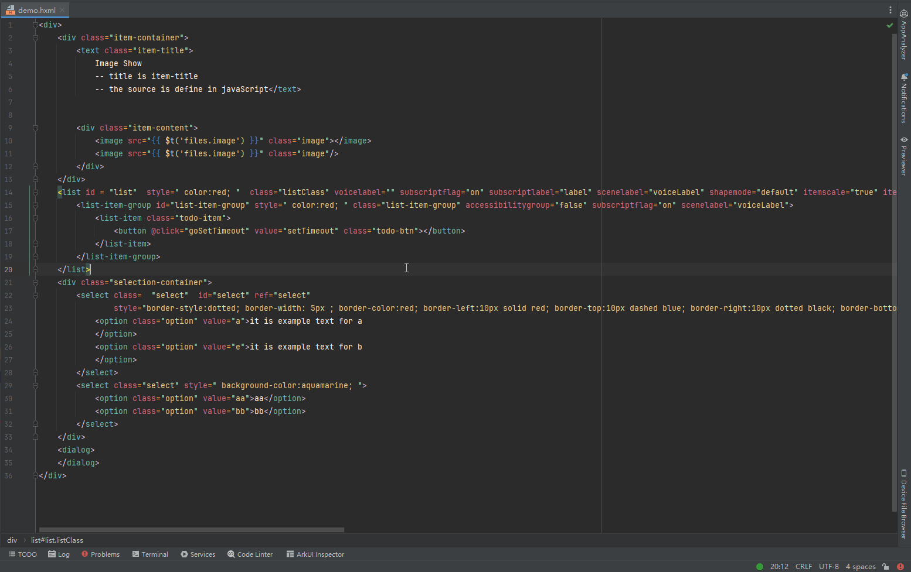
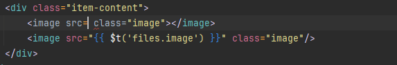
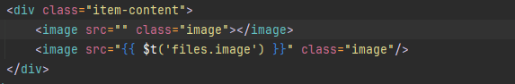
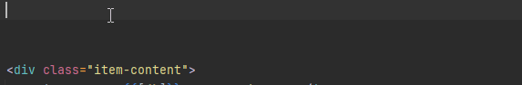

## 支持文件类型

工具当前支持hxml, js, hjs, css, json 等文件的编辑，支持基本的语法高亮和代码格式化等功能。

## 代码格式化

hxml代码格式化（按下快捷键Ctrl+Alt+L可自动格式化代码）

## 自动补全

### hxml引号补全

在符号"="右侧输入一个双引号或单引号时，会自动补全另一个。

### hxml括号补全

在符号"&gt;"右侧或双引号内部输入一个左括号时，会自动补全剩下的括号。

### hxml尾标签补全

代码输入&lt;view后，再输入符号&gt;可实现尾标签补全。

