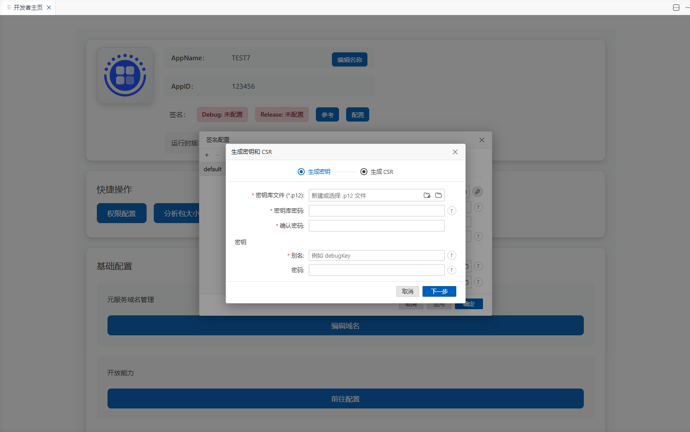
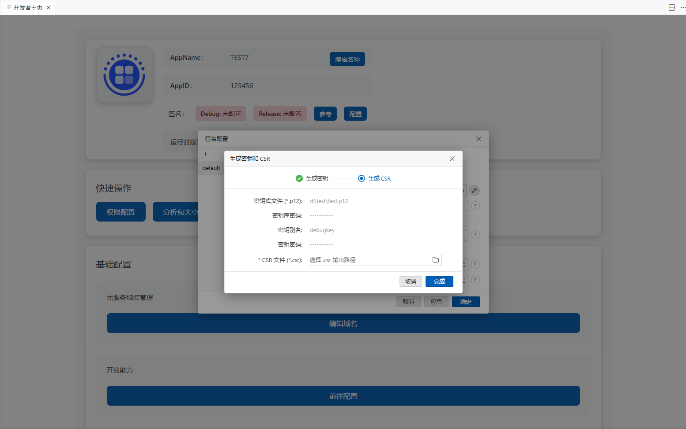
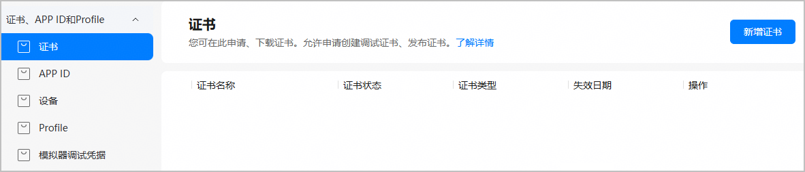
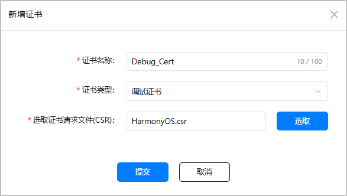
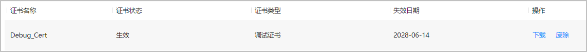
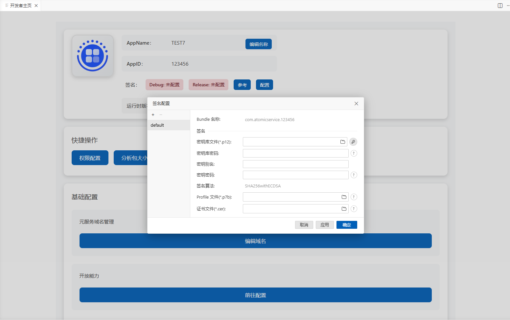

元服务签名配置的方式根据开发方式分为三种：DevEco Studio，命令行工具以及ASCF助手。

在DevEco studio中开发元服务配置签名可以参考：[配置调试签名-编写与调试应用 - 华为HarmonyOS开发者](https://developer.huawei.com/consumer/cn/doc/harmonyos-guides/ide-signing)。

下面将主要介绍在使用命令行工具或者ASCF助手开发过程中如何配置签名。

## 签名

元服务通过数字证书（.cer文件）和Profile文件（.p7b文件）来保证元服务的完整性。在申请数字证书和Profile文件前，需要生成密钥（存储在格式为.p12的密钥库文件中）和证书请求文件（.csr文件）。

**基本概念**

* **密钥**：格式为.p12，包含非对称加密中使用的公钥和私钥，存储在密钥库文件中，公钥和私钥用于数字签名和验证。
* **证书请求文件**：格式为.csr，全称为Certificate Signing Request，包含密钥对中的公钥和通用名称、组织名称、组织单位等信息，用于向AppGallery Connect申请数字证书。
* **数字证书**：格式为.cer，由华为AppGallery Connect颁发。
* **Profile文件**：格式为.p7b，包含元服务的包名、数字证书信息、描述元服务允许申请的证书权限列表，以及允许应用/元服务调试的设备列表（如果元服务类型为Release类型，则设备列表为空）等内容，每个元服务包中均必须包含一个Profile文件。

签名配置的主要流程为：生成密钥和证书请求文件 &gt; 在AGC中申请和下载调试证书和Profile文件 &gt; 配置签名信息。

## 生成密钥和证书请求文件

### 使用命令行生成生成密钥和证书请求文件

生成密钥命令如下所示：

```
ascf generate-p12 --keyAlias <key-alias> --keystore <keystore-path> --keystorePwd <keystore-password> --keyPwd <key-password>
```

**generate-p12 生成密钥**

| 参数 | 支持的值 | 说明 |
| --- | --- | --- |
| generate-p12 | - | 生成 P12 密钥命令 |
| --keyAlias | - | 密钥别名 |
| --keystore | - | 密钥库文件路径，文件后缀为.p12。 |
| --keystorePwd | - | 密钥库密码 |
| --keyPwd | - | 密钥密码 |

之后使用下面命令生成证书请求文件：

```
ascf generate-csr --keyAlias <key-alias> --keystore <keystore-path> --keystorePwd <keystore-password> --keyPwd <key-password> --outFile <output-csr-path>
```

**generate-csr 生成 CSR 证书请求**

| 参数 | 支持的值 | 说明 |
| --- | --- | --- |
| generate-csr | - | 生成 CSR 证书请求命令 |
| --keyAlias | - | 密钥别名 |
| --keystore | - | 密钥库文件路径 |
| --keystorePwd | - | 密钥库密码 |
| --keyPwd | - | 密钥密码 |
| --outFile | - | 输出 CSR 文件路径，文件后缀为.csr。 |

### 在ASCF助手中生成密钥和证书请求文件

在元服务项目中点击元服务图标显示开发者主页，点击签名配置，如下图所示：


点击，如下图所示，填入对应信息，点击“下一步”，即可生成或者使用已有的密钥。



如下图所示，填入对应信息后点击“完成”，即可生成证书请求文件。



## 申请调试证书和Profile文件

### 前提条件

您已准备好证书请求文件。

### 操作步骤

1. 登录[AppGallery Connect](https://developer.huawei.com/consumer/cn/service/josp/agc/index.html)，选择“证书、APP ID和Profile”。
2. 在左侧导航栏选择“证书、APP ID和Profile &gt; 证书”，进入“证书”页面，点击“新增证书”。

   
3. 在弹出的“新增证书”窗口填写要申请的证书信息，点击“提交”。

   

   | 参数 | 说明 |
   | --- | --- |
   | 证书名称 | 自定义证书名称，不超过100个字符。 |
   | 证书类型 | 选择“调试证书”。 |
   | 选取证书请求文件（CSR） | 上传准备好的证书请求文件。 |
4. 证书申请成功后，“证书”页面展示证书名称等信息。点击“下载”，将生成的证书保存至本地，供后续调试签名使用。

   


* 证书申请成功即为“生效”状态。目前实名认证开发者的调试证书有效期为180天，未实名开发者的调试证书有效期为14天。若调试过程中出现应用启动被拦截、提示应用过期等问题，可优先排查是否为调试证书过期导致，证书过期后将无法正常完成调试签名。
* 在调试阶段，如果您更新调试证书，则需要[同步更新调试Profile](https://developer.huawei.com/consumer/cn/doc/app/agc-help-debug-profile-0000002248181278)，如果您[配置了公钥指纹](https://developer.huawei.com/consumer/cn/doc/app/agc-help-cert-fingerprint-0000002278002933)，也需要同步做更新。
* 若证书状态变为“失效”或“已吊销”，表示当前证书已不可用，且通过此证书申请的Profile也会全部失效或吊销。您需要重新申请证书与Profile。
* 证书一旦废除将不可恢复，且通过此证书申请的Profile也会全部失效，请谨慎操作。

## 配置签名信息

开发者主页 -&gt; 元服务签名配置

点击“配置”，如下图所示：



在输入对应的信息之后点击”应用“或者”确定“，即可在build-profile.json5文件中对应的signingConfigs字段生成配置。
