完成元服务开发后，开发者可以根据需要，选择使用以下其中一种方式运行元服务。

## 使用本地真机运行元服务

在Phone和Tablet中运行HarmonyOS元服务的操作方法一致，可以采用USB连接方式或者无线调试的连接方式。

具体操作可参考[DevEco Studio操作指导-使用本地真机运行应用/元服务](https://developer.huawei.com/consumer/cn/doc/harmonyos-guides/ide-run-device)。

## 使用模拟器运行元服务

DevEco Studio提供了模拟器（Emulator），模拟器模拟了真实设备的基本功能，开发者可以更灵活、更高效地进行元服务开发和调试，提升开发体验与效率。


* 需使用5.1.1 Beta以上版本的DevEco Studio（[下载地址](https://developer.huawei.com/consumer/cn/download/deveco-studio)）。
* 与真机相比，模拟器当前仅支持部分能力，具体可查阅[模拟器与真机的差异](https://developer.huawei.com/consumer/cn/doc/harmonyos-guides/ide-emulator-specification)。
* 如果运行报错，开发者可参考[模拟器运行问题处理](https://developer.huawei.com/consumer/cn/doc/atomic-ascf/faqs-runtime-emulator)。

具体操作可参考[DevEco Studio操作指导-使用模拟器运行应用/元服务](https://developer.huawei.com/consumer/cn/doc/harmonyos-guides/ide-run-emulator)。

## 使用热重载功能进行调试

热重载是一种可以实时生效代码的功能。在DevEco Studio中启用热重载功能后，开发者对页面的 css/hxml/js/json 文件进行修改时，调试设备将自动应用更新内容，无需额外操作。大幅减少了重新编译和运行的时间，极大提升开发效率。


开发者也可以通过ASCF命令行工具直接启用热重载功能，详细信息请参阅[开启热重载](https://developer.huawei.com/consumer/cn/doc/atomic-ascf/run-ascf-cli#开启热重载)。

### 运行环境要求

使用热重载功能需满足以下条件：

* ASCF 运行时版本 ≥ 1.0.10
* ASCF ToolKit版本 ≥ 1.0.5
* ASCF Plugin版本 ≥ 1.0.4.303

### 开启热重载

1. 连接设备，在DevEco Studio中选择元服务运行的设备。
2. 在“选择运行/调试配置”菜单中选择带  标志的entry，进入热重载模式。

   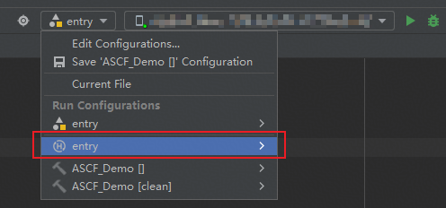
3. 点击运行热重载按钮，开启热重载功能。待热重载启动完成。

   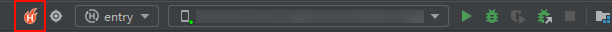
4. 此时修改并保存css/hxml/js/json文件，可在设备中实时查看修改效果。

   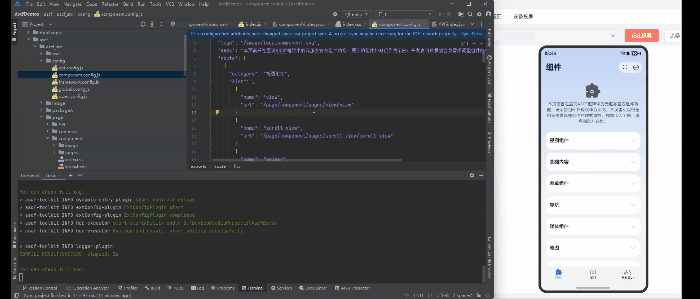
5. 点击停止按钮，停止热重载功能。

   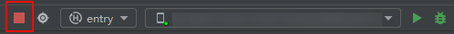

## 调试运行ASCF源代码

ASCF框架运行时分为视图层（Webview），逻辑层（V8引擎），均支持本地调试。

### 使用ASCF调试器

**版本限制：ASCF Plugin版本 ≥ 1.0.4.304**


DevEco Studio 6.0以下的版本，将在浏览器中打开调试页面。

1. 通过“视图-&gt; 工具窗口-&gt; ASCF 调试器”打开调试页面，也可以直接点击左下方工具窗口栏的（New UI）打开。对于DevEco Studio版本在6.0.0以下的用户，可以在下方工具窗口栏的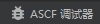打开调试页面。

   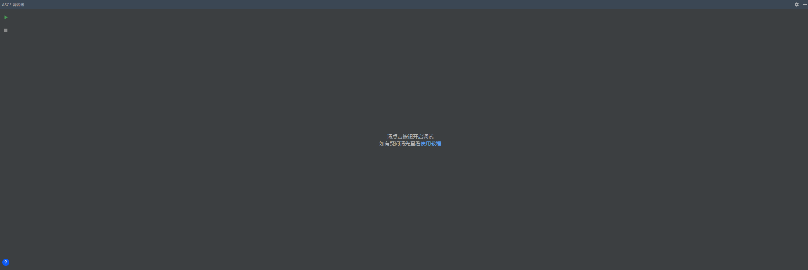
2. 在DevEco Studio运行元服务，详细参考：[使用本地真机运行元服务](#使用本地真机运行元服务)。
3. 调试分为：视图层（Webview）和逻辑层（V8引擎），详细参考：[调试运行ASCF源代码](#调试运行ascf源代码)。

   点击ASCF 调试器的按钮，逻辑层（V8引擎）调试会在DevEco Studio中自动拉起，如下图所示。

   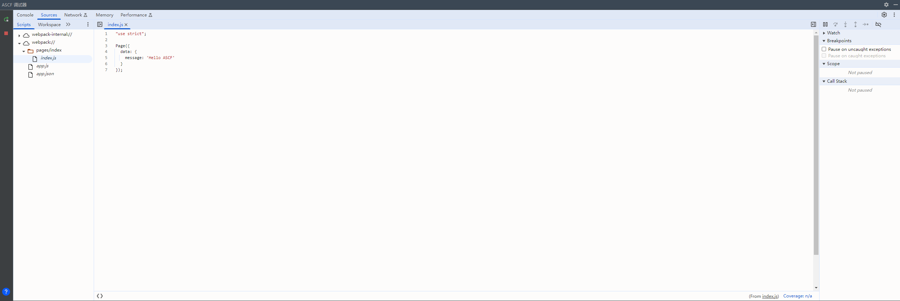

   在浏览器中打开“chrome://inspect/#devices“，即可调试视图层（Webview）。
4. 点击ASCF 调试器的按钮，可以停止调试。

### 使用命令打开调试页面

调试ASCF项目模式下，在ASCF项目根目录下使用以下命令开启调试功能。

开启Webview调试和V8引擎调试：

```
ascf debugger start
```

执行命令成功后，根据日志提示，[在chrome浏览器上打开调试工具页面](https://developer.huawei.com/consumer/cn/doc/harmonyos-guides/web-debugging-with-devtools#在chrome浏览器上打开调试工具页面)。

浏览器直接打开V8引擎调试页面：

```
ascf debugger start -o
```

关闭Webview调试和V8引擎调试：

```
ascf debugger stop
```

单独开启Webview调试：

```
ascf debugger start-view
```

单独关闭Webview调试：

```
ascf debugger stop-view
```

单独开启V8引擎调试：

```
ascf debugger start-service
```

单独关闭V8引擎调试：

```
ascf debugger stop-service
```

查看当前调试开启状态：

```
ascf debugger status
```

### 打开chrome调试页面

1. 当连接HarmonyOS 5.0及以上设备，ascf debugger start -ct hdc时，在电脑端Chrome浏览器地址栏中输入调试工具地址 chrome://inspect/#devices 并打开该页面。

   当连接HarmonyOS 4及以下设备，ascf debugger start -ct adb时，在日志搜索关键字start debug server url获取调试地址，在电脑端Chrome浏览器地址栏中输入调试地址并打开该页面。
2. 修改Chrome调试工具的配置。

   需要从本地的TCP 9222、TCP 9229端口发现被调试网页，所以请确保已勾选 "Discover network targets"。然后再进行网络配置。9222端口对应Webview调试窗口，9229端口对应V8引擎调试窗口。

   (1) 点击 "Configure" 按钮。

   (2) 在 "Target discovery settings" 中添加要监听的本地端口localhost:9222和localhost:9229。

   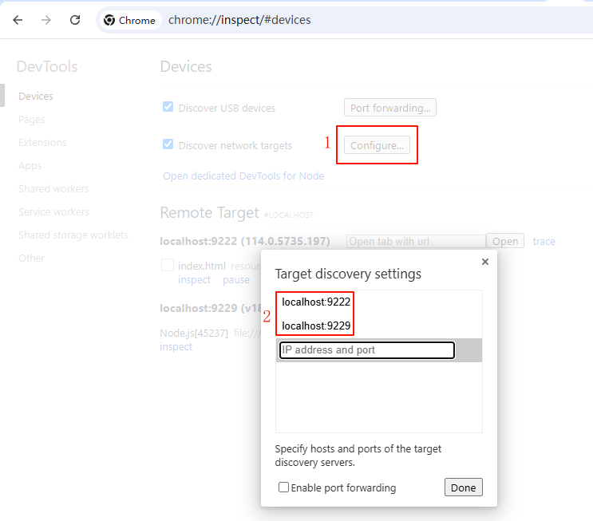

### 网络调试

点开Chrome调试&gt;点击Network控制板，面板展示的是has.download、has.upload、has.request、has.getImageInfo请求的资源。点击面板的请求，可以查看详细的网络请求信息。


当前仅支持HarmonyOS 4及以下设备网络调试。

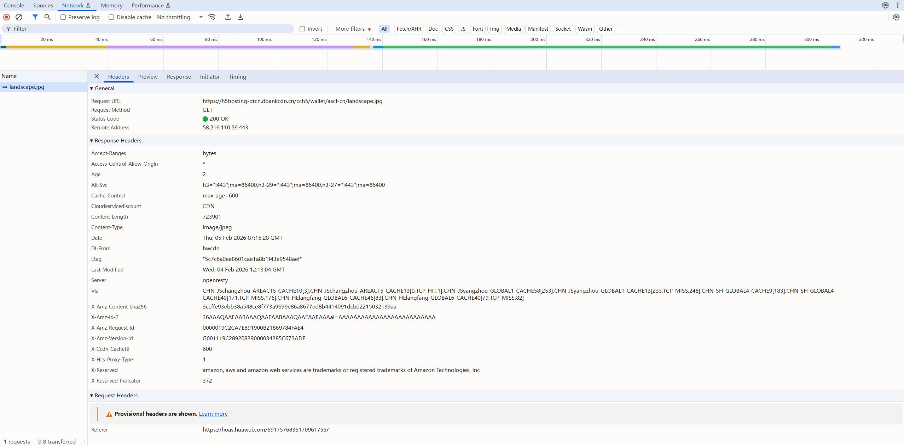

### 工具链调试功能支持参数

命令行工具调试功能参数，可以通过以下命令获取帮助：

```
ascf debugger start --help
```

**调试**

| 选项 | 作用 |
| --- | --- |
| --bundleName | 指定调试ASCF的包名。  例如：  ascf debugger start --bundleName com.atomicservice.1234568789 |
| --open [chrome|edge] | 浏览器打开V8引擎调试。支持指定chrome和edge。 |
| --deviceId | 当PC连接多台设备时，指定调试用设备。  例如：  ascf debugger start --deviceId 123456789  可使用命令hdc list targets查询已连接的所有目标设备。 |
| -ct  --connectorType | 设备调试工具类型，支持hdc/adb，默认hdc。当在HarmonyOS 4及以下设备上调试时，需要指定为adb。 |

如果暂不支持以上命令，请升级ASCF Toolkit至版本1.0.5及以上，或参考以下方式进行调试。

* Webview调试：开启方法请参考[使用Devtools工具调试前端页面](https://developer.huawei.com/consumer/cn/doc/harmonyos-guides/web-debugging-with-devtools)。
* V8引擎调试：在manifest.json中，设置debug=true会自动开启调试功能。支持在ascf.config.json配置 "ascfDebugger": "brk" 首行断点。

  支持手动开启V8引擎调试，本地执行 hdc fport tcp:9229 tcp:9225 后，访问 &lt;http://localhost:9229/json&gt; 后，复制 devtoolsFrontendUrl 使用浏览器打开调试页面。

### 启用调试异常

如果遇到开启调试失败问题（getDebugger[fport]error，默认[fport]为9222/9229），如果根据日志提示排查后仍无法解决，可能是因为当ASCFToolkit版本≤1.0.9时，用户电脑将localhost解析为ipv6地址，导致工具链无法正确检测到端口。可以升级ASCFToolkit到1.0.10及以上版本重试。

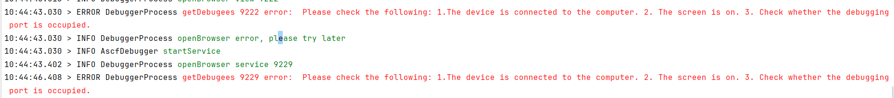

## 调试控制台（ASCF Console）

如果想要查看console API输出的日志内容和调用has接口的信息，可以在ascf.config.json中配置 \&#123;"enableDevTools": true\&#125;, 即可开启调试面板。

在页面上出现  即说明开启成功。


开启调试控制台可能会影响页面加载时长，生产阶段不建议开启。

调试控制台主要包括以下功能：

### Console日志

* 实时显示console.log/info/warn/error记录；
* Filter框输入关键字已进行记录筛选；
* 使用分类标签All, Mark, Log, Errors, Warnings...等进行记录分类显示
* 长按记录可弹出操作项：
* 复制：将记录数据执行复制操作
* 取消置顶/置顶显示：将记录取消置顶/置顶显示，最多可置顶三条
* 取消留存/留存：留存是指将记录保留下来，使其不受清除
* 取消全部留存：取消所有留存的记录
* 取消标记/标记：标记就是将数据添加一个Mark的分类，可以通过筛选栏快速分类显示
* 取消全部标记：取消所有标记的记录


### Api（接口调用和网络请求）

* 实时显示has对象下的相关 api 执行记录
* Filter框输入关键字已进行记录筛选
* 使用分类标签All, Mark, XHR...等进行记录分类显示
* 长按记录可弹出操作项：
* 复制：将记录数据执行复制操作，将其复制到剪切板
* 其他操作项含义与Console功能类似
* 点击条目可展示详情


### Storage（本地存储）

* 显示 Storage 记录
* Filter框输入关键字已进行记录筛选
* 长按操作项含义与Console功能类似
* 点击条目后，再点击X按钮可将其删除
* 点击Filter框左侧的刷新按钮可刷新全部数据
* 点击条目显示详情


## 查看ASCF日志

在 DevEco 在底部找到 Log 面板，筛选你正在开发的应用，过滤关键字006F 或 ascf-app，观察是否有告警、错误。

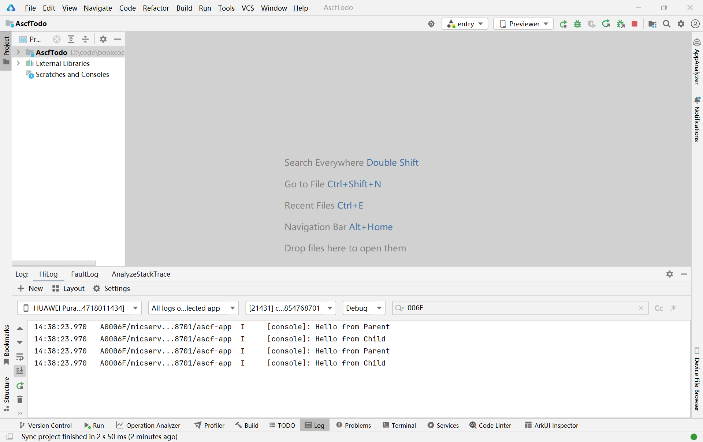

使用ASCF助手在VSCode中开发，查看开发者打印日志，请参考[打开日志](https://developer.huawei.com/consumer/cn/doc/atomic-ascf/ascf-assistant#打开日志)。

如果报错中包含 xxx is not defined，可能是对应的 api 在元服务中还未实现，需要对接口做适配。

## ASCF助手调试

1. 点击VSCode下方调试按钮，可以编译运行元服务并拉起调试页面。

   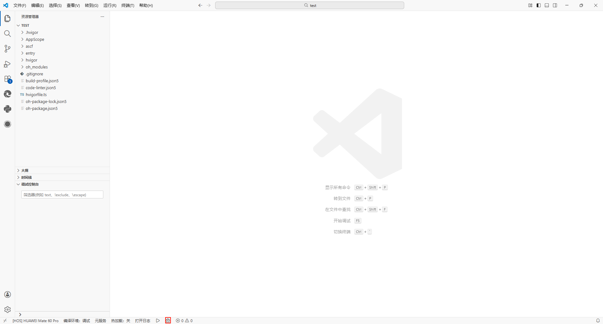
2. 调试分为：视图层（Webview）和逻辑层（V8引擎），详细参考：[调试运行ASCF源代码](#调试运行ascf源代码)。

   逻辑层（V8引擎）调试会在vscode中自动拉起，如下图所示。

   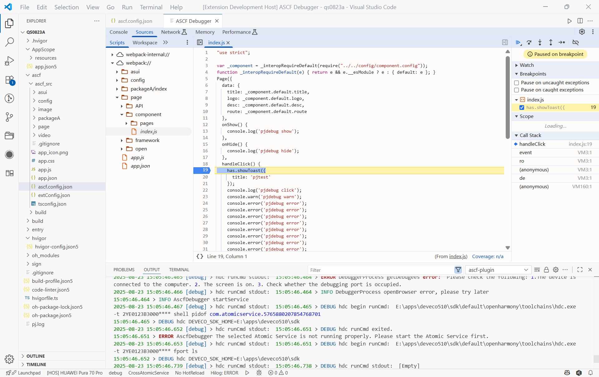

   在浏览器中打开“chrome://inspect/#devices“，即可调试视图层（Webview）。
