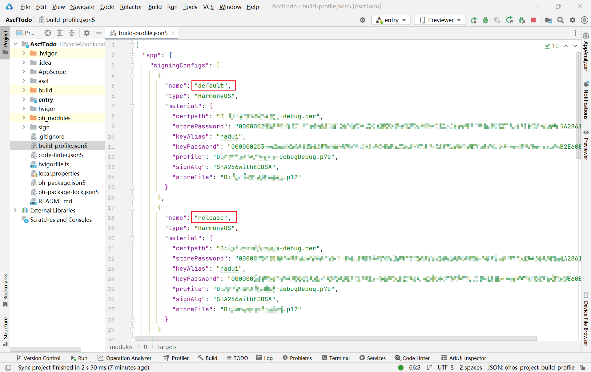
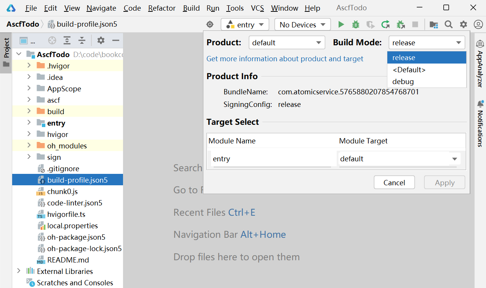
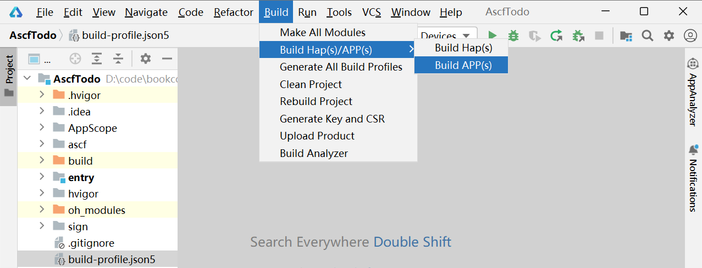
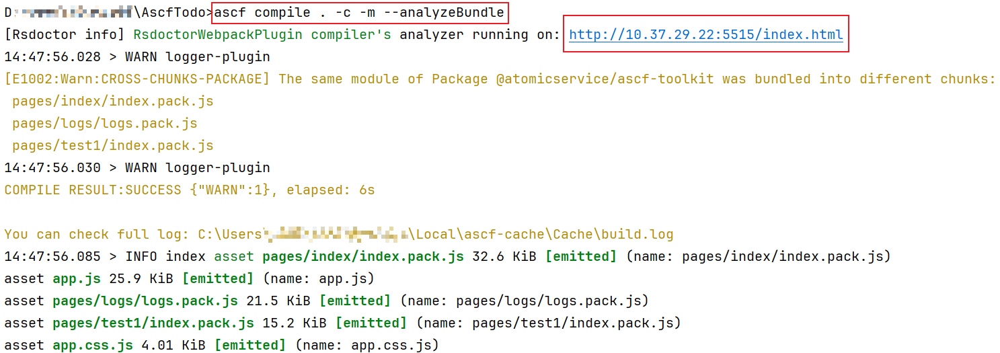
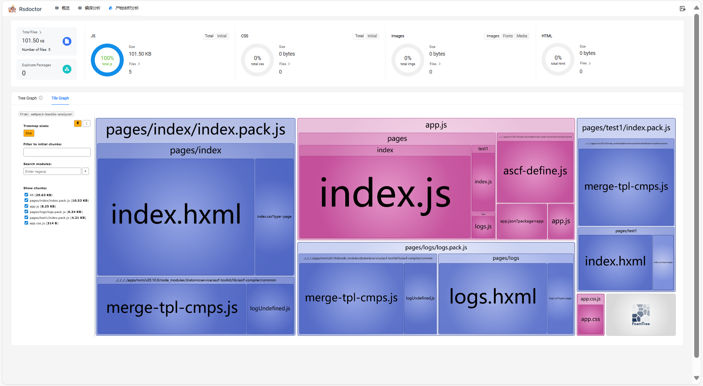

发布元服务的基本流程如下：

1. 了解[元服务审核指南](https://developer.huawei.com/consumer/cn/doc/distribution/app/50129)的要求，并完成发布前自检。
2. [打包发布版本](https://developer.huawei.com/consumer/cn/doc/harmonyos-guides/ide-publish-app)。
3. （可选）在正式发布元服务前，您可以发布一个[邀请测试](https://developer.huawei.com/consumer/cn/doc/app/agc-help-invite-test-0000002270829393)版本，邀请部分用户提前体验新版本，并收集用户的反馈，以便提前发现问题进行改进，从而保证全网版本的质量，提升用户体验。
4. 完成[元服务备案](/docs/dev/atomic-dev/atomic-service-filing/atomic-service-filing)。
5. [发布元服务](https://developer.huawei.com/consumer/cn/doc/app/agc-help-release-atomic-0000002327731065)。

   

   在发布元服务时，可以设置分发的软件包是否加密。由于元服务包体积较小，选择加密后涉及的启动时解密操作对启动耗时影响较大。为了保证快速启动元服务的体验，如果没有对安全性有特殊要求，不推荐加密元服务包。

## 如何配置签名

初次运行元服务，需要配置好证书签名，参考[元服务开发准备](/docs/dev/atomic-dev/atomic-service-development/atomic-dev-preparation#section42841246144813) 。

开发调试期间的证书不可用于应用上架。元服务发布证书的申请流程和应用开发类似，参考文档[发布元服务](/docs/distribute/agc/agc-help-release-atomic-0000002327731065/agc-help-release-atomic-guide-0000002293651514)，获取发布证书。

修改build-profile.json5文件，新增release证书签名。


调试和发布证书不能混用。



## 如何修改元服务默认标题、图标、启动图等信息

* 修改应用描述和应用标题：

  在项目“entry/src/main/resources/”目录、修改“zh-CN/element/string.json”和“base/element/string.json”中字段：

  + EntryAbility\_desc：应用描述
  + EntryAbility\_label：应用标题
* 修改应用图标：

  为使用[生成元服务图标](/docs/dev/atomic-dev/develop-first-atomic-service/atomic-service-icon-generation)生成的512x512图标，需要放置在“AppScope/resources/base/media/app\_icon.png”路径内 ，否则会上架审核不通过。

## 如何构建发布包

发布包需要使用[release签名](https://developer.huawei.com/consumer/cn/doc/harmonyos-guides/ide-publish-app#section793484619307)，创建好签名后修改build-profile.json5中“app.signingConfigs”，增加name为release的签名。

在IDE中构建发布包：

1. 点击工具链设置按钮，设置“Build Mode”为“release”。

   
2. 选择Build&gt;Build Hap(s)/APP(s)&gt;Build APP(s)，构建发布包。构建后结果位于build目录下，参考[发布应用](https://developer.huawei.com/consumer/cn/doc/harmonyos-guides/ide-publish-app#section97874500234)指导完成发布。

   

### 使用ASCF工具链命令行编译构建发布包

在进入到ASCF项目目录后，使用命令行构建

```
ascf build assembleApp
```

## 如何优化包大小满足发布要求

元服务的单包要求不超过2MB，总包不能超过10MB。因此在发布前，开发者需要优化包大小。调试debug包不限定包大小。

1. 元服务提供了分包功能，支持[分包](/docs/dev/atomic-dev/ascf/develop-subpackage-loading/develop-subpackages)、[异步化分包](/docs/dev/atomic-dev/ascf/develop-subpackage-loading/asynchronous-subcontracting)，来降低单包的大小。
2. 元服务提供了包成分分析功能，“ascf compile . -c -m --analyzeBundle”能分析包的依赖和每个分包的大小。

   

   包可能被压缩，请以最终打包的包大小，或是上传时的包大小校验结果为准。

   
3. 点击地址打开浏览器查看报告。

   

### 包大小优化建议

1. 尽可能使用系统提供接口和功能，减少三方库的依赖。
2. 尽可能将图片、视频等资源文件上云存储，避免占用包大小。本地文件使用webp等压缩格式。
