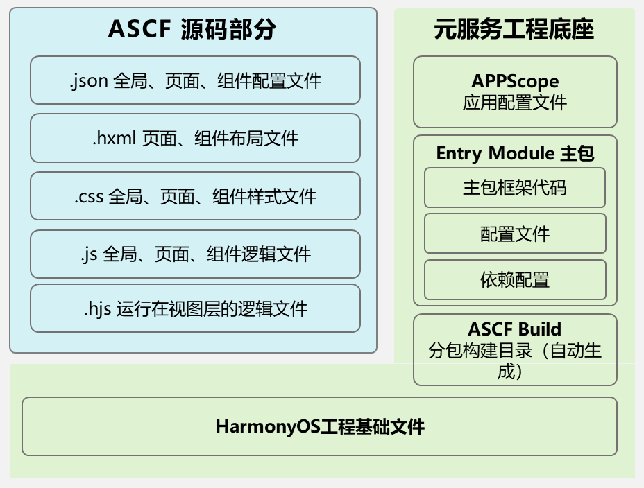
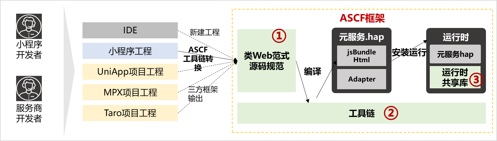

## 了解元服务

在万物互联时代，人均持有设备量不断攀升，设备种类和使用场景更加多样，使得应用开发、应用入口变得更加复杂。在此背景下，应用提供方和用户迫切需要一种新的服务提供方式，使应用开发更简单、服务（如听音乐、打车等）的获取和使用更便捷。为此，HarmonyOS除支持传统的需要安装的应用（以下简称传统应用）外，还支持更加方便快捷的免安装的应用，即元服务。

元服务是HarmonyOS提供的一种轻量应用程序形态，具备以下特征：

* 秒开直达，纯净清爽。
* 服务相伴，恰合时宜。
* 即用即走，账号相随。
* 一体两面，嵌入运行。
* AI智能，全域流转。
* 高效开发，生而可信。

## 了解ASCF框架

ASCF（Atomic Service Cross Framework）是元服务为小程序生态定制的一套解决方案，能够使用类似于小程序的开发技术，高效开发元服务。

ASCF框架提供了系统级的运行时能力，开发阶段编译调试的工具链。同时提供了转换工具将已有的小程序项目快速转换为ASCF框架的元服务项目。

可以使用控制中心扫一扫入口，扫描下方二维码，打开体验ASCF元服务。

