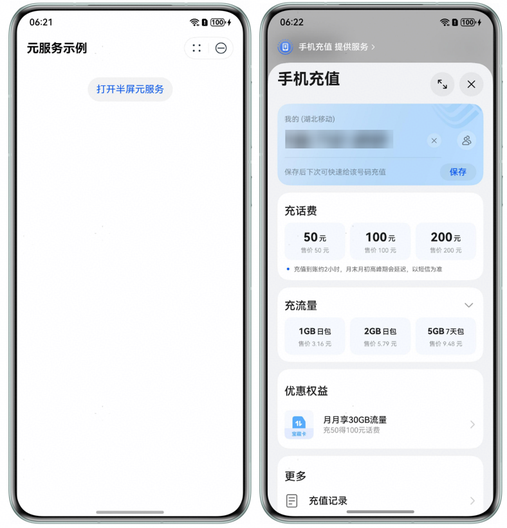

当元服务需要打开另一个元服务让用户进行快捷操作时，可使用该组件将要打开的元服务以半屏形式跳转。

**起始版本：** 1.0.17

**依赖关系：** HarmonyOS SDK版本≥5.1.0(18)

## 约束与限制

开发者需要注意，以半屏形式拉起的元服务中，部分API无法使用，如：

* [has.setScreenBrightness](https://developer.huawei.com/consumer/cn/doc/atomic-ascf/apis-screen#hassetscreenbrightness)、[has.onUserCaptureScreen](https://developer.huawei.com/consumer/cn/doc/atomic-ascf/apis-screen#hasonusercapturescreen)和[has.setKeepScreenOn](https://developer.huawei.com/consumer/cn/doc/atomic-ascf/apis-screen#hassetkeepscreenon)接口会失效。
* [has.getSystemInfo](https://developer.huawei.com/consumer/cn/doc/atomic-ascf/apis-system-info#hasgetsysteminfo)接口会失效，[has.getSystemInfoSync](https://developer.huawei.com/consumer/cn/doc/atomic-ascf/apis-system-info#hasgetsysteminfosync)和[has.getWindowInfo](https://developer.huawei.com/consumer/cn/doc/atomic-ascf/apis-system-info#hasgetwindowinfo)接口无法获取到正确的安全区域和窗口宽高。
* [video](https://developer.huawei.com/consumer/cn/doc/atomic-ascf/components-video)组件设置全屏方向相关属性会失效。
* [has.requestSubscribeMessage](https://developer.huawei.com/consumer/cn/doc/atomic-ascf/apis-message-subscription#hasrequestsubscribemessage)接口会失效。
* [has.onWindowResize](https://developer.huawei.com/consumer/cn/doc/atomic-ascf/apis-window#hasonwindowresize)接口无法获取正确的窗口宽高。

## 属性

| 名称 | 类型 | 必填 | 描述 |
| --- | --- | --- | --- |
| appid | string | 是 | 需要半屏跳转的元服务的AppId参数。 |
| path | string | 否 | 打开的页面路径。路径后可以带参数，参数与路径之间用?分隔，参数与键值用=相连，多个参数用&分隔。在元服务的[App.onLaunch](https://developer.huawei.com/consumer/cn/doc/atomic-ascf/logical-layer-app)、[App.onShow](https://developer.huawei.com/consumer/cn/doc/atomic-ascf/logical-layer-app)和[Page.onLoad](https://developer.huawei.com/consumer/cn/doc/atomic-ascf/logical-layer-page#onload)的回调函数中可以获得参数query。  - path为空或无效值时，则打开首页。  - path不为空，则之前的路径应为在app.json中定义的代码包路径。  例如，在app.json中定义了页面: "page/path/index"，则有效应用内页面路径为："page/path/index?key1=value1&key2=value2"。  **注意：** 该字段仅当目标元服务是ASCF框架开发的元服务时可直接使用，对于ArkTS开发的元服务，需双方自行约定实现，参数将通过目标元服务的[Want](https://developer.huawei.com/consumer/cn/doc/harmonyos-references/js-apis-app-ability-want)对象的parameters字段进行传递。 |
| want-param | object | 否 | 需要传递给目标元服务的数据。  - 若被半屏打开的是ASCF框架开发的元服务，请通过ascfPara.extraData字段传入业务数据。  例如：  \&#123;ascfPara: &#123;extraData: &#123;data: "test"\&#125;&#125;&#125;  - 若被半屏打开的是ArkTS开发的元服务，直接以平铺键值对形式传参，例如：&#123; data: "test" &#125;。  **注意：** subPackageName为系统保留字段，请勿使用。 |
| bindterminated | eventhandle | 否 | 退出的回调事件。被半屏打开的元服务正常退出时触发，event.detail = &#123; params &#125;，其中params为元服务退出时返回的数据。  - 若被半屏打开的是ArkTS开发的元服务，在目标元服务内通过调用[terminateSelfWithResult](https://developer.huawei.com/consumer/cn/doc/harmonyos-references/js-apis-inner-application-uiabilitycontext#terminateselfwithresult)或[terminateSelf](https://developer.huawei.com/consumer/cn/doc/harmonyos-references/js-apis-inner-application-uiabilitycontext#terminateself-1)正常退出时，触发本回调函数。  - 若被半屏打开的是ASCF框架开发的元服务，从1.0.18开始，在目标元服务内通过调用[has.terminateSelf](https://developer.huawei.com/consumer/cn/doc/atomic-ascf/apis-navigate#hasterminateself)退出时，触发本回调函数。 |
| binderror | eventhandle | 否 | 异常的回调事件。被半屏打开的元服务发生运行时异常时触发，event.detail = &#123; errCode, errMsg &#125;。 |

**binderror返回值：**

| 错误码 | 错误信息 |
| --- | --- |
| 10001 | An exception occurs during the running of the opened atomic service. |

## 示例

hxml文件：

```
<view class="container">
    <open-embedded-atomicservice
        appid="{{appid}}"
        binderror="onError"
        bindterminated="onTerminated">
        <button>打开半屏元服务</button>
    </open-embedded-atomicservice>
</view>
```

js文件：

```
Page({
  data: {
    appid: "57xxxxxxxxx", // 此处为样例，请开发者替换为可打开的元服务ID
  },

  onError(err) {
    has.showModal({
      title: '打开元服务失败或发生运行时异常',
      content: JSON.stringify(err.detail),
    })
  },

  onTerminated(info) {
    has.showModal({
      title: '打开的元服务退出',
      content: JSON.stringify(info.detail.params),
    });
  }
});
```

css文件：

```
.container {
  display: flex;
  justify-content: center;
  margin-top: 20px;
}
```

体验示意图如下：


