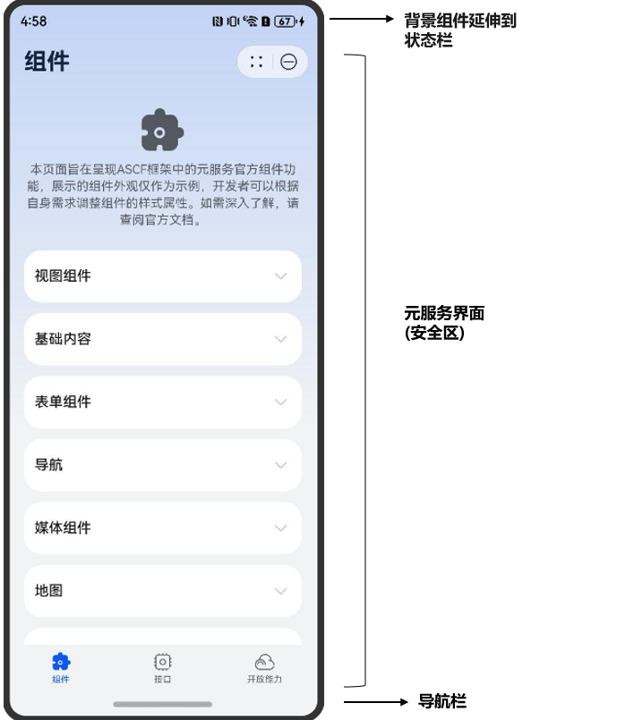

## 实现介绍



对于沉浸式页面来说，整个元服务展示界面可以简单分为三个部分。

* 状态栏
* 元服务界面
* 导航栏

沉浸式页面的实现效果在于将元服务页面扩展至状态栏与导航栏，同时，必须确保状态栏与导航栏的正常功能，防止与页面内容产生冲突。为此，我们将用户能正常执行应用内操作的区域定义为安全区域，并对状态栏与导航栏进行适当的避让，从而达成沉浸式页面的呈现。

## 全局配置

在实现自定义状态栏和导航栏之前，需要先在app.json文件中修改navigationStyle字段为custom，启用自定义导航栏。

```
{
  "pages": ["page/index/index"],
  "window": {
    "navigationStyle": "custom"
  }
}
```

## 页面安全区域避让


TabBar组件会自动实现底部导航栏避让。

### 方案一：使用自定义状态栏和导航栏样式

1. 通过接口获得状态栏和导航栏高度。

   安全区域的计算可以使用has.getSystemInfoSync()或has.getSystemInfo()方法获取顶部statusBarHeight状态栏高度和底部indicatorHeight导航栏高度，以下展示使用has.getSystemInfoSync()方法获取状态栏与导航栏高度。

   ```
   try {
     let res = has.getSystemInfoSync();
     // 获取状态栏高度和导航栏高度
     console.info(`getSystemInfoSync res.indicatorHeight: ${res?.indicatorHeight}, res.statusBarHeight: ${res?.statusBarHeight}`);
   } catch (err) {
     console.error('getSystemInfoSync fail', err);
   };
   ```
2. 自定义样式避让。

   自定义状态栏和导航栏的样式，将第一步获取到的statusBarHeight作为状态栏的高度，indicatorHeight作为导航栏的高度进行填充以实现沉浸式适配。

### 方案二：使用env()函数进行适配避让

可以使用env()函数进行适配，官方提供4个预定义变量，开发者可以使用以下变量对安全区域进行避让。

* 安全区域距离顶部边界的距离：safe-area-inset-top
* 安全区域距离底部边界的距离：safe-area-inset-bottom
* 安全区域距离左边边界的距离：safe-area-inset-left
* 安全区域距离右边边界的距离：safe-area-inset-right

```
.css_body {
  padding-bottom: env(safe-area-inset-bottom);
  padding-top: env(safe-area-inset-top);
}
```
