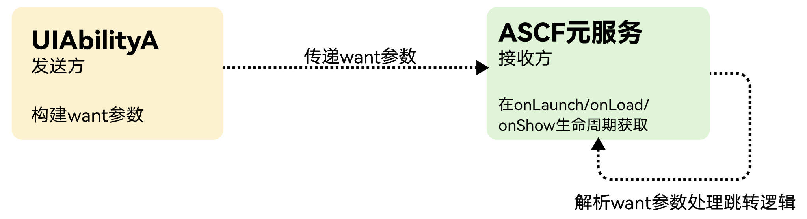

Want参数是应用组件间通信的核心载体对象，作用为启动目标应用/元服务并传递信息。

**图 1** Want用法示意图



## 使用方式

对于需要在ASCF元服务中通过want打开指定页面，整体流程与[启动UIAbility的指定页面](https://developer.huawei.com/consumer/cn/doc/harmonyos-guides/uiability-intra-device-interaction#调用方uiability指定启动页面)类似，但需要关注ASCF元服务将接收指定格式的want内容，所以在构建want参数时需要特殊处理。

## 构造want参数

在面向ASCF元服务构造want参数时，需要需要在ArkTS工程中指定want.parameters中的内容为&#123; ascfPara: [key: string]: Object &#125;结构

ascfPara数据结构

| 参数 | 类型 | 含义 | 备注 |
| --- | --- | --- | --- |
| path | string | 指定跳转的页面路径。 | 1.如path无法找到，将会跳转到元服务首页。  2.支持通过path拼接url参数传递数据 |

例如：

```
let wantInfo: Want = {
  bundleName: 'com.example.app',  // 目标应用包名
  abilityName: 'DetailAbility',   // 目标Ability名称
  parameters: {                   // 传递的参数
    ascfPara: {
      "path": "pages/index?data=testData", // 指定携带数据data: testData跳转到pages/index页面
    }
  }
};
```

## 传递参数

可通过API/App Linking/服务通知等方式拉起元服务，根据不同的拉起方式want参数的传递也有不同，详细请参考[拉起其他元服务](https://developer.huawei.com/consumer/cn/doc/atomic-guides/start-other-atomicservices)。

## 解析参数

可以在ASCF元服务的onLaunch、onLoad生命周期中获取传递的want参数信息。

```
App({
  onLaunch(options) {        // 监听ASCF框架加载。ASCF框架初始化完成时触发，获取want参数
    let path = options.path;  // 解析want参数
    let data = options.query;
    console.info('data', data);
    console.info('path', path);
  }
});
```
