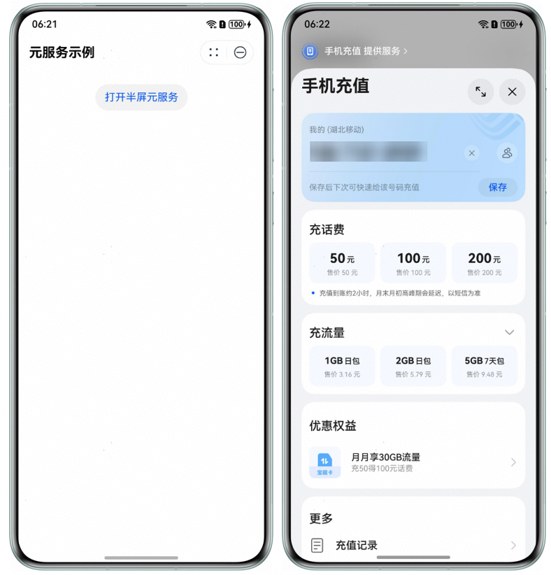
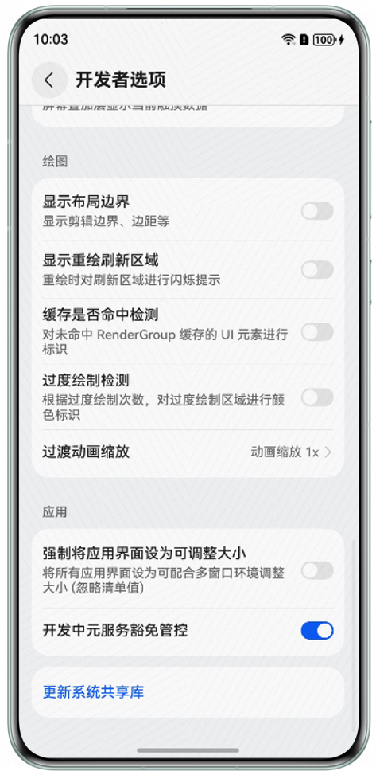

ASCF框架提供[open-embedded-atomicservice](/docs/dev/atomic-dev/ascf/components-open-capabilities/components-open-embedded-atomicservice)组件，允许ASCF框架开发的元服务以半屏形式嵌入式拉起另一个元服务。


嵌入式运行元服务的能力需与被嵌入方建立契约授权。目前处于Beta阶段，如需使用嵌入式能力，请通过邮件（atomicservice@huawei.com）与我们联系以获取授权。

实现的效果如下：



**版本限制：**

* ASCF运行时版本1.0.17及以上版本支持，1.0.17以下不提供open-embedded-atomicservice组件。
* HarmonyOS SDK版本≥5.1.0(18)

## 拉起方实现

在hxml文件中添加open-embedded-atomicservice组件，实现半屏拉起ASCF框架开发的元服务或ArkTS开发的元服务，注意两者传参格式会有所不同，具体用法见下方示例。

hxml文件：

```
<view class="container">
  <!-- 示例1：半屏嵌入式拉起ASCF框架开发的元服务 -->
  <open-embedded-atomicservice
    appid="{{ascfAppId}}"
    path="{{ascfPath}}"
    want-param="{{ascfWantParam}}"
    binderror="onError"
    bindterminated="onTerminated">
    <view class="service-trigger">
      <image class="service-icon" src="{{imgSrc}}"/>
      <text class="service-label">demoA</text>
    </view>
  </open-embedded-atomicservice>

  <!-- 示例2：半屏嵌入式拉起ArkTS开发的元服务 -->
  <open-embedded-atomicservice
    appid="{{arkTsAppId}}"
    want-param="{{arkTsWantParam}}"
    binderror="onError"
    bindterminated="onTerminated">
    <view class="service-trigger">
      <image class="service-icon" src="{{imgSrc}}"/>
      <text class="service-label">demoB</text>
    </view>
  </open-embedded-atomicservice>
</view>
```

js文件：

```
Page({
  data: {
    ascfAppId: 'xxx', // 此处仅为样例，请开发者替换为实际可打开的元服务ID
    ascfPath: 'pages/index/index?launcher=demo', // 此处仅为样例，请开发者替换为实际可打开的目标页面路径
    ascfWantParam: {
      ascfPara: {
        extraData: {
          developerParameters: 'test'
        }
      }
    },

    arkTsAppId: 'xxx', // 此处仅为样例，请开发者替换为实际可打开的元服务ID
    arkTsWantParam: {
      developerParameters: 'test'
    },

    imgSrc: 'icon.png' // 此处仅为样例，请开发者替换为实际可打开的图片地址
  },

  onError(err) {
    // 当被打开的元服务发生运行时异常时触发此回调函数
    const code = err.detail.errCode;
    const message = err.detail.errMsg;
    console.error(`onError, code is ${code}, message is ${message}`);
  },

  onTerminated(info) {
    // 当被打开的元服务正常退出时触发此回调函数
    const params = info.detail?.params;
    console.info(`onTerminated, ${params?.resultMessage}`);
  }
});
```

css文件

```
.container {
  display: flex;
  justify-content: space-evenly;
  margin-top: 20px;
}
.service-trigger {
  flex-direction: column;
  align-items: center;
  display: flex;
}
.service-icon {
  width: 36px;
  height: 36px;
  margin-bottom: 5px;
}
.service-label {
  font-size: 10px;
}
```

## 被拉起方实现

在被拉起的元服务中，可以接收并处理拉起方传递的参数，并在完成操作后退出自身，将结果返回给拉起方。被拉起方可能是基于ASCF框架或ArkTS开发的元服务，二者在参数接收和结果返回的实现方式上有所差异。下方示例分别展示了两种场景下具体实现方法。

### 接收参数

被拉起方是ASCF框架开发的元服务，可通过以下两种方式获取拉起方传递的参数：

* path中的查询参数：在目标页面onLoad生命周期的query参数中直接读取（例如路径为page/path/index?launcher=xxx时，query.launcher的值即为"xxx"）。
* want-param中的结构化数据：通过[has.getLaunchOptionsSync](/docs/dev/atomic-dev/ascf/apis-basis/apis-lifecycle#hasgetlaunchoptionssync)获取元服务启动参数，从中提取referrerInfo.extraData字段即为拉起方元服务通过want-param传递的业务数据。

```
Page({
  onLoad(query) {
    // 1. 获取拉起方 path 属性中携带的 query 参数并打印
    console.info(`Page onLoad, launcher: ${query.launcher}`);
    // 2. 获取拉起方 want-param 属性中传递的结构化参数
    const launchOptions = has.getLaunchOptionsSync(); // 获取元服务启动参数
    if (launchOptions && launchOptions.referrerInfo) {
      const extraData = has.getLaunchOptionsSync().referrerInfo.extraData;
      console.info(`Page onLoad, data from launcher: ${extraData.developerParameters}`);
    }
  }
});
```

被拉起方是ArkTS开发的元服务，在元服务的UIAbility的onCreate中通过want获取拉起方传给元服务的参数：

```
export default class AtomicServiceHspAbility extends UIAbility {
  onCreate(want: Want, launchParam: AbilityConstant.LaunchParam): void {
    console.info(`onCreate, data from launcher: ${want.parameters?.developerParameters}`);
  }
}
```

### 退出并返回结果

被拉起方是ASCF框架开发的元服务，通过调用[has.terminateSelf](/docs/dev/atomic-dev/ascf/apis/apis-navigate#hasterminateself)接口退出并返回结果给拉起方元服务：

```
terminateSelf() {
  has.terminateSelf({
    resultCode: 100, // 自定义返回给拉起方元服务的结果码
    params: {
      resultMessage: 'aabb' // 自定义返回给拉起方元服务的信息
    },
    success: () => {
      console.info('terminate success');
    },
    fail: (err) => {
      console.error(`terminate fail, code is ${err.errCode}, message is ${err.errMsg}`);
    },
    complete: () => {
      console.info('terminate complete');
    }
  })
}
```

被拉起方是ArkTS开发的元服务，通过调用[terminateSelfWithResult](https://developer.huawei.com/consumer/cn/doc/harmonyos-references/js-apis-inner-application-uiabilitycontext#terminateselfwithresult)退出并返回结果给拉起方元服务：

```
import { common } from '@kit.AbilityKit';
import { BusinessError } from '@kit.BasicServicesKit';

@Entry
@Component
struct Index {
  private uiContext = this.getUIContext();
  private context: common.UIAbilityContext = this.uiContext?.getHostContext() as common.UIAbilityContext;
  build() {
    Column() {
      Button('退出并返回数据')
        .onClick(() => {
          const abilityResult: common.AbilityResult = {
            resultCode: 100, // 自定义返回给拉起方元服务的结果码
            want: {
              parameters: {
                resultMessage: 'aabb' // 自定义返回给拉起方元服务的信息
              }
            }
          };
          try {
            this.context.terminateSelfWithResult(abilityResult)
              .then(() => {
                console.info('terminateSelfWithResult succeed');
              })
              .catch((err: BusinessError) => {
                console.error(`terminateSelfWithResult failed, code is ${err.code}, message is ${err.message}`);
              });
          } catch (err) {
            console.error(`terminateSelfWithResult failed, code is ${err.code}, message is ${err.message}`);
          }
        })
    }.height('100%').width('100%').justifyContent(FlexAlign.Center)
  }
}
```

## 兼容性设计

当宿主机SDK版本低于5.1.0(18)时，open-embedded-atomicservice组件无法使用。为保障功能可用性并避免用户体验中断，可使用[has.navigateToAtomicService](/docs/dev/atomic-dev/ascf/apis/apis-navigate#hasnavigatetoatomicservice)接口，实现以全屏跳出方式拉起目标元服务。

**示例代码：**

hxml文件：

```
<div class="container">
  <div has:if="{{!isEmbeddedSupported}}">
    <button bindtap="navigateToService">手机充值</button>
  </div>
  <div has:else>
    <open-embedded-atomicservice appid="{{appid}}">
      <button>点此跳转</button>
    </open-embedded-atomicservice>
  </div>
</div>
```

js文件：

```
Page({
  data: {
    appid: 'xxx', // 此处仅为样例，请开发者替换为实际可打开的元服务ID
    isEmbeddedSupported: false, // 是否支持嵌入式打开
  },

  onLoad() {
    const apiVersion = has.getSystemInfoSync().OSApiVersion;
    this.setData({
      isEmbeddedSupported: apiVersion >= 18, // 当API版本大于等于18时支持半屏嵌入式方式打开另一个元服务
    });
    console.info('onLoad -> get API version:', apiVersion);
  },

  navigateToService() {
    has.navigateToAtomicService({
      appId: this.data.appid,
      success: () => {
        console.info('Navigation to service successful');
      },
      fail: (res) => {
        console.error('Failed to navigate to service:', res);
      },
      complete: () => {
        console.info('Navigation to service completed');
      }
    })
  }
});
```

css文件：

```
.container {
  display: flex;
  flex-direction: column;
  align-items: center;
  padding: 20px;
}
```

## 开发者调试

嵌入式运行元服务能力默认是受限的，需要开发者申请权限，才能使用。如果开发者在申请权限之前开发调试阶段想临时开启权限，可以通过打开开发者选项中的“开发中元服务豁免管控”开关来获取调试嵌入式元服务的权限。




开发者选项中的“开发中元服务豁免管控”开关具体放通规格说明：

* 拉起方应用和被拉起方元服务，至少有一方的签名必须是调试签名，才可以通过打开该开关放通权限管控。
* 如果拉起方应用需要调试嵌入式运行的元服务已经上架发布，需要先在负一屏手动搜索并下载安装该元服务，再测试嵌入式运行该元服务，目前版本不支持调试阶段嵌入式运行触发元服务免安装。

## 使用限制

当在open-embedded-atomicservice中使用button作为子组件时，按钮的按压态相关属性（如hover-class、hover-start-time等）将无法正常生效。
