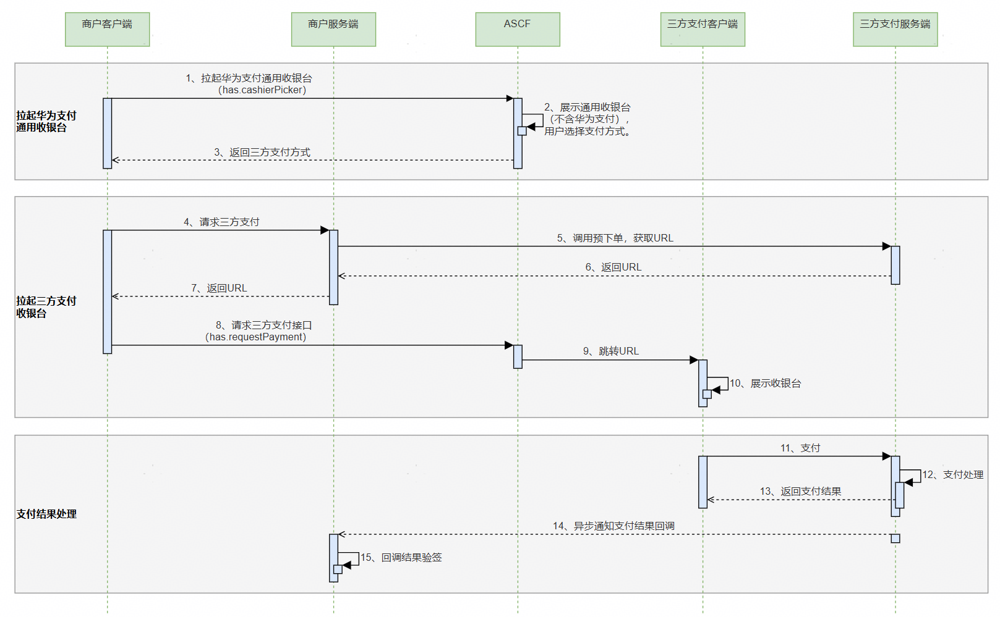

## 接入华为支付服务

Payment Kit（华为支付服务）提供了方便、安全和快捷的支付方式，用户可在元服务内完成实物商品的购买并展示支付结果。

Payment Kit的能力只支持实物商品和服务（酒店服务、出行服务、充值缴费服务）的支付，暂不支持如电子虚拟人物形象，游戏中的关卡、货币及道具等虚拟商品的支付。

虚拟商品的支付可接入[IAP应用内支付服务](https://developer.huawei.com/consumer/cn/doc/harmonyos-guides/iap-kit-guide)。

### 接入方式

开发方式与元服务的接入方式相同，详见[Payment Kit开发指南](https://developer.huawei.com/consumer/cn/doc/harmonyos-guides/payment-introduction)。

```
has.requestPayment({
  orderStr: '{"app_id":"***","merc_no":"***","prepay_id":"xxx","timestamp":"1680259863114","noncestr":"***","sign":"****","auth_id":"***"}',
  success: () => {
    console.info('requestPayment success');
  },
  fail: (err) => {
    console.error('requestPayment fail', err);
  },
  complete: (res) => {
    console.info('requestPayment complete', res);
  }
});
```

## 接入IAP应用内支付服务

IAP Kit（应用内支付服务）为开发者提供便捷的应用内支付体验和简便的接入流程，可通过使用IAP Kit提供的系统级支付API快速启动IAP收银台，即可实现应用内支付。详见[IAP应用内支付服务开发指南](https://developer.huawei.com/consumer/cn/doc/harmonyos-guides/iap-kit-guide)。

通过IAP Kit，用户可以在应用内购买各种类型的**数字商品（虚拟商品）** ，包括消耗型商品、非消耗型商品、自动续期订阅商品和非续期订阅商品。

| 商品类型 | 定义 | 用户权益时间 | 开发者权益处理 | 场景举例 |
| --- | --- | --- | --- | --- |
| 消耗型商品 | 使用一次后即消耗掉，随使用减少，需要再次购买的商品。 | 无限制 | 开发者发放权益后，后续不再进行管理。 | 游戏货币，游戏道具等。 |
| 非消耗型商品 | 一次性购买，永久拥有，无需消耗 | 永久 | 开发者永久维护用户权益。 | 游戏中额外的游戏关卡、应用中无时限的高级会员等。 |
| 自动续期订阅商品 | 用户购买后在一段时间内允许访问增值功能或内容，周期结束前自动续期购买下一期的服务。 | 连续性周期 | 开发者周期性维护用户权益。 | 应用中有时限的自动续期高级会员，如：视频连续包月会员。 |
| 非续期订阅商品 | 用户购买后在一段时间内允许访问增值功能或内容，周期结束后禁止访问，除非再次购买自动续期订阅或非续期订阅商品。 | 一个周期 | 开发者在一个周期内要进行权益维护。 | 应用中有时限的高级会员，如：视频一个月会员。 |

```
has.createIap({
  // 替换为实际的商品id
  productId: 'product_id',
  productType: 0,
  developerPayload: '',
  reservedInfo: '{"key1":"value1"}',
  promotionalOfferId: '',
  applicationUserName: '',
  jwsRepresentation: '',
  success: (res) => {
    console.info('createIap success', res);
  },
  fail: (err) => {
    console.error('createIap fail', err);
  },
  complete: (res) => {
    console.info('createIap complete', res);
  }
});
```

## 使用通用收银台实现外部支付

用户在元服务中选购完商品，点击下单购买时，ASCF元服务提供接口支持开发者拉起通用收银台选择三方支付方式完成商品订单的支付。

### 接入流程

华为支付通用收银台纯外部支付接入流程如下：

| 步骤 | 说明 |
| --- | --- |
| 商户入网（非必选） | 由于三方支付为直接连接第三方支付平台完成支付，故可能涉及需要开发者在第三方支付平台注册、创建商户（建议开发者用新申请的商户号与现有商户号做区分）。 |
| [产品开通与配置](https://developer.huawei.com/consumer/cn/doc/harmonyos-guides/payment-common-pay-introduction#section3657513103713) | 申请开通三方支付及完成相关支付模式配置。 |
| 通用收银台接入 | 根据外部支付场景[开发步骤](https://developer.huawei.com/consumer/cn/doc/harmonyos-guides/payment-common-pay-external#section9187179113620)完成通用收银台支付接入。 |

具体业务流程如下：



客户端根据商户已开通的支付方式调用cashierPicker接口拉起Payment Kit通用收银台，具体API说明详见[支付接口文档](https://developer.huawei.com/consumer/cn/doc/atomic-ascf/apis-payment#hascashierpicker)；用户选择支付方式后，再调用[requestPayment](https://developer.huawei.com/consumer/cn/doc/atomic-ascf/apis-payment#hasrequestpayment)接口跳转到三方支付。

**示例**

```
has.cashierPicker({
  tradeSummary: '',
  amount: 100,
  currency: 'CNY',
  extraInfo: '',
  success: (res) => {
    console.info('cashierPicker success', res.clientToken);
    setTimeout(() => {
      has.requestPayment({
        orderStr: `{"nextAction":"L","linkUrl":"https://www.***.pay.com/h5pay?prepay_id=***&sign=***","scheme":"","clientToken":"${res.clientToken}"}`,
        payload: 'AP',
        success: (res) => {
          console.info('requestPayment success', res);
        },
        fail: (err) => {
          console.error('requestPayment fail', err);
        },
        complete: (res) => {
          console.info('requestPayment complete', res);
        }
      });
    }, 1000);
  },
  fail: (err) => {
    console.error('cashierPicker fail', err);
  },
  complete: (res) => {
    console.info('cashierPicker complete', res);
  }
});
```
