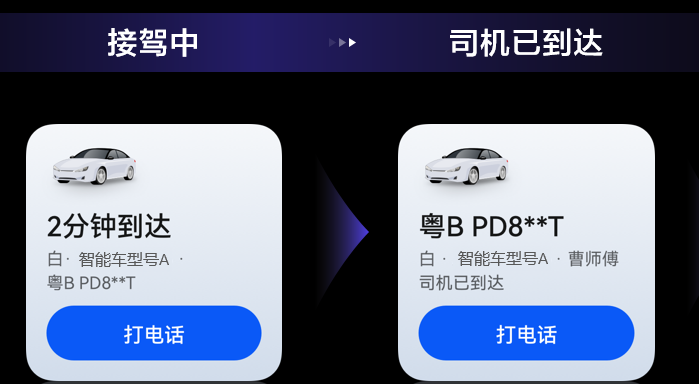
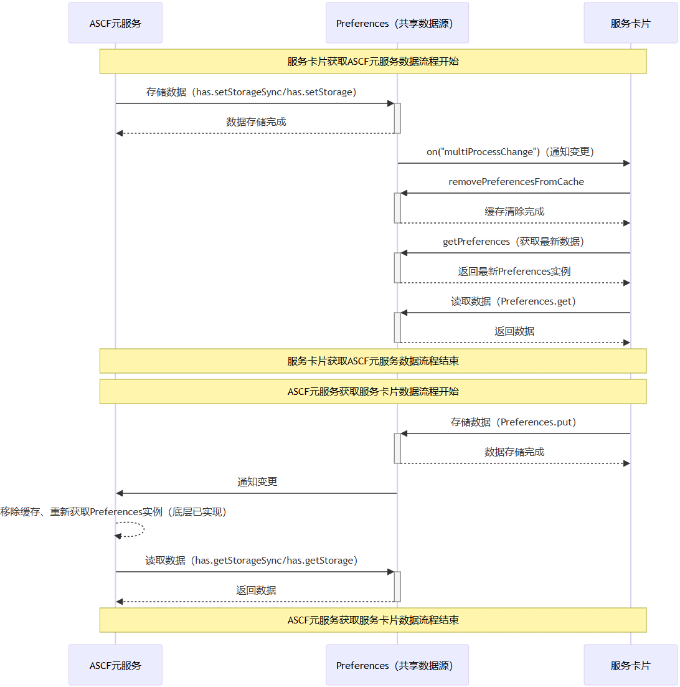

当元服务需要与卡片互通数据时，可以参考以下指导开发。

## 场景描述

当卡片需要从元服务获取信息，或元服务需要响应卡片的操作时，可以采用共享存储数据的方式实现。例如，在打车场景中，用户可以在卡片上执行拨打电话的操作，此时卡片侧显示的司机手机号就是从元服务中获取的数据。



## 开发流程

元服务与卡片共享存储数据可以通过用户首选项（Preferences）来实现，双方指定使用相同的Preferences实例的名称。但是需要注意的是，应用首次调用getPreferences接口获取某个Preferences实例后，该实例会被缓存起来，后续再次getPreferences时不会再次从持久化文件中读取，直接从缓存中获取Preferences实例；所以多个进程持有同一个首选项文件时，需要订阅进程间数据变更事件，在on('multiProcessChange')回调方法中调用removePreferencesFromCache从缓存中移除指定的Preferences实例，然后再重新获取Preferences实例。

**元服务与卡片共享存储数据流程示意图**：




* 元服务更新的数据，卡片需等待5秒以上才能获取到最新值。
* 因卡片存储的数据在元服务需通过[数据缓存](https://developer.huawei.com/consumer/cn/doc/atomic-ascf/apis-data-storage)接口获取，所以建议卡片存储的数据能够通过JSON.stringify序列化，并且单个key存储的最大数据长度不超过1MB。

以下代码展示的是元服务与卡片共享一个随机数的案例：

ASCF元服务侧：

```
<!-- index.hxml -->
<view class="content">
  <view class="text-wrap">
    <text class="text">随机数：{{ randomNumber }}</text>
  </view>
  <button class="mb-40 btn read-btn" bindtap="readRandomNumber">读取随机数</button>
  <button class="mb-40 btn update-btn" bindtap="updateRandomNumber">更新随机数</button>
</view>
```

```
// index.js
const RANDOM_NUMBER_KEY = 'localRandomNumber'
Page({
  data: {
    randomNumber: ''
  },
  readRandomNumber() {
    const localRandomNumber = has.getStorageSync(RANDOM_NUMBER_KEY, 0);
    this.setData({ randomNumber: localRandomNumber });
  },
  updateRandomNumber() {
    const randomNumber = Math.floor(Math.random() * 101);
    has.setStorageSync(RANDOM_NUMBER_KEY, randomNumber);
    this.setData({ randomNumber });
  }
})
```

服务卡片侧：

```
// EntryFormAbility.ets
import { formBindingData, FormExtensionAbility, formProvider } from '@kit.FormKit';
import { BusinessError } from '@kit.BasicServicesKit';
import { preferences } from '@kit.ArkData';

// ASCF中Preferences的名字，不可自定义
const PREFERENCES_NAME: string = '__^ascf_preferences$__';
const RANDOM_NUMBER_KEY: string = 'localRandomNumber';
const PREFERENCES_OPTIONS: preferences.Options = { name: PREFERENCES_NAME };

interface MessageOptions {
  messageName: string;
}

export default class EntryFormAbility extends FormExtensionAbility {
  currentFormId: string = '';
  currentMessage: string = '';
  dataPreferences: preferences.Preferences | undefined;

  onAddForm() {
    const formData = '';
    return formBindingData.createFormBindingData(formData);
  }

  onFormEvent(formId: string, message: string) {
    this.currentFormId = formId;
    this.currentMessage = message;
    this.disposeCardEvent();
  }

  getPreference(): preferences.Preferences {
    if (this.dataPreferences) {
      return this.dataPreferences;
    }
    const applicationContext = this.context.getApplicationContext();
    this.dataPreferences = preferences.getPreferencesSync(applicationContext, PREFERENCES_OPTIONS);
    // 获取Preferences实例后，订阅进程间数据变更事件
    this.dataPreferences.on('multiProcessChange', () => {
      // 调用removePreferencesFromCache从缓存中移除指定的Preferences实例
      preferences.removePreferencesFromCacheSync(applicationContext, PREFERENCES_OPTIONS);
      this.dataPreferences = undefined;
    });
    return this.dataPreferences;
  }

  disposeCardEvent() {
    const option: MessageOptions = JSON.parse(this.currentMessage);
    let text: string = '';
    if (option.messageName === 'get') {
      text = this.getPreference().getSync(RANDOM_NUMBER_KEY, '0').toString();
      this.updateCard(text);
    } else {
      text = Math.floor(Math.random() * 101).toString();
      this.getPreference().putSync(RANDOM_NUMBER_KEY, text);
      this.getPreference().flushSync();
      this.updateCard(text);
    }
  }

  updateCard(text: string) {
    class WidgetCardData {
      randomNumber: string = text;
    }

    const formData = new WidgetCardData();
    const formInfo: formBindingData.FormBindingData = formBindingData.createFormBindingData(formData);
    formProvider.updateForm(this.currentFormId, formInfo).then(() => {
      console.info('formProvider updateForm success');
    }).catch((err: BusinessError) => {
      console.error('formProvider updateForm  fail', err);
    });
  }
};
```

卡片视图UI:

```
// WidgetCard.ets
const storageUpdateByMsg = new LocalStorage();

@Entry(storageUpdateByMsg)
@Component
struct WidgetCard {
  @LocalStorageProp('randomNumber') randomNumber: ResourceStr = '0';
  readonly actionType: string = 'router';
  readonly abilityName: string = 'EntryAbility';
  readonly message: string = 'add detail';

  build() {
    Column() {
      Column() {
        Text('随机数：' + this.randomNumber)
          .fontColor('#000000')
          .fontSize(36)
          .margin({ top: '8%', left: '10%' });
      }.width('100%').height('40%')
      .alignItems(HorizontalAlign.Start);

      Column() {
        Button() {
          Text('读取随机数')
            .fontColor('#ffffff')
            .fontSize(18);
        }
        .width(150)
        .height(40)
        .margin({ bottom: 20 })
        .backgroundColor(Color.Orange)
        .borderRadius(16)
        .onClick(() => {
          postCardAction(this, {
            action: 'message',
            params: { messageName: 'get' }
          });
        });

        Button() {
          Text('更新随机数')
            .fontColor('#45A6F4')
            .fontSize(18);
        }
        .width(150)
        .height(40)
        .margin({ bottom: 10 })
        .backgroundColor(Color.Blue)
        .borderRadius(16)
        .onClick(() => {
          postCardAction(this, {
            action: 'message',
            params: { messageName: 'update' }
          });
        });
      }
      .width('100%').height('40%');
    }
    .width('100%')
    .height('100%')
    .alignItems(HorizontalAlign.Start)
    .backgroundImageSize(ImageSize.Cover)
    .onClick(() => {
      postCardAction(this, {
        action: this.actionType,
        abilityName: this.abilityName,
        params: {
          message: this.message
        }
      });
    });
  }
}
```
