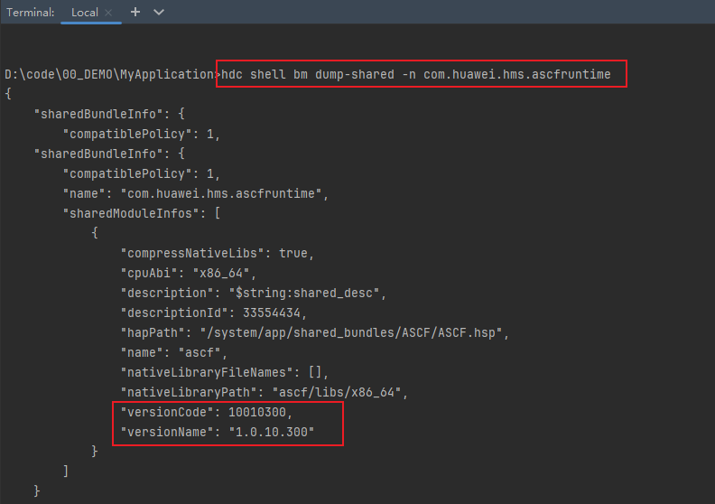
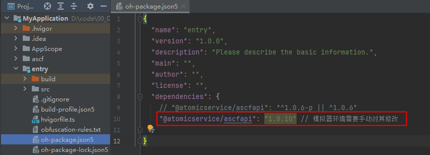

**问题现象**

模拟器运行ASCF框架无法正常启动，提示“Failed to install the HAP or HSP because the dependent module does not exist.”错误。

报错信息：

Install Failed: error: failed to install bundle.

code:9568305

error: Failed to install the HAP or HSP because the dependent module does not exist.

**可能原因**

项目中所依赖的运行时的版本可能高于模拟器版本。

**解决措施**

对于模拟器中的ASCF运行时，是不能安装和升级的，所以框架指定的版本号不能高于模拟器中预置的版本号，需要修改项目配置。

1. 获取模拟器ASCF运行时的版本号。

   hdc环境配置请参考[可选命令行直接执行hdc程序](https://developer.huawei.com/consumer/cn/doc/harmonyos-guides/hdc#可选命令行直接执行hdc程序)，使用如下命令读取版本号：

   ```
   hdc shell bm dump-shared -n com.huawei.hms.ascfruntime
   ```

   
2. 修改项目配置。

   例如此时的versionName为“1.0.10.300”，则需要将entry/oh-package.json5配置文件中的版本字段"@atomicservice/ascfapi": "^1.0.6"改为"@atomicservice/ascfapi": "1.0.10"，然后同步项目即可。

   

查询当前是否是模拟器的方法：

```
hdc shell param get const.product.model
```

结果为emulator，当前是模拟器环境。
