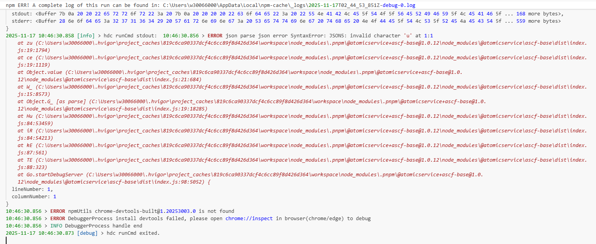
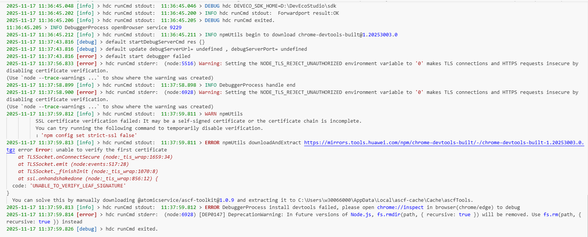
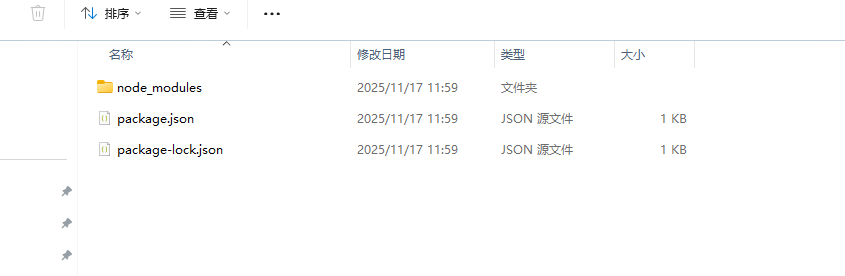

**问题现象**

devtool工具安装失败，例如下图中的错误。



或者



**解决措施**

手动安装devtool到指定缓存目录。参考ascf缓存目录：

win："C:\Users\你的用户名\AppData\Local\ascf-cache\Cache"

mac："/users/你的用户名/Library/caches/ascf-cache"

下面以Windows为例，首先随便新建一个文件夹，在当前的文件夹下安装devtool工具，安装命令如下：

```
npm install chrome-devtools-built@1.20253003.0
```



进入到"node\_modules"目录中，将"chrome-devtools-built"文件夹重命名为"chrome-devtools"并复制到缓存目录下即可。
