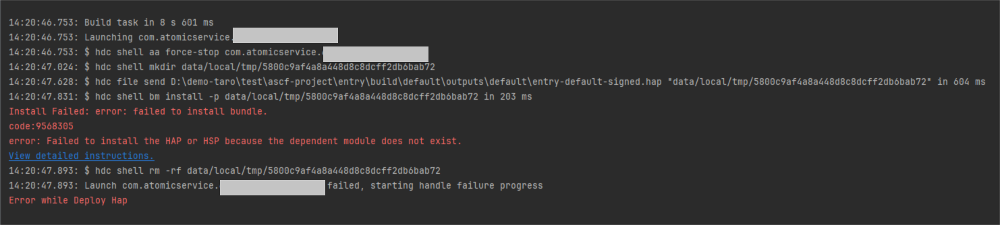
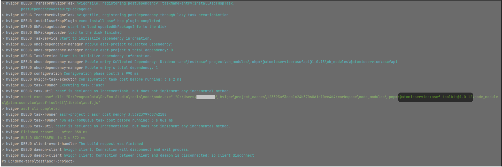
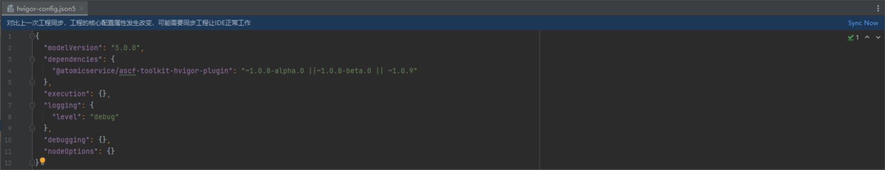

**问题现象**

DevEco Studio或者在VSCode中点击运行元服务启动报错，错误提示如下图所示：



**解决措施**

该错误产生的原因存在多种情况，解决措施建议如下：

1. ASCF工具链的版本

   在DevEco Studio的终端中执行下面的命令：

   ```
   hvigorw ascf args="-V"
   ```

   输出的结果如下图所示，可以看到当前工具链的版本。如果不是最新的，建议更新到当前最新的版本。

   

   更新版本，可以如下图所示：

   

   * 修改版本号。
   * 点击sync，之后会自动更新至指定的版本。
2. 清理应用市场中的缓存

   一般来说，更新工具链版本之后，就解决了问题。但是还有一种场景：如果手动执行命令删除手机中的ASCF运行后，再点击启动元服务，可能依然会报错。

   问题根因：

   ASCF工具链会协助开发者打开一个元服务示例，从而指导开发者下载ASCF运行时。在拉起元服务的过程中，可能会命中应用市场中的缓存机制（即手动执行命令清理ASCF运行时后，应用市场依然存在ASCF运行时的缓存），那么拉起元服务示例时就不会执行ASCF运行时的下载，最终导致手机中没有ASCF运行时，从而产生报错。

   手机在拉起元服务示例会报错：加载失败，请点击重试。

   可以使用以下命令清理应用市场中的缓存

   ```
   hdc shell bm clean -n com.huawei.hmsapp.appgallery -c
   hdc shell bm clean -n com.huawei.hmsapp.appgallery -d
   hdc shell aa force-stop com.huawei.hmsapp.appgallery
   ```
3. 手动打开元服务ASCF示例

   如果以上办法都不能解决问题，那么可以手动在应用市场中搜索“元服务ASCF示例”点击打开，之后继续调试运行元服务即可。
