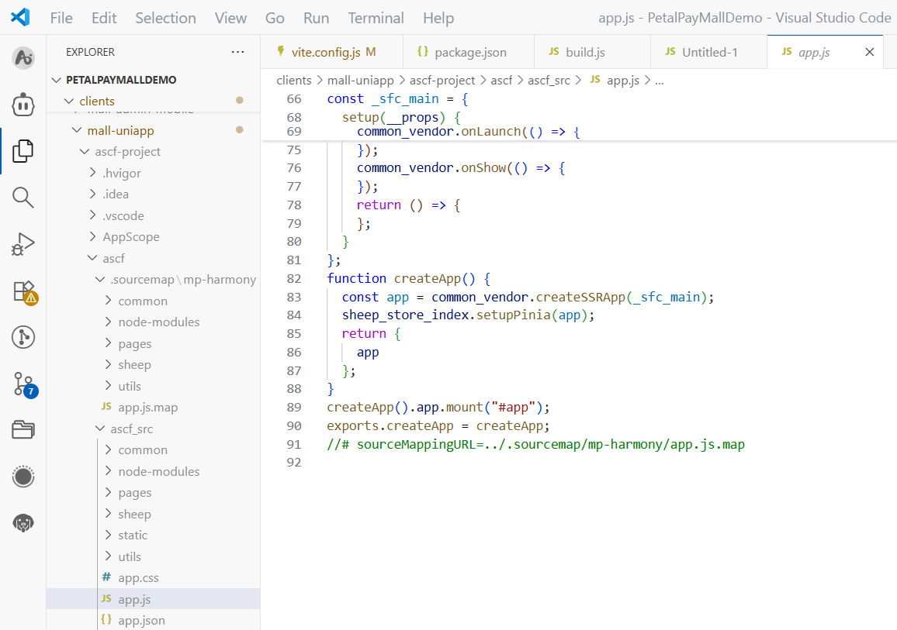

**问题现象**

uniapp编译运行没有sourcemap，无法调试。

**解决措施**

CLI编译，可以增加环境变量，参考：

```
（win32）：set UNI_SOCKET_HOSTS=0.0.0.0 && set UNI_SOCKET_PORT=9876 && set UNI_SOCKET_ID=1
（mac）：export UNI_SOCKET_HOSTS=0.0.0.0 && set UNI_SOCKET_PORT=9876 && set UNI_SOCKET_ID=1
```

编译产物如下图所示。



HBuildX编译运行，建议更新最新的IDE版本。
