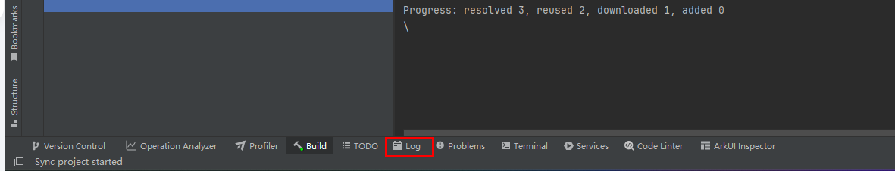
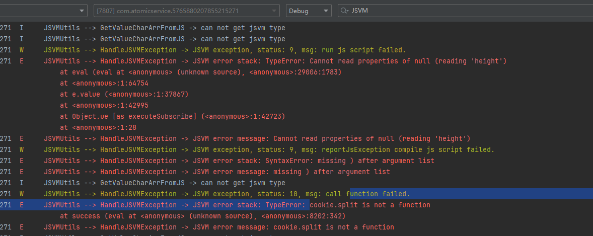

**问题现象**

修改js/json文件出现热重载功能不生效，日志报错：

BundleResourceLoader --&gt; request -&gt; fetch bundle resource from ascfDevServer failed, name: undefined, message: It is not allowed to access this domain

**可能原因**

设备没有开启“开发中元服务豁免管控”选项。

**解决措施**

在[开发者选项](https://developer.huawei.com/consumer/cn/doc/harmonyos-guides/ide-developer-mode#section530763213432)中，开启“开发中元服务豁免管控”。

通过HiLog快速查看error日志方法：

1. 点击DevEco Studio底部的Log。

   
2. 在搜索栏搜索“fetch bundle resource from ascfDevServer failed, name”。

   
