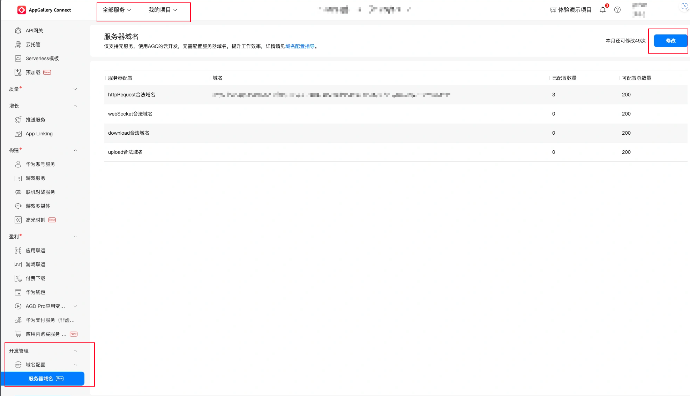

## 元服务运行遇到白屏问题如何调试

元服务启动白屏原因可能有以下常见原因：

* DevEco Studio相关配置没有配置成功。

  自查方案：可尝试运行HBuilderX内置的空白模板可正常运行，规避环境配置问题。
* 页面中使用了元服务尚未支持的API、使用了Plus API导致页面启动报错。

  可观察控制台是否有相关错误提示。也可尝试缩小问题范围，注释页面相关逻辑，锁定出问题的页面、组件、逻辑。

请根据运行日志查看具体错误信息，修改后重新运行；具体日志查看方法请参考[查看元服务日志](#如何查看分析元服务的日志)。

如果页面已经运行起来了，可以通过[调试定位](https://developer.huawei.com/consumer/cn/doc/atomic-ascf/debug-ascf-code)具体问题，通过使用 ascf debugger start 启动调试工具，断点调试解决问题。

## 如何查看、分析元服务的日志

* 在DevEco Studio在底部找到 Log 面板，筛选正在开发的应用，过滤Warn级别，观察此时log是否有告警、错误爆红。

  或是通过 hdc shell hilog --domain 0x006F,0x8BF2 命令行查看日志。
* 用户侧打印的log建议临时通过固定前缀，在Info级别进行过滤，或者临时使用console.warn进行数据打印。

如果报错中包含 xxx is not defined，可能是对应的API在元服务中还未实现，比如获取胶囊位置、获取激励视频等。此类问题需要使用条件编译进行规避。

如果报错中包含 vendor.js 中有报错，可能是三方组件库不兼容元服务，可以参考[通用定位问题方法](#通用定位问题方法)进行错误定位。

## 编译构建

### 通用定位问题方法

需要定位具体问题，可以在HBuilderX的安装根目录，创建.HX\_LAUNCHER\_DEBUG空文件后，重启运行。在HBuilderX菜单“帮助”&gt;“查看运行日志”，查看具体错误信息。

尝试上述方法仍无法定位到具体原因，可以将HBuilderX 的编译产物 unpackage/dist/dev/.mp-harmony 内容放置到 DevEco Studio工程中ASCF项目的 ascf\_src 目录下，使用ASCF工具链直接启动运行看具体错误信息。如果错误信息还是无法定位到问题，可以开启 hvigor/hvigor-config.json5中logging为debug后看日志。

### 发布报错Invalid storeFile value

发布报错：hvigor ERROR: Invalid storeFile value. Make sure it is not null or empty. The file must be included.

如果发生在应用运行、发行阶段。可能是构建时候证书缺少或者配置不对。参考[发布元服务](https://developer.huawei.com/consumer/cn/doc/app/agc-help-release-atomic-guide-0000002293651514)进行证书申请。

### 发行报错Unable to find the product 'release'

发行报错：hvigor ERROR: Unable to find the product 'release'

如果是发生应用发行阶段，可能是未填写完整的发布证书，需要调整 build-profile.json5。

### 运行报错failed to install bundle

运行报错：failed to install bundle. code:9568296 error: install failed due to error bundle type

模拟器或者真机上已经安装了当前 BundleName 的应用。可能是证书复用导致的错误，重新确认当前证书是元服务证书，而不是HarmonyOS应用的证书。

### 运行报错SDK component missing

运行报错：hvigor ERROR: SDK component missing. Please verify the integrity of your SDK.

可能声明了不兼容的字段，需要在 harmony-mp-configs/build-profile.json5 里面去掉 app.products.\*.compileSdkVersion 属性。

### 运行报错 the dependent module does not exist

运行报错：Failed to install the HAP or HSP because the dependent module does not exist.

表明当前环境缺少元服务运行所必须的基础依赖，通常出现在初次运行的错误提示。

可以在应用市场搜索 “helloUniapp”，随后直接运行以自动安装ASCF引擎。

## 调试运行

### 发送网络请求报错

需要在配置网络访问白名单：

* 临时方案：

  进入手机 &gt; 设置 &gt; 系统 &gt; 开发者选项（如果未开启 关于手机 - 软件版本连续点击开启） &gt; 开发中元服务豁免管控，选择开启后，可以自由调试。
* 稳定方案：

  整理 web-view 需要用到的相关域名，进入[AppGallery Connect](https://developer.huawei.com/consumer/cn/service/josp/agc/index.html#/) - 我的项目 - 开发管理 - 域名设置 - 服务器域名 - httpRequest 合法域名。按照提示进行填写。填写完成后打开 手机设置 - 应用与元服务，删掉正在开发的元服务，重新启动应用。

  

### web-view组件渲染空白，不能展示网页

web-view组件渲染空白，不能展示网页，可能是因为网络请求报错，请参考[发送网络请求报错](#发送网络请求报错)。

### 使用Map组件无法展示地图

使用Map组件无法展示地图，获取位置相关API使用报错，可参考以下步骤排查：

1. Map 和相关定位需要[AppGallery Connect](https://developer.huawei.com/consumer/cn/service/josp/agc/index.html#/)进行权限申请。具体可以参考[Map Kit开发准备](https://developer.huawei.com/consumer/cn/doc/harmonyos-guides/map-config-agc)，在“项目设置 &gt; API管理”开启定位服务、位置服务、地图服务。
2. 在“harmony-mp-configs/entry/src/main/module.json5”的“requestPermissions”字段里添加ohos.permission.LOCATION和 ohos.permission.APPROXIMATELY\_LOCATION。
3. 元服务不允许未经用户同意发起定位。在请求位置之前需要获取用户授权。伪代码如下：

   ```
   uni.authorize({
     scope: 'scope.userLocation',
     success: () => {
       uni.getLocation({});
     },
     fail: () => {
       uni.showToast({
         title: '未授权获取地理位置权限',
       });
     },
   });
   ```

## 提交审核报错

### “设备权限调用”填写不全

当提交审核报错时，请检查华为后台隐私政策中 “设备权限调用” 是否填写完整。即检查代码中module.json5中的requestPermissions字段和AGC后台的隐私协议权限第二条的设备权限调用是否严格一致。


* 位置权限中，精准定位 ohos.permission.LOCATION和模糊定位 ohos.permission.APPROXIMATELY\_LOCATION 务必成对出现。
* 需要用户选择媒体文件、或将文件保存到用户设备时，建议使用uni.chooseMedia和uni.saveFile接口，无需勾选ohos.permission.WRITE\_IMAGEVIDEO和ohos.permission.READ\_IMAGEVIDEO权限即可读取和写入。
* 目前无法读取用户剪切板内容，请不要勾选剪切板ohos.permission.READ\_PASTEBOARD权限，如需设置剪切板内容可使用uni.setClipboardData接口。

### 报错 submit version for review failed

报错 sumit version for review failed, additional msg is xxx：

* 报错信息msg为[[5]]：出现此报错一般是代码中deviceType和uniapp后台里选择的不一致，确保deviceType和后台选择保持一致即可。建议在后台中勾选Phone手机。
* 报错信息msg为“AppGalleryConnectAppMetaInfoService version's privacyAgreementId is empty”：出现此报错一般是在上架过程中某些协议没有选择，需要确保选择的协议是否出现疏漏，选择正确协议后重新校验审核即可通过。
* 报错信息msg为“appAdapters devices can not own entry main packages”：

  + 代码内应用适配平台和HarmonyOS后台勾选的设备不匹配，可检查代码中设备清单与线上资料是否一致。具体请参考[uniApp适配参考](https://uniapp.dcloud.net.cn/tutorial/mp-harmony/intro.html#sumit-version-for-review-failed-additional-msg-is-xxx)。
  + 代码工程中，需要在harmony-mp-configs/entry/src/main/module.json5中搜索deviceTypes，通常只设置phone值，表示兼容手机。
  + 在AGC后台或uni-app提审后台，也有适配设备选项，确保和代码中保持一致，通常勾选手机Phone值，表示兼容手机。

## 上架被驳回

* 元服务图标（最近任务列表图标）未使用平台提供的元服务图标生成工具生成，图标使用不规范。

  处理方案：参考 [如何修改元服务默认标题、图标、启动图等信息？](https://uniapp.dcloud.net.cn/tutorial/mp-harmony/intro.html#how-to-change-icon)
* 您的元服务提交的图标为系统图标（安装后/最近任务列表）。

  修改建议：元服务图标不得为系统图标。

  处理方案：参考 [如何修改元服务默认标题、图标、启动图等信息？](https://uniapp.dcloud.net.cn/tutorial/mp-harmony/intro.html#how-to-change-icon)
* 元服务存在自定构造的登录页面，不符合华为应用市场审核标准。

  处理方案：参考 [API 登录 uni.login 获取 code 报错、如何绑定现有用户体系？](https://uniapp.dcloud.net.cn/tutorial/mp-harmony/intro.html#how-to-design-user-login)
* 提交的元服务名称/图标与最近任务列表的元服务名称/元服务图标不一致。

  处理方案：参考 [如何修改元服务默认标题、图标、启动图等信息？](https://uniapp.dcloud.net.cn/tutorial/mp-harmony/intro.html#how-to-change-icon)
* 元服务内的隐私政策/在 AppGallery Connect 上提交的隐私政策网址内元服务名称与开发者提交的元服务名称信息不一致。

  处理方案：隐私协议是在AGC后台填写表格构建的，观察表格里顶部的名称是否和appid对应的名称是否一致。
* 元服务内用户协议展示的元服务名称与在 AppGallery Connect 上提交的元服务名称不一致。

  处理方案：用户协议网址一般是在AGC后台添加的，观察填写的URL内容和当前的元服务名称是否一样，元服务名称华为后台appid对应的名称一致。
* 隐私政策、用户协议未体现HarmonyOS平台。

  处理方案：检查在其他操作系统的相关描述旁，是否有HarmonyOS。常见的情况是直接把其他操作平台的隐私协议直接上传，没有增加HarmonyOS字样，未针对HarmonyOS平台做适配，导致上架被驳回。
* 存在自行构造的登录页面，不符合华为应用市场审核标准。

  元服务的登录要求可以参考阅读[使用华为账号登录 静默登录](https://developer.huawei.com/consumer/cn/doc/design-guides/accounts-0000001967444380)、[开发者可以使用自行设计的登录界面吗](https://developer.huawei.com/consumer/cn/doc/atomic-faqs/faqs-common-account-5)。

  如果需要账号登录，必须使用uni.login登录，不得绕过此步骤自行使用账号密码登录。建议申请获取用户手机号权限，然后关联自己的账号系统。在应用合适的时机调用登录接口以换取UnionID，先标识用户为华为用户，在操作关键步骤时接入现有账号，例如获取手机号并关联至现有账号。同时务必提供用户注销功能入口，以便用户自行取消注册，否则可能会被驳回。

  在实践中，某些分类下的应用无法申请一键获取手机号，申请将被驳回。这种情况下，建议在业务中实现静默登录，并在登录操作时关联其他平台的用户。此时，通过手机号和验证码完成相关平台账号的关联逻辑。
