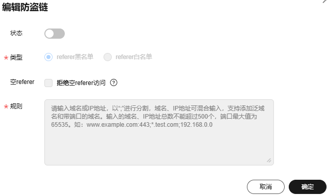

ASCF元服务中所有网络请求的请求头中referer字段都不可设置，包括网络请求接口、涉及网络请求的组件（如image组件、video组件）。

## 防盗链配置

元服务中使用的图片、音频、视频等资源，若未加防护，可能被他人直接引用，造成流量被盗用、服务器负载增加。为了防止资源被非法引用，ASCF框架提供防盗链功能。

### referer

ASCF元服务的referer值为：https://hoas.huawei.com/\&#123;appId\&#125;/ 。

当前实现中仅提供的网络接口相关API的referer中携带appId，视图层发出的网络图片、视频等资源携带的referer仅携带域名，即https://hoas.huawei.com。

## 启用防盗链

以华为云CDN为例，可参考操作步骤进行配置：

1. 登录CDN控制台。
2. 在左侧菜单栏中，选择“域名管理”。
3. 在域名列表中，单击需要修改的域名或域名所在行的“设置”，进入域名配置页面。
4. 选择“访问控制”页签。
5. 在防盗链配置模块，单击“编辑”，系统弹出“配置防盗链”对话框。

   

   * 打开“状态”开关按钮，开启该配置项。
   * 选择“类型”，选择referer白名单，根据业务需要配置referer相关参数。
   * 填写“规则”，填入ASCF元服务referer：https://hoas.huawei.com。
6. 单击“确认”，完成防盗链配置。
