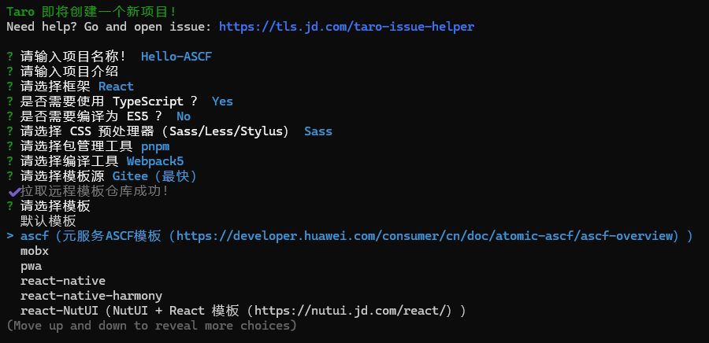

当前已有部分三方框架支持通过ASCF框架，将工程编译为元服务。

## uni-app编译为元服务

uni-app从HBuilderX 4.34版本开始支持编译为ASCF元服务。

### CLI 方式

如果是全新CLI项目请在终端运行如下命令，创建项目。

```
npx degit dcloudio/uni-preset-vue#vite-alpha my-vue3-project

# 开发
npm run dev:mp-harmony

# 构建
npm run build:mp-harmony
```

如果是已有CLI项目中使用，在终端中运行如下命令，升级最新 alpha 依赖。

```
npx @dcloudio/uvm@latest alpha
```

然后修改 package.json 的 scripts ，添加：

```
{
  "dev:mp-harmony": "uni -p mp-harmony",
  "build:mp-harmony": "uni build -p mp-harmony"
}
```

详见uni-app官方[CLI创建项目](https://uniapp.dcloud.net.cn/tutorial/mp-harmony/intro.html#using-by-cli)示例。

### 可视化界面

如果是全新可视化项目请参考uni-app官方提供的初始化工具[快速上手](https://uniapp.dcloud.net.cn/quickstart-hx.html)进行初始化。

如果是已有项目，请参考uniapp官方提供[HarmonyOS元服务](https://uniapp.dcloud.net.cn/tutorial/mp-harmony/intro.html)指南进行转换。

社区实践案例：[uni-app编译为ASCF](https://developer.huawei.com/consumer/cn/blog/topic/03203178721127385)。

## Taro编译为元服务

Taro从3.6.38以上以及4.X版本开始支持编译为ASCF元服务。

如果是全新项目，请参考Taro官方提供的快速开始[创建模板](https://docs.taro.zone/docs/GETTING-STARTED#项目初始化)进行初始化。

选择ASCF模板：



项目初始化完成后，修改Taro项目下config/index.\&#123;js,ts\&#125;配置文件，将 outputRoot: 'dist/ascf' 修改为 outputRoot: process.env.TARO\_ENV === 'ascf' ? 'ascf-project/ascf/ascf\_src' : 'dist'。其中outputRoot是已经创建好的一个ASCF工程路径。 详见[全新创建ASCF工程](https://developer.huawei.com/consumer/cn/doc/atomic-ascf/create-ascf-project)。

如果是已有项目请参考Taro官方示例[编译运行](https://docs.taro.zone/docs/GETTING-STARTED#ascf-元服务)进行转换。

然后在终端运行, 即可进行开发。

```
npm run dev:ascf

# 新起一个终端
npm run watch:ascf
```

社区实践案例：[Taro转为ASCF](https://developer.huawei.com/consumer/cn/blog/topic/03204494441193012)。

**适配元服务的建议如下：**

1. 了解项目代码，熟悉当前项目的页面布局和功能特性，通过代码审查理解接口调用及页面处理流程，并梳理组件和接口清单。
2. 使用MP-HARMONY条件编译方式，适配编译为元服务。
3. 仔细阅读[开发指南](https://developer.huawei.com/consumer/cn/doc/atomic-ascf/ascf-development-guide)，以适配平台相关功能和规范要求，然后编译为（ASCF范式）后，将编译产物dist/build/mp-harmony拷贝到ascf/ascf\_src目录后，参考Hello ASCF工程调试运行。

## 其他三方框架适配元服务

ASCF框架采用类似小程序的范式，基于[ASCF框架](https://developer.huawei.com/consumer/cn/doc/atomic-ascf/file-structure)即可将三方框架适配支持元服务。如果有需要使用三方框架开发元服务的诉求，可以将诉求反馈给我们，华为运营人员将在1-3个工作日内为开发者安排对接人员。

反馈邮箱地址：atomicservice@huawei.com

邮件标题：[ASCF三方框架适配元服务诉求]-[元服务名称]-[APP ID]-[Developer ID]，APP ID等查询方法见下方基础信息。

邮件内容：说明需要使用的相关的信息。

| 基础信息 | 描述 |
| --- | --- |
| 元服务名称 | 应用市场上架的元服务名称。 |
| APP ID | 登录[华为开发者联盟](https://developer.huawei.com/consumer/cn/service/josp/agc/index.html#/)，在“我的项目 \&gt; 项目设置 \&gt; 常规 \&gt; 应用-APP ID”中获取。 |
| Developer ID | 开发者用于调试的华为账号；登录[华为开发者联盟](https://developer.huawei.com/consumer/cn/service/josp/agc/index.html#/)，在“我的项目 \&gt; 项目设置 \&gt; 常规 \&gt; 开发者 \&gt; Developer ID"中获取。 |
